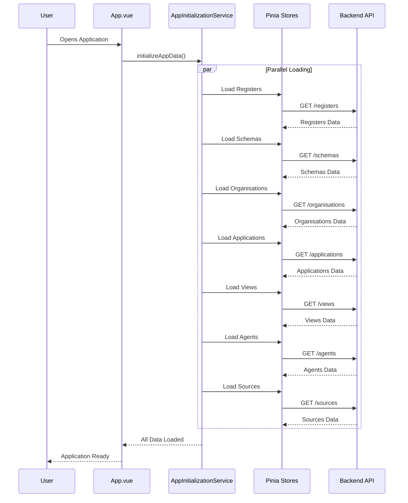

# Frontend Architecture

This guide covers the frontend architecture of OpenRegister, including the Vue.js component structure, state management with Pinia, and the application initialization system.

## Technology Stack

- **Framework**: Vue.js 2 (Options API)
- **State Management**: Pinia
- **UI Components**: Nextcloud Vue Components
- **Icons**: Material Design Icons (MDI)
- **Build Tool**: Webpack
- **Language**: JavaScript/TypeScript

## Application Initialization

OpenRegister implements a centralized initialization system to hot-load essential application data at startup. This ensures that frequently used data is immediately available without requiring API calls when modals or components open.

### Hot-Loading System

The initialization system pre-loads commonly used entities into their respective Pinia stores when the application starts. This eliminates loading delays when users interact with features like the Configuration modal, where organisations and applications are needed immediately.

#### Architecture Diagram



#### Hot-Loaded Entities

The following entities are hot-loaded at application startup:

**Core Entities:**
- **Registers**: Database register definitions
- **Schemas**: JSON schema definitions for data validation

**Configuration Dependencies:**
- **Organisations**: Organisation entities for multi-tenancy
- **Applications**: Application entities for access control

**Extended Entities:**
- **Views**: Custom view definitions
- **Agents**: AI agent configurations
- **Sources**: External data source connections

### Implementation

#### Service Location

The initialization logic is centralized in:

```
src/services/AppInitializationService.js
```

#### Key Functions

##### initializeAppData()

The main initialization function that loads all essential data in parallel:

```javascript
export async function initializeAppData() {
    console.log('[AppInit] Starting application data initialization...')
    
    const startTime = performance.now()
    
    try {
        // Load all essential data in parallel for maximum performance
        await Promise.all([
            // Core entities
            loadRegisters(),
            loadSchemas(),
            
            // Configuration dependencies
            loadOrganisations(),
            loadApplications(),
            
            // Extended entities
            loadViews(),
            loadAgents(),
            loadSources(),
        ])
        
        const endTime = performance.now()
        console.log('[AppInit] ✓ All data loaded successfully in ' + Math.round(endTime - startTime) + 'ms')
    } catch (error) {
        console.error('[AppInit] ✗ Error during initialization:', error)
        // Don't throw - allow app to continue even if some data fails to load
    }
}
```

##### reloadAppData()

Forces a refresh of all hot-loaded data. This is called when switching organisations:

```javascript
export async function reloadAppData() {
    console.log('[AppInit] Reloading all application data...')
    
    const startTime = performance.now()
    
    try {
        // Force reload all data in parallel
        await Promise.all([
            forceLoadRegisters(),
            forceLoadSchemas(),
            forceLoadOrganisations(),
            forceLoadApplications(),
            forceLoadViews(),
            forceLoadAgents(),
            forceLoadSources(),
        ])
        
        const endTime = performance.now()
        console.log('[AppInit] ✓ All data reloaded successfully in ' + Math.round(endTime - startTime) + 'ms')
    } catch (error) {
        console.error('[AppInit] ✗ Error during reload:', error)
    }
}
```

#### Application Integration

The initialization is triggered in 'App.vue' when the application mounts:

```javascript
// src/App.vue
import { initializeAppData } from './services/AppInitializationService.js'

export default {
    name: 'App',
    mounted() {
        // Initialize hot-loading of essential application data
        // This loads registers, schemas, organisations, applications, views, agents, and sources
        initializeAppData()
        
        // Set up dashboard store watchers
        setupDashboardStoreWatchers()
    },
}
```

#### Organisation Switching Integration

When a user switches organisations, all data is reloaded to reflect the new organisational context:

```javascript
// src/views/organisation/OrganisationsIndex.vue
import { reloadAppData } from '../../services/AppInitializationService.js'

async setActiveOrganisation(uuid) {
    try {
        await organisationStore.setActiveOrganisationById(uuid)
        this.showSuccessMessage('Active organisation changed successfully')
        
        // Reload all hot-loaded data for the new organisation context
        console.log('[OrganisationsIndex] Reloading application data after organisation switch...')
        await reloadAppData()
    } catch (error) {
        this.showErrorMessage('Failed to change active organisation: ' + error.message)
    }
}
```

### Performance Benefits

#### Before Hot-Loading

When a user opened the Configuration modal:
1. Modal opens
2. Shows loading state
3. Fetches organisations (500-2000ms)
4. Fetches applications (500-2000ms)
5. Modal becomes interactive (1000-4000ms total delay)

#### After Hot-Loading

When a user opens the Configuration modal:
1. Modal opens with data immediately available (0ms delay)
2. No loading states needed
3. Instant interactivity

#### Parallel Loading

All entities are loaded in parallel using 'Promise.all()', which means:
- If 7 entities each take 1 second to load sequentially = 7 seconds total
- With parallel loading = ~1 second total (the slowest single request)

Typical initialization times: **200-500ms** for all entities combined

### Console Logging

The service provides detailed console output for debugging and performance monitoring:

```
[AppInit] Starting application data initialization...
[AppInit] Loading registers...
[AppInit] Loading schemas...
[AppInit] Loading organisations...
[AppInit] Loading applications...
[AppInit] Loading views...
[AppInit] Loading agents...
[AppInit] Loading sources...
[AppInit] ✓ Loaded 7 registers
[AppInit] ✓ Loaded 49 schemas
[AppInit] ✓ Loaded 2 organisations
[AppInit] ✓ Loaded 3 applications
[AppInit] ✓ Views loaded
[AppInit] ✓ Loaded 5 agents
[AppInit] ✓ Loaded 4 sources
[AppInit] ✓ All data loaded successfully in 387ms
```

## Soft vs Hard Reload

OpenRegister implements a soft/hard reload pattern to prevent unnecessary loading spinners while keeping data fresh.

### Hard Reload (Default)

A **hard reload** shows loading states and spinners. Use this when:
- User explicitly clicks a "Refresh" button
- You need to show the user that data is being fetched
- The component needs immediate visual feedback

```javascript
// Hard reload - shows loading spinner
agentStore.refreshAgentList()
```

### Soft Reload

A **soft reload** updates data silently in the background without showing loading states. Use this when:
- Navigating to a page with hot-loaded data
- Data is likely already fresh from hot-loading
- You want to update data without disrupting the UI

```javascript
// Soft reload - no loading spinner
agentStore.refreshAgentList(null, true)  // second parameter = soft
```

### Implementation in Stores

All refresh methods support a 'soft' parameter:

```javascript
/**
 * Refresh the agent list from the API
 *
 * @param {string|null} search - Optional search term
 * @param {boolean} soft - If true, don't show loading state (default: false)
 * @returns {Promise} Promise with response and data
 */
async refreshAgentList(search = null, soft = false) {
    console.log('AgentStore: Starting refreshAgentList (soft=' + soft + ')')
    
    // Only set loading state for hard reloads
    if (!soft) {
        this.loading = true
    }
    this.error = null
    
    try {
        // ... fetch data ...
    } finally {
        if (!soft) {
            this.loading = false
        }
    }
}
```

### Usage in Views

Views should use soft reload on mount since data is hot-loaded:

```javascript
// In view component
mounted() {
    // Use soft reload (no loading spinner) since data is hot-loaded at app startup
    agentStore.refreshAgentList(null, true)
}
```

Refresh buttons should use hard reload to provide user feedback:

```vue
<template>
    <NcActionButton @click="agentStore.refreshAgentList()">
        <template #icon>
            <Refresh :size="20" />
        </template>
        Refresh
    </NcActionButton>
</template>
```

### Benefits

| Aspect | Before | After |
|--------|--------|-------|
| Page navigation | Shows loading spinner for 500-2000ms | Instant display with fresh data |
| User experience | Feels slow, unnecessary waiting | Smooth, responsive navigation |
| Data freshness | Only updates when mounted | Silently refreshes in background |
| Explicit refresh | Same as mount | Clear visual feedback with spinner |

## Component Usage Patterns

Components can safely assume data is pre-loaded and should use soft reload:

```javascript
// ❌ Bad: Hard reload on mount (shows unnecessary spinner)
mounted() {
    agentStore.refreshAgentList()
}

// ✅ Good: Soft reload on mount (no spinner, data updates silently)
mounted() {
    // Use soft reload since data is hot-loaded at app startup
    agentStore.refreshAgentList(null, true)
}

// ✅ Good: Hard reload on user action (shows spinner for feedback)
methods: {
    handleRefreshClick() {
        agentStore.refreshAgentList()  // Hard reload with spinner
    }
}
```

## Adding New Hot-Loaded Entities

To add a new entity type to hot-loading:

### 1. Create a loader function

In 'src/services/AppInitializationService.js':

```javascript
async function loadMyEntity() {
    if (!myEntityStore.myEntityList || myEntityStore.myEntityList.length === 0) {
        console.log('[AppInit] Loading my entities...')
        await myEntityStore.refreshMyEntityList()
        console.log('[AppInit] ✓ Loaded ' + (myEntityStore.myEntityList?.length || 0) + ' my entities')
    } else {
        console.log('[AppInit] ↷ My entities already loaded (' + myEntityStore.myEntityList.length + ')')
    }
}

async function forceLoadMyEntity() {
    console.log('[AppInit] Reloading my entities...')
    await myEntityStore.refreshMyEntityList()
    console.log('[AppInit] ✓ Reloaded ' + (myEntityStore.myEntityList?.length || 0) + ' my entities')
}
```

### 2. Add to Promise.all()

In both 'initializeAppData()' and 'reloadAppData()':

```javascript
await Promise.all([
    loadRegisters(),
    loadSchemas(),
    loadOrganisations(),
    loadApplications(),
    loadViews(),
    loadAgents(),
    loadSources(),
    loadMyEntity(),  // Add your new loader here
])
```

### 3. Import the store

At the top of the file:

```javascript
import { 
    registerStore,
    schemaStore,
    organisationStore,
    applicationStore,
    viewsStore,
    agentStore,
    sourceStore,
    myEntityStore,  // Add your new store
} from '../store/store.js'
```

## When NOT to Hot-Load

Don't hot-load entities that are:
- **Large datasets**: Entities with thousands of items (use pagination/search instead)
- **Rarely used**: Data only needed in specific, infrequently accessed features
- **User-specific**: Data that varies by user context (may cause conflicts)
- **Dynamic**: Data that changes frequently and needs real-time updates

## Error Handling

The initialization service is designed to be resilient:

- **Non-blocking**: Errors don't prevent the application from loading
- **Logged**: All errors are logged to the console with '[AppInit]' prefix
- **Graceful Degradation**: If one entity fails to load, others still proceed
- **Retry Logic**: Components can still trigger individual refreshes if needed

## Troubleshooting

### Data Not Loading

If data isn't appearing in components:

1. Check browser console for '[AppInit]' errors
2. Verify the store has a 'refresh...List()' method
3. Ensure the store is exported in 'src/store/store.js'
4. Check API endpoint is accessible (Network tab)

### Slow Initialization

If initialization takes longer than 1 second:

1. Check individual entity load times in console
2. Investigate slow API endpoints (Network tab)
3. Consider database indexing for slow queries
4. Check if data volume is too large for hot-loading

### Cache Issues

If stale data is being shown:

1. Individual components can force a refresh
2. Store update methods should invalidate cache
3. Consider implementing a 'Refresh All' button for users

### After Organisation Switch

If data doesn't update after switching organisations:

1. Verify 'reloadAppData()' is being called
2. Check console for '[AppInit]' reload messages
3. Ensure all stores have proper organisation filtering

## Directory Structure

```
src/
├── components/       # Reusable Vue components
├── views/           # Page-level Vue components
├── store/           # Pinia stores
│   └── modules/     # Individual store modules
├── services/        # Business logic services
│   └── AppInitializationService.js
├── modals/          # Modal dialogs
├── sidebars/        # Sidebar components
├── entities/        # TypeScript entity definitions
├── router/          # Vue Router configuration
├── App.vue          # Root application component
└── main.js          # Application entry point
```

## Related Documentation

- [Multi-Tenancy Feature](/docs/Features/multi-tenancy)
- [RBAC and Multi-Tenancy](/docs/developers/rbac)
- [Testing](/docs/developers/testing)
- [Component Development](/docs/Development/Services/styleguide)

