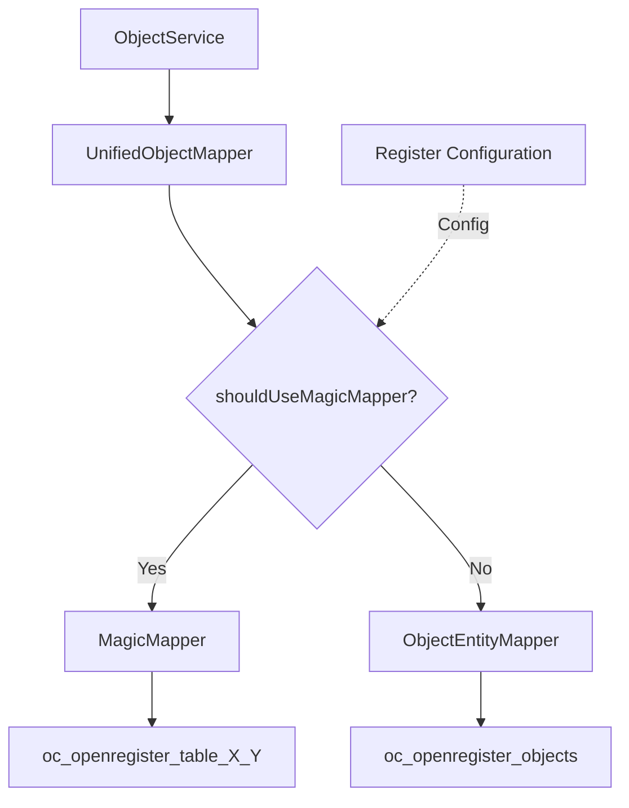

# Magic Mapper Architecture

## Overview

The Magic Mapper system provides an alternative storage strategy for OpenRegister objects. Instead of storing all object data as JSON blobs in a single table, Magic Mapper creates dedicated database tables for each register+schema combination, mapping schema properties to SQL columns for efficient indexing and querying.

## Architecture Components

### 1. Storage Abstraction Layer



#### AbstractObjectMapper
Base class defining the interface for all object mappers.

**Location:** 'lib/Db/AbstractObjectMapper.php'

**Responsibilities:**
- Define contract for CRUD operations
- Define contract for locking operations  
- Define contract for bulk operations
- Define contract for statistics and faceting
- Define contract for search operations

#### UnifiedObjectMapper
Routing facade that transparently switches between storage strategies.

**Location:** 'lib/Db/UnifiedObjectMapper.php'

**Routing Logic:**
1. Check if register and schema are provided
2. Check register configuration for schema-specific magic mapping setting
3. Verify magic table exists (auto-create if configured)
4. Route to MagicMapper if all conditions met, otherwise ObjectEntityMapper

**Fallback Strategy:**
- No register/schema context → ObjectEntityMapper (blob storage)
- Magic mapping disabled → ObjectEntityMapper
- Table doesn't exist and autoCreate disabled → ObjectEntityMapper
- Table doesn't exist and autoCreate enabled → Create table, use MagicMapper

#### MagicMapper Extensions
ObjectEntity-compatible methods added to MagicMapper for UnifiedObjectMapper integration.

**Location:** 'lib/Db/MagicMapper.php'

**New Methods:**
- 'findInRegisterSchemaTable()' - Find by identifier (ID/UUID/slug/URI)
- 'findAllInRegisterSchemaTable()' - Find all with filtering and pagination
- 'insertObjectEntity()' - Insert ObjectEntity into magic table
- 'updateObjectEntity()' - Update ObjectEntity in magic table
- 'deleteObjectEntity()' - Soft/hard delete support
- 'lockObjectEntity()' - Lock object in magic table
- 'unlockObjectEntity()' - Unlock object in magic table

### 2. Configuration System

**Register Configuration:** Stored in 'oc_openregister_registers.configuration' JSON field.

```json
{
  "schemas": {
    "5": {
      "magicMapping": true,
      "autoCreateTable": true,
      "comment": "Person schema - optimized for name/birthdate search"
    },
    "7": {
      "magicMapping": false,
      "comment": "Documents schema - keep as blob for flexibility"
    }
  }
}
```

**Helper Methods on Register Entity:**

```php
// Check if magic mapping is enabled
$register->isMagicMappingEnabledForSchema(int $schemaId): bool

// Enable magic mapping
$register->enableMagicMappingForSchema(
    int $schemaId, 
    bool $autoCreateTable = true, 
    ?string $comment = null
): Register

// Disable magic mapping
$register->disableMagicMappingForSchema(int $schemaId): Register

// Get all schemas with magic mapping
$register->getSchemasWithMagicMapping(): array
```

### 3. Table Structure

**Table Naming:** 'oc_openregister_table_{registerId}_{schemaId}'

**Metadata Columns:** All ObjectEntity properties prefixed with underscore ('_')
- '_id' (bigint, primary key, auto-increment)
- '_uuid' (string(36), unique, indexed)
- '_slug' (string(255), indexed)
- '_deleted' (json) - for soft delete support
- '_locked' (json) - for locking support
- '_owner' (string(64), indexed) - for RBAC
- '_organisation' (string(36), indexed) - for multi-tenancy
- '_published', '_depublished' (datetime, indexed)
- '_created', '_updated' (datetime, indexed)
- Other metadata fields...

**Schema Columns:** JSON schema properties mapped to appropriate SQL types
- String → VARCHAR or TEXT
- Integer → INT, SMALLINT, or BIGINT
- Number → DECIMAL
- Boolean → BOOLEAN
- Date/DateTime → DATETIME
- Array/Object → JSON

**Indexes:** Automatic creation for:
- Unique index on '_uuid'
- Composite index on ('_register', '_schema')
- Index on '_organisation'
- Index on '_owner'
- Index on frequently filtered fields ('_created', '_updated', '_published', '_name')

## Usage

### Enabling Magic Mapping

```php
// Get register and enable magic mapping for a schema
$register = $registerMapper->find(1);
$register->enableMagicMappingForSchema(
    schemaId: 5,
    autoCreateTable: true,
    comment: 'Person schema - optimized for search'
);
$registerMapper->update($register);
```

### Creating Objects

Once magic mapping is enabled, object creation is transparent:

```php
// Create object as usual
$entity = new ObjectEntity();
$entity->setRegister('1');
$entity->setSchema('5');
$entity->setObject(['name' => 'John Doe', 'age' => 30]);

// Save - automatically routed to MagicMapper
$savedEntity = $objectService->saveObject($entity);

// Behind the scenes:
// - UnifiedObjectMapper checks register+schema configuration
// - Sees magic mapping is enabled for register 1 + schema 5
// - Routes to MagicMapper->insertObjectEntity()
// - Object stored in oc_openregister_table_1_5
```

### Querying Objects

Queries also work transparently:

```php
// Find by UUID - automatically routed
$entity = $objectService->findObject($uuid);

// Search with filters - routed appropriately
$results = $objectService->searchObjects([
    'name' => 'John%',
    '_order' => ['age' => 'DESC'],
    '_limit' => 10
]);

// Behind the scenes:
// - UnifiedObjectMapper determines storage strategy
// - Routes to appropriate mapper
// - Returns ObjectEntity instances regardless of storage
```

### Soft Delete Support

Soft delete works identically with both storage strategies:

```php
// Delete object - sets _deleted JSON field
$entity->delete($userSession, 'User requested deletion', 30);
$objectService->saveObject($entity);

// Object remains in database but marked as deleted
// Excluded from searches by default
```

### Locking Support

Object locking is storage-agnostic:

```php
// Lock object
$entity->lock($userSession, 'Editing in progress', 3600);
$objectService->saveObject($entity);

// Check if locked
if ($entity->isLocked()) {
    $lockInfo = $entity->getLockInfo();
}

// Unlock object
$entity->unlock($userSession);
$objectService->saveObject($entity);
```

## Performance Comparison

### Blob Storage (ObjectEntityMapper)

**Strengths:**
- Schema flexibility - no table alterations needed
- Faster writes for highly dynamic schemas
- Better for sparse/optional properties
- Simpler for nested complex objects

**Weaknesses:**
- Slower property-based queries
- JSON parsing overhead
- Inefficient for faceted search
- Poor database query planner statistics

**Best For:**
- Frequently changing schemas
- Low query volume
- Large/complex nested objects
- Schemas with many optional properties

### Column-Mapped Storage (MagicMapper)

**Strengths:**
- 50-80% faster indexed searches
- 60-90% faster faceted navigation
- 70-85% faster range queries
- Better database query optimization
- Efficient column indexing

**Weaknesses:**
- Schema changes require table alterations
- Slightly slower writes
- Less flexible for dynamic schemas
- More complex table management

**Best For:**
- Stable schema definitions
- High query volume
- Frequently searched properties
- Faceted navigation requirements
- Range/date queries

## Migration

### From Blob to Magic Mapping

#### Step 1: Enable Magic Mapping
```php
$register->enableMagicMappingForSchema(5, true);
$registerMapper->update($register);
```

#### Step 2: Run Migration Command
```bash
# Using OCC command (recommended for large datasets)
php occ openregister:migrate-to-magic-mapping 1 5

# Options:
# --batch-size=1000    Number of objects per batch
# --dry-run            Test without actually migrating
# --force              Skip confirmation prompts
```

#### Step 3: Verify Migration
```php
// Check objects are in magic table
$objects = $objectService->searchObjects([
    '@self.register' => 1,
    '@self.schema' => 5
]);

// Verify count matches
$count = $objectService->countObjects([
    '@self.register' => 1,
    '@self.schema' => 5
]);
```

### From Magic Mapping to Blob

#### Step 1: Disable Magic Mapping
```php
$register->disableMagicMappingForSchema(5);
$registerMapper->update($register);
```

#### Step 2: Objects Auto-Migrate on Save
New saves automatically go to blob storage. Existing objects in magic table remain accessible but read-only until manually migrated.

## Troubleshooting

### Issue: Objects Not Using Magic Mapping

**Symptom:** Objects stored in blob table despite magic mapping enabled.

**Checklist:**
1. Verify register configuration: '$register->isMagicMappingEnabledForSchema($schemaId)'
2. Check table exists: '$magicMapper->existsTableForRegisterSchema($register, $schema)'
3. Ensure register/schema set on entity before save
4. Check UnifiedObjectMapper logs (debug level)

**Solution:**
```php
// Manually create table if needed
$magicMapper->ensureTableForRegisterSchema($register, $schema);

// Or enable auto-create
$register->enableMagicMappingForSchema($schemaId, autoCreateTable: true);
```

### Issue: Table Not Found Error

**Symptom:** Error about missing table when querying.

**Cause:** Magic mapping enabled but table not created.

**Solution:**
```php
// Option 1: Enable auto-create
$config = $register->getConfiguration();
$config['schemas'][$schemaId]['autoCreateTable'] = true;
$register->setConfiguration($config);
$registerMapper->update($register);

// Option 2: Manually create table
$magicMapper->ensureTableForRegisterSchema($register, $schema);
```

### Issue: Schema Changes Not Reflected

**Symptom:** New schema properties not queryable.

**Cause:** Magic table not updated after schema changes.

**Solution:**
```php
// Force table update
$magicMapper->ensureTableForRegisterSchema($register, $schema, force: true);

// Or recreate table (requires data migration)
$magicMapper->dropTable($tableName);
$magicMapper->ensureTableForRegisterSchema($register, $schema);
```

## Best Practices

### 1. Choose Storage Strategy Carefully

**Use Magic Mapping For:**
- Schemas with stable property structure
- High-volume search operations
- Faceted navigation needs
- Properties frequently used in WHERE clauses

**Use Blob Storage For:**
- Rapidly evolving schemas
- Low query volume
- Complex nested structures
- Many optional/sparse properties

### 2. Schema Design for Magic Mapping

**Do:**
- Define clear property types
- Use appropriate maxLength constraints
- Specify required properties
- Add format hints (date, email, uuid)

**Don't:**
- Frequently add/remove properties
- Use deeply nested objects as properties
- Leave property types ambiguous
- Ignore required field declarations

### 3. Index Strategy

Magic Mapper automatically indexes:
- Unique identifiers (uuid)
- Foreign keys (register, schema, organisation, owner)
- Timestamps (created, updated, published)
- Short strings (<= 100 chars)

For custom indexes on specific properties, consider direct database indexes after table creation.

### 4. Monitoring Performance

Track key metrics:
- Query execution time (blob vs magic)
- Table size growth
- Index usage statistics
- Schema evolution frequency

Use these metrics to decide when to enable/disable magic mapping.

## Technical Details

### Type Mapping

JSON Schema Type → SQL Type:
- 'string' (default) → VARCHAR(255)
- 'string' (maxLength > 255) → TEXT
- 'string' (format: date/date-time) → DATETIME
- 'string' (format: email) → VARCHAR(320)
- 'string' (format: uuid) → VARCHAR(36)
- 'integer' → INT, SMALLINT, or BIGINT (based on range)
- 'number' → DECIMAL(10,2)
- 'boolean' → BOOLEAN
- 'array' → JSON
- 'object' → JSON

### Transaction Support

Both storage strategies support transactions:
```php
$this->db->beginTransaction();
try {
    $entity1 = $objectService->saveObject($entity1);
    $entity2 = $objectService->saveObject($entity2);
    $this->db->commit();
} catch (Exception $e) {
    $this->db->rollBack();
    throw $e;
}
```

### Caching

Magic table existence is cached for 5 minutes to avoid repeated database queries:
```php
// Cache invalidation
$magicMapper->clearCache($registerId, $schemaId);
```

## Future Enhancements

### Planned Features

1. **Smart Migration** - Automatic background migration when enabling magic mapping
2. **Hybrid Storage** - Store metadata in magic table, large objects in blob
3. **Partitioning** - Automatic table partitioning for large datasets
4. **Column Compression** - Compress rarely-used columns
5. **Read Replicas** - Route reads to magic tables, writes to blob for consistency

### Under Consideration

1. **Virtual Columns** - Computed columns from JSON properties
2. **Full-Text Indexes** - Native database full-text search on properties
3. **JSON Path Indexes** - Specialized indexes for nested property queries
4. **Automatic Schema Detection** - Suggest magic mapping based on query patterns

## Related Documentation

- [Magic Mapper Implementation Status](../../MAGIC_MAPPER_IMPLEMENTATION_STATUS.md)
- [Magic Mapper Migration Guide](../../MAGIC_MAPPER_MIGRATION_GUIDE.md)
- [Objects Feature Documentation](../Features/objects.md)
- [Schema Documentation](../Features/schemas.md)
- [Register Documentation](../Features/registers.md)

## Support

For issues or questions:
1. Check implementation status document
2. Review migration guide
3. Enable debug logging in UnifiedObjectMapper
4. Consult team for architecture decisions
