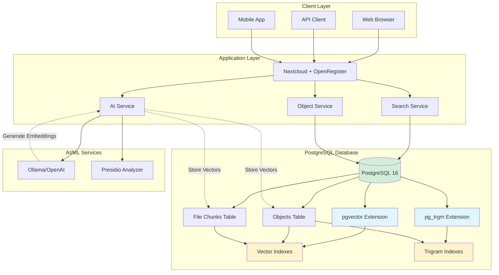
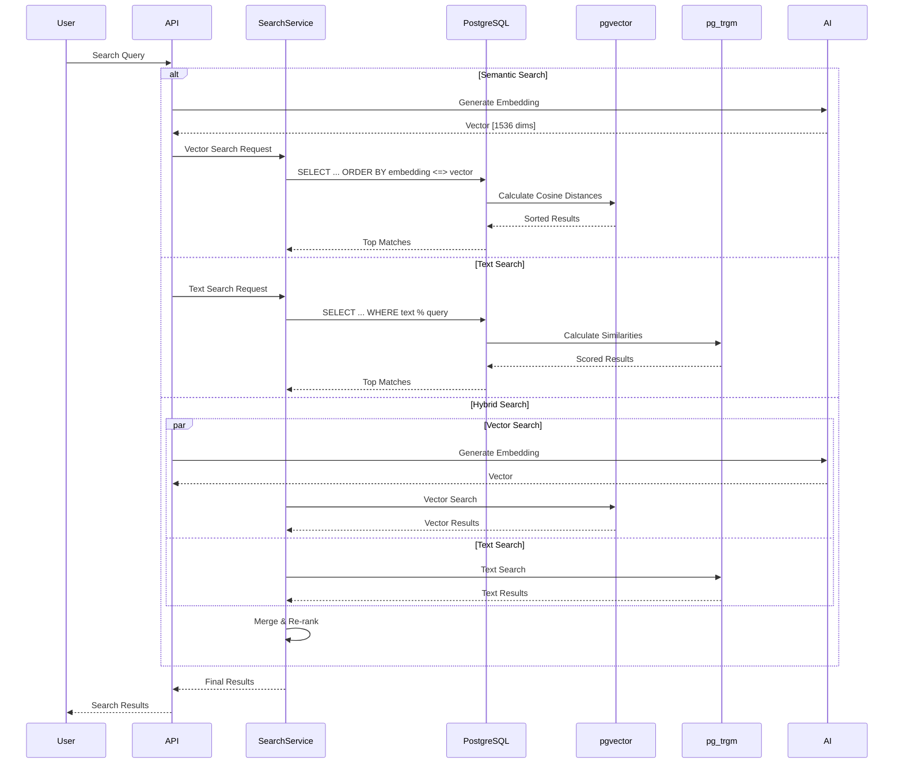
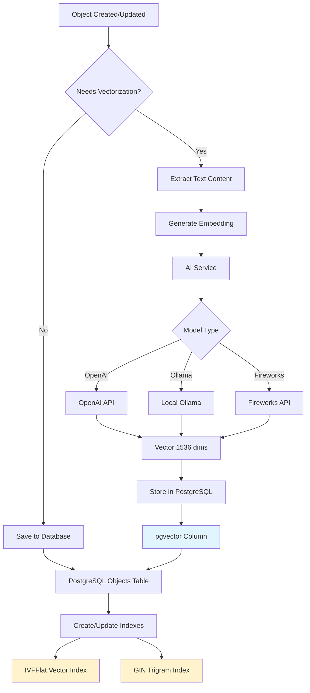
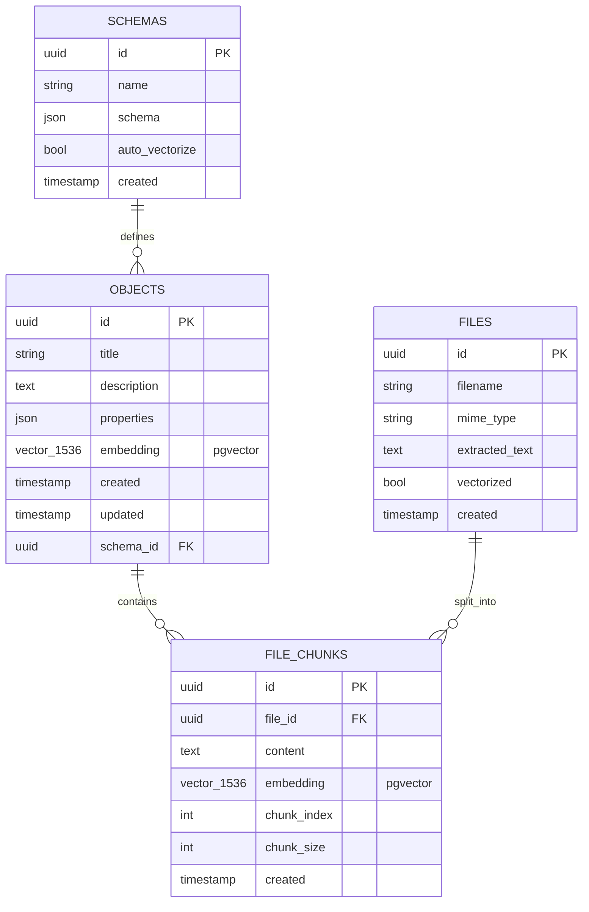
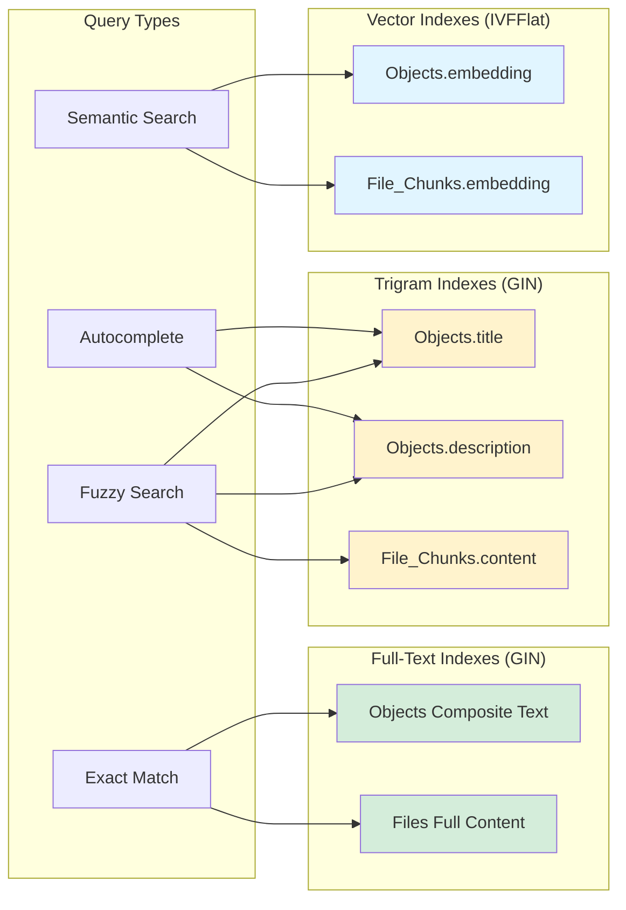
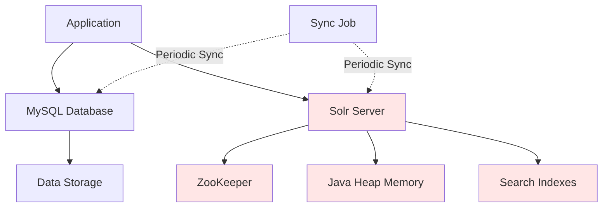
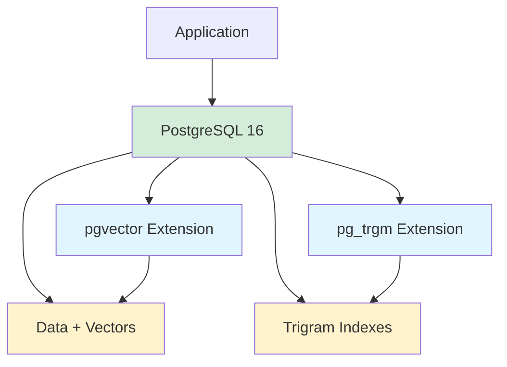
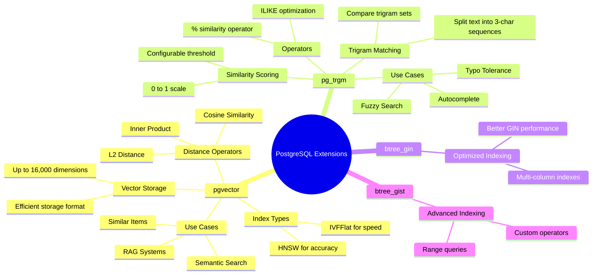
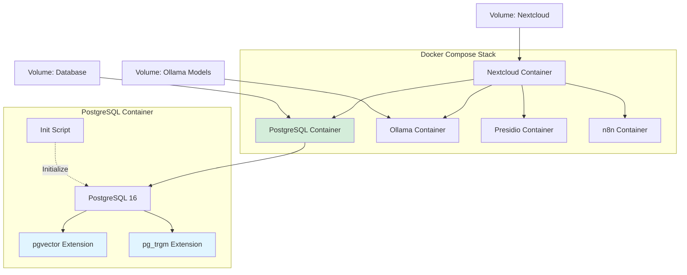

# OpenRegister PostgreSQL Architecture

## System Overview

## Search Flow

## Data Indexing Flow

## Database Schema

## Index Types and Usage

## Performance Characteristics

| Operation | Index Type | Complexity | Performance |
|-----------|-----------|------------|-------------|
| Vector Similarity (IVFFlat) | IVFFlat | O(√n) | < 100ms for 100K vectors |
| Vector Similarity (HNSW) | HNSW | O(log n) | < 50ms for 1M vectors |
| Trigram Similarity | GIN | O(log n) | < 50ms for 100K rows |
| Full-Text Search | GIN | O(log n) | < 100ms for 1M rows |
| Exact Match | B-tree | O(log n) | < 10ms |
| Pattern Match | GIN Trigram | O(log n) | < 50ms |

## Comparison: Before vs After

### Before (MySQL + Solr)

**Issues:**
- Separate infrastructure for search
- Data synchronization overhead
- Higher resource usage (JVM)
- Complex deployment
- Eventual consistency

### After (PostgreSQL Only)

**Benefits:**
- Single database for everything
- No synchronization needed
- Lower resource usage
- Simple deployment
- ACID consistency

## Extension Capabilities

## Deployment Architecture

## Summary

OpenRegister now uses a unified PostgreSQL-based architecture that:

1. **Eliminates External Dependencies**: No Solr or Elasticsearch needed
2. **Provides Advanced Search**: Vector similarity + full-text search
3. **Simplifies Deployment**: Single database container
4. **Reduces Resource Usage**: Lower memory and CPU requirements
5. **Ensures Consistency**: ACID-compliant operations
6. **Enables AI Features**: Native vector storage for embeddings
7. **Improves Performance**: Optimized indexes and queries

All search functionality is now native to PostgreSQL, making the system simpler, faster, and more maintainable.

