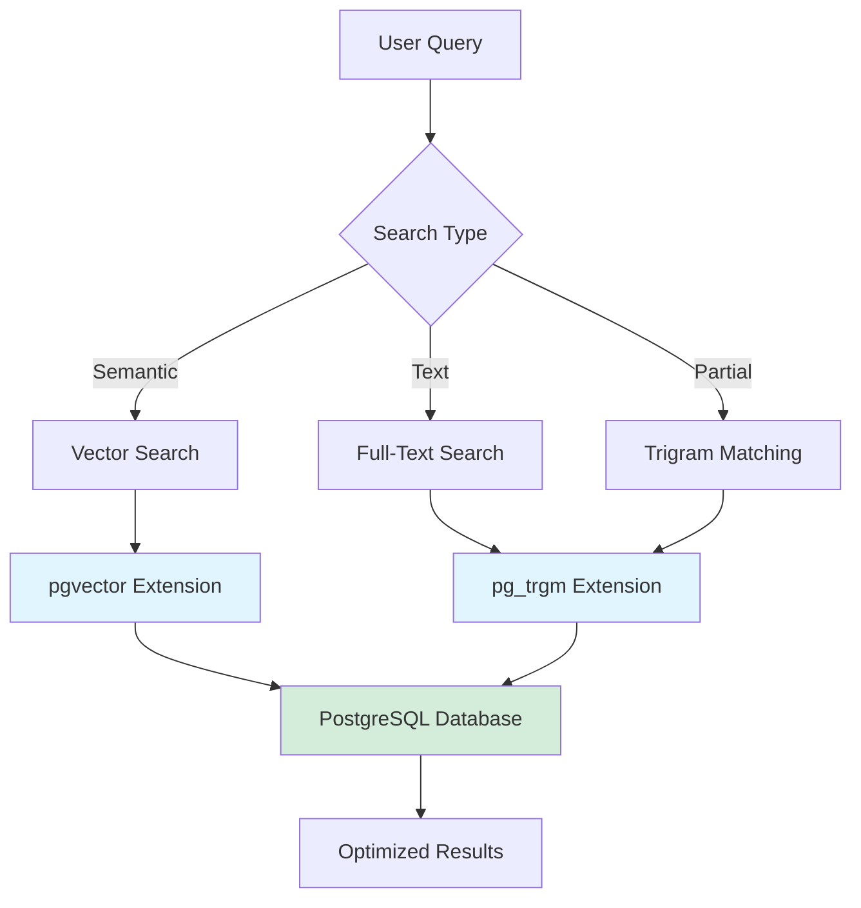
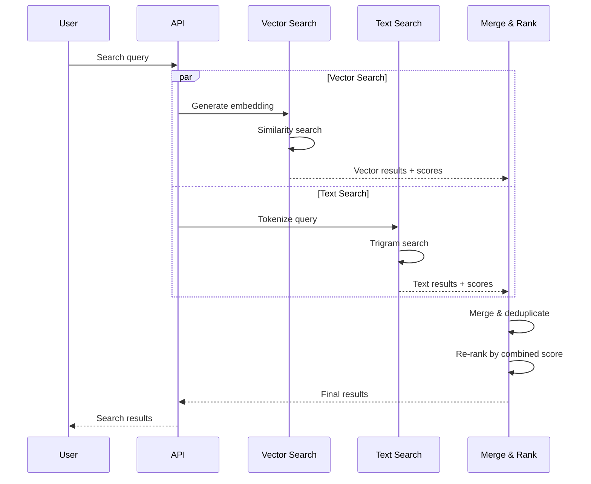

# PostgreSQL-Based Search in OpenRegister

OpenRegister uses PostgreSQL with advanced extensions for all search functionality, eliminating the need for external search engines like Solr or Elasticsearch.

## Overview

Our PostgreSQL-based search solution provides:

- **Vector Search**: Semantic search using AI embeddings via pgvector
- **Full-Text Search**: Trigram-based fuzzy matching via pg_trgm
- **Partial Text Matching**: Pattern matching and autocomplete
- **No External Dependencies**: Everything runs in PostgreSQL
- **High Performance**: Optimized indexes and query patterns

## Architecture



## Enabled Extensions

### 1. pgvector - Vector Similarity Search

Enables storing and searching AI embeddings for semantic search capabilities.

**Use Cases:**
- Semantic document search
- RAG (Retrieval Augmented Generation)
- Similar object recommendations
- Content similarity matching

**Key Features:**
- Supports vectors up to 16,000 dimensions
- Multiple distance operators (cosine, L2, inner product)
- Efficient IVFFlat indexing
- HNSW indexing for better performance

### 2. pg_trgm - Trigram Full-Text Search

Provides trigram-based text matching for fuzzy and partial searches.

**Use Cases:**
- Fuzzy text search
- Autocomplete functionality
- Typo-tolerant search
- Pattern matching
- Full-text search without stemming

**Key Features:**
- Similarity scoring (0-1 scale)
- Wildcard pattern matching
- ILIKE performance optimization
- Configurable similarity threshold

### 3. Supporting Extensions

- **btree_gin**: Optimized GIN indexing for multi-value columns
- **btree_gist**: Optimized GiST indexing for ranges and custom types
- **uuid-ossp**: UUID generation for database operations

## Database Configuration

The PostgreSQL container is configured with optimized settings:

```sql
-- Performance settings
shared_buffers=256MB
effective_cache_size=1GB
maintenance_work_mem=64MB
work_mem=4MB

-- Connection settings
max_connections=200

-- Write-ahead logging
min_wal_size=1GB
max_wal_size=4GB

-- Extensions
shared_preload_libraries='pg_trgm,vector'
```

## Vector Search Implementation

### Creating Vector Columns

```sql
-- Add vector column to your table
ALTER TABLE oc_openregister_objects 
ADD COLUMN embedding vector(1536);

-- Create index for fast similarity search
CREATE INDEX ON oc_openregister_objects 
USING ivfflat (embedding vector_cosine_ops)
WITH (lists = 100);
```

### Storing Embeddings

```php
// Generate embedding from text
$text = $object->getTitle() . ' ' . $object->getDescription();
$embedding = $this->aiService->generateEmbedding($text);

// Store in database
$object->setEmbedding($embedding);
$this->objectMapper->update($object);
```

### Searching by Similarity

```sql
-- Find similar objects using cosine distance
SELECT id, title, 
       embedding <=> :query_vector AS distance
FROM oc_openregister_objects
WHERE schema_id = :schema_id
ORDER BY embedding <=> :query_vector
LIMIT 10;
```

```php
// PHP/ORM implementation
$qb = $this->db->getQueryBuilder();
$qb->select(['id', 'title'])
   ->from('openregister_objects')
   ->where($qb->expr()->eq('schema_id', $qb->createNamedParameter($schemaId)))
   ->orderBy('embedding <=> :query_vector')
   ->setParameter('query_vector', $queryVector)
   ->setMaxResults(10);
```

## Full-Text Search Implementation

### Creating Trigram Indexes

```sql
-- Create GIN index for full-text search
CREATE INDEX ON oc_openregister_objects 
USING gin (title gin_trgm_ops, description gin_trgm_ops);

-- Create GiST index (alternative, better for dynamic data)
CREATE INDEX ON oc_openregister_objects 
USING gist (title gist_trgm_ops);
```

### Similarity Search

```sql
-- Search with similarity threshold
SELECT id, title, 
       similarity(title, :search_term) AS score
FROM oc_openregister_objects
WHERE similarity(title, :search_term) > 0.3
ORDER BY score DESC
LIMIT 20;
```

### Pattern Matching

```sql
-- Trigram-optimized ILIKE search
SELECT id, title
FROM oc_openregister_objects
WHERE title % :search_term
   OR title ILIKE '%' || :search_term || '%'
ORDER BY similarity(title, :search_term) DESC;
```

### Combined Search

```php
// Search across multiple fields with ranking
$qb = $this->db->getQueryBuilder();
$qb->select(['id', 'title', 'description'])
   ->selectAlias('similarity(title, :term)', 'title_score')
   ->selectAlias('similarity(description, :term)', 'desc_score')
   ->from('openregister_objects')
   ->where(
       $qb->expr()->orX(
           'title % :term',
           'description % :term',
           $qb->expr()->iLike('title', ':term_wildcard'),
           $qb->expr()->iLike('description', ':term_wildcard')
       )
   )
   ->orderBy('GREATEST(title_score, desc_score)', 'DESC')
   ->setParameter('term', $searchTerm)
   ->setParameter('term_wildcard', '%' . $searchTerm . '%')
   ->setMaxResults(50);
```

## Autocomplete Implementation

### Prefix Matching

```sql
-- Fast autocomplete using trigrams
SELECT DISTINCT title
FROM oc_openregister_objects
WHERE title ILIKE :prefix || '%'
ORDER BY similarity(title, :prefix) DESC
LIMIT 10;
```

### Word Boundary Matching

```sql
-- Match word beginnings
SELECT title
FROM oc_openregister_objects
WHERE title ~* '\\m' || :term
ORDER BY 
    CASE 
        WHEN title ILIKE :term || '%' THEN 1
        WHEN title ILIKE '% ' || :term || '%' THEN 2
        ELSE 3
    END,
    similarity(title, :term) DESC
LIMIT 10;
```

## Hybrid Search Strategy

Combine vector and text search for best results:



### Implementation

```php
/**
 * Hybrid search combining vector similarity and text matching.
 *
 * @param string $query The search query.
 * @param int $schemaId Schema to search in.
 * @param int $limit Maximum results to return.
 * 
 * @return array Combined and ranked search results.
 */
public function hybridSearch(string $query, int $schemaId, int $limit = 20): array
{
    // Generate embedding for semantic search.
    $embedding = $this->aiService->generateEmbedding($query);
    
    // Execute vector search.
    $vectorResults = $this->vectorSearch($embedding, $schemaId, $limit * 2);
    
    // Execute text search.
    $textResults = $this->textSearch($query, $schemaId, $limit * 2);
    
    // Merge and re-rank results.
    return $this->mergeResults($vectorResults, $textResults, $limit);
}

/**
 * Merge and rank results from multiple search methods.
 *
 * @param array $vectorResults Results from vector search with distances.
 * @param array $textResults Results from text search with similarity scores.
 * @param int $limit Maximum results to return.
 * 
 * @return array Merged and ranked results.
 */
private function mergeResults(array $vectorResults, array $textResults, int $limit): array
{
    $combined = [];
    
    // Add vector results with normalized scores.
    foreach ($vectorResults as $result) {
        $id = $result['id'];
        $combined[$id] = [
            'object' => $result,
            'vector_score' => 1 - $result['distance'], // Convert distance to similarity.
            'text_score' => 0,
        ];
    }
    
    // Add or merge text results.
    foreach ($textResults as $result) {
        $id = $result['id'];
        if (isset($combined[$id])) {
            $combined[$id]['text_score'] = $result['similarity'];
        } else {
            $combined[$id] = [
                'object' => $result,
                'vector_score' => 0,
                'text_score' => $result['similarity'],
            ];
        }
    }
    
    // Calculate combined scores (weighted average).
    foreach ($combined as &$item) {
        $item['final_score'] = 
            ($item['vector_score'] * 0.6) + 
            ($item['text_score'] * 0.4);
    }
    
    // Sort by final score and limit results.
    usort($combined, fn($a, $b) => $b['final_score'] <=> $a['final_score']);
    
    return array_slice($combined, 0, $limit);
}
```

## Performance Optimization

### Index Selection

| Search Type | Recommended Index | When to Use |
|------------|------------------|-------------|
| Vector similarity | IVFFlat | < 1M vectors, good balance |
| Vector similarity | HNSW | > 1M vectors, need speed |
| Exact text match | B-tree | Equality searches |
| Full-text search | GIN | Read-heavy workloads |
| Full-text search | GiST | Write-heavy workloads |
| Partial matching | GIN trigram | Prefix/suffix searches |

### Query Optimization Tips

1. **Use covering indexes** - Include frequently queried columns in indexes
2. **Limit result sets** - Always use LIMIT for large tables
3. **Filter before search** - Apply WHERE clauses before similarity operations
4. **Batch operations** - Update embeddings in batches, not individually
5. **Monitor query plans** - Use EXPLAIN ANALYZE to optimize queries

### Monitoring Queries

```sql
-- Enable query logging in development.
ALTER DATABASE nextcloud SET log_statement = 'all';
ALTER DATABASE nextcloud SET log_duration = on;

-- Check slow queries.
SELECT query, calls, total_time, mean_time
FROM pg_stat_statements
WHERE mean_time > 100
ORDER BY mean_time DESC
LIMIT 20;
```

## Migration from Solr/Elasticsearch

### Step 1: Update Docker Configuration

The docker-compose files have been updated to use PostgreSQL instead of Solr/Elasticsearch. Simply restart your containers:

```bash
docker-compose down
docker-compose up -d
```

### Step 2: Verify Extensions

Check that extensions are enabled:

```bash
docker exec openregister-postgres psql -U nextcloud -d nextcloud -c '\\dx'
```

Expected output:
```
                                      List of installed extensions
   Name     | Version |   Schema   |                         Description
------------+---------+------------+------------------------------------------------------
 btree_gin  | 1.3     | public     | support for indexing common datatypes in GIN
 btree_gist | 1.7     | public     | support for indexing common datatypes in GiST
 pg_trgm    | 1.6     | public     | text similarity measurement and index searching
 uuid-ossp  | 1.1     | public     | generate universally unique identifiers (UUIDs)
 vector     | 0.5.1   | public     | vector data type and ivfflat and hnsw access methods
```

### Step 3: Add Vector Columns

```sql
-- Add embedding column to objects table.
ALTER TABLE oc_openregister_objects 
ADD COLUMN embedding vector(1536);

-- Create index.
CREATE INDEX idx_objects_embedding ON oc_openregister_objects 
USING ivfflat (embedding vector_cosine_ops)
WITH (lists = 100);
```

### Step 4: Create Text Search Indexes

```sql
-- Full-text search indexes.
CREATE INDEX idx_objects_title_trgm ON oc_openregister_objects 
USING gin (title gin_trgm_ops);

CREATE INDEX idx_objects_description_trgm ON oc_openregister_objects 
USING gin (description gin_trgm_ops);

-- Combined index for multi-field search.
CREATE INDEX idx_objects_text_search ON oc_openregister_objects 
USING gin (to_tsvector('english', 
    COALESCE(title, '') || ' ' || COALESCE(description, '')));
```

### Step 5: Update Search Service

Replace Solr/Elasticsearch calls with PostgreSQL queries in your search service.

### Step 6: Generate Embeddings

Run a background job to generate embeddings for existing objects:

```php
php occ openregister:generate-embeddings --batch-size=100
```

## Comparison: PostgreSQL vs. External Search Engines

| Feature | PostgreSQL + Extensions | Solr/Elasticsearch |
|---------|------------------------|-------------------|
| **Setup Complexity** | ✅ Low (single container) | ❌ High (multiple services) |
| **Resource Usage** | ✅ Minimal (shared with DB) | ❌ High (separate JVM) |
| **Data Consistency** | ✅ ACID transactions | ⚠️ Eventually consistent |
| **Vector Search** | ✅ pgvector (native) | ⚠️ External plugin needed |
| **Full-Text Search** | ✅ pg_trgm (built-in) | ✅ Native support |
| **Partial Matching** | ✅ Excellent (trigrams) | ✅ Good |
| **Semantic Search** | ✅ Native vector ops | ⚠️ Requires plugins |
| **Maintenance** | ✅ Automatic with DB | ❌ Manual index management |
| **Scaling** | ⚠️ Vertical (single DB) | ✅ Horizontal (cluster) |
| **Query Language** | ✅ SQL (standard) | ❌ Custom DSL |
| **Development** | ✅ Simplified stack | ❌ Complex integration |

## Best Practices

### 1. Index Strategy

- Create indexes **after** bulk data imports
- Use partial indexes for filtered queries
- Monitor index bloat and rebuild periodically

### 2. Vector Management

- Normalize vectors before storing
- Use appropriate dimensions (1536 for OpenAI, 768 for local models)
- Batch embedding generation for efficiency

### 3. Search Performance

- Cache frequent searches
- Use materialized views for complex aggregations
- Implement pagination for large result sets

### 4. Query Tuning

```sql
-- Set higher work_mem for complex searches (per session).
SET work_mem = '16MB';

-- Adjust similarity threshold dynamically.
SET pg_trgm.similarity_threshold = 0.2;

-- Use covering indexes.
CREATE INDEX idx_objects_search_covering ON oc_openregister_objects 
    (schema_id, title, description) 
    INCLUDE (id, created, updated);
```

## Troubleshooting

### Extension Not Found

```bash
# Check PostgreSQL version (must be 12+).
docker exec openregister-postgres psql -V

# Verify pgvector installation.
docker exec openregister-postgres psql -U nextcloud -d nextcloud -c 'CREATE EXTENSION vector;'
```

### Slow Vector Searches

```sql
-- Increase lists parameter for larger datasets.
DROP INDEX idx_objects_embedding;
CREATE INDEX idx_objects_embedding ON oc_openregister_objects 
USING ivfflat (embedding vector_cosine_ops)
WITH (lists = 500); -- Increase from 100 to 500.

-- Or use HNSW for better performance.
CREATE INDEX idx_objects_embedding_hnsw ON oc_openregister_objects 
USING hnsw (embedding vector_cosine_ops);
```

### Poor Text Search Results

```sql
-- Lower similarity threshold.
ALTER DATABASE nextcloud SET pg_trgm.similarity_threshold = 0.2;

-- Rebuild trigram indexes.
REINDEX INDEX idx_objects_title_trgm;
```

### High Memory Usage

```sql
-- Reduce work_mem for search queries.
ALTER DATABASE nextcloud SET work_mem = '2MB';

-- Vacuum and analyze regularly.
VACUUM ANALYZE oc_openregister_objects;
```

## Testing Search Functionality

### Test Vector Search

```sql
-- Insert test vector.
INSERT INTO oc_openregister_objects (title, embedding)
VALUES ('test', '[0.1, 0.2, 0.3, ...]'::vector);

-- Search for similar vectors.
SELECT title, embedding <=> '[0.1, 0.2, 0.3, ...]'::vector AS distance
FROM oc_openregister_objects
ORDER BY distance
LIMIT 5;
```

### Test Trigram Search

```sql
-- Test similarity search.
SELECT title, similarity(title, 'search term') AS score
FROM oc_openregister_objects
WHERE similarity(title, 'search term') > 0.3
ORDER BY score DESC;

-- Test pattern matching.
SELECT title
FROM oc_openregister_objects
WHERE title % 'search term';
```

## Future Enhancements

1. **Hybrid Indexing**: Combine IVFFlat and HNSW for optimal performance
2. **Query Caching**: Implement Redis cache for frequent searches
3. **Relevance Tuning**: Machine learning-based result ranking
4. **Multilingual Support**: Language-specific text search configurations
5. **Real-time Indexing**: Trigger-based automatic embedding generation

## Resources

- [pgvector Documentation](https://github.com/pgvector/pgvector)
- [pg_trgm Documentation](https://www.postgresql.org/docs/current/pgtrgm.html)
- [PostgreSQL Full-Text Search](https://www.postgresql.org/docs/current/textsearch.html)
- [OpenAI Embeddings Guide](https://platform.openai.com/docs/guides/embeddings)

## Summary

PostgreSQL with pgvector and pg_trgm provides a complete, production-ready search solution that eliminates the need for external search engines. This approach offers:

- **Simplified Architecture**: Single database for all data and search
- **Better Performance**: Native SQL queries with optimized indexes
- **Lower Costs**: Reduced infrastructure and maintenance overhead
- **Enhanced Features**: Vector similarity + full-text + pattern matching
- **Improved Reliability**: ACID compliance and transactional consistency

By leveraging PostgreSQL's advanced extensions, OpenRegister delivers powerful search capabilities while maintaining a lean, maintainable codebase.

