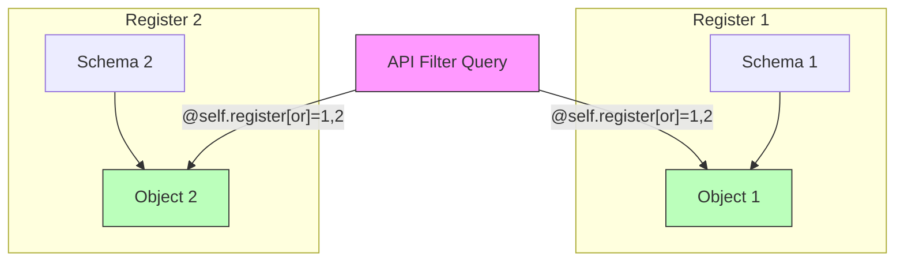
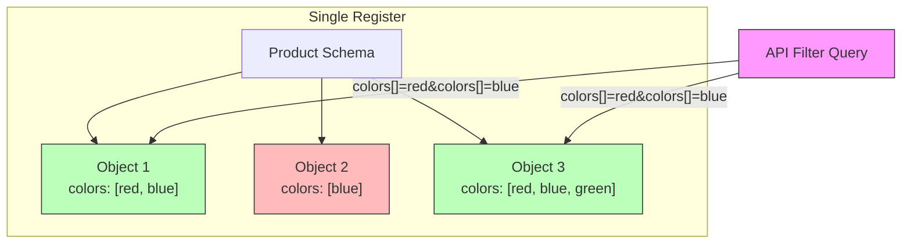

# Testing

OpenRegister uses a comprehensive testing stack to ensure code quality, type safety, and functionality across all components.

## Testing Stack

OpenRegister employs multiple testing and analysis tools:

### Static Analysis Tools

#### Psalm
**Type-safe static analysis for PHP**

Psalm performs deep static analysis to catch type errors, undefined methods, and logical issues before runtime.

**Running Psalm:**
```bash
# From workspace root
cd openregister
composer psalm

# Or using vendor binary
./vendor/bin/psalm --threads=1 --no-cache

# Check specific file
./vendor/bin/psalm --threads=1 --no-cache lib/Service/ObjectService.php
```

**Configuration:**
- Location: `openregister/psalm.xml`
- Level: Baseline with incremental improvements
- Excludes: Migration files

**Common Psalm Fixes:**
- Add proper type hints to method parameters
- Update docblock return types to match actual return types
- Use dependency injection instead of static service locators
- Add null checks for nullable properties

**PHPCS vs Psalm Conflicts:**
PHPCS requires explicit boolean comparisons (`=== true` / `=== false`) via the `Squiz.Operators.ComparisonOperatorUsage` rule, but Psalm flags these as redundant when functions already return booleans. We suppress these specific cases with inline annotations:

```php
/** @psalm-suppress RedundantCondition - PHPCS requires explicit comparison (Squiz.Operators.ComparisonOperatorUsage) */
if (is_array($order) === true) {
    // PHPCS requires === true, Psalm flags as redundant
}
```

This approach:
- Maintains PHPCS compliance (explicit comparisons)
- Keeps Psalm checking other redundant conditions
- Documents the conflict clearly in code

#### PHPStan
**PHP Static Analysis Tool**

PHPStan provides additional static analysis with different rules and detection capabilities than Psalm.

**Running PHPStan:**
```bash
# From workspace root
cd openregister
composer phpstan

# Or using vendor binary
./vendor/bin/phpstan analyse

# Check specific file
./vendor/bin/phpstan analyse lib/Service/ObjectService.php
```

**Configuration:**
- Location: `openregister/phpstan.neon`
- Level: 5
- Paths: `lib/` directory
- Excludes: `lib/Migration/*`

**Common PHPStan Fixes:**
- Correct parameter type mismatches
- Fix undefined method calls
- Handle null safety properly
- Add proper return type declarations

#### PHP CodeSniffer (phpcs)
**Coding standards enforcement**

PHP CodeSniffer checks code against defined coding standards (PSR-12, Nextcloud standards).

**Running phpcs:**
```bash
# Check all files
./vendor/bin/phpcs --standard=phpcs.xml

# Check specific file
./vendor/bin/phpcs --standard=phpcs.xml lib/Service/ObjectService.php

# Auto-fix issues (where possible)
./vendor/bin/phpcbf --standard=phpcs.xml lib/Service/ObjectService.php
```

**Configuration:**
- Location: `openregister/phpcs.xml`
- Standards: PSR-12, Nextcloud coding standards
- Enforces: Naming conventions, formatting, documentation
- **Custom Sniff**: Detects positional arguments after named arguments (PHP 8+ fatal error)

**Common phpcs Requirements:**
- Add docblocks to all classes, methods, and properties
- Add return types to all methods
- Add type hints to all method parameters
- Use proper indentation and spacing
- Follow PSR-12 naming conventions
- Add inline comments ending with proper punctuation (full-stop, exclamation, question mark)

**Named Arguments Check:**
The custom PHPCS sniff automatically detects PHP 8+ fatal errors where positional arguments are used after named arguments:

```php
// ❌ ERROR: Positional argument after named argument
return new JSONResponse(
    data: ['success' => true],
    200  // This will cause a PHP 8+ fatal error
);

// ✅ CORRECT: All arguments after named ones must also be named
return new JSONResponse(
    data: ['success' => true],
    statusCode: 200
);
```

#### Named Arguments Checker
**Custom script to detect PHP 8+ named argument errors**

A dedicated script checks for positional arguments after named arguments, which causes fatal errors in PHP 8+.

**Running the checker:**
```bash
# Check all files in lib/
composer check:named-args

# Or directly
php scripts/check-named-arguments.php --path=lib

# Check specific directory
php scripts/check-named-arguments.php --path=lib/Controller
```

**What it checks:**
- Detects positional arguments used after named arguments
- Reports exact line numbers and function calls
- Provides clear error messages explaining the issue

**Example output:**
```
Checking for positional arguments after named arguments in: lib
======================================================================

lib/Controller/SettingsController.php:
  Line 4216: Positional argument after named argument (PHP 8+ fatal error). 
             First named parameter found at line 4212, positional argument at line 4216. 
             All arguments after the first named argument must also be named.

✗ Found 1 error(s).
```

**Integration:**
This check is automatically included in:
- `composer check` - Standard quality checks
- `composer check:full` - Full quality checks
- `composer check:strict` - Strict quality checks

**Why this matters:**
In PHP 8+, mixing positional and named arguments causes a fatal error at runtime:
```
PHP Fatal error: Cannot use positional argument after named argument
```

This check catches these errors before deployment, preventing 500 errors in production.

### Integration Testing

PHPUnit integration tests verify functionality across components.

### Workflow Integration

All testing tools work together in the development workflow:

1. **During Development**: Run phpcs and Psalm/PHPStan frequently to catch issues early
2. **Before Commit**: Ensure all static analysis tools pass with zero errors
3. **In CI/CD**: Automated checks run on all pull requests
4. **Pre-Release**: Full integration test suite runs

**Quick Check All Tools:**
```bash
# Run all static analysis tools
cd openregister
composer psalm && composer phpstan && ./vendor/bin/phpcs --standard=phpcs.xml
```

## Integration Test Strategy

### Overview

Integration tests verify that different parts of the system work together correctly by testing against a running Docker environment with:
- Nextcloud container
- MySQL database
- Real HTTP requests
- Actual file storage

### Location

Integration tests are located in:
```
openregister/tests/Integration/
```

## Core Integration Tests

The `CoreIntegrationTest.php` file contains organized test groups covering all major OpenRegister functionality.

### Test Group 1: File Upload Tests (Tests 1-15)

Tests for file attachment and upload functionality.

#### Covered Functionality

**Single File Uploads**
- Multipart form upload
- Base64 data URI upload
- URL reference upload (external files)

**Multiple File Uploads**
- Multiple files in single request
- File arrays (images[])

**Validation**
- MIME type validation
- File size limits
- Corrupted base64 detection

**File Operations**
- Retrieving file metadata
- Updating files
- Mixed upload methods

#### Example Test

```php
public function testMultipartUploadSinglePdf(): void
{
    $pdfContent = '%PDF-1.4 fake pdf content for testing';
    $tmpFile = tmpfile();
    fwrite($tmpFile, $pdfContent);
    
    $response = $this->client->post(
        "/index.php/apps/openregister/api/objects/{$register}/{$schema}", 
        [
            'multipart' => [
                ['name' => 'title', 'contents' => 'Test Document'],
                ['name' => 'attachment', 'contents' => fopen($tmpPath, 'r'), 
                 'filename' => 'test.pdf', 
                 'headers' => ['Content-Type' => 'application/pdf']
                ],
            ]
        ]
    );
    
    $this->assertEquals(201, $response->getStatusCode());
}
```

### Test Group 2: Cascade Protection Tests (Tests 16-18)

Tests for referential integrity and cascade protection.

#### Covered Functionality

- **Register Protection**: Cannot delete register with objects
- **Schema Protection**: Cannot delete schema with objects  
- **Cleanup Workflow**: Can delete after proper cleanup

#### Why This Matters

Cascade protection prevents accidental data loss by ensuring:
1. Registers cannot be deleted while containing schemas or objects
2. Schemas cannot be deleted while containing objects
3. Proper cleanup order is enforced (objects → schemas → registers)

#### Example Test

```php
public function testCannotDeleteRegisterWithObjects(): void
{
    // Create object
    $response = $this->client->post(
        "/index.php/apps/openregister/api/objects/{$register}/{$schema}", 
        ['json' => ['title' => 'Protection Test']]
    );
    
    // Attempt to delete register
    $deleteResponse = $this->client->delete(
        "/index.php/apps/openregister/api/registers/{$registerId}"
    );
    
    // Should fail with 400 or 409
    $this->assertContains($deleteResponse->getStatusCode(), [400, 409]);
}
```

### Test Group 3: File Publishing Tests (Tests 19-22)

Tests for file sharing, publishing, and metadata.

#### Covered Functionality

**File Access Control**
- Authenticated URLs for non-shared files (`/api/files/`)
- Public share URLs for published files (`/index.php/s/`)

**Auto-Publishing**
- Schema-level `autoPublish` configuration
- Automatic share creation on upload

**Metadata Integration**
- Logo field mapping (`objectImageField`)
- Image metadata in `@self.image`
- First-file-in-array selection

**File Deletion**
- Delete single file by sending `null`
- Delete file array by sending `[]`

#### Example Test

```php
public function testAutoShareFileProperty(): void
{
    // Create schema with autoPublish
    $schemaResponse = $this->client->post(
        '/index.php/apps/openregister/api/schemas', 
        [
            'json' => [
                'register' => $registerId,
                'slug' => 'auto-share-test',
                'properties' => [
                    'document' => [
                        'type' => 'file',
                        'autoPublish' => true
                    ],
                ],
            ]
        ]
    );
    
    // Upload file
    $response = $this->client->post(
        "/index.php/apps/openregister/api/objects/{$register}/{$schema}", 
        ['multipart' => [...]]
    );
    
    $object = json_decode($response->getBody(), true);
    
    // Verify public share URL
    $this->assertArrayHasKey('published', $object['document']);
    $this->assertStringContainsString(
        '/index.php/s/', 
        $object['document']['accessUrl']
    );
}
```

### Test Group 4: Array Filtering Tests (Tests 23-30)

Tests for advanced filtering with AND/OR logic and dot notation.

#### What These Tests Cover

These tests verify filtering functionality **across multiple registers and schemas**, as well as array properties within objects:

**Cross-Register/Schema Filtering**
- Test objects created in **different registers** (Register 1, Register 2)
- Test objects created with **different schemas** (Schema 1, Schema 2)
- Verify AND logic returns zero results when filtering single-value fields for multiple values
- Verify OR logic returns objects from multiple registers/schemas

**Object Array Property Filtering**  
- Test objects with array properties (e.g., 'availableColours': ['red', 'blue'])
- Verify AND logic requires ALL values present in the array
- Verify OR logic matches objects with ANY of the specified values

#### Covered Functionality

**Default AND Logic**
- Metadata arrays: `@self.register[]=1&@self.register[]=2` → zero results (object can't be in BOTH registers)
- Object arrays: `colours[]=red&colours[]=blue` → objects with BOTH colors in their array

**Explicit OR Logic**
- Metadata: `@self.register[or]=1,2` → objects from EITHER register 1 OR register 2
- Objects: `colours[or]=red,blue` → objects with EITHER red OR blue (or both)

**Dot Notation Syntax**
- Clean URLs: `@self.field` instead of `@self[field]`
- Works with operators: `@self.created[gte]=2025-01-01`
- Combines with regular filters: `@self.register=5&title=Test`

**Complex Scenarios**
- Multiple filter types combined
- Nested operators
- Mixed AND/OR logic across different fields

#### Example Tests

**Default AND Logic - Cross-Register Testing**
```php
public function testMetadataArrayFilterDefaultAndLogic(): void
{
    // Step 1: Create TWO separate registers
    $register1 = $this->client->post('/api/registers', [
        'json' => ['slug' => 'filter-test-1', 'title' => 'Filter Test Register 1']
    ]);
    $register2 = $this->client->post('/api/registers', [
        'json' => ['slug' => 'filter-test-2', 'title' => 'Filter Test Register 2']
    ]);
    
    // Step 2: Create schemas in EACH register
    $schema1 = createSchemaInRegister($register1['id']);
    $schema2 = createSchemaInRegister($register2['id']);
    
    // Step 3: Create objects in DIFFERENT registers
    $obj1 = createObjectInRegister($register1, $schema1); // In Register 1
    $obj2 = createObjectInRegister($register2, $schema2); // In Register 2
    
    // Step 4: Filter with AND logic (default) - search across ALL registers
    $url = "/api/objects?@self.register[]={$reg1['id']}&@self.register[]={$reg2['id']}";
    $response = $this->client->get($url);
    $result = json_decode($response->getBody(), true);
    
    // Step 5: Verify zero results (object can't be in BOTH registers simultaneously)
    $this->assertEquals(0, $result['total']);
}
```

**Explicit OR Logic - Cross-Register Testing**
```php
public function testMetadataArrayFilterExplicitOrLogicWithDotNotation(): void
{
    // Step 1: Create TWO separate registers
    $register1 = createRegister('or-test-1');
    $register2 = createRegister('or-test-2');
    
    // Step 2: Create schemas in EACH register
    $schema1 = createSchemaInRegister($register1['id']);
    $schema2 = createSchemaInRegister($register2['id']);
    
    // Step 3: Create objects in DIFFERENT registers
    $obj1 = createObjectInRegister($register1, $schema1); // In Register 1
    $obj2 = createObjectInRegister($register2, $schema2); // In Register 2
    
    // Step 4: Filter with OR logic using dot notation - search across ALL registers
    $url = "/api/objects?@self.register[or]={$reg1['id']},{$reg2['id']}";
    $response = $this->client->get($url);
    $result = json_decode($response->getBody(), true);
    
    // Step 5: Verify BOTH objects returned (from register 1 OR register 2)
    $this->assertGreaterThanOrEqual(2, $result['total']);
    $returnedIds = array_column($result['results'], 'id');
    $this->assertContains($obj1['id'], $returnedIds); // From Register 1
    $this->assertContains($obj2['id'], $returnedIds); // From Register 2
}
```

**Object Array Property AND Logic - Within Same Register/Schema**
```php
public function testObjectArrayPropertyDefaultAndLogic(): void
{
    // Step 1: Create ONE register with ONE schema that has array property
    $register = createRegister('product-test');
    $schema = $this->client->post('/api/schemas', [
        'json' => [
            'register' => $register['id'],
            'slug' => 'product-schema',
            'properties' => [
                'title' => ['type' => 'string'],
                'availableColours' => [
                    'type' => 'array',
                    'items' => ['type' => 'string']
                ]
            ],
        ]
    ]);
    
    // Step 2: Create products with different color combinations IN SAME REGISTER
    $redBlue = createProduct(['red', 'blue']);        // ✅ Has BOTH red AND blue
    $onlyBlue = createProduct(['blue']);              // ❌ Has only blue, missing red
    $redBlueGreen = createProduct(['red', 'blue', 'green']); // ✅ Has BOTH red AND blue (plus green)
    
    // Step 3: Filter for products with BOTH red AND blue using AND logic
    $url = "/api/objects?availableColours[]=red&availableColours[]=blue";
    $response = $this->client->get($url);
    $result = json_decode($response->getBody(), true);
    
    // Step 4: Verify only products with BOTH colors are returned
    $returnedIds = array_column($result['results'], 'id');
    $this->assertContains($redBlue['id'], $returnedIds);      // Has both
    $this->assertContains($redBlueGreen['id'], $returnedIds); // Has both + more
    $this->assertNotContains($onlyBlue['id'], $returnedIds);  // Missing red
}
```

**Dot Notation Syntax**
```php
public function testDotNotationSyntaxForMetadataFilters(): void
{
    // Use dot notation for metadata filter
    $url = "/api/objects?@self.register={$registerId}";
    $response = $this->client->get($url);
    $result = json_decode($response->getBody(), true);
    
    // All returned objects should be from specified register
    foreach ($result['results'] as $obj) {
        $this->assertEquals($registerId, $obj['@self']['register']);
    }
}
```

## Running Tests

### Prerequisites

1. **Docker containers running**:
   ```bash
   docker ps | grep -E "nextcloud|database"
   ```

2. **OpenRegister app enabled**:
   ```bash
   docker exec -u 33 master-nextcloud-1 php occ app:enable openregister
   ```

### Run Tests Inside Docker Container (Recommended)

Integration tests should be run **inside the Nextcloud Docker container** to have access to the full Nextcloud environment:

```bash
# Run all tests
docker exec master-nextcloud-1 bash -c "cd /var/www/html/apps-extra/openregister && php vendor/bin/phpunit tests/Integration/CoreIntegrationTest.php --bootstrap tests/integration-bootstrap.php --no-configuration 2>&1"

# Run specific test group with readable output
docker exec master-nextcloud-1 bash -c "cd /var/www/html/apps-extra/openregister && php vendor/bin/phpunit --filter 'testMetadataArrayFilter|testObjectArrayProperty' tests/Integration/CoreIntegrationTest.php --bootstrap tests/integration-bootstrap.php --no-configuration --testdox 2>&1"

# Run single test
docker exec master-nextcloud-1 bash -c "cd /var/www/html/apps-extra/openregister && php vendor/bin/phpunit --filter testDotNotationSyntaxForMetadataFilters tests/Integration/CoreIntegrationTest.php --bootstrap tests/integration-bootstrap.php --no-configuration 2>&1"

# Save output to file
docker exec master-nextcloud-1 bash -c "cd /var/www/html/apps-extra/openregister && php vendor/bin/phpunit tests/Integration/CoreIntegrationTest.php --bootstrap tests/integration-bootstrap.php --no-configuration 2>&1 | tee /tmp/test-output.txt"
```

### Run Specific Test Groups

```bash
# File Upload Tests (1-15)
docker exec master-nextcloud-1 bash -c "cd /var/www/html/apps-extra/openregister && php vendor/bin/phpunit --filter testMultipart tests/Integration/CoreIntegrationTest.php --bootstrap tests/integration-bootstrap.php --no-configuration --testdox"

# Cascade Protection Tests (16-18)
docker exec master-nextcloud-1 bash -c "cd /var/www/html/apps-extra/openregister && php vendor/bin/phpunit --filter testCannotDelete tests/Integration/CoreIntegrationTest.php --bootstrap tests/integration-bootstrap.php --no-configuration --testdox"

# File Publishing Tests (19-22)
docker exec master-nextcloud-1 bash -c "cd /var/www/html/apps-extra/openregister && php vendor/bin/phpunit --filter 'testAutoShare|testLogo|testImage|testDelete' tests/Integration/CoreIntegrationTest.php --bootstrap tests/integration-bootstrap.php --no-configuration --testdox"

# Array Filtering Tests (23-30)
docker exec master-nextcloud-1 bash -c "cd /var/www/html/apps-extra/openregister && php vendor/bin/phpunit --filter 'testMetadataArrayFilter|testObjectArrayProperty|testDotNotation|testComplex' tests/Integration/CoreIntegrationTest.php --bootstrap tests/integration-bootstrap.php --no-configuration --testdox"
```

### Why Run in Docker Container?

Running tests inside the Docker container ensures:
- Access to Nextcloud's internal API
- Proper database connections
- File system access
- Nextcloud environment variables
- PHP extensions and dependencies
- Correct base URL ('http://localhost' inside container)

## Test Environment

### Configuration

Tests use the following configuration:
- **Base URL**: `http://localhost`
- **Auth**: `admin:admin` (Basic Auth)
- **Containers**: 
  - `master-nextcloud-1` (Nextcloud)
  - `master-database-mysql-1` (MySQL)

### Cleanup

Tests automatically clean up created resources:
1. Objects (deleted first)
2. Schemas (deleted second)
3. Registers (deleted last)

Proper cleanup order is essential for cascade protection.

## Writing New Tests

### Test Structure

```php
public function testYourFeature(): void
{
    // 1. Setup: Create necessary resources
    $register = $this->createTestRegister();
    $schema = $this->createTestSchema($register);
    
    // 2. Execute: Perform the test action
    $response = $this->client->post(
        "/api/objects/{$register}/{$schema}",
        ['json' => ['title' => 'Test']]
    );
    
    // 3. Assert: Verify expected behavior
    $this->assertEquals(201, $response->getStatusCode());
    $data = json_decode($response->getBody(), true);
    $this->assertArrayHasKey('id', $data);
    
    // 4. Cleanup: Track for tearDown
    $this->createdObjectIds[] = $data['id'];
}
```

### Best Practices

1. **Use unique identifiers**: Add `uniqid()` to slugs to avoid conflicts
2. **Track created resources**: Add IDs to cleanup arrays
3. **Clear assertions**: Use descriptive assertion messages
4. **Isolated tests**: Each test should be independent
5. **Cleanup order**: Objects → Schemas → Registers

### Adding to Test Groups

When adding tests, follow the existing group structure:
- **Tests 1-15**: File uploads
- **Tests 16-18**: Cascade protection
- **Tests 19-22**: File publishing
- **Tests 23-30**: Array filtering
- **Tests 31+**: Your new group

Update the class-level docblock when adding new groups.

## Continuous Integration

### GitHub Actions

Tests can be integrated with GitHub Actions:

```yaml
name: Integration Tests

on: [push, pull_request]

jobs:
  test:
    runs-on: ubuntu-latest
    steps:
      - uses: actions/checkout@v2
      - name: Start Docker containers
        run: docker-compose up -d
      - name: Run tests
        run: ./vendor/bin/phpunit tests/Integration/
```

## Troubleshooting

### Container Connection Issues

```bash
# Check container status
docker ps

# Check container logs
docker logs master-nextcloud-1

# Restart containers
docker-compose restart
```

### Database Issues

```bash
# Access database
docker exec -it master-database-mysql-1 mysql -u nextcloud -pnextcloud nextcloud

# Check object count
SELECT COUNT(*) FROM oc_openregister_objects;

# Clean test data
DELETE FROM oc_openregister_objects WHERE register IN (
    SELECT id FROM oc_openregister_registers WHERE slug LIKE 'test-%'
);
```

### Test Failures

1. **Check container logs** for errors
2. **Verify app is enabled**: `php occ app:list | grep openregister`
3. **Check database connections**
4. **Ensure proper cleanup** between test runs

## Test Scope: Cross-Register vs Within-Register

Understanding test scope is important for debugging and extending tests:

### Cross-Register/Schema Tests (Tests 21-22, 25-27)

These tests create **multiple registers and schemas** to verify filtering works across different data boundaries:



**Purpose**: Verify that:
- OR logic can retrieve objects from multiple registers
- AND logic correctly returns zero results for single-value fields
- Dot notation works across register boundaries

### Within-Register Tests (Tests 23-24, 28)

These tests use **one register with one schema** to verify array property filtering:



**Purpose**: Verify that:
- AND logic requires ALL array values to be present
- OR logic matches ANY array value
- Array filtering works within object properties

## Future Test Groups

Planned additional test groups:
- **RBAC Tests**: Role-based access control
- **Multi-tenancy Tests**: Organization isolation
- **Search Tests**: Full-text and filtered search
- **Solr Integration Tests**: Search engine functionality
- **Performance Tests**: Bulk operations and optimization

## Best Practices

### Code Quality Standards

1. **Zero Errors Policy**: All code must pass all static analysis tools with zero errors
2. **Warnings Are OK**: Warnings are tracked but do not block development
3. **Fix Before Commit**: Run all tools before committing changes
4. **Incremental Improvements**: Address warnings gradually in separate commits

### Static Analysis Workflow

```bash
# 1. Check for errors only
./vendor/bin/phpcs --standard=phpcs.xml --error-severity=1 --warning-severity=0 lib/

# 2. Run Psalm
./vendor/bin/psalm --threads=1 --no-cache

# 3. Run PHPStan
./vendor/bin/phpstan analyse

# 4. If all pass, commit changes
git add .
git commit -m "feat: implement feature X"
```

### Common Patterns

#### Dependency Injection vs Static Calls

**Bad (triggers Psalm/PHPStan errors):**
```php
$mapper = \OC::$server->get('OCA\OpenRegister\Db\ObjectMapper');
```

**Good (passes all checks):**
```php
public function __construct(
    private readonly ObjectMapper $objectMapper
) {
}
```

#### Nullable Return Types

**Bad:**
```php
/**
 * @return ValidationError
 */
public function getErrors(): ?ValidationError
```

**Good:**
```php
/**
 * @return ValidationError|null Returns validation errors or null if none exist.
 */
public function getErrors(): ?ValidationError
```

#### Type Casting for Operations

**Bad:**
```php
$control += ($character * $multiplier); // String * int triggers error
```

**Good:**
```php
$control += ((int) $character * $multiplier); // Explicit cast
```

## See Also

- [Search Documentation](../Features/search.md) - Array filtering details
- [File Management](../Features/files.md) - File upload specifications
- [API Documentation](../api/objects.md) - API endpoint reference
- [Coding Standards](https://docs.nextcloud.com/server/latest/developer_manual/digging_deeper/codingguidelines.html) - Nextcloud coding guidelines

