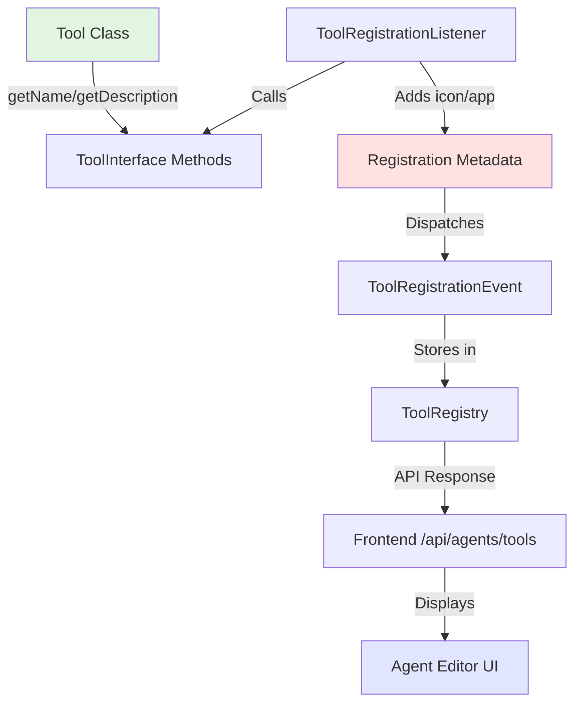

# Tool Metadata Architecture - Documentation Update

## What We Clarified

Based on your excellent question about where tool metadata comes from, we've improved the documentation to explain the architecture more clearly.

## The Current Architecture

### Two-Part System

**1. Tool Class (ToolInterface)**
```php
interface ToolInterface {
    public function getName(): string;         // ✅ Self-describing
    public function getDescription(): string;  // ✅ Self-describing
    public function getFunctions(): array;     // ✅ Self-describing
    public function executeFunction(...);      // ✅ Logic
    public function setAgent(Agent $agent);    // ✅ Context
}
```

**2. Registration Metadata**
```php
$event->registerTool('myapp.tool', $tool, [
    'name' => $tool->getName(),        // 📋 From tool (best practice)
    'description' => $tool->getDescription(), // 📋 From tool (best practice)
    'icon' => 'icon-category-office',  // 🎨 UI concern (registration only)
    'app' => 'myapp'                   // 🏷️ Metadata (registration only)
]);
```

### Why This Separation?

| Aspect | Tool Class | Registration Metadata | Reason |
|--------|-----------|----------------------|---------|
| **Name** | ✅ Primary source | 📋 Should reference tool | Tool knows its own name |
| **Description** | ✅ Primary source | 📋 Should reference tool | Tool knows its purpose |
| **Icon** | ❌ Not in interface | ✅ Only here | UI presentation concern |
| **App** | ❌ Not in interface | ✅ Only here | Context/grouping metadata |

## What We Updated

### 1. Documentation (`tool-registration.md`)

**Added:**
- ✅ Best practice: Use `$tool->getName()` and `$tool->getDescription()`
- ✅ Explanation of why icon/app are registration-only
- ✅ Table showing metadata sources and purposes
- ✅ Architecture rationale section
- ✅ Available icons reference (Nextcloud + MDI)

**Example from docs:**
```php
// ❌ OLD WAY (duplication)
$event->registerTool('myapp.tool', $tool, [
    'name' => 'My Tool',  // Hardcoded, duplicates $tool->getName()
    'description' => 'Does things',  // Hardcoded, duplicates $tool->getDescription()
    'icon' => 'icon-category-office',
    'app' => 'myapp'
]);

// ✅ NEW WAY (best practice)
$event->registerTool('myapp.tool', $tool, [
    'name' => $tool->getName(),  // Pulls from tool class
    'description' => $tool->getDescription(),  // Pulls from tool class
    'icon' => 'icon-category-office',  // UI concern, stays here
    'app' => 'myapp'  // Metadata, stays here
]);
```

### 2. Implementation Updates

**OpenRegister's `ToolRegistrationListener.php`:**
```php
// Now uses getName() and getDescription()
$event->registerTool('openregister.objects', $this->objectsTool, [
    'name' => $this->objectsTool->getName(),          // ✅ 
    'description' => $this->objectsTool->getDescription(), // ✅ 
    'icon' => 'icon-category-organization',
    'app' => 'openregister',
]);
```

**OpenCatalogi's `ToolRegistrationListener.php`:**
```php
// Now uses getName() and getDescription()
$event->registerTool('opencatalogi.cms', $this->cmsTool, [
    'name' => $this->cmsTool->getName(),          // ✅ 
    'description' => $this->cmsTool->getDescription(), // ✅ 
    'icon' => 'icon-category-office',
    'app' => 'opencatalogi',
]);
```

## Benefits of This Architecture

### 1. Single Source of Truth
- Tool class **owns** its name and description
- No duplication between class and registration
- Changes to tool name/description automatically reflected in UI

### 2. Testability
```php
// Can test tool independently of registration
public function testToolName() {
    $tool = new CMSTool(...);
    $this->assertEquals('CMS Tool', $tool->getName());
}
```

### 3. Flexibility
- Can override name/description in registration if needed (rare cases)
- UI concerns (icon, app badge) kept separate from business logic
- Tools remain framework-agnostic

### 4. Maintainability
- Tool class is self-documenting
- Registration is minimal configuration
- Clear separation of concerns

## Metadata Flow Diagram



## Frontend Display

What you see in the UI comes from:

```
┌─────────────────────────────────────────────┐
│  ☐  📄 CMS Tool          opencatalogi       │  ← Checkbox + Icon + Name + App Badge
│     Manage website content: create pages... │  ← Description
│                                             │
│  Icon:        $metadata['icon']             │  ← Registration only
│  Name:        $tool->getName()              │  ← From tool class
│  Description: $tool->getDescription()       │  ← From tool class  
│  App Badge:   $metadata['app']              │  ← Registration only
└─────────────────────────────────────────────┘
```

## Icon Options Reference

### Nextcloud Built-in Icons
```php
'icon' => 'icon-category-office'         // 📄 Office/documents
'icon' => 'icon-category-customization'  // ⚙️ Settings/config
'icon' => 'icon-category-organization'   // 🏢 Structure/org
'icon' => 'icon-category-monitoring'     // 📊 Analytics
'icon' => 'icon-category-integration'    // 🔗 Connections
'icon' => 'icon-category-workflow'       // 🔄 Automation
'icon' => 'icon-category-auth'          // 🔐 Security
'icon' => 'icon-category-social'        // 💬 Communication
```

### MDI Icons
```php
'icon' => 'mdi-database'  // 🗄️ Database
'icon' => 'mdi-web'       // 🌐 Website
'icon' => 'mdi-api'       // 🔌 API
'icon' => 'mdi-robot'     // 🤖 AI/Bot
'icon' => 'mdi-tools'     // 🔧 Tools
```

## Testing

After updates, verified API response:
```bash
$ curl http://localhost/index.php/apps/openregister/api/agents/tools
```

Response shows tools using their self-describing names:
```json
{
  "results": {
    "opencatalogi.cms": {
      "name": "CMS Tool",
      "description": "Manage website content: create and manage pages...",
      "icon": "icon-category-office",
      "app": "opencatalogi"
    },
    "openregister.objects": {
      "name": "objects",
      "description": "Manage objects in OpenRegister...",
      "icon": "icon-category-organization",
      "app": "openregister"
    }
  }
}
```

## Lessons Learned

1. **Documentation is iterative**: Your question helped us realize the docs didn't clearly explain where metadata comes from.

2. **Best practices emerge**: Through implementation, we discovered that pulling name/description from the tool class reduces duplication.

3. **Separation of concerns matters**: Keeping UI concerns (icon) separate from business logic (tool class) makes the system more maintainable.

4. **Examples are crucial**: The updated docs now show both ❌ wrong and ✅ right ways to register tools.

## For Future Developers

When creating a new tool:

1. **Implement ToolInterface** with clear name/description
2. **Register with metadata** using `$tool->getName()` and `$tool->getDescription()`
3. **Choose an appropriate icon** from the reference list
4. **Provide your app ID** for proper badging

This ensures consistency across the platform and makes your tool self-documenting!

## Files Modified

- ✅ `openregister/website/docs/development/tool-registration.md` - Updated with best practices
- ✅ `openregister/lib/Listener/ToolRegistrationListener.php` - Uses getName/getDescription
- ✅ `opencatalogi/lib/Listener/ToolRegistrationListener.php` - Uses getName/getDescription

## Status

✅ **Documentation updated**  
✅ **Implementation updated to best practices**  
✅ **API tested and working**  
✅ **Ready for developers to use**

---

**Great question!** Your curiosity about where the metadata comes from led to significant documentation improvements that will help all future developers. 🎉

