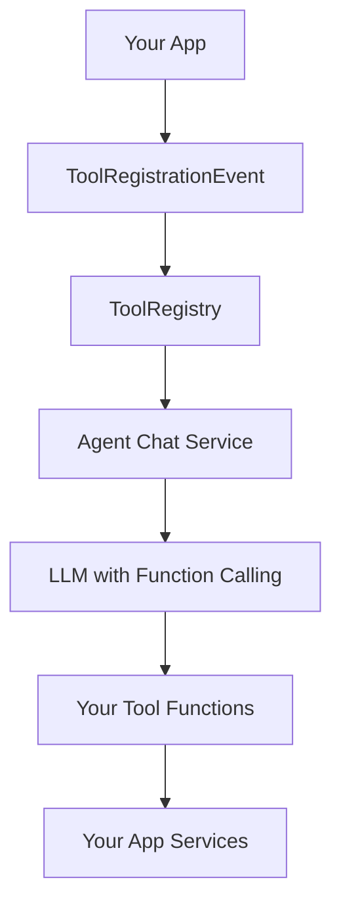

# Tool Registration for OpenRegister Agents

This guide explains how to create and register custom tools for OpenRegister agents. Tools enable AI agents to perform actions through function calling, allowing them to interact with your app's data and functionality.

## Overview

OpenRegister provides a plugin architecture for tools that allows any Nextcloud app to register custom functions that agents can use. Tools are automatically discovered and made available to all agents through a central registry.

### Key Concepts

- **Tool**: A collection of related functions that an agent can call
- **ToolRegistry**: Central service that manages all available tools
- **ToolRegistrationEvent**: Event dispatched when tools are being collected
- **ToolInterface**: Contract that all tools must implement

## Architecture



## Creating a Tool

### Step 1: Implement the ToolInterface

Create a new tool class in your app that implements the `OCA\OpenRegister\Tool\ToolInterface`:

```php
<?php

declare(strict_types=1);

namespace OCA\MyApp\Tool;

use OCA\OpenRegister\Tool\ToolInterface;
use OCA\OpenRegister\Db\Agent;
use OCA\MyApp\Service\MyService;
use Psr\Log\LoggerInterface;

class MyCustomTool implements ToolInterface
{
    private ?Agent $agent = null;
    
    public function __construct(
        private MyService $myService,
        private LoggerInterface $logger
    ) {
    }
    
    public function getName(): string
    {
        return 'My Custom Tool';
    }
    
    public function getDescription(): string
    {
        return 'Allows agents to interact with MyApp data';
    }
    
    public function setAgent(Agent $agent): void
    {
        $this->agent = $agent;
    }
    
    public function getFunctions(): array
    {
        return [
            [
                'name' => 'myapp_create_item',
                'description' => 'Create a new item in MyApp',
                'parameters' => [
                    'type' => 'object',
                    'properties' => [
                        'name' => [
                            'type' => 'string',
                            'description' => 'Name of the item to create'
                        ],
                        'description' => [
                            'type' => 'string',
                            'description' => 'Optional description'
                        ]
                    ],
                    'required' => ['name']
                ]
            ],
            [
                'name' => 'myapp_list_items',
                'description' => 'List all items in MyApp',
                'parameters' => [
                    'type' => 'object',
                    'properties' => [
                        'limit' => [
                            'type' => 'integer',
                            'description' => 'Maximum number of items to return'
                        ]
                    ],
                    'required' => []
                ]
            ]
        ];
    }
    
    public function executeFunction(string $functionName, array $parameters, ?string $userId = null): array
    {
        try {
            switch ($functionName) {
                case 'myapp_create_item':
                    $item = $this->myService->createItem(
                        $parameters['name'],
                        $parameters['description'] ?? '',
                        $userId
                    );
                    return [
                        'success' => true,
                        'data' => ['id' => $item->getId(), 'name' => $item->getName()]
                    ];
                    
                case 'myapp_list_items':
                    $items = $this->myService->listItems(
                        $parameters['limit'] ?? 10,
                        $userId
                    );
                    return [
                        'success' => true,
                        'data' => ['items' => $items]
                    ];
                    
                default:
                    return [
                        'success' => false,
                        'error' => 'Unknown function: ' . $functionName
                    ];
            }
        } catch (\Exception $e) {
            $this->logger->error('[MyCustomTool] Error executing function', [
                'function' => $functionName,
                'error' => $e->getMessage()
            ]);
            
            return [
                'success' => false,
                'error' => $e->getMessage()
            ];
        }
    }
}
```

### Step 2: Register the Tool

In your app's `lib/AppInfo/Application.php`, listen to the `ToolRegistrationEvent` and register your tool:

```php
<?php

namespace OCA\MyApp\AppInfo;

use OCA\OpenRegister\Event\ToolRegistrationEvent;
use OCA\MyApp\Tool\MyCustomTool;
use OCP\AppFramework\App;
use OCP\AppFramework\Bootstrap\IBootContext;
use OCP\AppFramework\Bootstrap\IBootstrap;
use OCP\AppFramework\Bootstrap\IRegistrationContext;
use OCP\EventDispatcher\IEventDispatcher;

class Application extends App implements IBootstrap
{
    public const APP_ID = 'myapp';

    public function __construct()
    {
        parent::__construct(self::APP_ID);
    }

    public function register(IRegistrationContext $context): void
    {
        // Register the tool registration listener
        $context->registerEventListener(
            ToolRegistrationEvent::class,
            \OCA\MyApp\Listener\ToolRegistrationListener::class
        );
    }

    public function boot(IBootContext $context): void
    {
        // Boot logic here
    }
}
```

### Step 3: Create a Tool Registration Listener

Create a listener class in `lib/Listener/ToolRegistrationListener.php`:

```php
<?php

declare(strict_types=1);

namespace OCA\MyApp\Listener;

use OCA\OpenRegister\Event\ToolRegistrationEvent;
use OCA\MyApp\Tool\MyCustomTool;
use OCP\EventDispatcher\Event;
use OCP\EventDispatcher\IEventListener;

class ToolRegistrationListener implements IEventListener
{
    public function __construct(
        private MyCustomTool $myCustomTool
    ) {
    }

    public function handle(Event $event): void
    {
        if (!($event instanceof ToolRegistrationEvent)) {
            return;
        }

        // Register your tool with metadata
        // BEST PRACTICE: Pull name/description from the tool class to avoid duplication
        $event->registerTool('myapp.mycustom', $this->myCustomTool, [
            'name' => $this->myCustomTool->getName(),
            'description' => $this->myCustomTool->getDescription(),
            'icon' => 'icon-category-customization',  // Nextcloud icon class or MDI icon
            'app' => 'myapp'  // Your app ID
        ]);
    }
}
```

:::tip Best Practice
Use `$tool->getName()` and `$tool->getDescription()` in the metadata to avoid duplication. This ensures the tool's self-reported name/description is always used in the UI.
:::

:::info Icon & App Metadata
The `icon` and `app` fields are **only** defined during registration (not in the tool class). This is intentional:
- **Icon**: UI presentation concern (which icon to show in the agent editor)
- **App**: Metadata for filtering/grouping tools by source app
- **Name/Description**: Should come from the tool class for consistency
:::

## Tool Metadata

When registering a tool, you must provide the following metadata:

| Field | Type | Required | Source | Description |
|-------|------|----------|--------|-------------|
| `name` | string | Yes | Tool class | Human-readable name displayed in the agent editor. **Best practice**: Use `$tool->getName()` |
| `description` | string | Yes | Tool class | Brief description of what the tool does. **Best practice**: Use `$tool->getDescription()` |
| `icon` | string | Yes | Registration | Nextcloud icon class (e.g., `icon-category-office`) or MDI icon name |
| `app` | string | Yes | Registration | Your app ID (e.g., `myapp`). Used for filtering and app badges |

### Why This Architecture?

**Tool Class** (ToolInterface):
- Defines **what** the tool does (functions, logic)
- Self-describes its **name** and **description**
- Agnostic to UI presentation

**Registration Metadata**:
- Defines **how** to display the tool in the UI (icon)
- Provides **context** about the tool's source (app ID)
- Can override tool class metadata if needed (though not recommended)

This separation allows:
- Tools to be self-documenting
- UI presentation to be flexible
- Tools to be tested independently of registration

### Tool ID Format

Tool IDs must follow the format: `app_name.tool_name`

Examples:
- `myapp.mycustom`
- `opencatalogi.cms`
- `openregister.register`

### Available Icons

You can use either Nextcloud built-in icons or MDI (Material Design Icons):

**Nextcloud Icon Classes** (recommended):
```php
'icon' => 'icon-category-office'         // Office/document icon
'icon' => 'icon-category-customization'  // Customization/settings icon
'icon' => 'icon-category-organization'   // Organization/structure icon
'icon' => 'icon-category-monitoring'     // Monitoring/analytics icon
'icon' => 'icon-category-integration'    // Integration/connection icon
'icon' => 'icon-category-workflow'       // Workflow/automation icon
'icon' => 'icon-category-auth'          // Authentication/security icon
'icon' => 'icon-category-social'        // Social/communication icon
'icon' => 'icon-folder'                 // Folder icon
'icon' => 'icon-file'                   // File icon
'icon' => 'icon-user'                   // User icon
'icon' => 'icon-settings'               // Settings icon
```

**MDI Icons** (use the class name from [Pictogrammers](https://pictogrammers.com/library/mdi/)):
```php
'icon' => 'mdi-database'       // Database icon
'icon' => 'mdi-web'           // Website icon
'icon' => 'mdi-api'           // API icon
'icon' => 'mdi-robot'         // Robot/AI icon
'icon' => 'mdi-tools'         // Tools icon
```

The icon appears next to the tool name in the agent editor, helping users quickly identify tool types.

## Function Definition Schema

Functions must follow the OpenAI function calling schema:

```php
[
    'name' => 'function_name',           // Unique function identifier
    'description' => 'What it does',     // Clear description for the LLM
    'parameters' => [
        'type' => 'object',
        'properties' => [
            'param_name' => [
                'type' => 'string',      // string, integer, boolean, array, object
                'description' => 'What this parameter is for',
                'enum' => ['option1', 'option2']  // Optional: restrict to specific values
            ]
        ],
        'required' => ['param_name']     // List of required parameters
    ]
]
```

## Best Practices

### 1. Security & Permissions

Always respect the user's permissions and the agent's configuration:

```php
public function executeFunction(string $functionName, array $parameters, ?string $userId = null): array
{
    // Check user permissions
    if (!$this->hasPermission($userId, 'myapp.create')) {
        return [
            'success' => false,
            'error' => 'Insufficient permissions'
        ];
    }
    
    // Check agent organization limits
    $organisation = $this->agent?->getOrganisation();
    if ($organisation && !$this->belongsToOrganisation($item, $organisation)) {
        return [
            'success' => false,
            'error' => 'Access denied to this organization'
        ];
    }
    
    // Execute function...
}
```

### 2. Error Handling

Always wrap function execution in try-catch and return structured responses:

```php
try {
    $result = $this->myService->doSomething($parameters);
    return [
        'success' => true,
        'data' => $result
    ];
} catch (\Exception $e) {
    $this->logger->error('[MyTool] Error', [
        'error' => $e->getMessage()
    ]);
    
    return [
        'success' => false,
        'error' => 'Failed to execute: ' . $e->getMessage()
    ];
}
```

### 3. Clear Function Descriptions

Write clear, concise descriptions for the LLM:

- **Good**: 'Create a new page with the given title and content'
- **Bad**: 'Creates page'

### 4. Input Validation

Validate all parameters before processing:

```php
// Validate required parameters
if (empty($parameters['name'])) {
    return [
        'success' => false,
        'error' => 'Name parameter is required'
    ];
}

// Validate parameter types
if (!is_string($parameters['name'])) {
    return [
        'success' => false,
        'error' => 'Name must be a string'
    ];
}

// Validate parameter values
if (strlen($parameters['name']) > 255) {
    return [
        'success' => false,
        'error' => 'Name must not exceed 255 characters'
    ];
}
```

### 5. Logging

Log all tool executions for debugging and auditing:

```php
$this->logger->info('[MyTool] Executing function', [
    'function' => $functionName,
    'userId' => $userId,
    'agentId' => $this->agent?->getId()
]);
```

## Testing Your Tool

### Unit Tests

Create PHPUnit tests for your tool:

```php
<?php

namespace OCA\MyApp\Tests\Tool;

use OCA\MyApp\Tool\MyCustomTool;
use PHPUnit\Framework\TestCase;

class MyCustomToolTest extends TestCase
{
    private MyCustomTool $tool;
    
    protected function setUp(): void
    {
        parent::setUp();
        $this->tool = new MyCustomTool(/* dependencies */);
    }
    
    public function testCreateItem(): void
    {
        $result = $this->tool->executeFunction('myapp_create_item', [
            'name' => 'Test Item'
        ], 'testuser');
        
        $this->assertTrue($result['success']);
        $this->assertArrayHasKey('data', $result);
    }
}
```

### Manual Testing

1. Enable your app in Nextcloud
2. Navigate to OpenRegister Agents
3. Create or edit an agent
4. Go to the 'Tools' tab
5. Your tool should appear in the list
6. Enable your tool
7. Start a chat with the agent
8. Ask the agent to use your tool's functions

## Example: CMS Tool for OpenCatalogi

Here's a complete example of a CMS tool that manages pages, menus, and menu items:

```php
<?php

declare(strict_types=1);

namespace OCA\OpenCatalogi\Tool;

use OCA\OpenRegister\Tool\ToolInterface;
use OCA\OpenRegister\Db\Agent;
use OCA\OpenCatalogi\Service\PageService;
use OCA\OpenCatalogi\Service\MenuService;
use Psr\Log\LoggerInterface;

class CMSTool implements ToolInterface
{
    private ?Agent $agent = null;
    
    public function __construct(
        private PageService $pageService,
        private MenuService $menuService,
        private LoggerInterface $logger
    ) {
    }
    
    public function getName(): string
    {
        return 'CMS Tool';
    }
    
    public function getDescription(): string
    {
        return 'Manage website content: pages, menus, and menu items';
    }
    
    public function setAgent(Agent $agent): void
    {
        $this->agent = $agent;
    }
    
    public function getFunctions(): array
    {
        return [
            // Page functions
            [
                'name' => 'cms_create_page',
                'description' => 'Create a new page with title and content',
                'parameters' => [
                    'type' => 'object',
                    'properties' => [
                        'title' => ['type' => 'string', 'description' => 'Page title'],
                        'content' => ['type' => 'string', 'description' => 'Page content in HTML'],
                        'slug' => ['type' => 'string', 'description' => 'URL-friendly slug']
                    ],
                    'required' => ['title', 'content']
                ]
            ],
            [
                'name' => 'cms_list_pages',
                'description' => 'List all pages',
                'parameters' => [
                    'type' => 'object',
                    'properties' => [
                        'limit' => ['type' => 'integer', 'description' => 'Max results']
                    ],
                    'required' => []
                ]
            ],
            // Menu functions
            [
                'name' => 'cms_create_menu',
                'description' => 'Create a new menu',
                'parameters' => [
                    'type' => 'object',
                    'properties' => [
                        'name' => ['type' => 'string', 'description' => 'Menu name'],
                        'location' => ['type' => 'string', 'description' => 'Menu location (header, footer, sidebar)']
                    ],
                    'required' => ['name']
                ]
            ],
            [
                'name' => 'cms_add_menu_item',
                'description' => 'Add an item to a menu',
                'parameters' => [
                    'type' => 'object',
                    'properties' => [
                        'menuId' => ['type' => 'string', 'description' => 'Menu UUID'],
                        'label' => ['type' => 'string', 'description' => 'Menu item label'],
                        'url' => ['type' => 'string', 'description' => 'Link URL'],
                        'pageId' => ['type' => 'string', 'description' => 'Link to a page UUID (alternative to url)']
                    ],
                    'required' => ['menuId', 'label']
                ]
            ]
        ];
    }
    
    public function executeFunction(string $functionName, array $parameters, ?string $userId = null): array
    {
        try {
            return match ($functionName) {
                'cms_create_page' => $this->createPage($parameters, $userId),
                'cms_list_pages' => $this->listPages($parameters, $userId),
                'cms_create_menu' => $this->createMenu($parameters, $userId),
                'cms_add_menu_item' => $this->addMenuItem($parameters, $userId),
                default => ['success' => false, 'error' => 'Unknown function']
            };
        } catch (\Exception $e) {
            $this->logger->error('[CMSTool] Error', [
                'function' => $functionName,
                'error' => $e->getMessage()
            ]);
            
            return ['success' => false, 'error' => $e->getMessage()];
        }
    }
    
    private function createPage(array $parameters, ?string $userId): array
    {
        $page = $this->pageService->create([
            'title' => $parameters['title'],
            'content' => $parameters['content'],
            'slug' => $parameters['slug'] ?? $this->generateSlug($parameters['title']),
            'owner' => $userId,
            'organisation' => $this->agent?->getOrganisation()
        ]);
        
        return [
            'success' => true,
            'data' => ['pageId' => $page->getUuid(), 'slug' => $page->getSlug()]
        ];
    }
    
    private function listPages(array $parameters, ?string $userId): array
    {
        $pages = $this->pageService->findAll(
            $parameters['limit'] ?? 50,
            $userId,
            $this->agent?->getOrganisation()
        );
        
        return [
            'success' => true,
            'data' => ['pages' => array_map(fn($p) => [
                'id' => $p->getUuid(),
                'title' => $p->getTitle(),
                'slug' => $p->getSlug()
            ], $pages)]
        ];
    }
    
    private function generateSlug(string $title): string
    {
        return strtolower(preg_replace('/[^a-z0-9]+/i', '-', $title));
    }
}
```

## Troubleshooting

### Tool Not Appearing in Agent Editor

1. Check that your app is enabled
2. Verify the event listener is registered in `Application.php`
3. Check logs for registration errors
4. Ensure tool ID follows the `app.tool` format

### Function Calls Failing

1. Check parameter validation
2. Verify user permissions
3. Review logs for exceptions
4. Test the function directly (not through the agent)

### LLM Not Using Your Tool

1. Improve function descriptions
2. Make parameter names more intuitive
3. Ensure the agent has the tool enabled
4. Test with explicit instructions (e.g., 'Use the CMS tool to create a page')

## API Reference

### ToolInterface

```php
interface ToolInterface
{
    public function getName(): string;
    public function getDescription(): string;
    public function getFunctions(): array;
    public function executeFunction(string $functionName, array $parameters, ?string $userId = null): array;
    public function setAgent(Agent $agent): void;
}
```

### ToolRegistrationEvent

```php
class ToolRegistrationEvent extends Event
{
    public function registerTool(string $id, ToolInterface $tool, array $metadata): void;
    public function getRegistry(): ToolRegistry;
}
```

### ToolRegistry

```php
class ToolRegistry
{
    public function registerTool(string $id, ToolInterface $tool, array $metadata): void;
    public function getTool(string $id): ?ToolInterface;
    public function getAllTools(): array;
    public function getTools(array $ids): array;
    public function hasTool(string $id): bool;
    public function getToolsByApp(string $appName): array;
}
```

## Further Reading

- [OpenAI Function Calling](https://platform.openai.com/docs/guides/function-calling)
- [LLPhant Documentation](https://llphant.gitbook.io/llphant)
- [OpenRegister Agent Documentation](../features/agents.md)
- [Nextcloud App Development](https://docs.nextcloud.com/server/latest/developer_manual/)

