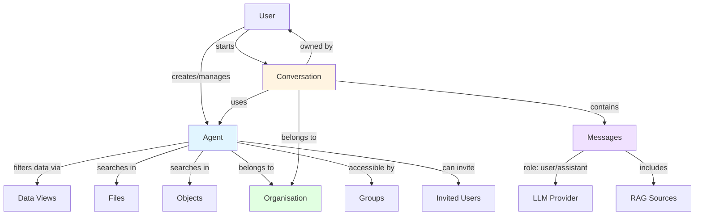

# Agents

## Overview

Agents in OpenRegister provide conversational AI capabilities that can interact with your data using natural language. Agents can be configured with different LLM providers, custom prompts, and access to specific data sources through views.

## Architecture



## Creating an Agent

### Step 1: Basic Settings

Access the Agents page from the main navigation and click **Add Agent**.

#### Required Fields

- **Name**: A unique identifier for your agent (e.g., "Customer Support Assistant")
- **Description**: Optional description of the agent's purpose and capabilities

#### Configuration Options

**Agent Type**
- `chat`: Conversational AI assistant (default)
- `automation`: Automated task execution
- `analysis`: Data analysis and insights
- `assistant`: General purpose assistant

**LLM Provider**
Select the Large Language Model provider for your agent:
- `openai`: OpenAI GPT-4, GPT-3.5 Turbo
- `ollama`: Local LLM execution
- `fireworks`: Fast, optimized inference
- `azure`: Azure OpenAI (Enterprise-grade)

**Model**
Specify the model to use (e.g., `gpt-4o-mini`, `llama3`, `claude-3-sonnet`)

**System Prompt**
Define the agent's behavior and persona. Example:
```
You are a helpful assistant that helps users find information in their document management system. 
Be concise and cite your sources.
```

**Temperature** (0.0 - 2.0)
- Lower values (0.0 - 0.5): More focused and deterministic responses
- Medium values (0.5 - 1.0): Balanced creativity
- Higher values (1.0 - 2.0): More creative and diverse responses
- Default: 0.7

**Max Tokens**
Maximum number of tokens the agent can generate per response. Default: 1000

### Step 2: RAG Configuration

**Enable RAG** (Retrieval-Augmented Generation)
Toggle this to allow the agent to search and retrieve context from your data.

When RAG is enabled, configure:

**Search Mode**
- `hybrid`: Combined keyword + semantic search (recommended)
- `semantic`: AI-powered semantic search only
- `keyword`: Traditional keyword search only

**Number of Sources** (1-20)
How many relevant documents/objects to retrieve as context. Default: 5

**Search Scope**
- `searchFiles`: Include files in the search (toggleable)
- `searchObjects`: Include database objects in the search (toggleable)

**Views** (Data Scope)
Select which views the agent can query. This restricts the agent to specific data sets based on view filters.

### Step 3: Privacy & Sharing

**Privacy Settings**

**Is Private**
- When enabled, only you and invited users can access this agent
- When disabled, all users in your organisation can use the agent

**Invited Users**
Add specific Nextcloud users who should have access to this private agent. Type usernames to search and select.

### Step 4: Resource Quotas

Set usage limits for your agent:

**Request Quota** (per day)
Maximum number of requests the agent can handle per day. Use 0 for unlimited.

**Token Quota** (per request)
Maximum tokens the agent can consume per request. Use 0 for unlimited.

### Step 5: Security (Advanced)

**Group Access Control**
Select Nextcloud groups that have access to this agent. Leave empty to allow all users in your organisation.

## Agent Access Control (RBAC)

Agents follow a hierarchical access model:

1. **Organisation Level**: Agents are tied to the organisation where they were created
2. **Privacy Level**:
   - **Public agents** (`isPrivate = false`): Accessible to all users in the organisation
   - **Private agents** (`isPrivate = true`): Only accessible to the owner and invited users
3. **Group Level**: Additional restriction by Nextcloud group membership

### Access Rules

A user can access an agent if:
- The agent belongs to their current organisation, AND
- The agent is public OR (the agent is private AND the user is the owner OR the user is invited), AND
- No group restrictions exist OR the user belongs to one of the specified groups

### Modification Rights

Only the agent owner can:
- Modify agent settings
- Change privacy settings
- Manage invited users
- Delete the agent

## Using Agents in Conversations

### Starting a Conversation

1. Navigate to the AI Assistant page
2. Click **New Conversation**
3. Select an agent from the available agents
4. Click **Start Conversation**

### Agent-Specific Context

When you chat with an agent, it:
- Uses the configured LLM provider and model
- Applies the system prompt to shape responses
- Retrieves context from sources within its configured views
- Respects the `searchFiles` and `searchObjects` settings
- Adheres to token and request quotas

### Conversation Features

- **Automatic Title Generation**: The agent generates a concise title for your conversation based on the first message
- **Context Summarization**: When the conversation grows large, the agent automatically creates a summary to maintain context within token limits
- **Source Citations**: Responses include references to the files and objects used to generate the answer
- **Conversation History**: All messages are persisted and can be reopened at any time

## API Usage

### Listing Agents

```http
GET /index.php/apps/openregister/api/agents
```

Returns all agents accessible to the current user based on RBAC rules.

### Getting a Single Agent

```http
GET /index.php/apps/openregister/api/agents/{id}
```

Returns agent details if the user has access.

### Creating an Agent

```http
POST /index.php/apps/openregister/api/agents
Content-Type: application/json

{
  "name": "Support Assistant",
  "description": "Helps users with common questions",
  "type": "chat",
  "provider": "openai",
  "model": "gpt-4o-mini",
  "prompt": "You are a helpful support assistant...",
  "temperature": 0.7,
  "maxTokens": 1000,
  "enableRag": true,
  "searchFiles": true,
  "searchObjects": true,
  "views": ["uuid-of-view-1", "uuid-of-view-2"],
  "isPrivate": false,
  "invitedUsers": []
}
```

The agent is automatically assigned to the current user's active organisation.

### Updating an Agent

```http
PUT /index.php/apps/openregister/api/agents/{id}
Content-Type: application/json

{
  "name": "Updated Name",
  "temperature": 0.8
}
```

Only the owner can update an agent.

### Deleting an Agent

```http
DELETE /index.php/apps/openregister/api/agents/{id}
```

Only the owner can delete an agent.

## Best Practices

### Prompt Engineering

1. **Be Specific**: Clearly define the agent's role and constraints
2. **Set Tone**: Specify the desired communication style (professional, friendly, technical)
3. **Define Behavior**: Explain how the agent should handle edge cases
4. **Cite Sources**: Instruct the agent to always reference where information came from

Example:
```
You are a technical documentation assistant for a software company. 
Your role is to help developers find information in the API documentation.

Guidelines:
- Always provide code examples when relevant
- Cite the specific documentation page or section
- If you don't know something, say so - don't make up information
- Use technical language appropriate for developers
- Be concise but thorough
```

### View Configuration

- Limit agents to specific views to reduce context and improve accuracy
- Create focused views for different agent purposes (e.g., "Customer Data", "Product Catalog")
- Use views to implement data access policies

### Temperature Tuning

- **Customer Support** (0.3-0.5): Consistent, factual responses
- **Content Creation** (0.7-0.9): Creative but controlled
- **Brainstorming** (1.0-1.5): Highly creative and diverse ideas

### Resource Management

- Set request quotas for production agents to control costs
- Use token limits to prevent runaway generation
- Monitor agent usage through audit trails

## Troubleshooting

### Agent Not Appearing in List

- Check that you're in the correct organisation
- Verify the agent isn't private (unless you're the owner or invited)
- Ensure your user is in the allowed groups (if group restrictions are set)

### Poor Quality Responses

- Refine the system prompt to be more specific
- Adjust the temperature (lower for more focused responses)
- Increase the number of RAG sources
- Verify the agent has access to relevant views
- Check that `searchFiles` and `searchObjects` are enabled appropriately

### "No context found" Errors

- Ensure RAG is enabled
- Verify the agent has views configured
- Check that the views contain relevant data
- Confirm files and objects are published (only published items are searchable)

### Access Denied Errors

- Verify you're the owner or have been invited (for private agents)
- Check group membership (if group restrictions are set)
- Ensure you're in the correct organisation
- Confirm the agent hasn't been deleted

## Advanced Topics

### Multi-Tenancy

Agents are organisation-scoped. When a user switches organisations:
- They see only agents belonging to the new organisation
- Conversations are also organisation-specific
- Previous conversations become inaccessible until switching back

### Integration with Views

Agents leverage the View system to scope their data access. When configuring an agent:
1. Create views that filter data to what the agent needs
2. Assign these views to the agent
3. The agent will only retrieve context from objects matching these view filters

This provides:
- **Security**: Agents can't access data outside their views
- **Relevance**: Context is limited to pertinent information
- **Performance**: Smaller search space improves response times

### Conversation Architecture

```
User → Conversation → Agent → LLM Provider
         ↓
      Messages
         ↓
      RAG Context (Files + Objects filtered by Views)
```

Each conversation:
- Is tied to a single agent
- Belongs to a specific user and organisation
- Contains a history of messages with sources
- Generates a title automatically
- Can be archived (soft deleted) and restored

