# AI Features & Setup Guide

## 🎯 What is AI in OpenRegister?

OpenRegister brings **Artificial Intelligence** to your data in a **secure and sovereign way**. This means:

- ✅ **Your data stays on YOUR servers** - nothing is shared with external companies
- ✅ **Secure & Private** - only you have access to your information
- ✅ **RBAC Compliant** - users only see data they have permission to access
- ✅ **Personalized Results** - different users get different answers based on their access level

### The Power of Combining AI with Your Data

Traditional AI assistants (like ChatGPT) only know information they were trained on - they don't know **your specific data**. OpenRegister changes this by:

1. **Connecting your documents and objects** to the AI
2. **Allowing natural language questions** about your data
3. **Providing cited, accurate answers** from your own information
4. **Respecting access controls** so secure data stays secure

**Example:** Instead of manually searching through 100 documents to find "What is our return policy?", you simply ask the AI agent, and it finds the answer instantly - citing the exact document where it found the information.

---

## 🔐 Security & Privacy: How It Works

### Sovereign AI

**Sovereign AI** means you are in complete control:

- AI models run on YOUR infrastructure (or your chosen provider)
- Your documents and data NEVER leave your servers
- No external company has access to your information
- You decide who can use the AI and what data they can access

### RBAC (Role-Based Access Control)

OpenRegister ensures that AI agents **respect your existing permissions**:

- If a user can't access a document manually, the AI won't show it to them either
- Different users asking the same question may get different answers based on their access level
- Group memberships and permissions are enforced at all times

**Example:**
- **HR Manager** asks "What is John's salary?" → Gets the answer from HR records
- **Regular User** asks "What is John's salary?" → Gets "No information found" (no access to HR data)

---

## 🧠 How AI Finds Information: RAG Explained

### What is RAG?

**RAG** stands for **Retrieval Augmented Generation**. This is how AI can answer questions about YOUR data:

1. **Retrieval** - The AI searches your documents and objects to find relevant information
2. **Augmentation** - The AI reads the retrieved information
3. **Generation** - The AI generates a natural language answer based on what it found

**Think of it like this:**
- Traditional AI = A smart person who only knows what they learned in school
- RAG-powered AI = A smart person who can also search your entire company library before answering

### How RAG Works (Step-by-Step)

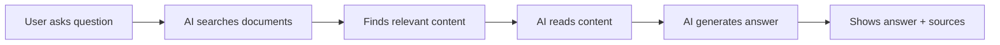

1. **You ask:** "What is the return policy?"
2. **AI searches:** Looks through all your documents for information about returns
3. **AI finds:** "Returns Policy v2.pdf, page 3"
4. **AI reads:** "Items can be returned within 30 days..."
5. **AI answers:** "According to Returns Policy v2.pdf, items can be returned within 30 days if unused and in original packaging."

**The key:** AI doesn't make up answers - it finds them in YOUR documents and cites its sources!

**📚 Deep Dive:** For technical details on how RAG is implemented, see [RAG Implementation](./rag-implementation.md).

---

## 📋 Configuration Guide

### Overview: Configuration Steps

Setting up AI in OpenRegister involves these steps:

1. **Configure LLM Provider** - Set up the AI engine (OpenAI, Ollama, or Fireworks)
2. **Prepare Your Data** - Vectorize objects and files
3. **Create Views** - Define what data AI can access
4. **Create Agents** - Set up AI assistants
5. **Configure Tools** - Enable actions (optional)
6. **Assign Access** - Control who can use which agents

Let's go through each step in detail.

---

### Step 1: Configure Your LLM Provider

#### What is an LLM?

**LLM** stands for **Large Language Model** - this is the AI "brain" that:
- Understands your questions
- Searches through your data
- Generates natural language answers

Think of it like choosing which engine powers your car. The engine (LLM) is what makes everything work.

#### Understanding Providers & Models

**Provider** = The company or service that runs the AI models
**Model** = The specific AI "brain" you want to use

You need to configure TWO types of models:

1. **Embedding Model** (for searching)
   - Converts your data into vectors
   - Understands the meaning of text
   - Used when vectorizing data and when searching
   - Example: `text-embedding-3-small`

2. **Chat Model** (for answering)
   - Generates human-like responses
   - Reads the search results and formulates answers
   - Used during conversations
   - Example: `gpt-4o-mini`

#### Supported AI Providers

OpenRegister supports multiple AI providers:

| Provider | Best For | Requires | Cost | Function Calling |
|----------|----------|----------|------|-----------------|
| **OpenAI** | Production, best results | API key | Pay per use | ✅ Supported |
| **Ollama** | Privacy, sovereignty, local or server deployment | Local/server installation | Free (uses your hardware) | ✅ Supported |
| **Fireworks AI** | Fast responses | API key | Pay per use | ❌ Not yet supported |

**Why Choose Ollama?**

Ollama is a powerful option that gives you complete control and access to a wide range of open-source models:

**Model Options:**
- 🦙 **Meta Llama** - High-performance commercial open-source models (Llama 3.1, Llama 3.2)
- 🌊 **Mistral** - Ethically-focused European models with transparency and responsible AI practices
- 🔥 **Phi** - Microsoft's efficient small models
- 💎 **Gemma** - Google's lightweight models
- 🎯 **Qwen** - Alibaba's multilingual models
- And many more from the open-source community!

**Deployment Flexibility:**
- **Local Installation:** Run on your own laptop/desktop for personal use
- **Server Deployment:** Install on your organization's server for team access
- **Full Privacy:** All processing happens on YOUR infrastructure
- **No External Dependencies:** Works completely offline once models are downloaded

**Ethical & Sovereignty Benefits:**
- ✅ **Data Sovereignty:** Your data never leaves your control
- ✅ **No Vendor Lock-in:** Switch models freely without API changes
- ✅ **Transparent Models:** Many models have open weights and documentation
- ✅ **European Options:** Choose models like Mistral that align with European AI values
- ✅ **Cost Control:** No per-request charges, only infrastructure costs

#### How to Configure LLM Settings

Navigate to the Open Register LLM Settings section to configure your AI provider:

**Location:** **Settings → Open Register → LLM Configuration**

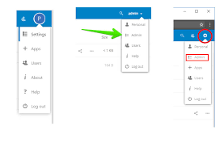
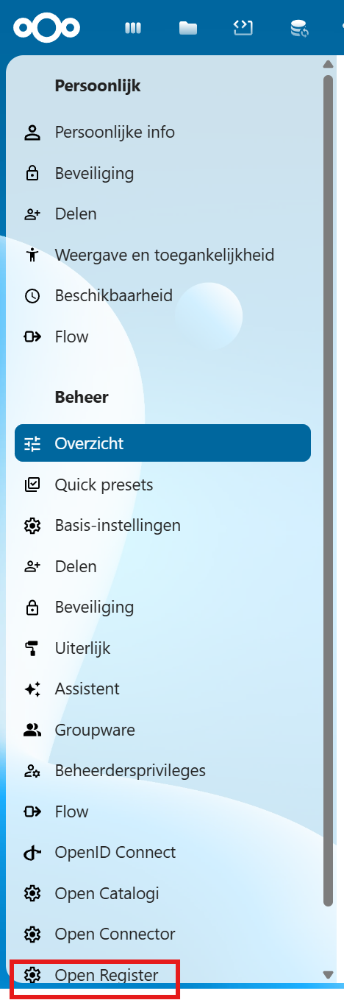

You'll see the **LLM Configuration Modal** with several sections:

##### 1. Enable AI Features

First, enable AI functionality:
- Toggle **LLM Enabled** to ON
- This activates all AI features in OpenRegister


##### 2. Select Embedding Provider

Choose the provider for converting data to vectors:

**For OpenAI:**
1. Select **OpenAI** as Embedding Provider
2. Enter your **OpenAI API Key**
3. (Optional) Enter **Organization ID** if you have one
4. Select an **Embedding Model** (recommended: `text-embedding-3-small`)

**For Fireworks AI:**
1. Select **Fireworks** as Embedding Provider
2. Enter your **Fireworks API Key**
3. Select an **Embedding Model** (recommended: `nomic-ai/nomic-embed-text-v1.5`)
4. (Optional) Configure **Base URL** if different from default

**For Ollama (Local or Server):**
1. Select **Ollama** as Embedding Provider
2. Enter **Ollama URL**:
   - **Local:** `http://localhost:11434`
   - **Server:** `http://your-server-ip:11434` or `http://ollama.yourdomain.com:11434`
3. Select an **Embedding Model**:
   - `nomic-embed-text` - Fast and efficient (recommended)
   - `mxbai-embed-large` - Higher quality embeddings
   - `all-minilm` - Lightweight option
4. Make sure Ollama is running and the model is downloaded (`ollama pull nomic-embed-text`)


##### 3. Select Chat Provider

Choose the provider for generating responses:

**For OpenAI:**
1. Select **OpenAI** as Chat Provider
2. Use the same API key as embedding (already filled)
3. Select a **Chat Model** (recommended: `gpt-4o-mini` for cost-effective, `gpt-4o` for best quality)

**For Fireworks AI:**
1. Select **Fireworks** as Chat Provider
2. Use the same API key as embedding (already filled)
3. Select a **Chat Model** (recommended: `accounts/fireworks/models/llama-v3p1-8b-instruct`)
4. ⚠️ **Note:** Function calling (tools) NOT supported with Fireworks

**For Ollama (Local or Server):**
1. Select **Ollama** as Chat Provider
2. Use the same URL as embedding (already filled)
3. Select a **Chat Model** based on your needs:
   
   **Commercial Open Source:**
   - `llama3.1` - Meta's flagship model, excellent quality, function calling ✅
   - `llama3.2` - Latest version with improved capabilities
   - `llama3.1:70b` - Larger variant for highest quality (requires more resources)
   
   **Ethically-Focused (European):**
   - `mistral` - Fast and efficient, European AI values
   - `mistral-nemo` - Balanced performance
   - `mixtral` - Mixture of experts, very capable
   
   **Efficient/Small:**
   - `phi3` - Microsoft's small but powerful model
   - `gemma2` - Google's lightweight model
   - `qwen2.5` - Multilingual support
   
4. Make sure Ollama is running and the model is downloaded (`ollama pull llama3.1`)

**💡 Choosing a Model:**
- **Start with:** `llama3.1` or `mistral` for good balance
- **Need function calling?** Use `llama3.1` (required for tools)
- **Limited resources?** Use `phi3` or `gemma2`
- **European/Ethical focus?** Use `mistral` or `mixtral`
- **Best quality?** Use `llama3.1:70b` (requires powerful hardware)

##### 4. Configure Enabled Features

Select which AI features should be active:
- ✅ **Text Generation** - Basic chat responses
- ✅ **Summarization** - Summarize documents and conversations
- ✅ **Semantic Search** - Meaning-based search in your data
- ✅ **Embedding** - Create vectors from your data

**💡 Tip:** Keep all features enabled unless you have specific reasons to disable them.

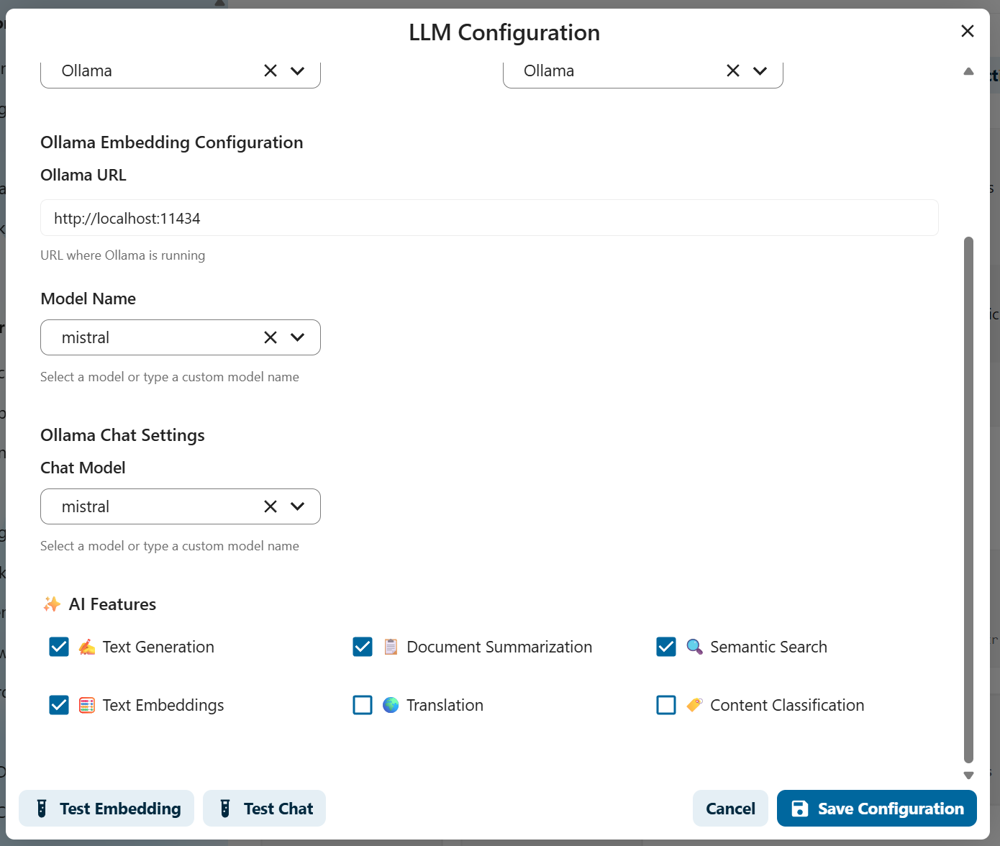

##### 5. Test Your Configuration

Before saving, verify everything works:
1. Click **Test Embedding** to verify the embedding model works
2. Click **Test Chat** to verify the chat model works
3. Both tests should show ✅ success messages


##### 6. Save Configuration

Click **Save** to apply your settings.

**What happens next:**
- Your AI provider is now configured
- You can start vectorizing data
- Agents will use these models for conversations

#### Quick Start Recommendations

**🏢 Best for Production (Paid but Reliable):**
- Embedding: OpenAI with `text-embedding-3-small`
- Chat: OpenAI with `gpt-4o-mini`
- Cost: ~$0.02 per 1000 requests
- ✅ Function calling supported
- ✅ Highly reliable
- ⚠️ Data sent to OpenAI

**🛡️ Best for Privacy & Sovereignty (Free):**
- Embedding: Ollama with `nomic-embed-text`
- Chat: Ollama with `llama3.1` or `mistral`
- Cost: Free (uses your hardware)
- ✅ Complete data control
- ✅ Works offline
- ✅ Function calling (llama3.1)
- ✅ European AI values (mistral)
- **Recommended for:** Government, healthcare, finance, sensitive data

**⚡ Best for Speed (Paid):**
- Embedding: Fireworks with `nomic-ai/nomic-embed-text-v1.5`
- Chat: Fireworks with `llama-v3p1-8b-instruct`
- Cost: ~$0.10 per 1M tokens
- ⚠️ No function calling support yet

**🌍 Best for Ethical AI (Free):**
- Embedding: Ollama with `nomic-embed-text`
- Chat: Ollama with `mistral` or `mixtral`
- Cost: Free (uses your hardware)
- ✅ European AI standards
- ✅ Transparent model development
- ✅ Responsible AI practices
- **Recommended for:** European organizations, ethical focus

**💻 Best for Limited Resources (Free):**
- Embedding: Ollama with `all-minilm`
- Chat: Ollama with `phi3` or `gemma2`
- Cost: Free (uses your hardware)
- ✅ Runs on modest hardware
- ✅ Fast responses
- ⚠️ Slightly lower quality
- **Recommended for:** Small organizations, testing

#### Getting API Keys

**OpenAI:**
1. Go to [platform.openai.com](https://platform.openai.com)
2. Sign up or log in
3. Navigate to API Keys
4. Create new secret key
5. Copy and paste into OpenRegister

**Fireworks AI:**
1. Go to [fireworks.ai](https://fireworks.ai)
2. Sign up or log in
3. Navigate to API Keys section
4. Create new API key
5. Copy and paste into OpenRegister

**Ollama (Local or Server):**

**Installation Options:**

*Docker Compose (Development - Recommended for Testing):*

If you're using the OpenRegister docker-compose setup, Ollama is already included and pre-configured!

1. Ollama container is automatically started with docker-compose
2. Pre-configured URL: `http://ollama:11434` (for container communication)
3. Skip to [Download Models](#download-models) section below
4. See [Docker Development Setup Guide](../../Development/docker-setup.md) for full details

*Local Installation (Your Computer):*
1. Download from [ollama.com](https://ollama.com)
2. Install for your OS (Windows, Mac, Linux)
3. Ollama starts automatically as a service

*Server Installation (Your Organization):*
1. Install on Linux server: `curl -fsSL https://ollama.com/install.sh | sh`
2. Configure network access (default: localhost only)
3. Set environment variables if needed (e.g., `OLLAMA_HOST=0.0.0.0`)
4. Ensure port 11434 is accessible

**Download Models:**

*For Docker Compose Setup:*
```bash
# For Embedding
docker exec openregister-ollama ollama pull nomic-embed-text

# For Chat (choose based on your needs)

# Recommended: Meta Llama (function calling support)
docker exec openregister-ollama ollama pull llama3.1

# Ethical: Mistral (European AI)
docker exec openregister-ollama ollama pull mistral

# Small/Efficient: Phi-3
docker exec openregister-ollama ollama pull phi3

# High Quality (requires powerful hardware)
docker exec openregister-ollama ollama pull llama3.1:70b
```

*For Local or Server Installation:*
```bash
# For Embedding
ollama pull nomic-embed-text

# For Chat (choose based on your needs)

# Recommended: Meta Llama (function calling support)
ollama pull llama3.1

# Ethical: Mistral (European AI)
ollama pull mistral

# Small/Efficient: Phi-3
ollama pull phi3

# High Quality (requires powerful hardware)
ollama pull llama3.1:70b
```

**Configuration in OpenRegister:**
- **Docker Compose:** Use `http://ollama:11434` (container-to-container communication)
- **Local:** Use `http://localhost:11434`
- **Server:** Use `http://your-server:11434` or `http://ollama.yourdomain.com:11434`

**💡 Server Setup Tips:**
- Use Docker for easier deployment
- Configure reverse proxy (nginx) for HTTPS
- Set up monitoring for model performance
- Consider GPU acceleration for faster responses

---

### Step 2: Prepare Your Data (Vectorization)

Before AI can search your data, it needs to be prepared. This process is called **vectorization** or creating **embeddings**.

#### What are Embeddings?

**Embeddings** are a way for computers to understand the *meaning* of text:

- Traditional search looks for **exact words**: "return policy" only finds documents with those exact words
- AI embeddings understand **meaning**: "return policy", "refund rules", "sending items back" all mean similar things

**How it works:**
- Text is converted into a **vector** (a list of numbers)
- Similar meanings = similar numbers
- AI can find documents based on meaning, not just keywords

**Example:**
```
Text: "The cat sat on the mat"
Vector: [0.2, -0.5, 0.8, 0.1, ...] (1536 numbers)

Text: "A feline rested on the rug"  
Vector: [0.21, -0.48, 0.79, 0.12, ...] (very similar numbers!)
```

Even though the words are different, the vectors are similar because the **meanings** are similar!

#### Vectorizing Objects

**Objects** are structured data in OpenRegister (like customers, orders, products).

1. Navigate to **Settings → AI → LLM Configuration**
2. Scroll to **Object Vectorization** section
3. Select which **Views** should be available to AI
4. Click **Vectorize All Objects**
5. Wait for processing to complete
6. Check statistics to verify completion

**💡 Tip:** Objects are vectorized as complete records. A customer record becomes one vector containing all fields.

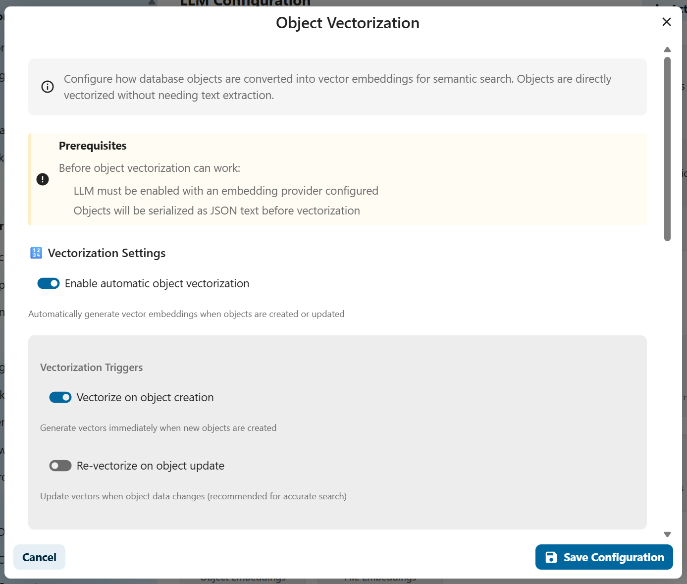

#### Vectorizing Files

**Files** are documents like PDFs, Word documents, or text files.

Because files can be very large, they are split into **chunks** before vectorization.

**What are Chunks?**
- A **chunk** is a small piece of a document (usually a paragraph or section)
- Large files are split into many chunks
- Each chunk is vectorized separately
- This allows AI to find the exact paragraph that answers your question

**Example:**
```
100-page PDF → Split into 200 chunks → 200 vectors created
```

When you ask "What is the return policy?", AI finds the specific chunk (paragraph) that contains the answer, not the entire 100-page document!

**How to vectorize files:**

1. Navigate to **Settings → AI → LLM Configuration**
2. Scroll to **File Vectorization** section
3. Configure file types to process (PDF, DOCX, TXT, etc.)
4. Set maximum file size
5. Click **Vectorize All Files**
6. Monitor extraction progress

**📚 Learn more:** See your system's file extraction documentation for details on how chunks are created from different file types.

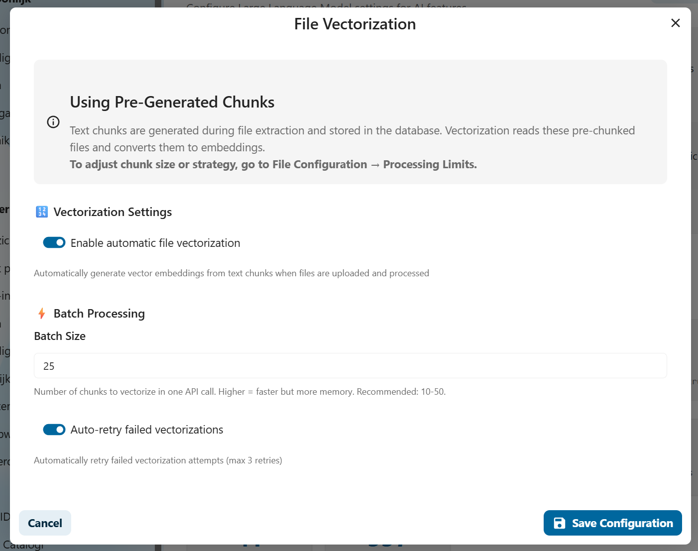

---

### Step 3: Create Views (What Data Should AI Access?)

**Views** are filters that determine which data AI can access.

Think of views like **search filters**:
- "Show me only customer records from 2024"
- "Show me only public documents"
- "Show me only invoices for project X"

**Why use views?**
- **Security:** Restrict AI to specific data subsets
- **Relevance:** Focus AI on relevant information only
- **Performance:** Smaller data sets = faster searches

**How to create views:**

1. Navigate to **Data → Views**
2. Click **Create New View**
3. Configure filters:
   - Select registers (data collections)
   - Select schemas (object types)
   - Add search terms or field filters
   - Set permissions
4. Save the view

**Example views:**
- "Public Documentation" - only public help articles
- "Sales Team Data" - only customer and order data
- "HR Records" - only employee information (restricted access)

**📚 Learn more:** See [Views Documentation](./views.md) for complete view configuration details.

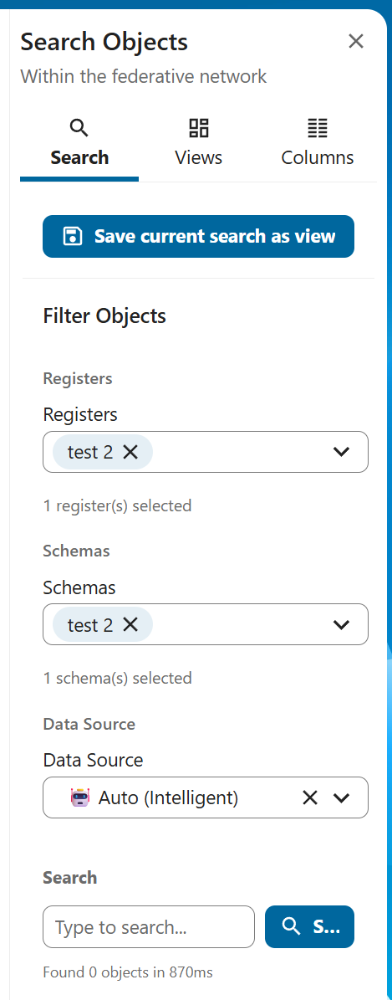 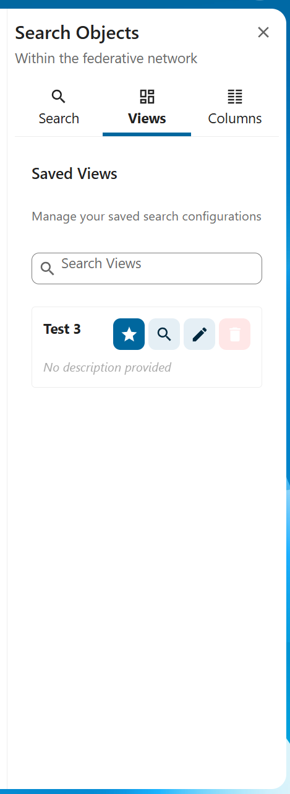
---

### Step 4: Create AI Agents

**Agents** are AI assistants configured for specific purposes.

Think of agents as **specialized employees**:
- **Customer Support Agent** - knows about products, policies, and FAQs
- **HR Assistant** - knows about employee policies and procedures
- **Sales Analyst** - knows about sales data and customer information

**How agents differ from each other:**
- **Different data access** - each agent can access different views
- **Different personality** - custom instructions shape behavior
- **Different tools** - some agents can perform actions, others only answer questions

**How to create an agent:**

1. Navigate to **Settings → AI → Agents**
2. Click **Create New Agent**
3. Configure the agent:
   - **Name:** Give it a descriptive name (e.g., "Customer Support Bot")
   - **Description:** Explain what this agent does
   - **System Prompt:** Instructions that shape the agent's behavior and personality
   - **Views:** Select which data views this agent can search
   - **Include Objects:** ✅ Enable if agent should search structured data
   - **Include Files:** ✅ Enable if agent should search documents
   - **Search Mode:** Choose Hybrid (recommended), Semantic, or Keyword
   - **Tools:** Select which actions the agent can perform (optional)
4. Save the agent

**Example System Prompt:**
```
You are a helpful customer support agent for Acme Corp. 
Your role is to answer customer questions about our products, policies, and services.
Always be polite and professional.
If you don't know the answer, direct the customer to contact support@acme.com.
Always cite the document where you found the information.
```

**📚 Learn more:** See [Agents Documentation](./agents.md) for advanced agent configuration.

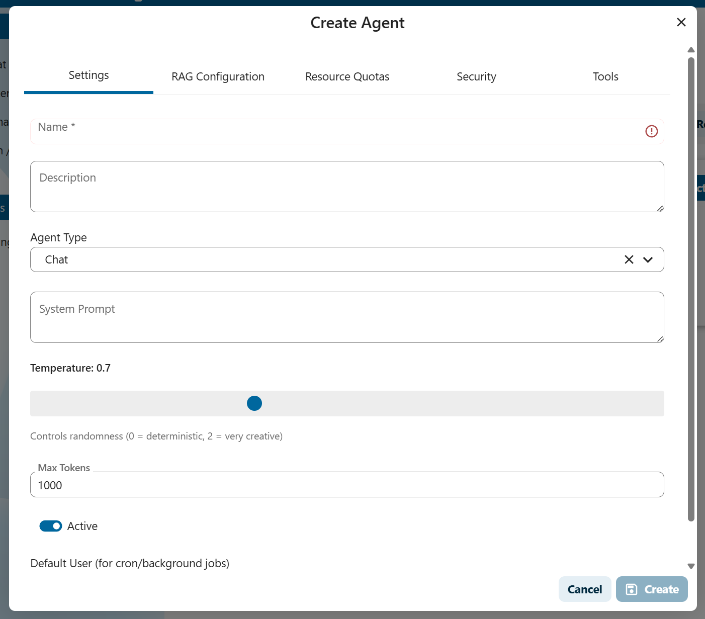

---

### Step 5: Configure Tools (Optional)

**Tools** allow agents to **perform actions**, not just answer questions.

**What can tools do?**
- Create, read, update, or delete data
- Search for specific information
- Generate reports
- Execute workflows

**Available tools:**
- **Register Tool:** Manage registers (data collections)
- **Schema Tool:** Manage schemas (data structures)
- **Objects Tool:** Manage objects (data records)
- **Application Tool:** Manage applications
- **Agent Tool:** Manage other agents
- **CMS Tool:** Manage website content (pages, menus)

**Example use cases:**
- "Create a new customer record for John Doe"
- "Update the status of order #12345 to shipped"
- "List all invoices from last month"
- "Create a new page about our new product"

**How to enable tools:**

1. Edit your agent (Settings → AI → Agents)
2. Scroll to **Tools** section
3. Select the tools this agent should have access to
4. Save the agent

**⚠️ Security Note:** Only give tools to agents used by trusted users! Tools can modify data.

**⚠️ Provider Note:** Tools currently only work with **OpenAI** and **Ollama**, not Fireworks AI.

**📚 Learn more:** See [Function Calling Documentation](./function-calling.md) for complete tool configuration.

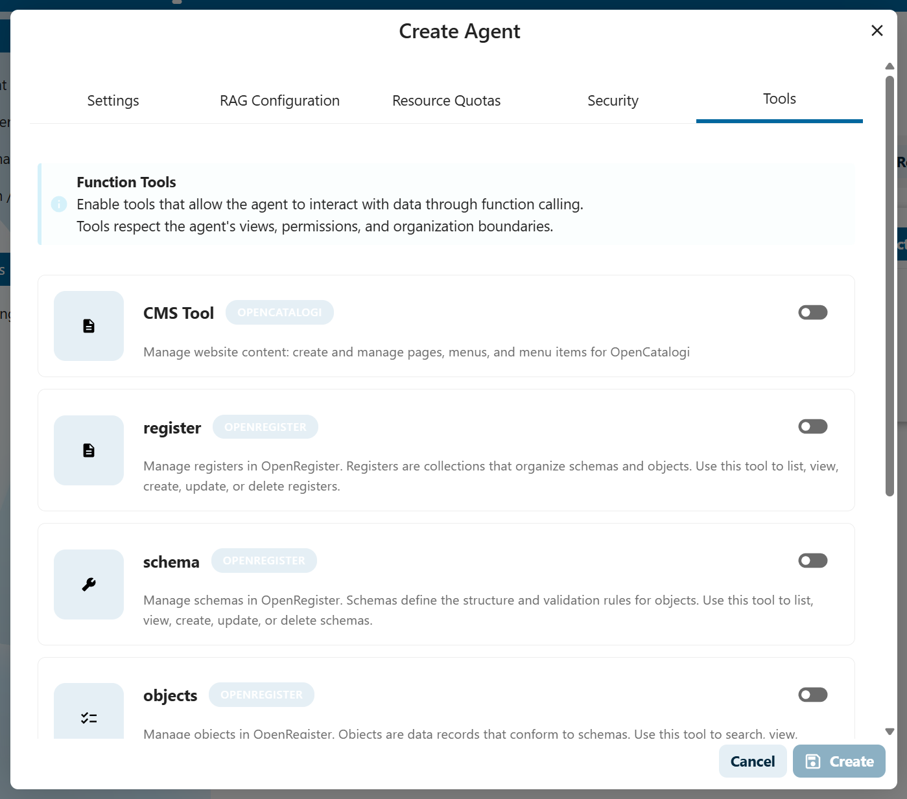
---

### Step 6: Assign Access (Who Can Use Which Agent?)

**Access control** determines who can chat with each agent.

**Two access levels:**
1. **Public:** Everyone can use this agent
2. **Groups:** Only specific Nextcloud groups can use this agent

**How to configure access:**

1. Edit your agent (Settings → AI → Agents)
2. Scroll to **Access Control** section
3. Choose:
   - **Public:** Leave groups empty
   - **Restricted:** Select specific groups
4. Save the agent

**Example configuration:**
- **Public FAQ Bot** - No groups selected = everyone can use it
- **HR Assistant** - Only "HR Department" group = only HR staff can use it
- **Sales Agent** - "Sales Team" and "Management" groups = only these groups can use it

**💡 Tip:** Even if an agent is public, RBAC still applies! Users only see data they have permission to access.

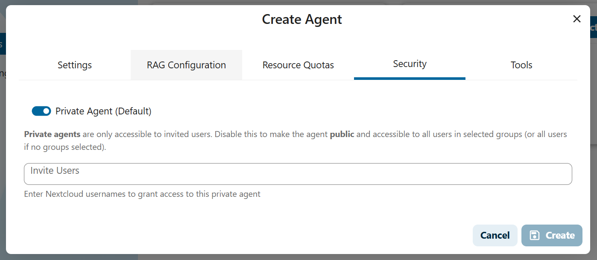

---

## 🚀 Using AI: The Chat Interface

### Starting a Conversation

1. Navigate to **AI → Chat**
2. Select an agent from the dropdown
3. Type your question in natural language
4. Press Enter or click Send

**Example questions:**
- "What is our return policy?"
- "Find all customers from Amsterdam"
- "Summarize the Q4 2024 sales report"
- "How do I reset my password?"

### Understanding AI Responses

AI responses include:

1. **Answer:** Natural language response to your question
2. **Sources:** Documents/objects where the information was found
3. **Citations:** Click sources to view the original content

**Example response:**
```
Answer: "According to our policy, items can be returned within 
30 days if they are unused and in original packaging. 
A full refund will be issued within 5-7 business days."

Sources:
📄 Returns_Policy_v2.pdf (Page 3)
📄 Customer_FAQ.docx (Section 5)
```

### When AI Can't Answer

If AI doesn't find relevant information, it will tell you:
- "I couldn't find any information about that topic in the available documents."
- "Based on the documents I have access to, I don't have enough information to answer that question."

**This is GOOD!** It means the AI is honest and not making things up.

**What to do:**
1. Check if the relevant documents are vectorized
2. Check if the agent has access to the right views
3. Try rephrasing your question
4. Check if you have permission to access the data
5. 
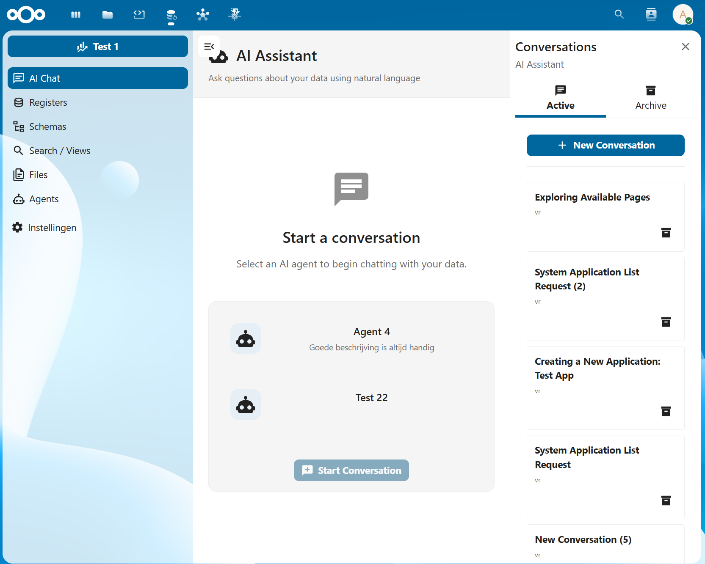
---

## 🎓 Best Practices

### For Administrators

1. **Start Small:** Vectorize a small set of documents first to test
2. **Use Views:** Don't give agents access to everything - use targeted views
3. **Monitor Usage:** Check which agents are being used and how often
4. **Update Regularly:** Re-vectorize data when documents change
5. **Test Permissions:** Verify that RBAC is working as expected
6. **Use Descriptive Names:** Give agents and views clear, understandable names

### For Users

1. **Be Specific:** Ask clear, specific questions
2. **Check Sources:** Always verify the sources cited by AI
3. **Rephrase if Needed:** If you don't get a good answer, try asking differently
4. **Report Issues:** If AI gives incorrect information, report it to your admin
5. **Respect Privacy:** Don't share sensitive AI conversations with unauthorized people

---

## 📊 Monitoring & Maintenance

### Statistics Dashboard

Monitor your AI setup in **Settings → AI → LLM Configuration**:

- **Chat Statistics:**
  - Total agents configured
  - Total conversations
  - Total messages exchanged

- **Vector Statistics:**
  - Total objects vectorized
  - Total files vectorized
  - Storage used by vectors

- **Provider Status:**
  - Connection status
  - Current models in use
  - Configuration health

### Regular Maintenance

**Weekly:**
- Check that new documents are being vectorized
- Monitor conversation quality
- Review usage statistics

**Monthly:**
- Re-vectorize all data to capture updates
- Review and update agent prompts
- Audit access controls
- Check provider costs (if using paid services)

**Quarterly:**
- Evaluate which agents are most used
- Consider adding new tools or capabilities
- Review and update views
- Train users on new features

---

## ❓ Troubleshooting

### Common Issues

#### "AI doesn't find my documents"
**Solutions:**
1. Check if documents are vectorized (see statistics)
2. Verify agent has access to correct views
3. Ensure you have permission to access the documents
4. Try re-vectorizing the data

#### "AI gives wrong answers"
**Solutions:**
1. Check the cited sources - is the source information correct?
2. Improve system prompt to guide AI better
3. Ensure data is up-to-date
4. Report issue to admin for review

#### "Tools don't work"
**Solutions:**
1. Verify you're using OpenAI or Ollama (not Fireworks AI)
2. Check if agent has tools enabled
3. Verify you have permissions to perform the action
4. Check logs for error messages

#### "Different users see different answers"
**This is normal!** RBAC is working as designed. Different users have different access to data, so they get different answers. This is a security feature, not a bug.

---

## 🔍 Advanced Topics

### Choosing Search Modes

**Semantic Search:**
- Searches by meaning, not keywords
- Best for conceptual questions
- Example: "refund policy" finds "return procedures"

**Keyword Search:**
- Traditional text search
- Best for exact terms
- Example: "invoice #12345" finds that specific invoice

**Hybrid Search (Recommended):**
- Combines both methods
- Best overall accuracy
- Uses both keyword matching AND semantic understanding

**When to use which:**
- **General questions** → Hybrid
- **Specific IDs or terms** → Keyword
- **Conceptual queries** → Semantic

### Model Selection

**Embedding Models:**
- Convert text to vectors
- Smaller = faster, larger = more accurate
- Recommendation: `text-embedding-3-small` (OpenAI) for good balance

**Chat Models:**
- Generate responses
- Smaller = faster/cheaper, larger = smarter/more expensive
- Recommendation: `gpt-4o-mini` (OpenAI) for good balance

---

## 📚 Related Documentation

- **[Views](./views.md)** - Configure data filters for agents
- **[Agents](./agents.md)** - Advanced agent configuration and management
- **[Function Calling](./function-calling.md)** - Enable agents to perform actions with tools
- **[RAG Implementation](./rag-implementation.md)** - Technical deep dive into how RAG works
- **[Chat & RAG Deep Dive](./chat-rag-deepdive.md)** - Detailed explanation of chat functionality

---

## 💬 Need Help?

- **User Questions:** Contact your system administrator
- **Admin Questions:** Check technical documentation or contact support
- **Bug Reports:** File an issue in the repository
- **Feature Requests:** Discuss with your development team

---

**Congratulations!** You now understand how to configure and use AI in OpenRegister. Start with small experiments and gradually expand as you become more comfortable with the system. 🎉

