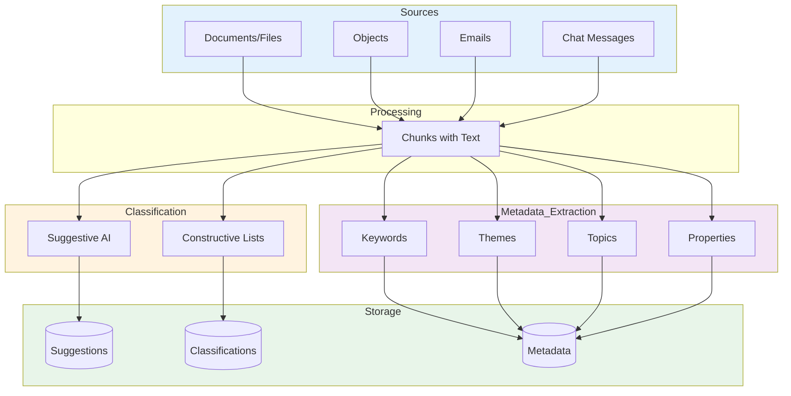
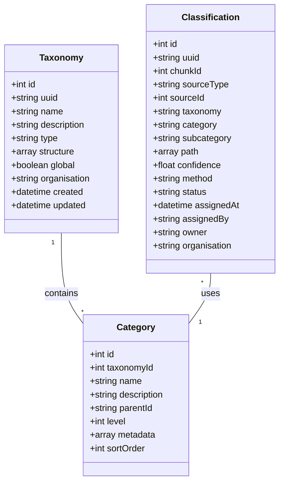
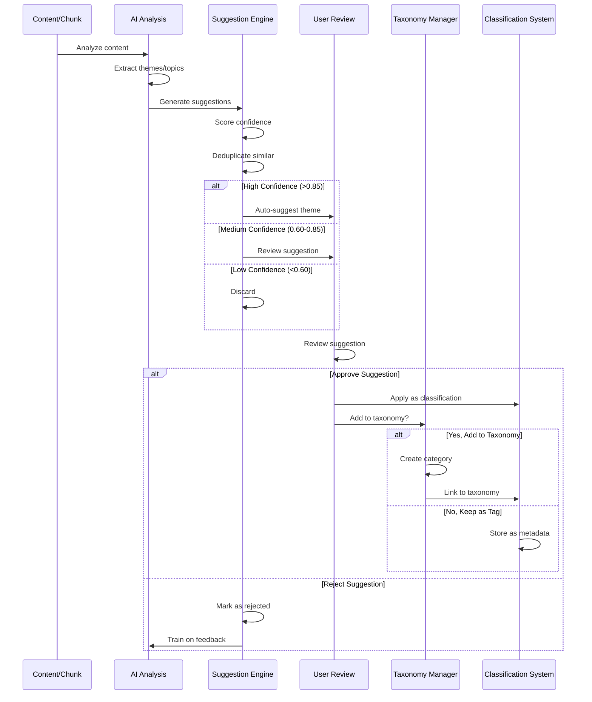
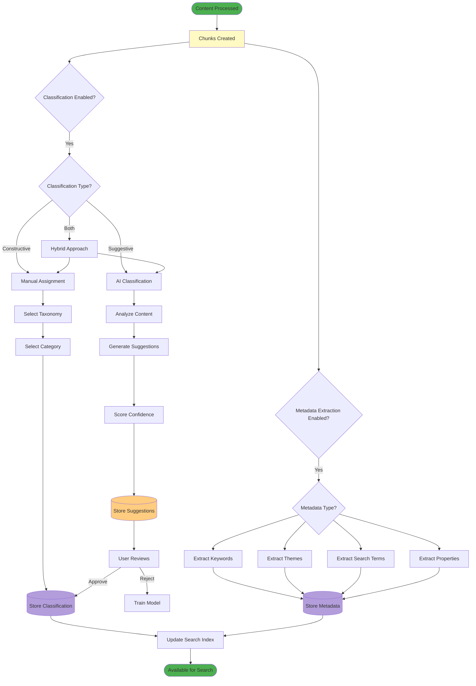

# Archiving and Metadata Classification

## Overview

The Archiving and Metadata system provides intelligent classification and metadata extraction for all content types (documents, objects, emails, chats) processed through the chunking pipeline. The system combines AI-powered suggestions with curated taxonomies to organize and enrich content automatically.

## Core Concepts

### Classification vs Extraction

**Classification**: Assigning content to predefined or AI-suggested categories
- **Constructive**: User selects from curated lists (controlled vocabulary)
- **Suggestive**: AI proposes new categories based on content analysis

**Metadata Extraction**: Automatically identifying and extracting structured information
- Keywords and search terms
- Themes and topics
- Dates and temporal information
- Named entities (covered by GDPR feature)
- Document properties

### Content Types

The system classifies content from multiple sources:



## Classification System

### 1. Constructive Classification

**Definition**: Users assign content to predefined categories from curated lists.

**Characteristics**:
- Controlled vocabulary
- Consistent taxonomy
- Organization-specific or global
- Manual or AI-assisted selection
- Hierarchical structures supported

**Use Cases**:
- Regulatory compliance (document types)
- Records management (retention schedules)
- Information architecture (content organization)
- Knowledge management (topic taxonomies)

#### Classification Schema



#### Example Taxonomies

**1. Document Types (Legal/Compliance)**
```
- Contracts
  - Employment Contracts
  - Vendor Contracts
  - Client Agreements
- Policies
  - Internal Policies
  - External Policies
- Reports
  - Financial Reports
  - Audit Reports
  - Management Reports
```

**2. Content Themes (Knowledge Management)**
```
- Technology
  - Software Development
  - Infrastructure
  - Security
- Business
  - Sales
  - Marketing
  - Operations
- Human Resources
  - Recruitment
  - Training
  - Benefits
```

**3. Records Management (Archival)**
```
- Permanent Retention
- 7-Year Retention
- 3-Year Retention
- Temporary (1 Year)
- Destroy After Processing
```

### 2. Suggestive Classification

**Definition**: AI analyzes content and proposes new categories based on detected themes.

**Characteristics**:
- AI-generated suggestions
- Discovers emerging themes
- Adapts to content changes
- Requires user approval
- Can be promoted to constructive categories

**Use Cases**:
- Content discovery (find new trends)
- Topic modeling (identify discussion themes)
- Dynamic organization (adapt to evolving content)
- Research and analysis (uncover patterns)

#### Suggestion Workflow



#### AI Suggestion Methods

**1. Topic Modeling** (Unsupervised)
```
Method: Latent Dirichlet Allocation (LDA) or similar
Input: All chunks in a document
Output: Probability distribution over topics
Example: 
  - Topic 1: "contract, agreement, terms" (45%)
  - Topic 2: "payment, invoice, billing" (30%)
  - Topic 3: "support, maintenance, service" (25%)
```

**2. LLM-Based Analysis** (Supervised)
```
Method: Prompt-based theme extraction
Input: Chunk text + context
Output: Structured themes with confidence
Example:
  - Primary theme: "Software Licensing" (0.92)
  - Secondary themes: ["Payment Terms" (0.78), "Support Agreement" (0.65)]
```

**3. Clustering** (Unsupervised)
```
Method: Vector similarity clustering
Input: Chunk embeddings
Output: Content clusters
Example:
  - Cluster 1: 45 chunks about "Project Planning"
  - Cluster 2: 32 chunks about "Budget Discussions"
  - Cluster 3: 28 chunks about "Technical Architecture"
```

## Metadata Extraction

### 1. Keywords

**Definition**: Important terms that represent content essence.

**Extraction Methods**:
- **TF-IDF**: Statistical importance
- **NER + Filtering**: Named entities as keywords
- **LLM Extraction**: Context-aware keywords
- **Hybrid**: Combine multiple methods

**Storage**:
```json
{
  'keywords': [
    {'term': 'cloud migration', 'score': 0.95, 'frequency': 12},
    {'term': 'kubernetes', 'score': 0.87, 'frequency': 8},
    {'term': 'cost optimization', 'score': 0.82, 'frequency': 6}
  ]
}
```

**Use Cases**:
- Search enhancement (boost relevant results)
- Tag clouds (visual navigation)
- Related content (find similar documents)
- Auto-complete suggestions

### 2. Themes

**Definition**: High-level topics that span multiple chunks/documents.

**Extraction Methods**:
- **Topic Modeling**: LDA, NMF
- **LLM Analysis**: Prompt-based theme identification
- **Clustering**: Group similar content

**Storage**:
```json
{
  'themes': [
    {
      'name': 'Digital Transformation',
      'confidence': 0.89,
      'supporting_chunks': [123, 145, 167],
      'keywords': ['digitalization', 'automation', 'cloud'],
      'suggested_by': 'llm'
    }
  ]
}
```

**Use Cases**:
- Content organization (thematic navigation)
- Executive summaries (key themes overview)
- Trend analysis (emerging themes over time)
- Knowledge graphs (theme relationships)

### 3. Search Terms

**Definition**: Phrases users might search for to find this content.

**Extraction Methods**:
- **Question Extraction**: "What does this answer?"
- **Title/Header Analysis**: Prominent text
- **LLM Generation**: "How would you search for this?"

**Storage**:
```json
{
  'searchTerms': [
    'how to migrate to cloud',
    'kubernetes deployment guide',
    'cloud infrastructure costs',
    'container orchestration best practices'
  ]
}
```

**Use Cases**:
- Search optimization (better matching)
- SEO (search engine optimization)
- Content discovery (suggest related searches)
- FAQ generation (common questions)

### 4. Document Properties

**Definition**: Structured metadata about the content.

**Extraction Methods**:
- **Date Extraction**: Created, modified, effective dates
- **Author Detection**: Writers, contributors
- **Version Information**: Document versions
- **Format Analysis**: Structure, sections, length

**Storage**:
```json
{
  'properties': {
    'documentType': 'Technical Report',
    'author': 'Engineering Team',
    'createdDate': '2024-01-15',
    'effectiveDate': '2024-02-01',
    'version': '2.1',
    'pageCount': 45,
    'wordCount': 12450,
    'sections': ['Executive Summary', 'Technical Details', 'Recommendations'],
    'language': 'en',
    'readingLevel': 'B2'
  }
}
```

## Database Schema

### Classification Table

```sql
CREATE TABLE oc_openregister_classifications (
    id BIGINT AUTO_INCREMENT PRIMARY KEY,
    uuid VARCHAR(255) NOT NULL UNIQUE,
    chunk_id BIGINT NOT NULL,
    source_type VARCHAR(50) NOT NULL,
    source_id BIGINT NOT NULL,
    taxonomy VARCHAR(255),
    category VARCHAR(255) NOT NULL,
    subcategory VARCHAR(255),
    path JSON,
    confidence DECIMAL(3,2) NOT NULL,
    method VARCHAR(50) NOT NULL,
    status VARCHAR(50) NOT NULL DEFAULT 'active',
    assigned_at DATETIME NOT NULL DEFAULT CURRENT_TIMESTAMP,
    assigned_by VARCHAR(255),
    owner VARCHAR(255),
    organisation VARCHAR(255),
    
    INDEX idx_chunk (chunk_id),
    INDEX idx_source (source_type, source_id),
    INDEX idx_taxonomy (taxonomy),
    INDEX idx_category (category),
    INDEX idx_status (status),
    INDEX idx_owner (owner),
    INDEX idx_organisation (organisation),
    
    FOREIGN KEY (chunk_id) REFERENCES oc_openregister_chunks(id) ON DELETE CASCADE
) ENGINE=InnoDB DEFAULT CHARSET=utf8mb4 COLLATE=utf8mb4_unicode_ci;
```

### Taxonomy Table

```sql
CREATE TABLE oc_openregister_taxonomies (
    id BIGINT AUTO_INCREMENT PRIMARY KEY,
    uuid VARCHAR(255) NOT NULL UNIQUE,
    name VARCHAR(255) NOT NULL,
    description TEXT,
    type VARCHAR(50) NOT NULL,
    structure JSON NOT NULL,
    global BOOLEAN NOT NULL DEFAULT FALSE,
    organisation VARCHAR(255),
    owner VARCHAR(255),
    created_at DATETIME NOT NULL DEFAULT CURRENT_TIMESTAMP,
    updated_at DATETIME NOT NULL DEFAULT CURRENT_TIMESTAMP ON UPDATE CURRENT_TIMESTAMP,
    
    INDEX idx_name (name),
    INDEX idx_type (type),
    INDEX idx_global (global),
    INDEX idx_organisation (organisation),
    
    UNIQUE KEY unique_name_org (name, organisation)
) ENGINE=InnoDB DEFAULT CHARSET=utf8mb4 COLLATE=utf8mb4_unicode_ci;
```

### Suggestion Table

```sql
CREATE TABLE oc_openregister_suggestions (
    id BIGINT AUTO_INCREMENT PRIMARY KEY,
    uuid VARCHAR(255) NOT NULL UNIQUE,
    chunk_id BIGINT NOT NULL,
    source_type VARCHAR(50) NOT NULL,
    source_id BIGINT NOT NULL,
    suggestion_type VARCHAR(50) NOT NULL,
    value TEXT NOT NULL,
    confidence DECIMAL(3,2) NOT NULL,
    method VARCHAR(50) NOT NULL,
    context JSON,
    status VARCHAR(50) NOT NULL DEFAULT 'pending',
    reviewed_by VARCHAR(255),
    reviewed_at DATETIME,
    owner VARCHAR(255),
    organisation VARCHAR(255),
    created_at DATETIME NOT NULL DEFAULT CURRENT_TIMESTAMP,
    
    INDEX idx_chunk (chunk_id),
    INDEX idx_source (source_type, source_id),
    INDEX idx_type (suggestion_type),
    INDEX idx_status (status),
    INDEX idx_confidence (confidence),
    INDEX idx_owner (owner),
    INDEX idx_organisation (organisation),
    
    FOREIGN KEY (chunk_id) REFERENCES oc_openregister_chunks(id) ON DELETE CASCADE
) ENGINE=InnoDB DEFAULT CHARSET=utf8mb4 COLLATE=utf8mb4_unicode_ci;
```

### Metadata Table

```sql
CREATE TABLE oc_openregister_metadata (
    id BIGINT AUTO_INCREMENT PRIMARY KEY,
    uuid VARCHAR(255) NOT NULL UNIQUE,
    chunk_id BIGINT,
    source_type VARCHAR(50) NOT NULL,
    source_id BIGINT NOT NULL,
    metadata_type VARCHAR(50) NOT NULL,
    metadata_key VARCHAR(255) NOT NULL,
    metadata_value TEXT NOT NULL,
    confidence DECIMAL(3,2),
    method VARCHAR(50),
    owner VARCHAR(255),
    organisation VARCHAR(255),
    created_at DATETIME NOT NULL DEFAULT CURRENT_TIMESTAMP,
    updated_at DATETIME NOT NULL DEFAULT CURRENT_TIMESTAMP ON UPDATE CURRENT_TIMESTAMP,
    
    INDEX idx_chunk (chunk_id),
    INDEX idx_source (source_type, source_id),
    INDEX idx_type (metadata_type),
    INDEX idx_key (metadata_key),
    INDEX idx_owner (owner),
    INDEX idx_organisation (organisation),
    
    FOREIGN KEY (chunk_id) REFERENCES oc_openregister_chunks(id) ON DELETE SET NULL
) ENGINE=InnoDB DEFAULT CHARSET=utf8mb4 COLLATE=utf8mb4_unicode_ci;
```

## Processing Pipeline

### Complete Flow



## User Interface Components

### 1. Classification Panel

Located on: Document/Object detail page

**Features**:
- Display current classifications
- Add new classification
- Remove classifications
- Bulk classification
- Classification history

**Mockup**:
```
┌─ Classifications ─────────────────────────────┐
│                                                │
│ Taxonomy: [Document Types ▼]                  │
│ Category: [Contracts ▼]                       │
│ Subcategory: [Vendor Contracts ▼]             │
│                                                │
│ [Add Classification]                          │
│                                                │
│ Current Classifications:                       │
│ ┌─────────────────────────────────────────┐   │
│ │ 📄 Document Types > Contracts >         │   │
│ │    Vendor Contracts                     │   │
│ │    Confidence: 100% (Manual)            │   │
│ │    Assigned: 2024-01-15 by John Doe     │   │
│ │    [Remove]                             │   │
│ └─────────────────────────────────────────┘   │
│ ┌─────────────────────────────────────────┐   │
│ │ 🏷️ Content Themes > Technology >        │   │
│ │    Software Development                 │   │
│ │    Confidence: 87% (AI)                 │   │
│ │    Assigned: 2024-01-15 (automatic)     │   │
│ │    [Remove]                             │   │
│ └─────────────────────────────────────────┘   │
│                                                │
└────────────────────────────────────────────────┘
```

### 2. Suggestion Review Panel

Located on: Admin dashboard or document page

**Features**:
- View pending suggestions
- Approve/reject suggestions
- Promote to taxonomy
- Bulk actions
- Confidence filtering

**Mockup**:
```
┌─ AI Suggestions Pending Review ───────────────┐
│                                                │
│ Showing: [All ▼] | Confidence: [>70% ▼]       │
│                                                │
│ ┌─────────────────────────────────────────┐   │
│ │ 💡 Suggested Theme: "API Integration"   │   │
│ │    Confidence: 89%                      │   │
│ │    Found in: 12 documents, 45 chunks    │   │
│ │    Similar to: "Software Integration"   │   │
│ │                                          │   │
│ │    [✓ Approve] [✗ Reject]               │   │
│ │    [+ Add to Taxonomy]                  │   │
│ └─────────────────────────────────────────┘   │
│ ┌─────────────────────────────────────────┐   │
│ │ 💡 Suggested Category: "Cloud Security" │   │
│ │    Confidence: 76%                      │   │
│ │    Found in: 8 documents, 23 chunks     │   │
│ │    Taxonomy: Technology > Security      │   │
│ │                                          │   │
│ │    [✓ Approve] [✗ Reject]               │   │
│ │    [+ Add to Taxonomy]                  │   │
│ └─────────────────────────────────────────┘   │
│                                                │
│ [Review All] [Approve High Confidence (>85%)] │
└────────────────────────────────────────────────┘
```

### 3. Metadata Display

Located on: Document/Object detail page, search results

**Features**:
- Show extracted metadata
- Edit metadata
- View extraction method
- Confidence scores

**Mockup**:
```
┌─ Metadata ────────────────────────────────────┐
│                                                │
│ Keywords: (10)                                 │
│ #cloud-migration #kubernetes #docker           │
│ #infrastructure #devops #automation            │
│ [Show all...] [Edit]                          │
│                                                │
│ Themes: (3)                                    │
│ • Digital Transformation (89%)                 │
│ • Infrastructure Modernization (76%)           │
│ • Cost Optimization (65%)                      │
│                                                │
│ Properties:                                    │
│ • Document Type: Technical Report              │
│ • Author: Engineering Team                     │
│ • Created: 2024-01-15                         │
│ • Language: English (en)                       │
│ • Reading Level: B2 (Intermediate)            │
│ • Word Count: 12,450                          │
│                                                │
│ Search Terms: (5)                              │
│ "how to migrate to cloud"                      │
│ "kubernetes deployment guide"                  │
│ [Show all...]                                 │
│                                                │
└────────────────────────────────────────────────┘
```

### 4. Taxonomy Manager

Located on: Admin settings

**Features**:
- Create/edit taxonomies
- Manage categories
- Import/export taxonomies
- Set global/organization scope
- Hierarchical editor

**Mockup**:
```
┌─ Taxonomy Manager ────────────────────────────┐
│                                                │
│ [+ New Taxonomy] [Import] [Export]            │
│                                                │
│ Taxonomies:                                    │
│                                                │
│ ▼ 📚 Document Types (Global)                  │
│   ├─ 📄 Contracts                             │
│   │  ├─ Employment Contracts                  │
│   │  ├─ Vendor Contracts                      │
│   │  └─ Client Agreements                     │
│   ├─ 📋 Policies                              │
│   │  ├─ Internal Policies                     │
│   │  └─ External Policies                     │
│   └─ 📊 Reports                               │
│      ├─ Financial Reports                     │
│      └─ Audit Reports                         │
│   [Edit] [Delete] [Export]                    │
│                                                │
│ ▶ 🏷️ Content Themes (Organization)            │
│   [Edit] [Delete] [Export]                    │
│                                                │
│ ▶ 📁 Records Management (Organization)         │
│   [Edit] [Delete] [Export]                    │
│                                                │
└────────────────────────────────────────────────┘
```

## Configuration

### Settings → OpenRegister → Archiving and Metadata

```
┌─ Classification ──────────────────────────────┐
│ ☑ Enable Classification                       │
│                                                │
│ Classification Mode:                           │
│   ○ Constructive Only (Manual)                │
│   ○ Suggestive Only (AI)                      │
│   ● Both (Hybrid) ←                           │
│                                                │
│ AI Suggestion Settings:                        │
│   Confidence Threshold: [0.70] (0.0-1.0)      │
│   Auto-approve High Confidence: ☑ (>0.85)     │
│   Suggestion Method: [LLM + Clustering ▼]     │
│                                                │
│ Constructive Settings:                         │
│   Allow User Creation: ☑                      │
│   Require Admin Approval: ☐                   │
│   Default Taxonomy: [Document Types ▼]        │
└────────────────────────────────────────────────┘

┌─ Metadata Extraction ─────────────────────────┐
│ ☑ Enable Metadata Extraction                  │
│                                                │
│ Extract:                                       │
│   ☑ Keywords (max: [10])                      │
│   ☑ Themes (max: [5])                         │
│   ☑ Search Terms (max: [10])                  │
│   ☑ Document Properties                       │
│                                                │
│ Extraction Method:                             │
│   ○ Local Algorithms                          │
│   ○ External API                              │
│   ● LLM                                       │
│   ○ Hybrid (All)                              │
│                                                │
│ Keyword Settings:                              │
│   Algorithm: [TF-IDF + NER ▼]                 │
│   Min Frequency: [2]                          │
│   Min Score: [0.60]                           │
│                                                │
│ Theme Settings:                                │
│   Method: [Topic Modeling + LLM ▼]            │
│   Min Confidence: [0.65]                      │
└────────────────────────────────────────────────┘

┌─ Processing ──────────────────────────────────┐
│ Process Content:                               │
│   ☑ On Upload/Creation                        │
│   ☑ Background Job                            │
│   ☐ Manual Only                               │
│                                                │
│ Batch Size: [50] items per job                │
│ Job Interval: [10] minutes                    │
│                                                │
│ [Process All Content Now]                     │
│ [Reprocess Failed Items]                      │
└────────────────────────────────────────────────┘

┌─ Statistics ──────────────────────────────────┐
│ Total Classified: 8,452                        │
│ Pending Suggestions: 234                       │
│ Taxonomies: 8 (3 global, 5 organization)      │
│ Categories: 156                                │
│                                                │
│ Top Classifications:                           │
│   • Contracts: 2,341 documents                │
│   • Technical Documentation: 1,892 documents   │
│   • Financial Reports: 987 documents          │
│                                                │
│ Top Suggested Themes:                          │
│   • API Integration: 45 documents (pending)    │
│   • Cloud Security: 23 documents (pending)     │
│   • Performance Optimization: 18 docs (pending)│
└────────────────────────────────────────────────┘
```

## API Endpoints

### Classifications

```http
# List classifications
GET /api/classifications?source_type=file&source_id=123

# Get single classification
GET /api/classifications/{id}

# Create classification
POST /api/classifications
{
  'chunkId': 123,
  'sourceType': 'file',
  'sourceId': 456,
  'taxonomy': 'Document Types',
  'category': 'Contracts',
  'subcategory': 'Vendor Contracts',
  'method': 'manual'
}

# Delete classification
DELETE /api/classifications/{id}

# Bulk classify
POST /api/classifications/bulk
{
  'sourceIds': [123, 456, 789],
  'taxonomy': 'Document Types',
  'category': 'Contracts'
}
```

### Suggestions

```http
# List pending suggestions
GET /api/suggestions?status=pending&confidence=>0.70

# Get single suggestion
GET /api/suggestions/{id}

# Review suggestion
POST /api/suggestions/{id}/review
{
  'action': 'approve',  # or 'reject'
  'addToTaxonomy': true,
  'taxonomyName': 'Content Themes',
  'categoryName': 'API Integration'
}

# Bulk approve
POST /api/suggestions/bulk-approve
{
  'suggestionIds': [123, 456],
  'addToTaxonomy': false
}
```

### Taxonomies

```http
# List taxonomies
GET /api/taxonomies?global=true

# Get single taxonomy
GET /api/taxonomies/{id}

# Create taxonomy
POST /api/taxonomies
{
  'name': 'Document Types',
  'description': 'Classification of document types',
  'type': 'hierarchical',
  'structure': {...},
  'global': false
}

# Update taxonomy
PUT /api/taxonomies/{id}

# Delete taxonomy
DELETE /api/taxonomies/{id}

# Export taxonomy
GET /api/taxonomies/{id}/export
```

### Metadata

```http
# Get metadata for source
GET /api/metadata?source_type=file&source_id=123

# Get specific metadata type
GET /api/metadata?source_id=123&metadata_type=keywords

# Update metadata
PUT /api/metadata/{id}
{
  'metadataValue': 'updated value',
  'confidence': 0.95
}

# Bulk extract metadata
POST /api/metadata/extract
{
  'sourceType': 'file',
  'sourceIds': [123, 456, 789],
  'types': ['keywords', 'themes']
}
```

## Use Cases

### 1. Legal Document Management

**Scenario**: Law firm needs to classify and organize thousands of contracts.

**Solution**:
1. Create **constructive taxonomy**: Document Types > Contracts > [subtypes]
2. Apply classifications manually or with AI assistance
3. Extract metadata: parties, dates, jurisdiction
4. Enable retention schedule based on classification

**Benefits**:
- Consistent organization
- Easy retrieval
- Compliance tracking
- Automated retention

### 2. Knowledge Base Organization

**Scenario**: Tech company wants to organize documentation automatically.

**Solution**:
1. Enable **suggestive classification**
2. AI discovers themes: "API Integration", "Deployment", "Troubleshooting"
3. Users review and approve suggestions
4. Promoted themes become taxonomy categories
5. Extract keywords and search terms for better discovery

**Benefits**:
- Automatic organization
- Discover emerging topics
- Improved search
- Dynamic taxonomy

### 3. Email Archiving

**Scenario**: Organization needs to classify and archive emails for compliance.

**Solution**:
1. Process emails through chunking pipeline
2. Extract metadata: sender, recipient, subject, date
3. Classify by **constructive taxonomy**: Business, HR, Legal, IT
4. Apply retention policies based on classification
5. Enable GDPR entity tracking for personal data

**Benefits**:
- Organized email archive
- Compliance with regulations
- Easy search and retrieval
- GDPR compliance

### 4. Multi-Language Content Management

**Scenario**: International organization with content in multiple languages.

**Solution**:
1. Process all content through text extraction
2. Detect language for each chunk
3. Apply language-specific taxonomies
4. Extract keywords in original language
5. Use multilingual themes (translated)

**Benefits**:
- Language-aware organization
- Localized taxonomies
- Cross-language search
- Better user experience

### 5. Research Document Analysis

**Scenario**: Research organization needs to analyze thousands of papers.

**Solution**:
1. Enable **suggestive classification**
2. AI discovers research themes and topics
3. Extract keywords and concepts
4. Cluster similar papers
5. Generate knowledge graph

**Benefits**:
- Discover research trends
- Find related papers
- Identify research gaps
- Visual knowledge maps

## Integration with Existing Features

### 1. Text Extraction Pipeline

```
File/Object → Text Extraction → Chunks → Classification + Metadata
```

Classifications and metadata are applied after chunks are created.

### 2. GDPR Entity Tracking

Entities can be used as metadata:
- Person names become keywords
- Organizations become themes
- Locations become metadata properties

### 3. Search Enhancement

Classifications and metadata improve search:
- Filter by classification
- Boost by metadata relevance
- Suggest related content
- Faceted navigation

### 4. Vector Search (RAG)

Metadata enhances RAG:
- Filter vectors by classification
- Include metadata in context
- Theme-based retrieval
- Improved relevance

## Performance Considerations

### Processing Times

- **Keyword extraction**: 50-200ms per chunk (TF-IDF)
- **Theme extraction**: 500-2000ms per document (LLM)
- **Classification suggestion**: 200-1000ms per chunk (LLM)
- **Metadata extraction**: 100-500ms per chunk

### Optimization Strategies

1. **Batch Processing**: Process multiple chunks together
2. **Caching**: Cache AI results for similar content
3. **Incremental Updates**: Only process changed content
4. **Priority Queue**: Process important content first
5. **Background Jobs**: Non-blocking processing

### Storage Requirements

- **Classifications**: ~200 bytes per classification
- **Suggestions**: ~500 bytes per suggestion
- **Metadata**: ~1KB per metadata set
- **Taxonomies**: ~10-50KB per taxonomy

**Example** (10,000 documents):
```
Classifications: 10,000 × 3 × 200 bytes = 6 MB
Suggestions: 10,000 × 2 × 500 bytes = 10 MB
Metadata: 10,000 × 1KB = 10 MB
Taxonomies: 10 × 25KB = 250 KB

Total: ~26 MB
```

## Security and Multi-Tenancy

### Access Control

1. **Classifications**: Users can only classify their own content or shared content
2. **Taxonomies**: 
   - Global taxonomies: Read-only for all users
   - Organization taxonomies: Editable by organization admins
   - User taxonomies: Personal taxonomies
3. **Suggestions**: Only visible to content owner and organization admins
4. **Metadata**: Inherits access control from source content

### Data Isolation

- All entities include `owner` and `organisation` fields
- Queries automatically filter by user's organizations
- Multi-tenant safe by design
- Admin users can access cross-organization data

## Future Enhancements

1. **Auto-Classification**: Automatically classify new content based on similar content
2. **Smart Suggestions**: Learn from user approvals/rejections
3. **Cross-Reference**: Link classifications across documents
4. **Visualization**: Knowledge graphs, theme evolution over time
5. **Export/Import**: Share taxonomies between organizations
6. **Templates**: Pre-built taxonomies for common use cases
7. **Validation Rules**: Ensure classification consistency
8. **Bulk Operations**: Reclassify multiple items at once

## Conclusion

The Archiving and Metadata system provides:

✅ **Flexible Classification**: Constructive and suggestive approaches  
✅ **Intelligent Metadata**: Automatic keyword, theme, and property extraction  
✅ **Multi-Tenant**: Full organization and user isolation  
✅ **AI-Powered**: LLM-based suggestions and extraction  
✅ **Extensible**: Support for custom taxonomies  
✅ **Integrated**: Works with chunks, entities, and search  
✅ **User-Friendly**: Intuitive UI for classification and review  

This system complements the text extraction and entity tracking features to provide a complete content intelligence platform.

---

**Next Steps**:
- Review this feature design with stakeholders
- Prioritize classification vs metadata features
- Decide on initial taxonomy templates
- Plan integration with existing UI
- Determine AI provider for suggestions


