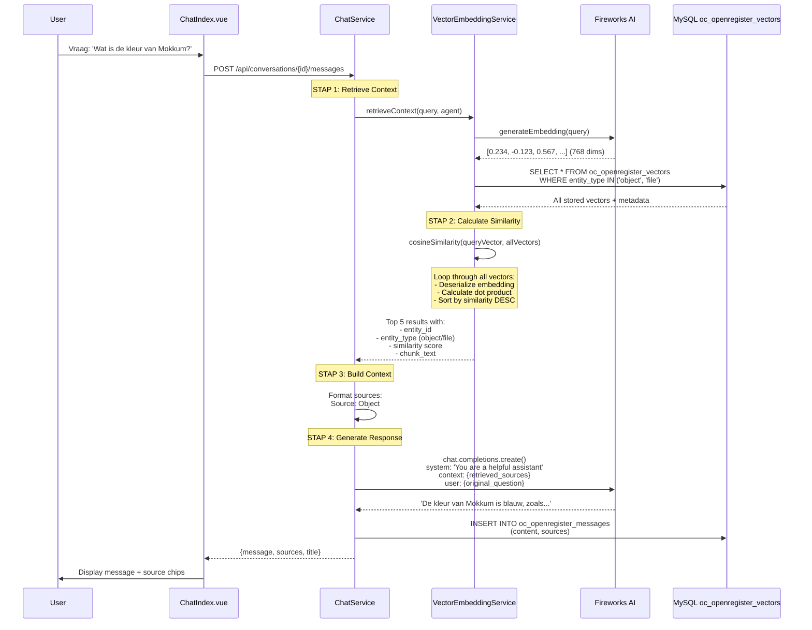

# Chat RAG (Retrieval Augmented Generation) - Deep Dive

## Inhoudsopgave
1. [Overzicht](#overzicht)
2. [De Volledige Flow](#de-volledige-flow)
3. [Vector Embeddings: De Basis](#vector-embeddings-de-basis)
4. [Semantic Search: Hoe Vindt Chat Relevante Informatie?](#semantic-search)
5. [RAG in Actie: Van Vraag tot Antwoord](#rag-in-actie)
6. [Objecten vs Files: Het Verschil](#objecten-vs-files)
7. [Frontend Weergave](#frontend-weergave)
8. [Voorbeeld: 'De kleur van Mokkum is...'](#voorbeeld-query)

---

## Overzicht

**OpenRegister's Chat functionaliteit gebruikt RAG (Retrieval Augmented Generation)** om contextuele, nauwkeurige antwoorden te geven op basis van jouw eigen data - zowel **objecten** als **documenten**.

### Wat is RAG?

RAG combineert twee krachtige technieken:
1. **Retrieval**: Zoek relevante informatie in jouw data via semantic search
2. **Generation**: Gebruik een LLM om een natuurlijk antwoord te genereren met die context

Dit voorkomt 'hallucination' (verzonnen antwoorden) en houdt de AI gegrond in jouw echte data.

---

## De Volledige Flow



---

## Vector Embeddings: De Basis

### Wat is een Embedding?

Een **embedding** is een **numerieke representatie** van tekst in een hoog-dimensionale ruimte:

```php
// Input tekst
$text = 'De kleur van Mokkum is blauw';

// LLM embedding model (Fireworks: thenlper/gte-base)
$embedding = [
    0.234,
    -0.123,
    0.567,
    0.891,
    // ... 768 dimensies totaal
];
```

**Waarom embeddings?**
- Teksten met **vergelijkbare betekenis** hebben **vergelijkbare vectors**
- We kunnen **wiskundig berekenen** hoe 'dichtbij' twee teksten zijn
- Taal-onafhankelijk: 'color' en 'kleur' zijn dichtbij elkaar

### Hoe Worden Embeddings Opgeslagen?

**Database tabel:** `oc_openregister_vectors`

```sql
CREATE TABLE `oc_openregister_vectors` (
  `id` bigint PRIMARY KEY AUTO_INCREMENT,
  `entity_type` varchar(50),  -- 'object' of 'file'
  `entity_id` varchar(255),   -- UUID van object/file
  `chunk_index` int,          -- Voor files: welk stuk (0 voor objects)
  `total_chunks` int,         -- Voor files: totaal aantal stukken
  `chunk_text` longtext,      -- De originele tekst (voor debugging/display)
  `embedding` longblob,       -- Serialized PHP array met vector
  `embedding_model` varchar(100),  -- 'thenlper/gte-base'
  `embedding_dimensions` int, -- 768
  `metadata` longtext,        -- Extra JSON metadata
  `created_at` datetime,
  KEY `entity_idx` (`entity_type`,`entity_id`)
);
```

**Voorbeeld rij:**
```
id: 123
entity_type: 'object'
entity_id: 'a1b2c3d4-...'
chunk_index: 0
chunk_text: 'Object met naam Mokkum en kleur blauw'
embedding: (serialized array van 768 floats)
embedding_model: 'thenlper/gte-base'
embedding_dimensions: 768
```

---

## Semantic Search

### Hoe Werkt Semantic Search?

**Code:** `VectorEmbeddingService::semanticSearch()`

**Stap voor stap:**

#### 1. Query Embedding Genereren
```php
// User vraagt: 'Wat is de kleur van Mokkum?'
$queryEmbeddingData = $this->generateEmbedding($query, $provider);
$queryEmbedding = $queryEmbeddingData['embedding'];
// Result: [0.123, -0.456, 0.789, ...] (768 dims)
```

#### 2. Alle Vectors Ophalen uit Database
```php
$vectors = $this->fetchVectors($filters);
// Returns: All object + file vectors from oc_openregister_vectors
```

#### 3. Cosine Similarity Berekenen

**Cosine Similarity** meet de hoek tussen twee vectors:
- **1.0** = identiek (0° hoek)
- **0.0** = geen relatie (90° hoek)
- **-1.0** = tegengesteld (180° hoek)

```php
private function cosineSimilarity(array $vector1, array $vector2): float
{
    $dotProduct = 0.0;
    $magnitude1 = 0.0;
    $magnitude2 = 0.0;

    // Loop through all 768 dimensions
    for ($i = 0; $i < 768; $i++) {
        $dotProduct += $vector1[$i] * $vector2[$i];
        $magnitude1 += $vector1[$i] ** 2;
        $magnitude2 += $vector2[$i] ** 2;
    }

    $magnitude1 = sqrt($magnitude1);
    $magnitude2 = sqrt($magnitude2);

    return $dotProduct / ($magnitude1 * $magnitude2);
}
```

**Voor elk vector in de database:**
```php
foreach ($vectors as $vector) {
    $storedEmbedding = unserialize($vector['embedding']);
    $similarity = $this->cosineSimilarity($queryEmbedding, $storedEmbedding);
    
    $results[] = [
        'vector_id' => $vector['id'],
        'entity_type' => $vector['entity_type'],  // 'object' of 'file'
        'entity_id' => $vector['entity_id'],
        'similarity' => $similarity,  // 0.0 - 1.0
        'chunk_text' => $vector['chunk_text'],
        // ...
    ];
}
```

#### 4. Sorteren en Top N Teruggeven
```php
// Sort descending by similarity
usort($results, fn($a, $b) => $b['similarity'] <=> $a['similarity']);

// Return top 10 (or whatever limit)
return array_slice($results, 0, $limit);
```

**Resultaat:**
```php
[
    [
        'entity_type' => 'object',
        'entity_id' => 'a1b2c3d4-...',
        'similarity' => 0.923,  // Very relevant!
        'chunk_text' => 'Object met naam Mokkum en kleur blauw',
    ],
    [
        'entity_type' => 'file',
        'entity_id' => '12',
        'similarity' => 0.812,
        'chunk_text' => 'Rapport over Mokkum: De historische stad...',
    ],
    // ... more results
]
```

---

## RAG in Actie

### ChatService::processMessage()

**De volledige conversatie flow:**

```php
public function processMessage(int $conversationId, string $userMessage, string $userId): array
{
    // 1. Store user message
    $userMsgEntity = $this->storeMessage($conversationId, 'user', $userMessage);

    // 2. Get agent configuration (optional)
    $agent = $this->agentMapper->find($conversation->getAgentId());
    
    // Agent bepaalt:
    // - searchMode: 'semantic', 'hybrid', 'keyword'
    // - numSources: hoeveel bronnen (default 5)
    // - searchFiles: true/false
    // - searchObjects: true/false
    // - views: filter op specifieke views

    // 3. RETRIEVE CONTEXT using RAG
    $context = $this->retrieveContext($userMessage, $agent);
    // Returns:
    // {
    //   'text': 'Source: Mokkum\n{chunk_text}\n\nSource: ...',
    //   'sources': [
    //     {'id': '...', 'type': 'object', 'name': 'Mokkum', 'similarity': 0.923},
    //     {'id': '12', 'type': 'file', 'name': 'rapport.pdf', 'similarity': 0.812},
    //   ]
    // }

    // 4. Build conversation history
    $messageHistory = $this->buildMessageHistory($conversationId);

    // 5. GENERATE RESPONSE from LLM
    $aiResponse = $this->generateResponse(
        $userMessage,
        $context,
        $messageHistory,
        $agent
    );

    // 6. Store AI response WITH sources
    $aiMsgEntity = $this->storeMessage(
        $conversationId,
        'assistant',
        $aiResponse,
        $context['sources']  // ← Sources worden opgeslagen bij het bericht!
    );

    return [
        'message' => $aiMsgEntity->jsonSerialize(),
        'sources' => $context['sources'],
        'title' => $conversation->getTitle(),
    ];
}
```

### Retrieve Context: De Kern van RAG

```php
private function retrieveContext(string $query, ?Agent $agent): array
{
    // Get agent settings
    $searchMode = $agent?->getRagSearchMode() ?? 'hybrid';
    $numSources = $agent?->getRagNumSources() ?? 5;
    $includeFiles = $agent?->getSearchFiles() ?? true;
    $includeObjects = $agent?->getSearchObjects() ?? true;

    // Perform semantic search
    $results = $this->vectorService->semanticSearch(
        $query,
        $numSources * 2,  // Get more to filter
        ['entity_type' => ['object', 'file']]
    );

    $sources = [];
    $contextText = '';

    foreach ($results as $result) {
        $isFile = ($result['entity_type'] === 'file');
        $isObject = ($result['entity_type'] === 'object');

        // Apply type filters
        if (($isFile && !$includeFiles) || ($isObject && !$includeObjects)) {
            continue;
        }

        // Stop if enough sources
        if (count($sources) >= $numSources) {
            break;
        }

        // Build source info
        $source = [
            'id' => $result['entity_id'],
            'type' => $result['entity_type'],
            'name' => $this->extractSourceName($result),
            'similarity' => $result['similarity'],
            'text' => $result['chunk_text'],
        ];

        $sources[] = $source;

        // Add to context text
        $contextText .= "Source: {$source['name']}\n";
        $contextText .= "{$source['text']}\n\n";
    }

    return [
        'text' => $contextText,
        'sources' => $sources,
    ];
}
```

### Generate Response: LLM met Context

```php
private function generateResponse(
    string $userMessage,
    array $context,
    array $messageHistory,
    ?Agent $agent
): string {
    // Build system prompt
    $systemPrompt = 'You are a helpful assistant.';
    if ($agent && $agent->getSystemPrompt()) {
        $systemPrompt = $agent->getSystemPrompt();
    }

    // Add context to system message
    if (!empty($context['text'])) {
        $systemPrompt .= "\n\nRelevant context:\n" . $context['text'];
    }

    // Build messages array for LLM
    $messages = [
        ['role' => 'system', 'content' => $systemPrompt],
        ...$messageHistory,  // Previous conversation
        ['role' => 'user', 'content' => $userMessage],
    ];

    // Call LLM
    $chat = new OpenAIChat($llphantConfig);
    $response = $chat->generateChatResponse($messages);

    return $response->content;
}
```

**LLM ziet dus:**
```
SYSTEM: You are a helpful assistant.

Relevant context:
Source: Mokkum
Object met naam Mokkum en kleur blauw en locatie Friesland

Source: rapport.pdf
Rapport over Mokkum: De historische stad met haar blauwe aardewerk...

USER: Wat is de kleur van Mokkum?

ASSISTANT: De kleur van Mokkum is blauw. Dit blijkt zowel uit de object informatie als uit historische documenten over het Mokkumer aardewerk.
```

---

## Objecten vs Files

### Hoe Worden Ze Onderscheiden?

**1. In de Database:**
```sql
-- Object vector
entity_type: 'object'
entity_id: 'a1b2c3d4-5678-...'  -- UUID
chunk_index: 0                   -- Altijd 0 voor objects
total_chunks: 1                  -- Altijd 1 voor objects
chunk_text: 'Object met naam X...'

-- File vector (met chunks)
entity_type: 'file'
entity_id: '12'                  -- Nextcloud file ID
chunk_index: 0                   -- Chunk 0 van 5
total_chunks: 5                  -- Dit document heeft 5 chunks
chunk_text: 'Dit is het eerste deel...'
```

**2. Bij Vectorization:**

**Objects** (`ObjectVectorizationStrategy`):
```php
public function extractVectorizationItems(mixed $entity): array
{
    // Objects worden als GEHEEL gevectoriseerd
    return [[
        'text' => $this->serializeObject($entity),  // Full JSON representation
        'index' => 0,
        'metadata' => [
            'schema_id' => $entity->getSchema(),
            'register_id' => $entity->getRegister(),
            'object_title' => $entity->getTitle() ?? 'Untitled',
        ],
    ]];
}
```

**Files** (`FileVectorizationStrategy`):
```php
public function extractVectorizationItems(mixed $entity): array
{
    // Files worden GESPLITST in chunks
    $chunks = $this->textService->extractText($fileId);
    // Result: [
    //   ['text' => 'Page 1 content...', 'index' => 0],
    //   ['text' => 'Page 2 content...', 'index' => 1],
    //   ['text' => 'Page 3 content...', 'index' => 2],
    // ]
    
    return array_map(fn($chunk, $index) => [
        'text' => $chunk,
        'index' => $index,
        'metadata' => [
            'file_name' => $entity->getName(),
            'mime_type' => $entity->getMimeType(),
            'total_chunks' => count($chunks),
        ],
    ], $chunks, array_keys($chunks));
}
```

**3. In Search Results:**

```php
// ChatService::retrieveContext()
foreach ($results as $result) {
    $isFile = ($result['entity_type'] === 'file');
    $isObject = ($result['entity_type'] === 'object');

    // Agent kan filteren:
    if (($isFile && !$includeFiles) || ($isObject && !$includeObjects)) {
        continue;  // Skip deze source
    }

    // Source name extraction differs:
    $sourceName = $isObject 
        ? ($result['metadata']['object_title'] ?? 'Object #' . $result['entity_id'])
        : ($result['metadata']['file_name'] ?? 'Document #' . $result['entity_id']);
}
```

---

## Frontend Weergave

### ChatIndex.vue: Hoe Sources Worden Getoond

**Template:**
```vue
<!-- Voor elk AI bericht -->
<div class="message assistant">
    <div class="message-content">
        <!-- AI response text -->
        <div class="message-text" v-html="formatMessage(message.content)" />

        <!-- Sources sectie (alleen voor AI messages) -->
        <div v-if="message.sources && message.sources.length > 0" class="message-sources">
            <div class="sources-header">
                <FileDocumentOutline :size="16" />
                <span>Sources:</span>
            </div>
            
            <div class="sources-list">
                <div
                    v-for="(source, sIndex) in message.sources"
                    :key="sIndex"
                    class="source-item"
                    @click="viewSource(source)">
                    
                    <!-- Icon gebaseerd op type -->
                    <div class="source-icon">
                        <FileDocument v-if="source.type === 'file'" :size="16" />
                        <CubeOutline v-else :size="16" />
                        <!--                    ↑ = Object icon -->
                    </div>
                    
                    <!-- Source info -->
                    <div class="source-info">
                        <div class="source-name">{{ source.name }}</div>
                        <div class="source-similarity">
                            {{ Math.round(source.similarity * 100) }}% relevantie
                        </div>
                    </div>
                </div>
            </div>
        </div>
    </div>
</div>
```

**Visueel:**
```
┌─────────────────────────────────────────────┐
│ 🤖 AI Assistant              13:45          │
│                                             │
│ De kleur van Mokkum is blauw. Dit blijkt   │
│ uit zowel de object informatie als...      │
│                                             │
│ 📄 Sources:                                 │
│ ┌─────────────────────────────────────────┐ │
│ │ 🧊 Mokkum              92% relevantie   │ │  ← Object
│ └─────────────────────────────────────────┘ │
│ ┌─────────────────────────────────────────┐ │
│ │ 📄 rapport.pdf         81% relevantie   │ │  ← File
│ └─────────────────────────────────────────┘ │
└─────────────────────────────────────────────┘
```

**Click Handler:**
```javascript
methods: {
    viewSource(source) {
        if (source.type === 'object') {
            // Navigate to object detail page
            this.$router.push({
                name: 'ObjectDetails',
                params: { id: source.id }
            });
        } else if (source.type === 'file') {
            // Open file viewer/downloader
            window.open(
                generateUrl('/apps/files/?fileid=' + source.id),
                '_blank'
            );
        }
    }
}
```

---

## Voorbeeld Query

### Scenario: 'Wat is de kleur van Mokkum?'

**Stel je hebt dit object:**
```json
{
    "uuid": "a1b2c3d4-5678-...",
    "schema": 4,
    "register": 1,
    "title": "Mokkum",
    "summary": "Historische stad",
    "data": {
        "naam": "Mokkum",
        "kleur": "blauw",
        "locatie": "Friesland",
        "bekend_van": "aardewerk"
    }
}
```

**Stap 1: Object Vectorization**
```php
// ObjectVectorizationStrategy::serializeObject()
$text = "Object met naam Mokkum en kleur blauw en locatie Friesland en bekend_van aardewerk";

// Send to Fireworks AI
$embedding = $llm->generateEmbedding($text);
// Result: [0.234, -0.123, 0.567, ..., 0.891] (768 dims)

// Store in database
INSERT INTO oc_openregister_vectors (
    entity_type, entity_id, chunk_text, embedding, ...
) VALUES (
    'object', 'a1b2c3d4-...', $text, serialize($embedding), ...
);
```

**Stap 2: User Chat Query**
```
User: "Wat is de kleur van Mokkum?"
```

**Stap 3: Query Embedding**
```php
$queryEmbedding = $llm->generateEmbedding("Wat is de kleur van Mokkum?");
// Result: [0.245, -0.115, 0.573, ..., 0.887] (768 dims)
//          ↑ Very similar to object embedding!
```

**Stap 4: Cosine Similarity Calculation**
```php
$similarity = cosineSimilarity(
    [0.245, -0.115, 0.573, ..., 0.887],  // Query
    [0.234, -0.123, 0.567, ..., 0.891]   // Object
);
// Result: 0.923 (92.3% similarity - zeer relevant!)
```

**Vergelijk met NIET-relevante vector:**
```php
// Ander object: "Duurzaamheidsrapport 2023"
$otherEmbedding = [0.012, 0.834, -0.512, ..., 0.123];

$similarity = cosineSimilarity($queryEmbedding, $otherEmbedding);
// Result: 0.213 (21.3% - niet relevant)
```

**Stap 5: Semantic Search Results**
```php
// VectorEmbeddingService::semanticSearch() returns:
[
    [
        'entity_type' => 'object',
        'entity_id' => 'a1b2c3d4-...',
        'similarity' => 0.923,  // ← TOP RESULT!
        'chunk_text' => 'Object met naam Mokkum en kleur blauw...',
        'metadata' => ['object_title' => 'Mokkum', 'schema_id' => 4],
    ],
    [
        'entity_type' => 'file',
        'entity_id' => '12',
        'similarity' => 0.812,
        'chunk_text' => 'Rapport over Mokkum: De historische stad...',
    ],
    // ... lower similarity results
]
```

**Stap 6: Build Context**
```php
$contextText = "
Source: Mokkum
Object met naam Mokkum en kleur blauw en locatie Friesland en bekend_van aardewerk

Source: rapport.pdf
Rapport over Mokkum: De historische stad met haar karakteristieke blauwe aardewerk...
";
```

**Stap 7: LLM Prompt**
```
SYSTEM: You are a helpful assistant.

Relevant context:
Source: Mokkum
Object met naam Mokkum en kleur blauw en locatie Friesland en bekend_van aardewerk

Source: rapport.pdf
Rapport over Mokkum: De historische stad met haar karakteristieke blauwe aardewerk...

USER: Wat is de kleur van Mokkum?
```

**Stap 8: LLM Response**
```
ASSISTANT: De kleur van Mokkum is blauw. Mokkum, een historische stad in 
Friesland, staat vooral bekend om het karakteristieke blauwe aardewerk dat 
daar wordt geproduceerd.
```

**Stap 9: Store Message + Sources**
```sql
INSERT INTO oc_openregister_messages (
    conversation_id,
    role,
    content,
    sources  -- JSON met alle source details!
) VALUES (
    1,
    'assistant',
    'De kleur van Mokkum is blauw...',
    '[{"id":"a1b2c3d4-...","type":"object","name":"Mokkum","similarity":0.923}]'
);
```

**Stap 10: Frontend Display**
```
┌─────────────────────────────────────────────┐
│ 👤 You                       13:44          │
│ Wat is de kleur van Mokkum?                │
└─────────────────────────────────────────────┘

┌─────────────────────────────────────────────┐
│ 🤖 AI Assistant              13:45          │
│                                             │
│ De kleur van Mokkum is blauw. Mokkum, een  │
│ historische stad in Friesland, staat       │
│ vooral bekend om het karakteristieke       │
│ blauwe aardewerk dat daar wordt            │
│ geproduceerd.                              │
│                                             │
│ 📄 Sources:                                 │
│ ┌─────────────────────────────────────────┐ │
│ │ 🧊 Mokkum              92% relevantie   │ │  ← Click → Object details
│ └─────────────────────────────────────────┘ │
│ ┌─────────────────────────────────────────┐ │
│ │ 📄 rapport.pdf         81% relevantie   │ │  ← Click → Open PDF
│ └─────────────────────────────────────────┘ │
└─────────────────────────────────────────────┘
```

---

## Performance & Schaalbaarheid

### Huidige Implementatie

**Bottleneck:**
```php
// VectorEmbeddingService::semanticSearch()
$vectors = $this->fetchVectors($filters);  // Haalt ALLE vectors op!

foreach ($vectors as $vector) {
    $similarity = $this->cosineSimilarity($queryEmbedding, $storedEmbedding);
    // ↑ N comparisons (waar N = totaal aantal vectors)
}
```

**Performance met jouw dataset:**
- 961 total vectors (404 objects + 557 files)
- Search time: ~50-200ms (afhankelijk van server load)
- Memory usage: ~2-5MB per search

**Schaling:**
- 10,000 vectors: ~500ms
- 100,000 vectors: ~5s (te langzaam!)

### Toekomstige Optimalisaties

**Optie 1: Vector Database (Pinecone, Weaviate, Qdrant)**
- Approximate Nearest Neighbor (ANN) search
- Sub-millisecond queries op 1M+ vectors
- Extra infra nodig

**Optie 2: FAISS (Facebook AI Similarity Search)**
- In-memory index
- 100x sneller dan brute-force
- Kan in PHP via extension

**Optie 3: PostgreSQL pgvector**
- Native vector support in Postgres
- Geen extra infra
- IVFFLAT/HNSW indices voor snelle search

---

## Debugging & Monitoring

### Log Statements

**Enable debug logging:**
```php
// config.php
'loglevel' => 0,  // 0 = debug, 1 = info, 2 = warn, etc.
```

**Kijk in logs:**
```bash
docker logs -f master-nextcloud-1 | grep '\[VectorEmbeddingService\]'
docker logs -f master-nextcloud-1 | grep '\[ChatService\]'
```

**Typische log flow:**
```
[info] [ChatService] Retrieving context for query: "Wat is de kleur..."
[info] [VectorEmbeddingService] Performing semantic search, limit=10
[debug] [VectorEmbeddingService] Step 1: Generating query embedding
[debug] [VectorEmbeddingService] Step 2: Fetching vectors from database
[debug] [VectorEmbeddingService] Step 3: Calculating similarities, count=961
[info] [VectorEmbeddingService] Semantic search completed, results=10, top_similarity=0.923, time=87ms
[info] [ChatService] Context retrieved, numSources=2, contextLength=342
```

### API Testing

**Test vectorization stats:**
```bash
curl -u admin:admin http://localhost/index.php/apps/openregister/api/vectors/stats
```

**Test semantic search directly:**
```bash
curl -u admin:admin -X POST \
  http://localhost/index.php/apps/openregister/api/vectors/search \
  -H 'Content-Type: application/json' \
  -d '{"query":"Wat is de kleur van Mokkum?","limit":5}'
```

**Test chat conversation:**
```bash
curl -u admin:admin -X POST \
  http://localhost/index.php/apps/openregister/api/conversations/1/messages \
  -H 'Content-Type: application/json' \
  -d '{"message":"Wat is de kleur van Mokkum?"}'
```

---

## Conclusie

De **OpenRegister Chat met RAG** combineert:

1. **Vector Embeddings** (wiskundige representaties van tekst)
2. **Semantic Search** (vind relevante info via cosine similarity)
3. **LLM Generation** (genereer natuurlijke antwoorden met context)

**Result:** Een AI assistent die **gegrond** is in **jouw eigen data**, zowel **gestructureerde objecten** als **ongestructureerde documenten**, met **transparante bronvermelding** en **volledige traceability**.

🎯 **Alle antwoorden zijn verifieerbaar via de source chips!**

