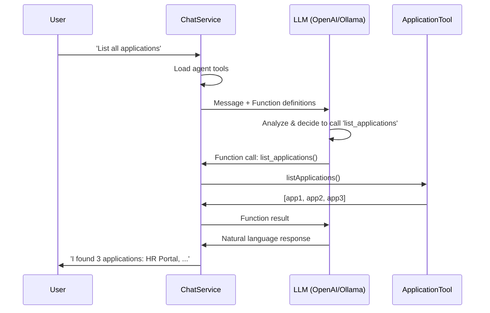

# Function Calling (Tools)

## Overview

OpenRegister supports **function calling** (also known as tools), enabling AI agents to perform actions and retrieve information from the system. Agents can manage registers, schemas, objects, applications, and other agents through natural language.

## ⚠️ **Provider Support**

| Provider | Function Calling Support | Status |
|----------|------------------------|--------|
| **OpenAI** | ✅ **Fully Supported** | Excellent |
| **Ollama** | ✅ **Supported** | Good with compatible models |
| **Fireworks AI** | ❌ **Not Implemented** | Use OpenAI or Ollama |

### 🎯 **Recommended Models for Tool-Oriented Agents**

For agents that need to use tools (function calling), model selection is critical. Not all models support function calling reliably.

#### **Ollama Models - Function Calling Performance**

| Model | Function Calling | Performance | Recommended For |
|-------|-----------------|-------------|-----------------|
| **mistral-nemo** | ⭐⭐⭐⭐⭐ **Excellent** | Fast, reliable tool execution | **RECOMMENDED for all tool agents** |
| llama3.2:3b | ⭐⭐⭐ Good | Lightweight, decent tool support | Basic tool usage, resource-constrained |
| llama3.1:8b | ⭐⭐⭐⭐ Very Good | Reliable function calling | Alternative to mistral-nemo |
| mistral:7b | ⭐⭐ Fair | Inconsistent tool calling | NOT recommended for tools |
| qwen2:0.5b | ⭐ Poor | Minimal function support | Only for chat, not tools |
| phi3:mini | ⭐⭐ Fair | Limited tool support | NOT recommended for tools |

#### **Installation**

To install Mistral Nemo (recommended for tool agents):

```bash
docker exec openregister-ollama ollama pull mistral-nemo
```

#### **Agent Configuration**

For tool-oriented agents, configure:

```json
{
  'provider': 'ollama',
  'model': 'mistral-nemo',
  'temperature': 0.3,
  'tools': ['opencatalogi.cms', 'openregister.objects']
}
```

**Why Mistral Nemo?**
- ✅ **Reliable function execution** - Consistently calls tools when appropriate
- ✅ **Proper parameter handling** - Correctly formats function arguments
- ✅ **Low hallucination** - Doesn't invent functions or parameters
- ✅ **Fast inference** - Reasonable speed even on CPU
- ✅ **Good context retention** - Remembers conversation history well

### ⚠️ Important Notes

**Function calling is NOT yet implemented for Fireworks AI.** If you want to use tools, you must:

1. Configure **OpenAI** or **Ollama** as your chat provider
2. Use a **function-calling compatible model** (see table above)
3. Ensure your agent is configured with at least one tool
4. Test with natural language commands (e.g., 'List all applications')

**For Ollama users:** We strongly recommend **mistral-nemo** for any agent that needs to use tools. Other models may describe what they would do instead of actually executing functions.

---

## Available Tools

### 1. **Register Tool** (`openregister.register`)

Manage registers (collections of schemas and objects).

**Capabilities:**
- List all accessible registers
- Get register details by ID or slug
- Create new registers
- Update register configuration
- Delete registers

**Example queries:**
- 'Show me all registers'
- 'What is in the products register?'
- 'Create a new register called customers'

---

### 2. **Schema Tool** (`openregister.schema`)

Manage schemas (define object structure and validation).

**Capabilities:**
- List all accessible schemas
- Get schema details including properties
- Create new schemas
- Update schema configuration
- Delete schemas

**Example queries:**
- 'List all schemas in the products register'
- 'Show me the person schema'
- 'Create a schema for orders with fields: id, customer, total'

---

### 3. **Objects Tool** (`openregister.objects`)

Manage objects (data records conforming to schemas).

**Capabilities:**
- Search and filter objects
- Get object details
- Create new objects
- Update existing objects
- Delete objects

**Example queries:**
- 'Find all persons named John'
- 'Show me object 123 from the products register'
- 'Create a new product with name: Widget, price: 10'

---

### 4. **Application Tool** (`openregister.application`)

Manage applications (software modules in your organisation).

**Capabilities:**
- List all accessible applications
- Get application details
- Create new applications
- Update application configuration
- Delete applications

**Example queries:**
- 'List all applications'
- 'What applications are available?'
- 'Create an application called HR Portal'

---

### 5. **Agent Tool** (`openregister.agent`)

Manage AI agents (self-management capability).

**Capabilities:**
- List all accessible agents
- Get agent configuration
- Create new agents
- Update agent settings
- Delete agents

**Example queries:**
- 'Show me all agents'
- 'Create a support agent for customer questions'
- 'What is the configuration of agent X?'

---

## Configuration

### Enabling Tools for an Agent

1. Navigate to **Settings → AI → Agents**
2. Edit or create an agent
3. Select the tools you want to enable (e.g., 'Application Management')
4. Save the agent

### Testing Function Calling

1. Ensure you are using **OpenAI** or **Ollama** (NOT Fireworks AI)
2. Create or edit an agent and enable at least one tool
3. Start a conversation with the agent
4. Ask the agent to perform an action:
   - 'List all applications'
   - 'Create a register called test'
   - 'Show me schema 5'

### Checking the Logs

Function calls are logged for debugging:

```bash
docker logs -f master-nextcloud-1 | grep 'ChatService.*function'
```

You should see:
- `[ChatService] Prepared functions for LLM` - Tools are being sent
- `[ChatService] Handling function call` - LLM is calling a function
- `[ApplicationTool] Listing applications` - Function is being executed

If you see:
- `Function calling not yet supported for Fireworks AI` - You need to switch providers

---

## How Function Calling Works

1. **Agent loads tools**: When processing a message, `ChatService` loads tools configured for the agent
2. **Convert to OpenAI format**: Tools' `getFunctions()` returns function definitions in OpenAI format
3. **Send to LLM**: Functions are included in the chat API request
4. **LLM decides**: The LLM analyzes the user message and decides if a function call is needed
5. **Execute function**: If yes, `ChatService` executes the function via the tool
6. **Return result**: Function result is sent back to LLM, which formulates a natural language response



---

## Architecture

### Tool Interface

All tools implement `ToolInterface`:

```php
interface ToolInterface
{
    public function getName(): string;
    public function getDescription(): string;
    public function getFunctions(): array; // OpenAI function format
    public function executeFunction(string $functionName, array $parameters, ?string $userId = null): array;
}
```

### Function Definition Format

Tools return function definitions as plain arrays (OpenAI format):

```php
public function getFunctions(): array
{
    return [
        [
            'name' => 'list_applications',
            'description' => 'List all applications...',
            'parameters' => [
                'type' => 'object',
                'properties' => [
                    'limit' => [
                        'type' => 'integer',
                        'description' => 'Maximum results',
                    ],
                ],
                'required' => [],
            ],
        ],
    ];
}
```

### Tool Registry

The `ToolRegistry` manages all available tools and maps tool IDs to implementations:

```php
$tool = $this->toolRegistry->getTool('openregister.application');
```

---

## Security & RBAC

All tools respect:
- **RBAC permissions**: Users can only perform actions they have permissions for
- **Organisation boundaries**: Multi-tenancy is enforced
- **Agent configuration**: Only enabled tools are accessible
- **View restrictions**: Objects are filtered by agent's configured views

---

## Troubleshooting

### 'Function calling not yet supported for Fireworks AI'

**Solution**: Change your LLM provider to OpenAI or Ollama in Settings → AI → LLM Configuration.

### Tools are not being called

**Check:**
1. Is the agent configured with tools enabled?
2. Are you using OpenAI or Ollama (not Fireworks)?
3. Is the user message clear and actionable? (e.g., 'List applications' not 'What are applications?')

### 'Tool not found' warning in logs

**Solution**: The tool ID in the agent configuration is incorrect. Use the format `openregister.register`, `openregister.application`, etc.

---

## Roadmap

### Planned Features

- ✅ Basic function calling (OpenAI/Ollama)
- ⏳ Fireworks AI function calling support
- ⏳ Multi-step function calls (agent chains)
- ⏳ Function call caching
- ⏳ Custom tools via app configuration

---

## See Also

- [RAG Deep Dive](./chat-rag-deepdive.md) - How agents find information
- [Agent Configuration](./agents.md) - Configure agents and tools
- [AI Configuration](../Features/ai.md) - Provider setup and AI features

