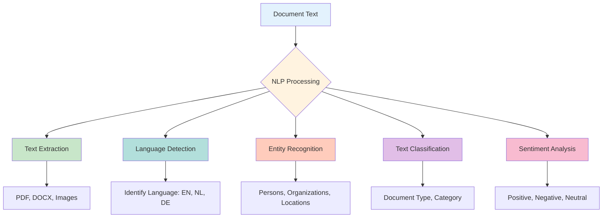
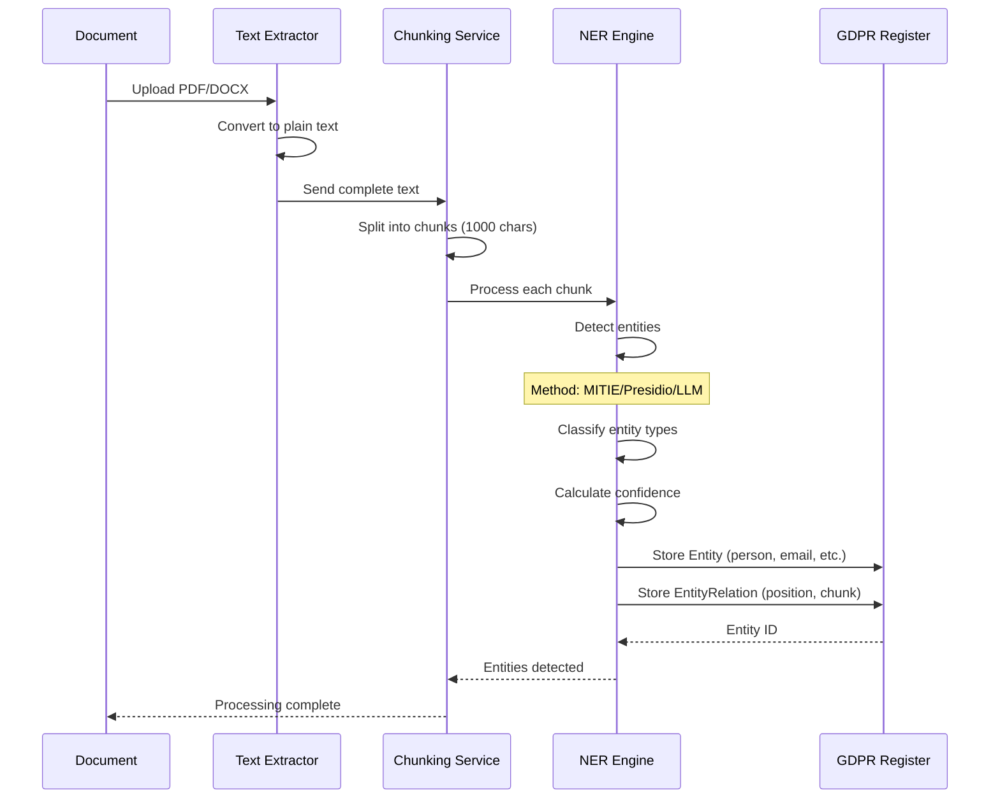
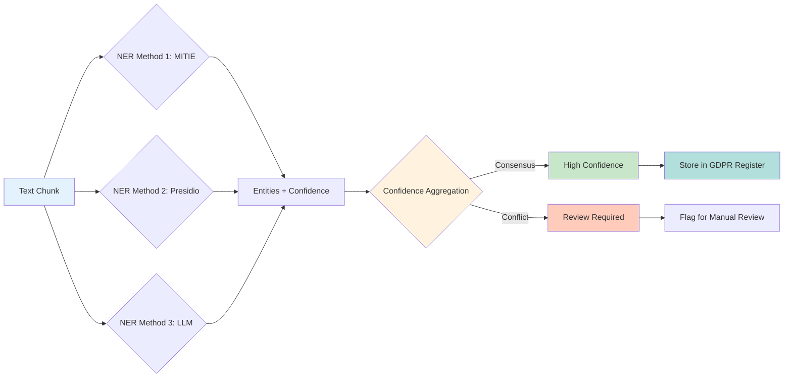

# Named Entity Recognition (NER) & Natural Language Processing (NLP)

## Overview

OpenRegister uses Named Entity Recognition (NER) and Natural Language Processing (NLP) techniques to automatically identify and extract sensitive information from documents for GDPR compliance, data classification, and intelligent search capabilities.

## What is NLP?

**Natural Language Processing (NLP)** is a field of artificial intelligence that enables computers to understand, interpret, and process human language in a meaningful way.

### Core NLP Capabilities in OpenRegister



### NLP Tasks in OpenRegister

1. **Text Extraction**: Convert files (PDF, DOCX, images) into machine-readable text
2. **Language Detection**: Identify the language of content (English, Dutch, German, etc.)
3. **Language Level Assessment**: Determine reading difficulty (A1-C2 CEFR levels, Flesch-Kincaid scores)
4. **Named Entity Recognition (NER)**: Identify persons, organizations, locations, dates, etc.
5. **Text Chunking**: Split documents into semantic units for better processing
6. **Text Classification**: Categorize documents by type, topic, or sensitivity
7. **Sentiment Analysis**: Understand emotional tone (future feature)

## What is NER?

**Named Entity Recognition (NER)** is a specific NLP task that locates and classifies named entities (proper nouns and important terms) in text into predefined categories.

### Entity Categories

OpenRegister recognizes these entity types for GDPR compliance:

| Entity Type | Description | Examples | GDPR Category |
|------------|-------------|----------|--------------|
| **PERSON** | Individual names | John Doe, Jane Smith | Personal Data |
| **EMAIL** | Email addresses | john@example.com | Personal Data |
| **PHONE** | Phone numbers | +31 6 12345678 | Personal Data |
| **ADDRESS** | Physical addresses | 123 Main St, Amsterdam | Personal Data |
| **ORGANIZATION** | Company/org names | Acme Corporation | Business Data |
| **LOCATION** | Geographic locations | Amsterdam, Netherlands | Contextual Data |
| **DATE** | Dates and times | 2025-01-15, January 15th | Temporal Data |
| **IBAN** | Bank account numbers | NL91 ABNA 0417 1643 00 | Sensitive PII |
| **SSN** | Social security numbers | 123-45-6789 | Sensitive PII |

### NER Process Flow



## NER Implementation Options

OpenRegister supports multiple NER engines to balance accuracy, privacy, and infrastructure requirements:

### 1. MITIE PHP Library (Local - Basic Setup)

**MITIE** (MIT Information Extraction) is an open-source NER library from MIT that runs entirely locally.

**Recommended for:**
- Development environments
- Privacy-sensitive deployments with no external API calls
- Basic entity recognition needs
- Low-resource environments

**Advantages:**
- ✅ No external dependencies
- ✅ Complete privacy (all processing local)
- ✅ No API costs
- ✅ Fast processing
- ✅ Works offline

**Limitations:**
- ⚠️ Lower accuracy than cloud services
- ⚠️ Requires PHP extension compilation
- ⚠️ Limited language support
- ⚠️ Pattern-based detection (regex + ML models)

**Installation:**

```bash
# Install MITIE PHP extension
git clone https://github.com/mit-nlp/MITIE.git
cd MITIE
mkdir build && cd build
cmake ..
cmake --build . --config Release --target install

# Enable PHP extension
echo "extension=mitie.so" > /etc/php/8.1/mods-available/mitie.ini
phpenmod mitie
```

**Usage Example:**

```php
use OCA\OpenRegister\Service\NerService;

// MITIE will detect entities using local models
$nerService = $this->container->get(NerService::class);
$entities = $nerService->extractEntities($text, 'mitie');

foreach ($entities as $entity) {
    echo "Found {$entity['type']}: {$entity['value']} (confidence: {$entity['confidence']})\n";
}
```

**Detection Methods:**
- Pattern matching (regex) for emails, phones, IBANs
- Statistical ML models for persons and organizations
- Dictionary-based location detection

### 2. Microsoft Presidio (Production - Recommended)

**Presidio** is Microsoft's open-source PII detection and anonymization framework with state-of-the-art accuracy.

**Recommended for:**
- ✅ Production deployments
- ✅ GDPR compliance requirements
- ✅ Multi-language support needed
- ✅ High accuracy requirements

**Advantages:**
- ✅ High accuracy (90-98% precision)
- ✅ Multi-language support (50+ languages)
- ✅ PII-specific focus (built for GDPR/CCPA)
- ✅ Anonymization built-in
- ✅ Regular updates and improvements
- ✅ Self-hosted option (Docker)
- ✅ Extensible with custom recognizers

**Deployment:**

Presidio Analyzer can be deployed as a Docker container (included in OpenRegister's docker-compose.yml):

```yaml
presidio-analyzer:
  image: mcr.microsoft.com/presidio-analyzer:latest
  container_name: openregister-presidio-analyzer
  restart: always
  ports:
    - "5001:5001"
  environment:
    - GRPC_PORT=5001
    - LOG_LEVEL=INFO
    # Multi-language support including Dutch
    - PRESIDIO_ANALYZER_LANGUAGES=en,nl,de,fr,es
  deploy:
    resources:
      limits:
        memory: 2G
      reservations:
        memory: 512M
  healthcheck:
    test: ["CMD-SHELL", "curl -f http://localhost:5001/health || exit 1"]
    interval: 30s
    timeout: 10s
    retries: 3
    start_period: 30s
```

**Note**: Presidio also offers a separate Anonymizer service, but OpenRegister handles anonymization internally using the detected entity positions from the Analyzer.

**Usage Example:**

```php
use OCA\OpenRegister\Service\NerService;

// Presidio provides higher accuracy
$nerService = $this->container->get(NerService::class);
$entities = $nerService->extractEntities($text, 'presidio', [
    'language' => 'nl'  // Specify Dutch language
]);

foreach ($entities as $entity) {
    echo "Found {$entity['type']}: {$entity['value']}\n";
    echo "Confidence: {$entity['confidence']}\n";
    echo "Position: {$entity['start']}-{$entity['end']}\n";
}
```

**Supported Entity Types:**
- PERSON, EMAIL_ADDRESS, PHONE_NUMBER
- LOCATION, ORGANIZATION
- CREDIT_CARD, IBAN_CODE, SSN
- IP_ADDRESS, URL, DATE_TIME
- MEDICAL_LICENSE, US_PASSPORT
- Custom types via plugins

### 3. LLM-Based NER (GPT-4, Claude, Ollama)

**LLM-based NER** uses large language models to detect entities with contextual understanding.

**Recommended for:**
- Complex entity relationships
- Domain-specific entities
- Ambiguous cases requiring context
- Multi-task processing (NER + classification + sentiment)

**Advantages:**
- ✅ Best accuracy for complex cases
- ✅ Context-aware detection
- ✅ Handles ambiguity
- ✅ No training required
- ✅ Can detect custom entity types via prompts

**Limitations:**
- ⚠️ Slower than dedicated NER systems
- ⚠️ Higher cost (API calls)
- ⚠️ Requires careful prompt engineering
- ⚠️ Privacy considerations for cloud LLMs

**Usage Example:**

```php
use OCA\OpenRegister\Service\NerService;
use OCA\OpenRegister\Service\LLMService;

// Use Ollama (local) or OpenAI (cloud) for NER
$nerService = $this->container->get(NerService::class);
$entities = $nerService->extractEntities($text, 'llm', [
    'provider' => 'ollama',
    'model' => 'llama3.2',
    'temperature' => 0.1  // Low temperature for consistent extraction
]);

foreach ($entities as $entity) {
    echo "Found {$entity['type']}: {$entity['value']}\n";
    echo "Context: {$entity['context']}\n";
    echo "Reasoning: {$entity['reasoning']}\n";
}
```

**Supported Providers:**
- **Ollama** (local, privacy-first)
- **OpenAI** (GPT-4, GPT-4-turbo)
- **Anthropic** (Claude 3)
- **Azure OpenAI**

### 4. Hybrid Approach (Best Accuracy)

Combine multiple methods for optimal accuracy and coverage:



**Hybrid Strategy:**

```php
$entities = $nerService->extractEntities($text, 'hybrid', [
    'methods' => ['mitie', 'presidio', 'llm'],
    'consensus_threshold' => 0.75,  // Require 2/3 agreement
    'min_confidence' => 0.6
]);

// Example result
[
    'entity' => 'john.doe@example.com',
    'type' => 'email',
    'detections' => [
        'mitie' => ['confidence' => 0.95],
        'presidio' => ['confidence' => 0.98],
        'llm' => ['confidence' => 0.92]
    ],
    'final_confidence' => 0.95,  // Average of all methods
    'consensus' => true  // All 3 methods agreed
]
```

## Entity Extraction Accuracy

Typical accuracy ranges by method:

| Method | Precision | Recall | F1 Score | Speed |
|--------|-----------|--------|----------|-------|
| **MITIE** (Local) | 75-85% | 70-80% | 72-82% | ⚡⚡⚡ Fast |
| **Presidio** (Production) | 90-95% | 85-92% | 87-93% | ⚡⚡ Medium |
| **LLM** (GPT-4) | 92-98% | 90-95% | 91-96% | ⚡ Slow |
| **Hybrid** | 95-99% | 92-96% | 93-97% | ⚡ Slow |

**Definitions:**
- **Precision**: Percentage of detected entities that are correct (low false positives)
- **Recall**: Percentage of actual entities that were detected (low false negatives)
- **F1 Score**: Harmonic mean of precision and recall (overall accuracy)

## Configuration

Entity extraction is configured in OpenRegister settings:

```php
// config/ner_config.php
return [
    'ner_enabled' => true,
    'ner_method' => 'presidio',  // or 'mitie', 'llm', 'hybrid'
    
    // MITIE configuration
    'mitie' => [
        'model_path' => '/var/www/html/custom_apps/openregister/models/mitie',
        'languages' => ['en', 'nl']
    ],
    
    // Presidio configuration
    'presidio' => [
        'analyzer_url' => 'http://presidio-analyzer:5001',
        'anonymizer_url' => 'http://presidio-anonymizer:5002',
        'languages' => ['en', 'nl', 'de', 'fr', 'es'],
        'score_threshold' => 0.6  // Minimum confidence
    ],
    
    // LLM configuration
    'llm' => [
        'provider' => 'ollama',  // or 'openai', 'anthropic'
        'model' => 'llama3.2',
        'temperature' => 0.1,
        'max_tokens' => 4000
    ],
    
    // Hybrid configuration
    'hybrid' => [
        'methods' => ['mitie', 'presidio'],
        'consensus_threshold' => 0.67,  // Require 2/3 agreement
        'fallback_to_llm' => true  // Use LLM for conflicts
    ]
];
```

## GDPR Compliance

The NER system supports GDPR compliance through:

### 1. Complete Data Subject Profiles

Track all occurrences of a person across all documents:

```php
// Find all documents containing John Doe
$person = $entityMapper->findByValue('John Doe', GdprEntity::TYPE_PERSON);
$relations = $entityRelationMapper->findByEntityId($person->getId());

foreach ($relations as $relation) {
    $chunk = $chunkMapper->find($relation->getChunkId());
    echo "Found in: {$chunk->getSourceType()} #{$chunk->getSourceId()}\n";
    echo "Position: {$relation->getPositionStart()}-{$relation->getPositionEnd()}\n";
    echo "Confidence: {$relation->getConfidence()}\n";
}
```

### 2. Role-Based Anonymization

Different handling based on entity context:

```php
// Role types
EntityRelation::ROLE_PUBLIC_FIGURE      // CEO in press release
EntityRelation::ROLE_EMPLOYEE           // Staff in official docs
EntityRelation::ROLE_PRIVATE_INDIVIDUAL // Customer in support ticket
EntityRelation::ROLE_MENTIONED          // Third party reference

// Anonymization decision
if ($relation->getRole() === EntityRelation::ROLE_PRIVATE_INDIVIDUAL) {
    $anonymized = $anonymizationService->anonymize($entity);
    $relation->setAnonymized(true);
    $relation->setAnonymizedValue($anonymized);
}
```

### 3. Source Document Tracking

Always know which files contain which entities:

```php
// Get all files containing this person
$relations = $entityRelationMapper->findByEntityId($personId);
$fileIds = array_unique(array_column($relations, 'file_id'));

// Prepare for GDPR request
$documents = $fileMapper->findByIds($fileIds);
```

## Best Practices

### 1. Choose the Right Method for Your Use Case

- **Development/Testing**: Use MITIE for quick setup
- **Production/GDPR**: Use Presidio for best accuracy and compliance
- **Privacy-Critical**: Use Ollama (local LLM) to avoid cloud APIs
- **Complex Cases**: Use Hybrid approach with multiple methods

### 2. Confidence Thresholds

Set appropriate confidence thresholds based on use case:

```php
// Conservative (fewer false positives)
'min_confidence' => 0.8

// Balanced (good trade-off)
'min_confidence' => 0.6

// Aggressive (catch more entities, more false positives)
'min_confidence' => 0.4
```

### 3. Manual Review Queue

Flag low-confidence detections for human review:

```php
if ($entity['confidence'] < 0.75) {
    $reviewQueue->add($entity, $chunk);
}
```

### 4. Regular Model Updates

- Update MITIE models quarterly
- Keep Presidio containers updated
- Fine-tune LLM prompts based on false positives

## Performance Considerations

### Processing Speed

Average processing time per 1000-character chunk:

- **MITIE**: 10-50ms (local, fast)
- **Presidio**: 100-300ms (API call, medium)
- **LLM** (Ollama local): 500-2000ms (slow, depends on model)
- **LLM** (OpenAI API): 200-1000ms (API latency)
- **Hybrid**: 500-3000ms (slowest, but most accurate)

### Scalability

For large document collections:

```php
// Process in background jobs
$job = new EntityExtractionJob($fileId, 'presidio');
$jobList->add($job);

// Batch processing
$chunks = $chunkMapper->findPending(100);
$entities = $nerService->extractBatch($chunks, 'presidio');
```

### Resource Requirements

| Method | CPU | Memory | Network | Storage |
|--------|-----|--------|---------|---------|
| MITIE | Low | 100MB | None | Minimal |
| Presidio | Medium | 500MB | Yes | Minimal |
| LLM (Local) | High | 8-16GB | None | High |
| LLM (API) | Low | 100MB | Yes | Minimal |

## Troubleshooting

### MITIE Not Detecting Entities

```bash
# Check if extension is loaded
php -m | grep mitie

# Verify model files exist
ls -la /path/to/mitie/models/

# Test detection
php occ openregister:ner:test --method=mitie --text="John Doe works at Acme Corp"
```

### Presidio Connection Errors

```bash
# Check if Presidio is running
curl http://presidio-analyzer:5001/health

# View logs
docker logs openregister-presidio-analyzer

# Restart Presidio
docker-compose restart presidio-analyzer presidio-anonymizer
```

### Low Accuracy

- Increase confidence threshold to reduce false positives
- Switch to Presidio or Hybrid method
- Fine-tune entity types in configuration
- Add custom recognizers for domain-specific entities

## Future Enhancements

Planned improvements to NER/NLP:

- 🔮 Custom entity types (product names, project codes)
- 🔮 Relationship extraction (person works at company)
- 🔮 Sentiment analysis per entity mention
- 🔮 Multi-document entity resolution (same person across files)
- 🔮 Temporal entity tracking (entity value changes over time)
- 🔮 Entity disambiguation (John Smith #1 vs John Smith #2)

## Related Documentation

- [Text Extraction Enhanced](./text-extraction-enhanced.md) - Complete text extraction pipeline
- [Text Extraction Database Entities](../technical/text-extraction-entities.md) - Database schema
- [Entity Relationships](../technical/entity-relationships-addition.md) - Entity data model
- [GDPR Features](../Features/files.md) - GDPR compliance features

## API Examples

### Extract Entities from Text

```bash
# Using MITIE (local)
curl -X POST http://nextcloud.local/index.php/apps/openregister/api/ner/extract \
  -u admin:admin \
  -H "Content-Type: application/json" \
  -d '{
    "text": "Contact John Doe at john.doe@example.com or +31 6 12345678",
    "method": "mitie"
  }'

# Using Presidio (production)
curl -X POST http://nextcloud.local/index.php/apps/openregister/api/ner/extract \
  -u admin:admin \
  -H "Content-Type: application/json" \
  -d '{
    "text": "Contact John Doe at john.doe@example.com or +31 6 12345678",
    "method": "presidio",
    "anonymize": true
  }'
```

### Get GDPR Profile

```bash
# Get all data for a person
curl -X GET http://nextcloud.local/index.php/apps/openregister/api/gdpr/profile/john.doe@example.com \
  -u admin:admin

# Response includes all files, chunks, and occurrences
```

---

**Note**: For production GDPR compliance, we strongly recommend using **Presidio** or **Hybrid** methods for optimal accuracy. MITIE is suitable for development and testing purposes.

For detailed setup instructions including Dutch language support, see [Presidio Setup for Dutch Language](../development/presidio-setup.md).

