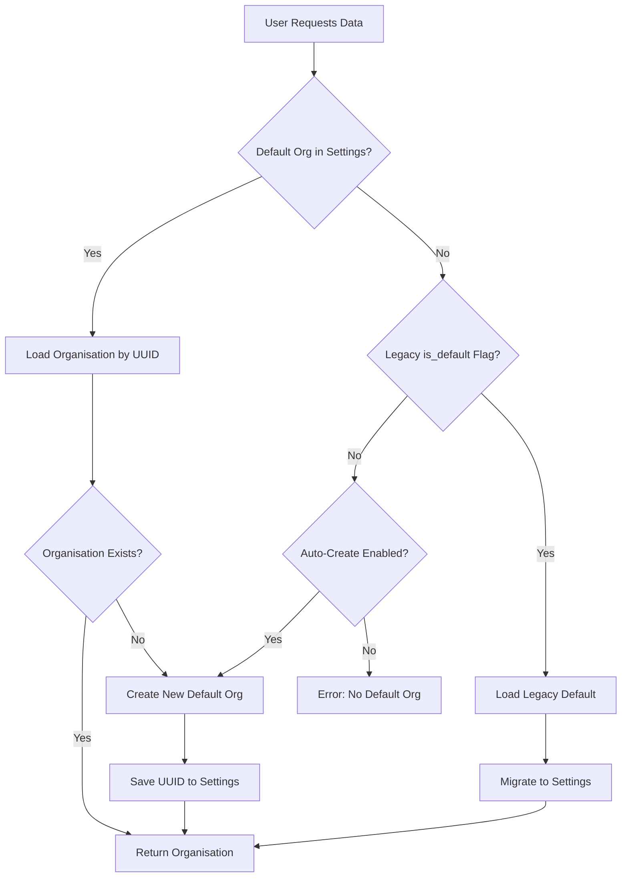

# Default Organisation Configuration

OpenRegister uses a **settings-based approach** for configuring the default organisation, rather than a database column flag. This provides better centralized configuration management and makes it easy to change the default organisation without modifying database records.

## Overview

The default organisation is the organisation that new users are automatically added to when they don't have any specific organisation membership. This is essential for ensuring all users have at least one organisation context.

### Why Settings Instead of Database Column?

- **Single Source of Truth**: One organisation UUID stored in application settings
- **Easy to Change**: Admins can change the default organisation through the UI without database modifications
- **Centralized Configuration**: Managed alongside other application settings
- **No Database Overhead**: No need for unique constraints or queries on `is_default` flags
- **Better for Multi-Instance**: Settings are managed per-instance, not in shared database

## Configuration

### Via UI (Admin Settings)

1. Navigate to **Settings** → **OpenRegister** → **Organisation Configuration**
2. Select the default organisation from the dropdown
3. Optionally enable/disable auto-creation of default organisation
4. Click **Save Settings**


### Via API

#### Get Current Default Organisation Setting

```bash
GET /apps/openregister/api/settings/organisation
```

**Response:**

```json
{
  "organisation": {
    "default_organisation": "uuid-of-default-org",
    "auto_create_default_organisation": true
  }
}
```

#### Update Default Organisation Setting

```bash
PUT /apps/openregister/api/settings/organisation
Content-Type: application/json

{
  "default_organisation": "new-uuid-here",
  "auto_create_default_organisation": true
}
```

## Settings

### `default_organisation`

- **Type**: `string` (UUID) or `null`
- **Default**: `null`
- **Description**: UUID of the organisation that should be used as default

When set to `null` and a default organisation is needed:
- If `auto_create_default_organisation` is `true`, a new default organisation will be created
- If `auto_create_default_organisation` is `false`, an error will occur

### `auto_create_default_organisation`

- **Type**: `boolean`
- **Default**: `true`
- **Description**: Whether to automatically create a default organisation if none exists

When `true`:
- On app initialization, if no default organisation is configured, one will be created automatically
- Named "Default Organisation"
- System owner
- All admin users are added as members

When `false`:
- Admin must manually select a default organisation in settings
- System will not function properly until a default is configured

## How It Works

### Initialization Flow



### Backend Implementation

#### SettingsService

```php
// Get default organisation UUID
$uuid = $settingsService->getDefaultOrganisationUuid();

// Set default organisation UUID
$settingsService->setDefaultOrganisationUuid($organisationUuid);
```

#### OrganisationService

The `OrganisationService` checks for the default organisation in this order:

1. **Settings UUID**: Loads UUID from `organisation.default_organisation` setting
2. **Legacy Database Flag**: Falls back to `is_default = true` column (for backward compatibility)
3. **Auto-Create**: Creates new default if auto-create is enabled
4. **Error**: Throws exception if no default found and auto-create is disabled

```php
private function fetchDefaultOrganisationFromDatabase(): Organisation
{
    // 1. Try settings UUID first
    $defaultOrgUuid = $this->settingsService->getDefaultOrganisationUuid();
    
    if ($defaultOrgUuid !== null) {
        try {
            return $this->organisationMapper->findByUuid($defaultOrgUuid);
        } catch (DoesNotExistException $e) {
            // UUID doesn't exist, create new
            $org = $this->organisationMapper->createDefault();
            $this->settingsService->setDefaultOrganisationUuid($org->getUuid());
            return $org;
        }
    }
    
    // 2. Fall back to legacy is_default flag
    try {
        $org = $this->organisationMapper->findDefault();
        // Migrate to settings
        $this->settingsService->setDefaultOrganisationUuid($org->getUuid());
        return $org;
    } catch (DoesNotExistException $e) {
        // 3. Create new if auto-create enabled
        $org = $this->organisationMapper->createDefault();
        $this->settingsService->setDefaultOrganisationUuid($org->getUuid());
        return $org;
    }
}
```

## Backward Compatibility

The system maintains backward compatibility with the legacy `is_default` database column:

### Legacy Support

- Existing installations with `is_default = 1` flag will continue to work
- On first access, the system will:
  1. Detect organisation with `is_default = 1`
  2. Read its UUID
  3. Store UUID in settings
  4. Use settings for all future operations

### Database Column

The `is_default` column remains in the database but is **no longer the primary source of truth**:
- It's still checked as a fallback for legacy installations
- New installations ignore it
- Can be safely removed in a future major version

## Migration from Legacy

### Automatic Migration

For existing installations using the `is_default` flag, migration happens automatically on first access:

```php
// OrganisationService detects legacy setup
$org = $this->organisationMapper->findDefault(); // Uses is_default = 1

// Migrates to settings
$this->settingsService->setDefaultOrganisationUuid($org->getUuid());

// Future requests use settings, not database flag
```

###  Manual Migration

If you need to manually migrate:

```bash
# Get current default organisation
php occ config:app:get openregister organisation

# If empty, find organisation with is_default = 1
mysql -u nextcloud -p -e "SELECT uuid FROM oc_openregister_organisations WHERE is_default = 1"

# Set in settings
php occ config:app:set openregister organisation --value='{"default_organisation":"<uuid>","auto_create_default_organisation":true}'
```

## Best Practices

### 1. Always Set a Default

Ensure a default organisation is always configured:
```php
$defaultUuid = $settingsService->getDefaultOrganisationUuid();
if ($defaultUuid === null) {
    // Create and set default
    $org = $organisationService->ensureDefaultOrganisation();
}
```

### 2. Validate Before Changing

Before changing the default organisation, validate:
- The organisation exists
- The organisation is active
- The organisation has at least one admin user

### 3. Communicate Changes

When changing the default organisation:
- Notify users who will be affected
- Ensure new default has appropriate resources
- Update documentation if using specific default

### 4. Monitor Default Organisation

Track metrics:
- Number of users in default organisation
- Creation rate of new users
- Resources consumed by default organisation

### 5. Consider Organization Structure

Choose your default organisation based on your needs:
- **Small Teams**: Single default for all users
- **Departments**: Different defaults per department (requires custom logic)
- **Multi-Tenant**: Separate defaults per tenant

## Troubleshooting

### No Default Organisation Error

**Symptoms**: "No default organisation found" error

**Solutions**:
1. Check settings:
```bash
php occ config:app:get openregister organisation
```

2. Verify organisation exists:
```sql
SELECT * FROM oc_openregister_organisations WHERE uuid = '<uuid-from-settings>';
```

3. Enable auto-create:
```bash
php occ config:app:set openregister organisation --value='{"auto_create_default_organisation":true}'
```

### Wrong Organisation as Default

**Symptoms**: Users added to unexpected organisation

**Solutions**:
1. Check current default:
```bash
php occ config:app:get openregister organisation
```

2. Update via UI (Settings → OpenRegister → Organisation Configuration)

3. Or update via command:
```bash
php occ config:app:set openregister organisation --value='{"default_organisation":"<correct-uuid>"}'
```

### Settings Not Persisting

**Symptoms**: Default organisation setting resets after save

**Solutions**:
1. Check file permissions on Nextcloud config directory
2. Verify database connection
3. Check logs for errors:
```bash
docker logs -f <nextcloud-container> | grep 'Organisation'
```

## Statistics

The Organisation Configuration settings page displays:

- **Total Organisations**: Count of all organisations
- **Active Organisations**: Count of active organisations (`active = 1`)
- **Total Members**: Sum of all users across all organisations
- **Avg Members/Org**: Average number of members per organisation

## PHP API

### Reading Settings

```php
use OCA\OpenRegister\Service\SettingsService;

// Get default UUID
$uuid = $settingsService->getDefaultOrganisationUuid();

// Get all organisation settings
$settings = $settingsService->getOrganisationSettingsOnly();
// Returns:
// [
//   'organisation' => [
//     'default_organisation' => '...',
//     'auto_create_default_organisation' => true
//   ]
// ]
```

### Writing Settings

```php
// Set default UUID
$settingsService->setDefaultOrganisationUuid($newUuid);

// Update all settings
$settingsService->updateOrganisationSettingsOnly([
    'default_organisation' => $newUuid,
    'auto_create_default_organisation' => false
]);
```

### Getting Default Organisation

```php
use OCA\OpenRegister\Service\OrganisationService;

// Always returns a valid organisation (creates if needed)
$defaultOrg = $organisationService->ensureDefaultOrganisation();
```

## Related Documentation

- [Organisation Management](/docs/features/organisations)
- [Organisation Roles (RBAC)](/docs/features/organisation-roles)
- [Settings Management](/docs/configuration/settings)
- [User Management](/docs/features/users)

