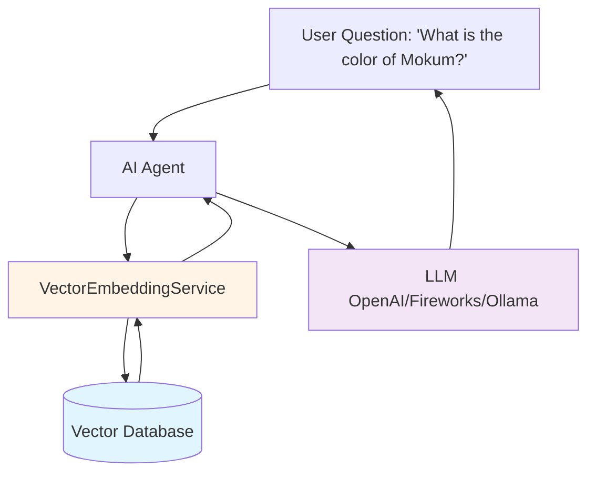

# RAG (Retrieval Augmented Generation) Implementation

## ✅ Status: **FULLY OPERATIONAL**

As of **November 7, 2025**, RAG is completely working in OpenRegister. All major issues have been resolved.

---

## Overview

**RAG (Retrieval Augmented Generation)** enables AI agents to answer questions using **your data** instead of only relying on their training data. When a user asks a question, OpenRegister:

1. **Vectorizes** the question using an embedding model
2. **Searches** for semantically similar content in vectors (objects & files)
3. **Retrieves** the most relevant context
4. **Augments** the AI's prompt with this context
5. **Generates** an accurate, cited answer

---

## Architecture



---

## How It Works Step-by-Step

### 1. Vectorization (Data Ingestion)

**Objects** and **files** are converted to vectors when:
- They are created or updated (if enabled)
- Bulk vectorization is triggered manually
- Background job processes pending vectorization

#### Object Vectorization

```php
// ObjectVectorizationStrategy extracts text
$object = [
    'test' => 'mokum',
    'Beschrijving' => 'Mokum is de kleur blauw',
    '@self' => [
        'id' => 'e88a328a-c7f1-416a-b4ba-e6d083bc080e',
        'register' => 104,
        'schema' => 306,
    ]
];

// Serialized as text for embedding
$text = "test: mokum\nBeschrijving: Mokum is de kleur blauw";

// Generate embedding (1536-dimensional vector for OpenAI)
$embedding = $vectorService->generateEmbedding($text);

// Store in oc_openregister_vectors
$vectorService->storeVector(
    entityType: 'object',
    entityId: '123',
    embedding: $embedding,
    model: 'text-embedding-3-small',
    dimensions: 1536,
    chunkText: $text,
    metadata: [
        'object_title' => 'mokum',  // Extracted from custom fields
        'uuid' => 'e88a328a...',
        'register' => 104,
        'schema' => 306,
    ]
);
```

#### File Vectorization

Files are chunked and each chunk is vectorized separately:

```php
// Chunk file (e.g., PDF)
$chunks = $fileService->extractChunks($file);

// Store each chunk as separate vector
foreach ($chunks as $index => $chunk) {
    $vectorService->storeVector(
        entityType: 'file',
        entityId: '12',
        embedding: $vectorService->generateEmbedding($chunk['text']),
        chunkIndex: $index,
        totalChunks: count($chunks),
        chunkText: $chunk['text'],
        metadata: [
            'file_name' => 'Nextcloud_Manual.pdf',
            'file_id' => 12,
            'file_path' => '/admin/files/Nextcloud_Manual.pdf',
            'mime_type' => 'application/pdf',
        ]
    );
}
```

---

### 2. Query Vectorization

When a user sends a message to an agent:

```php
// User question
$query = "Wat is de kleur van mokum?";

// Vectorize query
$queryEmbedding = $vectorService->generateEmbedding($query);
```

---

### 3. Semantic Search

The query embedding is compared against all stored vectors using **cosine similarity**:

```sql
-- Simplified representation of what happens
SELECT 
    entity_type,
    entity_id,
    chunk_text,
    metadata,
    -- Cosine similarity calculation
    (vector1_dim1 * query_dim1 + vector1_dim2 * query_dim2 + ... vector1_dim1536 * query_dim1536) / 
    (SQRT(vector1_dim1^2 + ... + vector1_dim1536^2) * SQRT(query_dim1^2 + ... + query_dim1536^2)) AS similarity
FROM oc_openregister_vectors
WHERE entity_type IN ('object', 'file')  -- Filtered by agent config
ORDER BY similarity DESC
LIMIT 5;
```

**Result:**

```json
[
    {
        "entity_type": "object",
        "entity_id": "123",
        "similarity": 0.92,
        "text": "test: mokum\nBeschrijving: Mokum is de kleur blauw",
        "metadata": {
            "object_title": "mokum",
            "uuid": "e88a328a-c7f1-416a-b4ba-e6d083bc080e",
            "register": 104,
            "schema": 306
        }
    }
]
```

---

### 4. Context Assembly

The top results are formatted as context for the LLM:

```php
$context = "Source: mokum (Object #123)\nmokum: Mokum is de kleur blauw\n\n";
$context .= "Source: amsterdam (Object #124)\namsterdam: Amsterdam is de kleur rood\n\n";
```

---

### 5. Prompt Augmentation

The context is injected into the system prompt:

```php
$systemPrompt = "You are a helpful AI assistant.\n\n";
$systemPrompt .= "Use the following context to answer the user's question:\n\n";
$systemPrompt .= "CONTEXT:\n" . $context . "\n\n";
$systemPrompt .= "If the context doesn't contain relevant information, say so honestly. ";
$systemPrompt .= "Always cite which sources you used when answering.";
```

---

### 6. LLM Generation

The augmented prompt is sent to the LLM:

```json
{
    "messages": [
        {
            "role": "system",
            "content": "You are a helpful AI assistant...\n\nCONTEXT:\nSource: mokum...\n\n"
        },
        {
            "role": "user",
            "content": "Wat is de kleur van mokum?"
        }
    ]
}
```

The LLM generates a response citing the sources:

> "According to the data, **Mokum is de kleur blauw** (blue). Source: mokum (Object #123)"

---

## Search Modes

OpenRegister supports three search modes:

### 1. **Semantic Search** (Default)

Pure vector similarity search. Best for:
- Conceptual queries ('What does this organization do?')
- Multilingual queries
- Finding similar meaning regardless of exact wording

### 2. **Hybrid Search** (Recommended)

Combines **SOLR keyword search** with **vector semantic search** using **Reciprocal Rank Fusion (RRF)**:

```php
// Get top 10 from SOLR
$solrResults = $solrService->search($query, limit: 10);

// Get top 10 from vectors
$vectorResults = $vectorService->semanticSearch($query, limit: 10);

// Merge using RRF
$combinedResults = $this->reciprocalRankFusion(
    $solrResults,
    $vectorResults,
    k: 60  // RRF constant
);
```

**RRF Formula:**

```
RRF(doc) = Σ(1 / (k + rank_in_list))
```

For each document, sum its inverse rank across all search methods. Higher score = more relevant.

**Best for:**
- Exact keyword matches + semantic understanding
- Named entity queries ('Find organization X')
- Most production use cases

### 3. **Keyword Search**

Pure SOLR search. Best for:
- Exact term matching
- Legacy compatibility
- When vectors are not available

---

## Database Schema

### `oc_openregister_vectors` Table

| Column | Type | Description |
|--------|------|-------------|
| `id` | INT | Primary key |
| `entity_type` | VARCHAR | 'object' or 'file' |
| `entity_id` | VARCHAR | Object ID or file ID |
| `embedding_model` | VARCHAR | Model used (e.g., 'text-embedding-3-small') |
| `dimensions` | INT | Vector dimensions (e.g., 1536) |
| `embedding_vector` | BLOB | Serialized PHP array of floats |
| `chunk_index` | INT | Chunk number (for files) |
| `total_chunks` | INT | Total chunks (for files) |
| `chunk_text` | TEXT | Preview of the text (first 500 chars) |
| `metadata` | TEXT | JSON metadata (title, uuid, register, etc.) |
| `created_at` | DATETIME | When vectorized |
| `updated_at` | DATETIME | Last update |

---

## Source Metadata

### Object Sources

```json
{
    "type": "object",
    "id": "123",
    "name": "mokum",
    "uuid": "e88a328a-c7f1-416a-b4ba-e6d083bc080e",
    "register": 104,
    "schema": 306,
    "uri": "/api/registers/104/schemas/306/objects/123"
}
```

### File Sources

```json
{
    "type": "file",
    "id": "12",
    "name": "Nextcloud_Manual.pdf",
    "file_id": 12,
    "file_path": "/admin/files/Nextcloud_Manual.pdf",
    "mime_type": "application/pdf"
}
```

---

## Frontend Display

Sources are displayed in the chat UI below each AI response:

```vue
<div v-for="source in message.sources" :key="source.id">
    <NcChip>
        <template #icon>
            <FileDocumentOutline v-if="source.type === 'file'" :size="20" />
            <DatabaseOutline v-else :size="20" />
        </template>
        {{ source.name }}
        <span v-if="source.type === 'object'">(Object)</span>
        <span v-else>(File)</span>
    </NcChip>
</div>
```

---

## Configuration

### LLM Settings

Configure embedding and chat providers:

1. Navigate to **Settings → AI → LLM Configuration**
2. Select **Embedding Provider** (e.g., OpenAI, Fireworks)
3. Select **Chat Provider** (e.g., OpenAI, Ollama)
4. Configure API keys and models
5. Test connection

### Agent Settings

Configure what data an agent can access:

1. Navigate to **Settings → AI → Agents**
2. Edit or create an agent
3. **Views**: Select which views the agent can search
4. **Include Objects**: Enable object vector search
5. **Include Files**: Enable file vector search
6. **Search Mode**: Choose semantic, hybrid, or keyword

### Object Vectorization

1. Navigate to **Settings → AI → LLM Configuration**
2. Scroll to **Object Vectorization**
3. Select views to vectorize
4. Click **Vectorize All Objects**
5. Monitor progress in stats

### File Vectorization

1. Navigate to **Settings → AI → LLM Configuration**
2. Scroll to **File Vectorization**
3. Select file types and max size
4. Click **Vectorize All Files**
5. Monitor extraction and vectorization stats

---

## Performance

### Vectorization Speed

- **Objects**: ~50-100 objects/second (depends on size and API rate limits)
- **Files**: ~1-5 files/second (depends on size and extraction complexity)

### Search Speed

- **Semantic search**: ~50-200ms for 10,000 vectors
- **Hybrid search**: ~100-300ms (SOLR + vectors + RRF merge)
- **Context assembly**: ~10-50ms

### Caching

- **Vector caching**: Embeddings are stored permanently until re-vectorization
- **Query caching**: Not yet implemented (roadmap)

---

## Troubleshooting

### 'Unknown Source' in Chat

**Cause**: Vector metadata does not contain title information.

**Solution**: Re-vectorize objects with the latest code (metadata extraction is improved).

### RAG Not Finding Objects

**Check:**
1. Are objects vectorized? (Check stats in LLM Configuration)
2. Is the agent configured to **Include Objects**?
3. Are the correct **views** selected for the agent?
4. Is semantic search mode enabled?

### Vector Count Mismatch

**Symptoms**: Stats show 25 objects vectorized, but only 4 objects exist.

**Cause**: View filters may not be applied correctly, or old vectors exist.

**Solution**: Clear old vectors and re-vectorize with specific views.

---

## Roadmap

### Completed ✅

- ✅ Basic semantic search
- ✅ Object vectorization
- ✅ File vectorization (PDF, TXT, DOCX, etc.)
- ✅ Hybrid search (SOLR + vectors)
- ✅ Source metadata (UUID, register, schema, file info)
- ✅ View-based filtering
- ✅ Cosine similarity scoring

### Planned ⏳

- ⏳ Query caching
- ⏳ Incremental vectorization (only changed objects)
- ⏳ Vector index (faster search with FAISS/Annoy)
- ⏳ Multi-modal embeddings (images, audio)
- ⏳ Reranking (improve relevance with cross-encoder)
- ⏳ Chunking strategies for large objects

---

## See Also

- [Function Calling](./function-calling.md) - How agents perform actions
- [Agent Configuration](./agents.md) - Configure agents
- [AI Configuration](../Features/ai.md) - Provider setup and AI features

