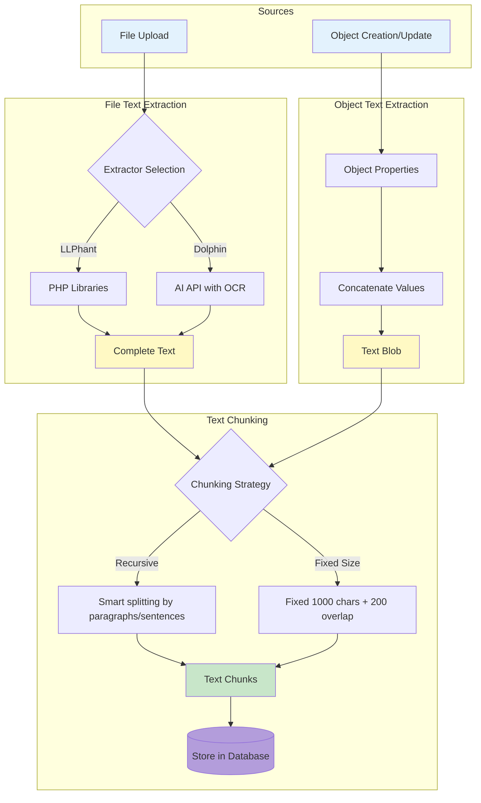
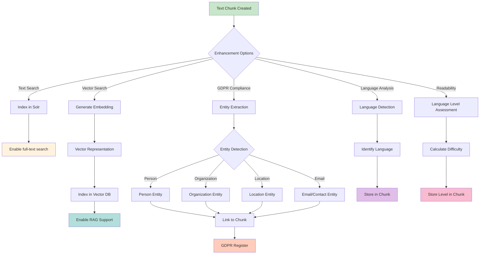
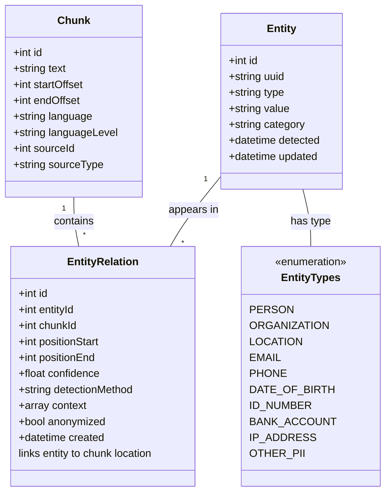
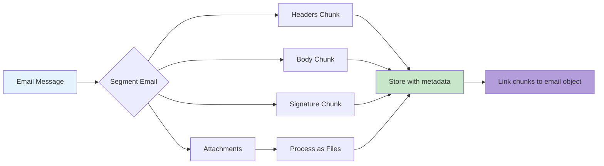
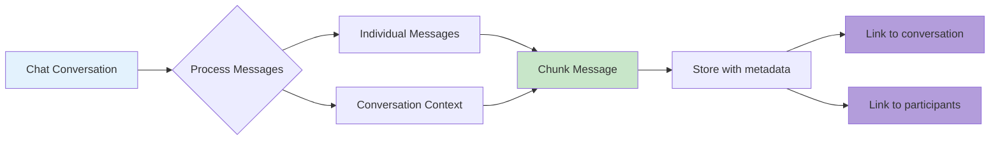
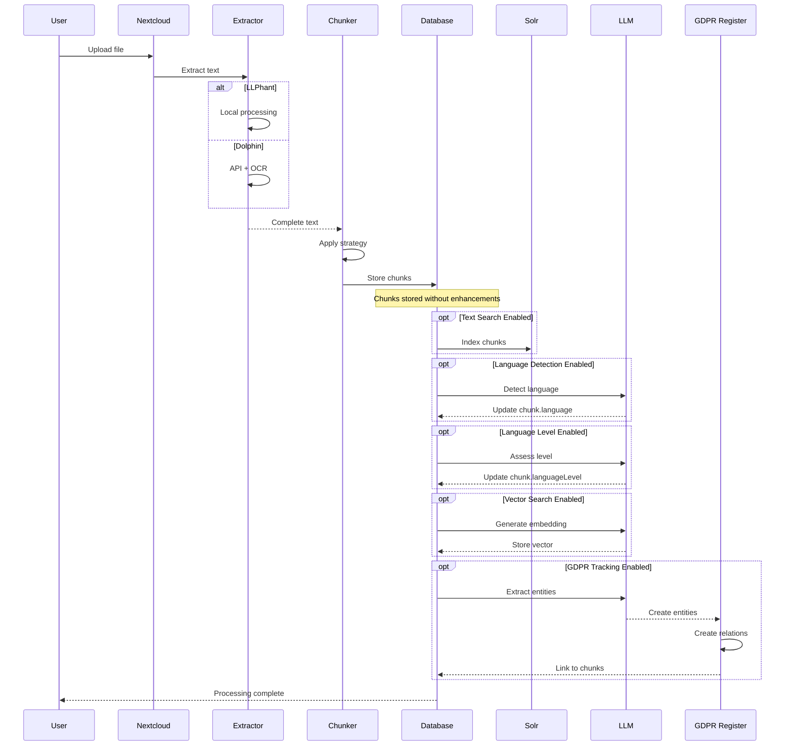

# Enhanced Text Extraction & GDPR Entity Tracking

## Overview

OpenRegister provides a comprehensive text extraction, chunking, and analysis pipeline that processes both **files** and **objects** into searchable, analyzable chunks. The system supports multiple processing paths and optional enhancement steps including entity extraction for GDPR compliance, language detection, and language level assessment.

## Core Concepts

### Sources: Files vs Objects

The text extraction system processes two distinct types of sources:

#### 1. File Processing
Files (PDF, DOCX, images, etc.) are converted into text through extraction services:
- **LLPhant**: Local PHP-based extraction for standard documents
- **Dolphin**: AI-powered extraction with OCR support for complex documents and images

#### 2. Object Processing
OpenRegister objects (structured data) are converted into text blobs:
- Property values are concatenated into a searchable text representation
- Maintains references to source object and properties
- Enables full-text search across structured data

### The Chunking Process

Both files and objects follow a path to **chunks** - smaller, manageable pieces of text optimized for processing:



### Chunk Storage

Chunks are stored with comprehensive metadata:
- Original text content
- Start/end offsets
- Source reference (file ID or object ID)
- **Language** (e.g., 'en', 'nl', 'de')
- **Language Level** (e.g., 'A1', 'B2', 'C1' or reading difficulty score)

## Enhancement Pipeline

Once chunks are created, they can undergo multiple optional enhancement processes:



## Processing Methods

Each enhancement can be performed by different methods based on requirements:

### 1. Local Algorithms
- **Advantages**: Privacy-friendly, no external dependencies, fast
- **Use Cases**: Language detection, basic entity patterns
- **Examples**: 
  - Regular expressions for email/phone detection
  - Statistical language detection libraries
  - Readability formulas (Flesch-Kincaid, etc.)

### 2. External Services
- **Advantages**: Specialized accuracy, maintained by experts
- **Use Cases**: Complex entity recognition, advanced NLP
- **Examples**:
  - **Presidio**: Microsoft's PII detection service
  - **NLDocs**: Dutch document analysis
  - **Dolphin**: Advanced text analysis

### 3. LLM/AI Processing
- **Advantages**: Context-aware, handles ambiguity, multi-task
- **Use Cases**: Complex entities, context-dependent detection
- **Examples**:
  - GPT-4 for nuanced entity extraction
  - Custom prompts for domain-specific entities
  - Combined analysis (language + entities + sentiment)

### 4. Hybrid Approach (Recommended for Critical Applications)
- **Strategy**: Multiple methods with confidence scoring
- **Example Flow**:
  1. Local regex detects potential email: confidence 0.6
  2. Presidio confirms: confidence 0.85
  3. LLM validates in context: confidence 0.95
  4. Final decision: Entity confirmed with 0.95 confidence

## GDPR Entity Register

The system maintains a comprehensive register of all personal data found in your content.

### Entity Types



### Entity Entity

Represents a unique piece of personally identifiable information:

- **id**: Primary key
- **uuid**: Unique identifier for API access
- **type**: Type of entity (person, organization, email, etc.)
- **value**: The actual entity value (e.g., 'john.doe@example.com')
- **category**: Classification (PII, sensitive PII, business data)
- **detectedAt**: First detection timestamp
- **updatedAt**: Last occurrence timestamp
- **metadata**: Additional context (normalized forms, aliases)

:::tip Entity Knowledge Graph
Entities can be linked to each other! Contact information (phone, email, address) can belong to persons or organizations. This creates a knowledge graph that helps with:
- Complete GDPR profiles (all contact info per person)
- Better anonymization planning
- Contact information consolidation
- Entity deduplication

**Note**: We track contact info ownership, NOT employment or family relationships.
:::

### Entity Relation Entity

Links entities to specific chunk locations:

- **id**: Primary key
- **entityId**: Reference to Entity
- **chunkId**: Reference to Chunk
- **positionStart**: Character position where entity starts in chunk
- **positionEnd**: Character position where entity ends in chunk
- **confidence**: Detection confidence (0.0 - 1.0)
- **detectionMethod**: How it was found ('regex', 'presidio', 'llm', 'hybrid')
- **context**: Surrounding text for verification
- **anonymized**: Whether this occurrence has been anonymized
- **anonymizedValue**: Replacement value if anonymized
- **createdAt**: Detection timestamp

### Entity Link Entity (Entity-to-Entity Relationships)

Links entities to each other to create a knowledge graph:

- **id**: Primary key
- **sourceEntityId**: Source entity in the relationship
- **targetEntityId**: Target entity in the relationship
- **relationshipType**: Type of relationship
  - 'belongs_to' - Contact info (phone/email/address) belongs to person or organization
  - 'associated_with' - Generic association for uncertain relationships
  - 'primary_contact' - Marks primary contact method
  - 'alternate_contact' - Marks alternate contact method
- **confidence**: Relationship confidence (0.0 - 1.0)
- **detectionMethod**: How detected ('proximity', 'pattern', 'llm', 'manual', 'inference')
- **metadata**: Additional context about the relationship
- **createdAt**: When relationship was detected

**Example Relationships**:
```
Contact Info → belongs_to → Person or Organization:
- Phone(+31612345678) → belongs_to → Person(John Doe)
- Email(john@company.com) → belongs_to → Person(John Doe)
- Email(info@acme.com) → belongs_to → Organization(Acme Corp)
- Address(123 Main St) → belongs_to → Person(John Doe)
- Address(456 Business Park) → belongs_to → Organization(Acme Corp)
```

### Preparing for Anonymization

The system is designed to support future anonymization features:

#### 1. Precise Location Tracking
Every entity relation records exact character positions, enabling surgical replacement:

```
Original chunk: 'Contact John Doe at john.doe@example.com for details.'
Entity: type=PERSON, value='John Doe'
Relation: positionStart=8, positionEnd=16
Anonymization: Replace positions 8-16 with '[PERSON_1]'
Result: 'Contact [PERSON_1] at john.doe@example.com for details.'
```

#### 2. Consistency Across Documents
The Entity table ensures the same person/email is anonymized consistently:

```
Entity UUID: '550e8400-...'
Value: 'john.doe@example.com'
Anonymized to: '[EMAIL_42]' (same across all occurrences)
```

#### 3. Reversible Anonymization
The system can maintain a secure mapping for authorized users:

```
Anonymized View: 'Contact [PERSON_1] at [EMAIL_42]'
Admin View: 'Contact John Doe at john.doe@example.com'
```

#### 4. Metadata Preservation
Context and confidence scores help validate anonymization:

```json
{
  'entity': 'john.doe@example.com',
  'anonymized': '[EMAIL_42]',
  'confidence': 0.95,
  'method': 'hybrid',
  'context': '...Contact John Doe at john.doe@example.com for...',
  'verified': true
}
```

## Language Detection & Assessment

### Language Detection

Identifies the primary language of each chunk:

**Methods**:
1. **Local Algorithm**: Fast statistical detection (e.g., lingua, language-detect)
2. **External Service**: Cloud-based detection (e.g., Google Cloud Translation API)
3. **LLM**: Context-aware language identification

**Storage**: ISO 639-1 codes ('en', 'nl', 'de', 'fr', etc.)

**Use Cases**:
- Route to appropriate language models
- Filter search results by language
- Trigger language-specific processing
- Compliance with language requirements

### Language Level Assessment

Determines reading difficulty or proficiency level:

**Methods**:
1. **Readability Formulas**: Flesch-Kincaid, SMOG, Coleman-Liau
2. **External Services**: Specialized readability APIs
3. **LLM Analysis**: Context-aware difficulty assessment

**Scales**:
- **CEFR**: A1, A2, B1, B2, C1, C2 (language proficiency)
- **Reading Level**: Grade 1-12, College, Graduate
- **Numeric Score**: Custom difficulty score (0-100)

**Storage**: String field in chunk entity (e.g., 'B2', 'Grade 8', '65')

**Use Cases**:
- Content accessibility evaluation
- Educational material classification
- Simplified language recommendations
- Regulatory compliance (plain language laws)

## Extended Chunking Support

### Email Chunking

Emails are chunked with special handling:



**Metadata Stored**:
- Email sender/recipients (as entities for GDPR)
- Subject line
- Timestamp
- Email thread ID
- Attachment references

### Chat Message Chunking

Chat messages (Talk app) are chunked with conversation context:



**Metadata Stored**:
- Conversation ID
- Message sender (as entity for GDPR)
- Timestamp
- Reply-to references
- Participant list

**Context Preservation**:
- Include previous 2-3 messages in chunk context for coherent search
- Maintain conversation threading
- Link related chunks

## Processing Flow Example

### Complete File Processing Flow



## Configuration Options

### Text Extraction Settings

Located in **Settings → OpenRegister → File Configuration**:

- **Extraction Scope**: None, All Files, Specific Folders, Object Files
- **Extraction Engine**: LLPhant or Dolphin
- **Chunking Strategy**: Recursive (smart) or Fixed Size
- **Chunk Size**: Default 1000 characters
- **Chunk Overlap**: Default 200 characters

### Enhancement Settings

Located in **Settings → OpenRegister → Text Analysis**:

#### Language Detection
- **Enable Language Detection**: Yes/No
- **Detection Method**: Local Algorithm / External Service / LLM / Hybrid
- **Confidence Threshold**: Minimum confidence to store result (0.0-1.0)

#### Language Level Assessment
- **Enable Level Assessment**: Yes/No
- **Assessment Method**: Formula / Service / LLM
- **Scale**: CEFR / Reading Level / Numeric Score

#### Entity Extraction (GDPR)
- **Enable Entity Extraction**: Yes/No
- **Extraction Method**: Local Patterns / Presidio / LLM / Hybrid
- **Entity Types**: Select which types to detect
- **Confidence Threshold**: Minimum confidence (0.0-1.0)
- **Context Window**: Characters to store around entity

#### Vector/RAG Support
- **Enable Vectorization**: Yes/No
- **Embedding Model**: Select model
- **Vector Backend**: Solr / Dedicated Vector DB

## API Endpoints

### Chunk Management

```
GET /api/chunks
  - List all chunks with filters
  - Filters: sourceType, sourceId, language, languageLevel

GET /api/chunks/{id}
  - Get single chunk with all metadata

POST /api/chunks/{id}/analyze
  - Trigger analysis (language, level, entities)
  - Body: { 'features': ['language', 'level', 'entities'] }
```

### Entity Register (GDPR)

```
GET /api/entities
  - List all detected entities
  - Filters: type, category, dateRange

GET /api/entities/{id}
  - Get entity details with all occurrences

GET /api/entities/{id}/occurrences
  - List all chunks containing this entity

GET /api/entities/{id}/links
  - Get all entities linked to this entity
  - Shows relationships (phone belongs to person, etc.)

POST /api/entities/{id}/anonymize
  - Mark entity for anonymization
  - Body: { 'replacement': '[PERSON_1]' }

GET /api/gdpr/report
  - Generate GDPR compliance report
  - Shows all PII found in system

GET /api/gdpr/profile/{entityId}
  - Complete GDPR profile for a person
  - Includes all contact info, employment, relationships
```

### Entity Links (Knowledge Graph)

```
GET /api/entity-links?sourceId={id}
  - Get all links from an entity

GET /api/entity-links?targetId={id}
  - Get all links to an entity

POST /api/entity-links
  - Create entity relationship
  - Body: { 'sourceEntityId': 1, 'targetEntityId': 2, 'relationshipType': 'belongs_to' }

GET /api/entities/{id}/graph
  - Get knowledge graph around an entity
  - Shows all related entities and relationships
```

### Language Analysis

```
GET /api/chunks/languages
  - Get language distribution statistics

GET /api/chunks/levels
  - Get language level distribution

POST /api/chunks/batch-analyze
  - Analyze multiple chunks
  - Body: { 'chunkIds': [1,2,3], 'features': ['language'] }
```

## Use Cases

### 1. GDPR Compliance Audit

**Scenario**: Organization needs to identify all personal data.

**Process**:
1. Enable entity extraction with hybrid method
2. Process all existing files and objects
3. System detects entities and their relationships:
   - Persons
   - Email addresses (linked to persons)
   - Phone numbers (linked to persons)
   - Organizations (linked to persons via employment)
4. Generate GDPR report showing:
   - All persons with complete profiles
   - All contact information per person
   - Organizations they work for
   - All document locations
5. Review and verify entities and relationships
6. Prepare comprehensive data subject access requests

**Example Output**:
```
Data Subject: John Doe

Contact Information:
- Phone: +31612345678 (primary)
- Phone: +31687654321 (alternate)
- Email: john.doe@example.com (primary)
- Email: j.doe@company.com (alternate)
- Address: 123 Main St, Amsterdam

Found in:
- 15 documents
- 45 chunks
- 3 email threads
```

### 2. Multi-Language Content Management

**Scenario**: Organization has content in multiple languages.

**Process**:
1. Enable language detection
2. Process all content
3. Filter searches by language
4. Route to appropriate language models for AI
5. Generate language distribution reports

### 3. Accessibility Compliance

**Scenario**: Government agency must ensure plain language.

**Process**:
1. Enable language level assessment
2. Set target level (e.g., B1 / Grade 8)
3. Process all public-facing documents
4. Identify documents exceeding target complexity
5. Flag for simplification

### 4. Intelligent Search with Context

**Scenario**: Users need semantic search across emails and documents.

**Process**:
1. Enable chunking for files, objects, and emails
2. Generate embeddings for vector search
3. Enable language detection for result filtering
4. User searches: 'budget discussion with John'
5. System finds:
   - Email chunks mentioning budget + John
   - Document chunks about budget meetings
   - Chat messages discussing budget
6. Results ranked by relevance and language preference

## Performance Considerations

### Processing Times

**Chunking**: ~50-100ms per 100KB of text
**Language Detection**: ~10-50ms per chunk (local) or ~100-200ms (API)
**Language Level**: ~20-100ms per chunk (formula) or ~200-500ms (LLM)
**Entity Extraction**: ~100-300ms per chunk (patterns) or ~500-2000ms (LLM)

### Recommendations

1. **Batch Processing**: Process enhancements in background jobs
2. **Selective Enhancement**: Only enable features you need
3. **Confidence Thresholds**: Higher thresholds = fewer false positives but may miss entities
4. **Hybrid Approach**: Use fast local methods first, then validate with LLM only when uncertain

## Database Schema

### Updated Chunks Table

```sql
ALTER TABLE oc_openregister_file_texts ADD COLUMN language VARCHAR(10) DEFAULT NULL;
ALTER TABLE oc_openregister_file_texts ADD COLUMN language_level VARCHAR(20) DEFAULT NULL;

-- Note: Chunks currently stored in chunks_json field
-- Future migration will separate into dedicated chunk table
```

### New Entity Table

```sql
CREATE TABLE oc_openregister_entities (
    id BIGINT AUTO_INCREMENT PRIMARY KEY,
    uuid VARCHAR(255) NOT NULL UNIQUE,
    type VARCHAR(50) NOT NULL,
    value TEXT NOT NULL,
    category VARCHAR(50) NOT NULL,
    metadata JSON,
    detected_at DATETIME NOT NULL,
    updated_at DATETIME NOT NULL,
    INDEX idx_type (type),
    INDEX idx_category (category),
    INDEX idx_detected (detected_at)
);
```

### New Entity Relation Table

```sql
CREATE TABLE oc_openregister_entity_relations (
    id BIGINT AUTO_INCREMENT PRIMARY KEY,
    entity_id BIGINT NOT NULL,
    chunk_id BIGINT NOT NULL,
    position_start INT NOT NULL,
    position_end INT NOT NULL,
    confidence DECIMAL(3,2) NOT NULL,
    detection_method VARCHAR(50) NOT NULL,
    context TEXT,
    anonymized BOOLEAN DEFAULT FALSE,
    anonymized_value VARCHAR(255),
    created_at DATETIME NOT NULL,
    FOREIGN KEY (entity_id) REFERENCES oc_openregister_entities(id) ON DELETE CASCADE,
    FOREIGN KEY (chunk_id) REFERENCES oc_openregister_chunks(id) ON DELETE CASCADE,
    INDEX idx_entity (entity_id),
    INDEX idx_chunk (chunk_id),
    INDEX idx_confidence (confidence),
    INDEX idx_anonymized (anonymized)
);
```

## Security & Privacy

### Data Protection

1. **Entity Storage**: Entities are stored encrypted at rest
2. **Access Control**: GDPR register access requires admin privileges
3. **Audit Trail**: All entity access is logged
4. **Retention**: Configurable retention periods for entity data

### External Service Considerations

When using external services (Presidio, Dolphin, etc.):

1. **Data Transmission**: Consider data sensitivity before sending to external APIs
2. **Compliance**: Ensure services comply with GDPR, HIPAA, or relevant regulations
3. **Contracts**: Establish data processing agreements
4. **Fallback**: Always have local method fallback if service unavailable

## Future Enhancements

1. **Anonymization Engine**: Automatic replacement of entities in source documents
2. **Pseudonymization**: Consistent fake data generation for testing
3. **Consent Tracking**: Link entities to user consent records
4. **Right to Erasure**: Automated entity removal across all chunks
5. **Cross-Reference Detection**: Link related entities (e.g., person + their email)
6. **Sentiment Analysis**: Per-chunk sentiment scoring
7. **Topic Modeling**: Automatic categorization of chunks by topic
8. **Summarization**: LLM-generated summaries of long documents

## Conclusion

The enhanced text extraction system provides a comprehensive foundation for:
- **Searchability**: Full-text and semantic search
- **Compliance**: GDPR entity tracking and future anonymization
- **Accessibility**: Language and readability analysis
- **Intelligence**: AI-ready chunked content for RAG and analysis

By processing both files and objects into a unified chunk structure, OpenRegister enables powerful cross-content search, analysis, and compliance features while maintaining flexibility in processing methods and preparing for future capabilities.

---

**📚 See Also**:
- **[Text Extraction, Vectorization & Named Entity Recognition](../Features/text-extraction-vectorization-ner.md)** - Unified documentation covering text extraction, vectorization, and NER in one place
- [Text Extraction Sources](./text-extraction-sources.md) - Detailed source-specific documentation

