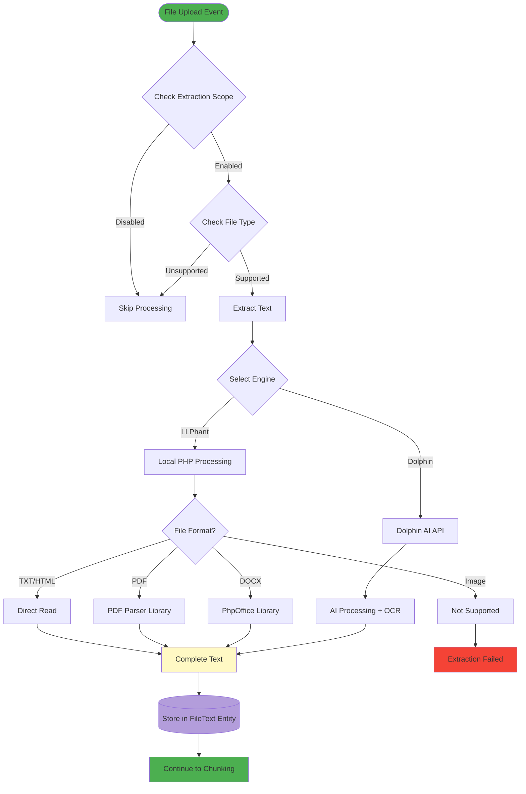

# Text Extraction Sources: Files vs Objects

OpenRegister processes content from two distinct sources that both lead to chunks for searching and analysis.

## Processing Paths Overview


## 📄 Source 1: Files

### Description

Files (documents, images, spreadsheets, etc.) are processed through text extraction engines to convert binary content into searchable text.

### Supported File Types

| Category | Formats | Extraction Method |
|----------|---------|-------------------|
| **Documents** | PDF, DOCX, DOC, ODT, RTF | LLPhant or Dolphin |
| **Spreadsheets** | XLSX, XLS, CSV | LLPhant or Dolphin |
| **Presentations** | PPTX | LLPhant or Dolphin |
| **Text Files** | TXT, MD, HTML, JSON, XML | LLPhant (native) |
| **Images** | JPG, PNG, GIF, WebP, TIFF | Dolphin (OCR only) |

### File Processing Flow



### File Metadata Preserved

When files are processed, the following metadata is maintained:

- **Source Reference**: Original file ID from Nextcloud
- **File Path**: Location in Nextcloud filesystem
- **MIME Type**: File format information
- **File Size**: Original file size in bytes
- **Checksum**: For change detection
- **Extraction Method**: Which engine was used (LLPhant or Dolphin)
- **Extraction Timestamp**: When text was extracted

### Example: PDF Processing

```
Input: contract-2024.pdf (245 KB, 15 pages)

Step 1: Text Extraction
  - Engine: Dolphin AI
  - Time: 8.2 seconds
  - Output: 12,450 characters of text

Step 2: Chunking
  - Strategy: Recursive (respects paragraphs)
  - Chunks created: 14
  - Average chunk size: 889 characters
  - Overlap: 200 characters

Step 3: Storage
  - FileText entity created
  - Chunks stored in chunks_json field
  - Status: completed
```

## 📦 Source 2: Objects

### Description

OpenRegister objects (structured data entities) are converted into text blobs by concatenating their property values. This enables full-text search across structured data.

### Object-to-Text Conversion

Objects are transformed using the following rules:

1. **Simple Properties**: Direct value extraction
   ```json
   { 'name': 'John Doe', 'age': 35 }
   → 'name: John Doe age: 35'
   ```

2. **Arrays**: Join with separators
   ```json
   { 'tags': ['urgent', 'customer', 'support'] }
   → 'tags: urgent, customer, support'
   ```

3. **Nested Objects**: Flatten with dot notation
   ```json
   { 'address': { 'city': 'Amsterdam', 'country': 'NL' } }
   → 'address.city: Amsterdam address.country: NL'
   ```

4. **Special Handling**: Exclude system fields
   - Ignore: `id`, `uuid`, `created`, `updated`
   - Include: User-defined properties only

### Object Processing Flow


### Object Metadata Preserved

When objects are processed, the following metadata is maintained:

- **Object ID**: Reference to original object
- **Schema**: Schema definition for context
- **Register**: Register containing the object
- **Property Map**: Which chunk contains which properties
- **Extraction Timestamp**: When text blob was created

### Example: Contact Object Processing

```json
Input Object (Contact Schema):
{
  'id': 12345,
  'uuid': '550e8400-e29b-41d4-a716-446655440000',
  'firstName': 'Jane',
  'lastName': 'Smith',
  'email': 'jane.smith@example.com',
  'phone': '+31612345678',
  'company': {
    'name': 'Acme Corp',
    'industry': 'Technology'
  },
  'tags': ['vip', 'partner'],
  'notes': 'Important client, prefers email communication'
}

Step 1: Text Blob Creation
  → 'firstName: Jane lastName: Smith email: jane.smith@example.com 
     phone: +31612345678 company.name: Acme Corp 
     company.industry: Technology tags: vip, partner 
     notes: Important client, prefers email communication'

Step 2: Chunking
  - Strategy: Fixed size (short enough for single chunk)
  - Chunks created: 1
  - Chunk size: 215 characters

Step 3: Storage
  - ObjectText entity created
  - Chunk stored with property mapping
  - Status: completed
```

## Common Chunking Process

Both files and objects converge at the chunking stage, where text is divided into manageable pieces.

### Chunking Strategies

#### 1. Recursive Character Splitting (Recommended)

Smart splitting that respects natural text boundaries:

```
Priority Order:
1. Paragraph breaks (\n\n)
2. Sentence endings (. ! ?)
3. Line breaks (\n)
4. Word boundaries (spaces)
5. Character split (fallback)
```

**Best for**: Natural language documents, articles, reports

#### 2. Fixed Size Splitting

Mechanical splitting with overlap:

```
Settings:
- Chunk size: 1000 characters
- Overlap: 200 characters
- Minimum chunk: 100 characters
```

**Best for**: Structured data, code, logs

### Chunk Structure

Each chunk contains:

```json
{
  'text': 'The actual chunk content...',
  'start_offset': 0,
  'end_offset': 1000,
  'source_type': 'file',
  'source_id': 12345,
  'language': 'en',
  'language_level': 'B2'
}
```

## Enhancement Pipeline

After chunking, content can undergo optional enhancements:

### 1. Text Search Indexing (Solr)


**Purpose**: Fast keyword and phrase search across all content

**Performance**: ~50-200ms per query

**Use Cases**: Search box, filters, reporting

### 2. Vector Embeddings (RAG)


**Purpose**: Semantic search and AI context retrieval

**Performance**: ~200-500ms per chunk (one-time), ~100-300ms per query

**Use Cases**: AI chat, related content, recommendations

### 3. Entity Extraction (GDPR)


**Purpose**: GDPR compliance, PII tracking, data subject access requests

**Performance**: ~100-2000ms per chunk (depending on method)

**Use Cases**: Compliance audits, right to erasure, data mapping

### 4. Language Detection


**Purpose**: Multi-language support, content filtering, translation routing

**Performance**: ~10-50ms per chunk (local) or ~100-200ms (API)

**Use Cases**: Language filters, translation, localization

### 5. Language Level Assessment


**Purpose**: Accessibility compliance, content simplification, readability scoring

**Performance**: ~20-100ms per chunk

**Use Cases**: Plain language compliance, educational leveling, accessibility

## Comparison: Files vs Objects

| Aspect | Files | Objects |
|--------|-------|---------|
| **Input Format** | Binary (PDF, DOCX, images) | Structured JSON data |
| **Extraction** | Text extraction engines required | Property value concatenation |
| **Processing Time** | Slow (2-60 seconds) | Fast (&lt;1 second) |
| **Complexity** | High (OCR, parsing) | Low (string operations) |
| **Chunk Count** | Many (10-1000+) | Few (1-10) |
| **Update Frequency** | Rare (files are static) | Common (objects change often) |
| **Best For** | Documents, reports, images | Structured records, metadata |
| **GDPR Risk** | High (unstructured PII) | Medium (known data structure) |
| **Search Precision** | Lower (natural language) | Higher (structured fields) |
| **Context** | Full document context | Property-level context |

## Combined Use Cases

### Use Case 1: Customer Management

```
Object: Customer record
  - Name, email, phone, notes
  → Chunked for search

File: Contract PDF attached to customer
  - Terms, signatures, dates
  → Extracted and chunked

Search: 'payment terms for Acme Corp'
  → Finds chunks from both object and file
  → Returns unified results
```

### Use Case 2: GDPR Data Subject Access Request

```
Request: 'Find all mentions of john.doe@example.com'

Step 1: Entity extraction finds email in:
  - 15 chunks from 8 PDF files
  - 3 chunks from 2 customer objects
  - 12 chunks from 42 email messages

Step 2: Generate report with:
  - All files containing email
  - All objects referencing person
  - All email conversations
  - Exact positions in each source

Step 3: Provide data or anonymize on request
```

### Use Case 3: Multi-Language Knowledge Base

```
Content Sources:
  - Files: User manuals (EN, NL, DE)
  - Objects: FAQ entries (EN, NL)
  - Emails: Support conversations (mixed)

Processing:
  1. All sources → Chunks
  2. Language detection → Tag each chunk
  3. Vector embeddings → Enable semantic search

User Search (in Dutch):
  → System filters to NL chunks
  → Semantic search across files + objects + emails
  → Returns relevant content in user's language
```

## Configuration

### Enabling File Processing

**Settings → OpenRegister → File Configuration**

```
Extract Text From: [All Files / Specific Folders / Object Files]
Text Extractor: [LLPhant / Dolphin]
Chunking Strategy: [Recursive / Fixed Size]
```

### Enabling Object Processing

**Settings → OpenRegister → Text Analysis**

```
Enable Object Text Extraction: [Yes / No]
Include Properties: [Select which properties to extract]
Chunking Strategy: [Recursive / Fixed Size]
```

### Enabling Enhancements

**Settings → OpenRegister → Text Analysis**

```
☑ Text Search Indexing (Solr)
☑ Vector Embeddings (RAG)
☑ Entity Extraction (GDPR)
☑ Language Detection
☑ Language Level Assessment
```

## Performance Recommendations

### For File-Heavy Workloads

- Use background processing
- Enable Dolphin for images/complex PDFs
- Use recursive chunking for better quality
- Enable selective enhancements (not all at once)

### For Object-Heavy Workloads

- Use immediate processing (objects are small)
- Enable fixed-size chunking (faster)
- Always enable language detection (fast on short text)
- Enable entity extraction for compliance

### For Mixed Workloads

- Background processing for files
- Immediate processing for objects
- Use recursive chunking for both
- Enable all enhancements selectively per schema

## API Examples

### Search Across Both Sources

```http
GET /api/search?q=contract%20terms&sources=files,objects
```

Response:
```json
{
  'results': [
    {
      'source_type': 'file',
      'source_id': 12345,
      'file_name': 'contract-2024.pdf',
      'chunk_index': 3,
      'text': '...payment terms are net 30...',
      'score': 0.95
    },
    {
      'source_type': 'object',
      'source_id': 67890,
      'schema': 'customers',
      'property': 'notes',
      'text': '...special contract terms agreed...',
      'score': 0.87
    }
  ]
}
```

### Get All Chunks for a File

```http
GET /api/files/12345/chunks
```

### Get All Chunks for an Object

```http
GET /api/objects/67890/chunks
```

## Conclusion

OpenRegister's dual-source text extraction system provides:

- **Comprehensive Coverage**: Search across files AND structured data
- **Unified Processing**: Same chunking and enhancement pipeline
- **Flexible Configuration**: Enable features per source type
- **GDPR Compliance**: Track entities from all sources
- **Intelligent Search**: Semantic and keyword search across everything

By processing both files and objects into a common chunk format, OpenRegister creates a truly unified content search and analysis platform.

---

**Next Steps**:
- [Enhanced Text Extraction Documentation](./text-extraction-enhanced.md)
- [GDPR Entity Tracking](./text-extraction-enhanced.md#gdpr-entity-register)
- [Language Detection](./text-extraction-enhanced.md#language-detection--assessment)
- [File Processing Details](../Features/files.md)
- [Object Management](../Features/objects.md)


