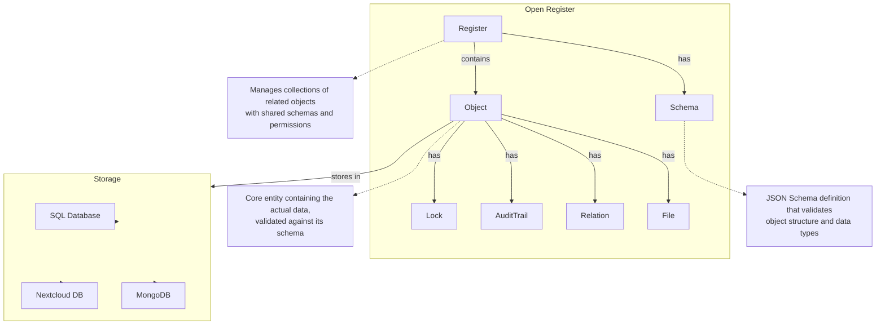

# Introduction

Open Register is a versatile system for creating and managing domain-specific or organizational data registers. Whether you need to build a social security database, manage client information, or create any other structured data repository, Open Register provides a storage-independent solution for managing and validating data objects.

## Core Concepts


Open Register operates on three fundamental principles:

1. **JSON Schema Validation**: All data objects are validated against predefined [JSON Schema](https://json-schema.org/) definitions. This ensures data integrity and consistency across your application.

2. **Storage Independence**: Objects can be stored in various backends without changing your application logic:
   - Nextcloud internal database
   - External SQL databases (MySQL, MariaDB, PostgreSQL)
   - Document stores (MongoDB)
   - *More backends can be added through the storage adapter interface*

3. **Flexible Schema Sources**: Register schemas can be:
   - Defined manually for custom requirements
   - Imported from Schema.org for standardized data structures
   - Imported from Dutch GGM (Gemeentelijk Gegevensmodel) for government data
   - Created from other sources and standards


## Key Features

| Feature | Description | Benefits | Sub-features |
|---------|-------------|-----------|--------------|
| 💾 [Storing Objects](Features/objects.md) | Core entity containing validated data with metadata, relationships, and file attachments | Data integrity, structured storage, rich metadata | • Schema validation<br/>• Object relationships<br/>• Object locking<br/>• Soft deletion<br/>• Version history<br/>• Audit trails |
| 📝 [Schema Management](Features/schemas.md) | Define and validate data structures using JSON Schema | Data validation, documentation, API contracts | • JSON Schema validation<br/>• Schema versioning<br/>• Schema import/export<br/>• Schema.org integration<br/>• GGM integration<br/>• Custom schema creation |
| ⏰ [Register Management](Features/registers.md) | Organize collections of related objects with shared schemas | Logical grouping, domain organization, data management | • Domain organization<br/>• Schema grouping<br/>• Access control<br/>• Process automation<br/>• Data segregation<br/>• Register versioning |
| 🔒 [Access Control](Features/access-control.md) | Enterprise-grade permissions with Nextcloud RBAC and Keycloak integration | Security, compliance, role management | • Role-based access<br/>• ADFS integration<br/>• Keycloak integration<br/>• FCS compliance<br/>• Verwerkingen registers<br/>• Multi-level permissions |
| 🗑️ [File Management](Features/files.md) | Secure file storage and management with Nextcloud integration | Document handling, versioning, previews | • File versioning<br/>• File previews<br/>• Metadata extraction<br/>• Content indexing<br/>• Secure storage<br/>• File relationships |
| 🔍 [Search & Facets](Features/search.md) | Advanced search capabilities with automatic faceting | Quick discovery, pattern recognition, efficient filtering | • Full-text search<br/>• Automatic faceting<br/>• Advanced filtering<br/>• Pattern matching<br/>• Wildcard search<br/>• Phrase search |
| 🔔 [Events & Webhooks](Features/events.md) | Event-driven architecture for system integration | Extensibility, automation, real-time updates | • Schema events<br/>• Register events<br/>• Object events<br/>• File events<br/>• Validation events<br/>• Webhook support |
| 📦 [Storage Sources](Features/sources.md) | Flexible storage backends with source configuration | Scalability, performance, data segregation | • Multiple backends<br/>• Connection pooling<br/>• Read/write separation<br/>• Sharding support<br/>• Performance optimization<br/>• Data segregation |

### Basic Workflow

1. Define or import your register schema (e.g., client database, social security records)
2. Client sends a JSON object via API
3. Open Register validates it against the corresponding JSON Schema
4. If valid, the object is stored in the configured backend
5. The object can be retrieved later, regardless of the storage backend

```mermaid
graph TB
    Client[Client]
    API[API Layer]
    Registry[Schema Registry]
    Validator[Validation Engine]
    Adapter[Storage Adapter]
    Storage[Storage Backends]
    DB1[Nextcloud DB]
    DB2[MySQL/MariaDB]
    DB3[PostgreSQL]
    DB4[MongoDB]
    
    Client -->|"Wants to store a JSON object"| API
    API -->|"passes incoming JSON objects"| Adapter
    Adapter -->|"Validates incoming JSON objects"| Validator
    Validator <--|"Obtains schema definitions"| Registry
    Adapter -->|"Saves results after validation"| Storage
    Storage --> DB1
    Storage --> DB2
    Storage --> DB3
    Storage --> DB4
    
    note1[Validates incoming JSON objects<br/>and stores them in configured<br/>storage backends]
    Adapter -.-> note1
```

## Project Structure



## Developer Documentation

For developers working with OpenRegister, see our comprehensive developer guides:

- **[Object Handling](developers/object-handling.md)** - Working with the ObjectService and response classes
- **[Self Metadata Handling](developers/self-metadata-handling.md)** - Managing @self metadata, ownership, and organization assignment
- **[Object Handlers](developers/object-handlers.md)** - Custom object processing and validation
- **[Response Classes](developers/response-classes.md)** - Understanding response types and method chaining

## Troubleshooting & Fixes


## Contributing

1. Create a new branch from 'documentation'
2. Make your changes
3. Test locally using 'npm start'
4. Create a Pull Request to the 'documentation' branch
