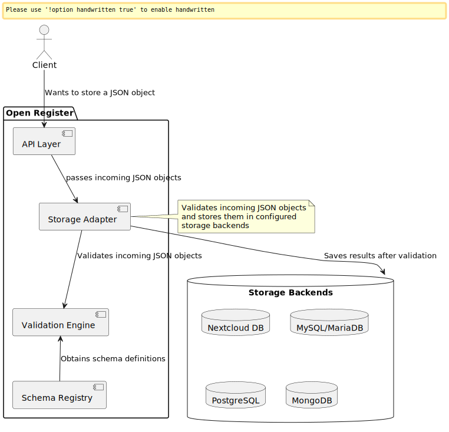

# Open Register Documentation

Open Register is a storage-independent system for managing and validating structured data objects. It provides a flexible and robust way to store, validate, and manage data across different storage backends.

## Core Concepts

Open Register operates on two fundamental principles:

1. **JSON Schema Validation**: All data objects are validated against predefined [JSON Schema](https://json-schema.org/) definitions. This ensures data integrity and consistency across your application.

2. **Storage Independence**: Objects can be stored in various backends without changing your application logic:
   - Nextcloud internal database
   - External SQL databases (MySQL, MariaDB, PostgreSQL)
   - Document stores (MongoDB)
   - *More backends can be added through the storage adapter interface*

### Basic Workflow

1. Client sends a JSON object via API
2. Open Register validates it against the corresponding JSON Schema
3. If valid, the object is stored in the configured backend
4. The object can be retrieved later, regardless of the storage backend

## Key Features

| Feature | Description | Benefits |
|---------|-------------|-----------|
| 💾 [Storing Objects](Features/storing-objects.md) | Configure how and where register data is stored | Storage flexibility, system integration, scalability |
| 📝 [Audit Trails](Features/audit-trails.md) | Complete history of all object changes | Compliance, accountability, change tracking |
| ⏰ [Time Travel](Features/time-travel.md) | View and restore previous object states | Data recovery, historical analysis, version control |
| 🔒 [Object Locking](Features/object-locking.md) | Prevent concurrent modifications | Data integrity, process management, conflict prevention |
| 🗑️ [Soft Deletes](Features/soft-deletes.md) | Safely remove objects with recovery options | Data safety, compliance, mistake recovery |
| 🔗 [Object Relations](Features/object-relations.md) | Create and manage connections between objects | Complex data structures, linked information, dependencies |
| 📎 [File Attachments](Features/file-attachments.md) | Manage files associated with objects | Document management, version control, previews |
| 🔍 [Content Search](Features/content-search.md) | Full-text search across objects and files | Quick discovery, unified search, advanced filtering |
| 🏷️ [Automatic Facets](Features/automatic-facets.md) | Dynamic filtering based on object properties | Intuitive navigation, pattern discovery, smart filtering |
| ✅ [Schema Validation](Features/schema-validation.md) | Validate objects against JSON schemas | Data quality, consistency, structure enforcement |
| 📚 [Register Management](Features/register-management.md) | Organize collections of related objects | Logical grouping, access control, process automation |
| 🔐 [Access Control](Features/access-control.md) | Fine-grained permissions management | Security, role management, granular control |
| ⚡ [Elasticsearch](Features/elasticsearch.md) | Advanced search and analytics capabilities | Performance, insights, complex queries |
| 📋 [Schema Import & Sharing](Features/schema-import.md) | Import schemas from Schema.org, OAS, GGM, and share via Open Catalogi | Standards compliance, reuse, collaboration |
| 🔔 [Events & Webhooks](Features/events.md) | React to object changes with events and webhooks | Integration, automation, real-time updates |
| ✂️ [Data Filtering](Features/data-filtering.md) | Select specific properties to return | Data minimalization, GDPR compliance, efficient responses |
| 🔍 [Advanced Search](Features/advanced-search.md) | Filter objects using flexible property-based queries | Precise filtering, complex conditions, efficient results |
| 🗑️ [Object Deletion](Features/object-deletion.md) | Soft deletion with retention and recovery | Data safety, compliance, lifecycle management |

## Project Structure

    website/
    ├── docs/              # Documentation markdown files
    ├── src/               # React components and pages
    ├── static/            # Static files (images, etc)
    ├── docusaurus.config.js   # Site configuration
    ├── package.json       # Project dependencies
    ├── README.md         # This file
    └── sidebars.js       # Sidebar configuration

## Contributing

1. Create a new branch from `documentation`
2. Make your changes
3. Test locally using `npm start`
4. Create a Pull Request to the `documentation` branch
