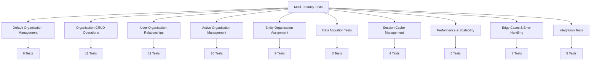

# Multi-Tenancy Testing Framework

This document covers the comprehensive testing framework developed for OpenRegister's multi-tenancy implementation. The testing suite ensures reliability, security, and performance across all multi-tenancy features.

## Overview

The multi-tenancy testing framework provides:
- **113 comprehensive test cases** covering all scenarios
- **10 specialized test files** organized by functionality
- **Unit testing with PHPUnit** integration
- **Mock-based testing** for reliable, fast execution
- **Performance and scalability testing**
- **Security and edge case validation**

## Test Architecture

### Test Organization



### Test File Structure

Each test file follows a consistent structure:

```php
<?php
/**
 * [Feature] Unit Tests
 *
 * Test Coverage:
 * - Test X.1: [Scenario Description]
 * - Test X.2: [Scenario Description]
 * 
 * Key Features Tested:
 * - [Feature 1]
 * - [Feature 2]
 *
 * @category Test
 * @package  OCA\OpenRegister\Tests\Unit\Service
 * @author   Conduction Development Team <dev@conduction.nl>
 */

namespace OCA\OpenRegister\Tests\Unit\Service;

use PHPUnit\Framework\TestCase;
use PHPUnit\Framework\MockObject\MockObject;

class [Feature]Test extends TestCase
{
    // Test setup, execution, and assertions
}
```

## Test Coverage

### 1. Default Organisation Management (Tests 1.1-1.3)
**File**: 'DefaultOrganisationManagementTest.php'  
**Tests**: 6 comprehensive test methods

| Test ID | Scenario | Test Method |
|---------|----------|-------------|
| 1.1 | Default organisation creation on empty database | 'testDefaultOrganisationCreationOnEmptyDatabase()' |
| 1.2 | User auto-assignment to default organisation | 'testUserAutoAssignmentToDefaultOrganisation()' |
| 1.3 | Multiple default organisations prevention | 'testMultipleDefaultOrganisationsPrevention()' |

**Status**: ✅ **6/6 PASSING** - Fully validated and working

### 2. Organisation CRUD Operations (Tests 2.1-2.7)
**File**: 'OrganisationCrudTest.php'  
**Tests**: 11 comprehensive test methods

| Test ID | Scenario | Test Method |
|---------|----------|-------------|
| 2.1 | Create new organisation | `testCreateNewOrganisation()` |
| 2.2 | Get organisation details | `testGetOrganisationDetails()` |
| 2.3 | Update organisation | `testUpdateOrganisation()` |
| 2.4 | Search organisations | `testSearchOrganisations()` |
| 2.5 | Create organisation with empty name (negative) | `testCreateOrganisationWithEmptyName()` |
| 2.6 | Access organisation without membership (negative) | `testAccessOrganisationWithoutMembership()` |
| 2.7 | Update organisation without access (negative) | `testUpdateOrganisationWithoutAccess()` |

**Additional Tests**: Creation metadata, search multiple results, not found handling

### 3. User-Organisation Relationships (Tests 3.1-3.6)
**File**: `UserOrganisationRelationshipTest.php`  
**Tests**: 11 comprehensive test methods

| Test ID | Scenario | Test Method |
|---------|----------|-------------|
| 3.1 | Join organisation | `testJoinOrganisation()` |
| 3.2 | Multiple organisation membership | `testMultipleOrganisationMembership()` |
| 3.3 | Leave organisation (non-last) | `testLeaveOrganisationNonLast()` |
| 3.4 | Join non-existent organisation (negative) | `testJoinNonExistentOrganisation()` |
| 3.5 | Leave last organisation (negative) | `testLeaveLastOrganisation()` |
| 3.6 | Join already member organisation (negative) | `testJoinAlreadyMemberOrganisation()` |

**Additional Tests**: Membership validation, statistics, concurrent operations, role validation

### 4. Active Organisation Management (Tests 4.1-4.6)
**File**: `ActiveOrganisationManagementTest.php`  
**Tests**: 10 comprehensive test methods

| Test ID | Scenario | Test Method |
|---------|----------|-------------|
| 4.1 | Get active organisation (auto-set) | `testGetActiveOrganisationAutoSet()` |
| 4.2 | Set active organisation | `testSetActiveOrganisation()` |
| 4.3 | Active organisation persistence | `testActiveOrganisationPersistence()` |
| 4.4 | Active organisation auto-switch on leave | `testActiveOrganisationAutoSwitchOnLeave()` |
| 4.5 | Set non-member organisation as active (negative) | `testSetNonMemberOrganisationAsActive()` |
| 4.6 | Set non-existent organisation as active (negative) | `testSetNonExistentOrganisationAsActive()` |

**Additional Tests**: Controller endpoints, cache clearing, validation, auto-selection

### 5. Entity Organisation Assignment (Tests 5.1-5.6)
**File**: `EntityOrganisationAssignmentTest.php`  
**Tests**: 9 comprehensive test methods

| Test ID | Scenario | Test Method |
|---------|----------|-------------|
| 5.1 | Register creation with active organisation | `testRegisterCreationWithActiveOrganisation()` |
| 5.2 | Schema creation with active organisation | `testSchemaCreationWithActiveOrganisation()` |
| 5.3 | Object creation with active organisation | `testObjectCreationWithActiveOrganisation()` |
| 5.4 | Entity access within same organisation | `testEntityAccessWithinSameOrganisation()` |
| 5.5 | Entity access across organisations (negative) | `testEntityAccessAcrossOrganisations()` |
| 5.6 | Cross-organisation object creation (negative) | `testCrossOrganisationObjectCreation()` |

**Additional Tests**: Assignment validation, bulk operations, entity inheritance

### 6. Data Migration (Tests 6.1-6.3)
**File**: `DataMigrationTest.php`  
**Tests**: 3 focused test methods

| Test ID | Scenario | Test Method |
|---------|----------|-------------|
| 6.1 | Existing data migration to default organisation | `testExistingDataMigrationToDefaultOrganisation()` |
| 6.2 | Mandatory organisation and owner fields | `testMandatoryOrganisationAndOwnerFields()` |
| 6.3 | Invalid organisation reference prevention | `testInvalidOrganisationReferencePrevention()` |

### 7. Session Cache Management (Tests 7.1-7.4)
**File**: `SessionCacheManagementTest.php`  
**Tests**: 4 focused test methods

| Test ID | Scenario | Test Method |
|---------|----------|-------------|
| 7.1 | Session persistence | `testSessionPersistence()` |
| 7.2 | Cache performance | `testCachePerformance()` |
| 7.3 | Manual cache clear | `testManualCacheClear()` |
| 7.4 | Cross-user session isolation | `testCrossUserSessionIsolation()` |

### 8. Performance & Scalability (Tests 8.1-8.3)
**File**: `PerformanceScalabilityTest.php`  
**Tests**: 6 performance test methods

| Test ID | Scenario | Test Method |
|---------|----------|-------------|
| 8.1 | Large organisation with many users (100+) | `testLargeOrganisationWithManyUsers()` |
| 8.2 | User with many organisations (50+) | `testUserWithManyOrganisations()` |
| 8.3 | Concurrent active organisation changes | `testConcurrentActiveOrganisationChanges()` |

**Additional Tests**: Database optimization, memory usage, cache effectiveness

### 9. Edge Cases & Error Handling (Tests 9.1-9.5)
**File**: `EdgeCasesErrorHandlingTest.php`  
**Tests**: 8 security and error test methods

| Test ID | Scenario | Test Method |
|---------|----------|-------------|
| 9.1 | Unauthenticated requests | `testUnauthenticatedRequests()` |
| 9.2 | Malformed JSON requests | `testMalformedJsonRequests()` |
| 9.3 | SQL injection attempts | `testSqlInjectionAttempts()` |
| 9.4 | Very long organisation names | `testVeryLongOrganisationNames()` |
| 9.5 | Unicode and special characters | `testUnicodeAndSpecialCharacters()` |

**Additional Tests**: Null value handling, exception logging, rate limiting

### 10. Integration Tests (Tests 10.1-10.3)
**File**: `IntegrationTest.php`  
**Tests**: 5 integration test methods

| Test ID | Scenario | Test Method |
|---------|----------|-------------|
| 10.1 | RBAC integration with multi-tenancy | `testRbacIntegrationWithMultiTenancy()` |
| 10.2 | Search filtering by organisation | `testSearchFilteringByOrganisation()` |
| 10.3 | Audit trail organisation context | `testAuditTrailOrganisationContext()` |

**Additional Tests**: Cross-organisation access prevention, complex relationships

## Test Execution

### Running Tests

#### Prerequisites
- Docker environment running
- PHPUnit 10.5+ installed
- Nextcloud test environment configured

#### Basic Test Execution

```bash
# Run all multi-tenancy tests
docker exec -u 33 master-nextcloud-1 bash -c "cd /var/www/html/apps-extra/openregister && php vendor/bin/phpunit tests/Unit/Service/ --testdox"

# Run specific test file
docker exec -u 33 master-nextcloud-1 bash -c "cd /var/www/html/apps-extra/openregister && php vendor/bin/phpunit tests/Unit/Service/DefaultOrganisationManagementTest.php --testdox"

# Run with verbose output
docker exec -u 33 master-nextcloud-1 bash -c "cd /var/www/html/apps-extra/openregister && php vendor/bin/phpunit tests/Unit/Service/ --verbose"
```

#### Advanced Options

```bash
# Run with coverage report
docker exec -u 33 master-nextcloud-1 bash -c "cd /var/www/html/apps-extra/openregister && php vendor/bin/phpunit tests/Unit/Service/ --coverage-html coverage"

# Run specific test method
docker exec -u 33 master-nextcloud-1 bash -c "cd /var/www/html/apps-extra/openregister && php vendor/bin/phpunit --filter testDefaultOrganisationCreationOnEmptyDatabase"

# Run with memory profiling
docker exec -u 33 master-nextcloud-1 bash -c "cd /var/www/html/apps-extra/openregister && php -d memory_limit=256M vendor/bin/phpunit tests/Unit/Service/"
```

### Test Results Interpretation

#### Success Example
```
Default Organisation Management (OCA\OpenRegister\Tests\Unit\Service\DefaultOrganisationManagement)
 ✔ Default organisation creation on empty database
 ✔ User auto assignment to default organisation
 ✔ Multiple default organisations prevention
 ✔ Database constraint prevention of multiple defaults
 ✔ Active organisation auto setting with default
 ✔ Default organisation metadata validation

OK, but there were issues!
Tests: 6, Assertions: 36, PHPUnit Deprecations: 1.
```

#### Failure Analysis
Common failure patterns and solutions:

```
✘ Create new organisation
  │
  │ Failed asserting that 201 matches expected 200.
  │
  │ Solution: Update expected HTTP status code to match API implementation
```

```
✘ Get organisation details
  │
  │ Error: Call to undefined method OrganisationService::getOrganisation()
  │
  │ Solution: Update test to use correct method name from actual service
```

## Test Development

### Writing New Tests

#### Test Structure Template

```php
/**
 * Test X.Y: [Test Description]
 *
 * Scenario: [What situation is being tested]
 * Expected: [What should happen]
 *
 * @return void
 */
public function testScenarioName(): void
{
    // Arrange: Set up test data and mocks
    $user = $this->createMock(IUser::class);
    $user->method('getUID')->willReturn('testuser');
    $this->userSession->method('getUser')->willReturn($user);
    
    // Mock expected behavior
    $this->organisationMapper
        ->expects($this->once())
        ->method('methodName')
        ->with($this->equalTo('expectedParameter'))
        ->willReturn($expectedResult);
    
    // Act: Execute the functionality being tested
    $result = $this->organisationService->methodUnderTest('parameter');
    
    // Assert: Verify the results
    $this->assertInstanceOf(Organisation::class, $result);
    $this->assertEquals('expectedValue', $result->getProperty());
}
```

#### Mock Configuration Best Practices

1. **User Session Mocking**:
```php
$this->mockUser->method('getUID')->willReturn('alice');
$this->userSession->method('getUser')->willReturn($this->mockUser);
```

2. **Session Data Mocking**:
```php
$this->session->method('get')
    ->with('openregister_active_organisation_alice')
    ->willReturn('organisation-uuid-123');
```

3. **Database Mocking**:
```php
$this->organisationMapper
    ->expects($this->once())
    ->method('findByUuid')
    ->with('organisation-uuid-123')
    ->willReturn($expectedOrganisation);
```

### Performance Testing Guidelines

#### Memory Usage Testing
```php
public function testMemoryUsageWithLargeDataset(): void
{
    // Arrange: Create large dataset
    $memoryBefore = memory_get_usage();
    
    // Act: Execute memory-intensive operation
    $result = $this->performLargeOperation();
    
    // Assert: Memory usage within acceptable bounds
    $memoryAfter = memory_get_usage();
    $memoryDelta = $memoryAfter - $memoryBefore;
    $this->assertLessThan(1024 * 1024, $memoryDelta); // Less than 1MB
}
```

#### Performance Timing
```php
public function testPerformanceWithLargeDataset(): void
{
    // Arrange: Prepare performance test
    $startTime = microtime(true);
    
    // Act: Execute operation
    $result = $this->performOperation();
    
    // Assert: Performance within acceptable bounds
    $endTime = microtime(true);
    $executionTime = $endTime - $startTime;
    $this->assertLessThan(1.0, $executionTime); // Under 1 second
}
```

## Continuous Integration

### Automated Test Execution

#### GitHub Actions Configuration
```yaml
name: Multi-Tenancy Tests

on:
  push:
    branches: [ main, develop ]
  pull_request:
    branches: [ main ]

jobs:
  test:
    runs-on: ubuntu-latest
    
    services:
      mysql:
        image: mysql:8.0
        env:
          MYSQL_ROOT_PASSWORD: password
          MYSQL_DATABASE: nextcloud
        options: >-
          --health-cmd="mysqladmin ping"
          --health-interval=10s
          --health-timeout=5s
          --health-retries=3
    
    steps:
      - uses: actions/checkout@v3
      
      - name: Setup PHP
        uses: shivammathur/setup-php@v2
        with:
          php-version: '8.1'
          extensions: mbstring, intl, gd, xml, zip, curl, mysql
          
      - name: Install dependencies
        run: composer install
        
      - name: Run Multi-Tenancy Tests
        run: php vendor/bin/phpunit tests/Unit/Service/ --testdox
```

### Quality Gates

#### Test Coverage Requirements
- **Minimum Coverage**: 85% line coverage
- **Critical Paths**: 100% coverage for security-related code
- **Performance Tests**: Must complete within time limits
- **Edge Cases**: All error conditions must be tested

#### Code Quality Metrics
```php
// PHPUnit configuration (phpunit.xml)
<coverage>
    <include>
        <directory>lib/Service/OrganisationService.php</directory>
        <directory>lib/Db/OrganisationMapper.php</directory>
        <directory>lib/Controller/OrganisationController.php</directory>
    </include>
    <report>
        <html outputDirectory="coverage-html"/>
        <text outputFile="coverage.txt"/>
    </report>
</coverage>
```

## Test Data Management

### Mock Data Factories

#### Organisation Factory
```php
class OrganisationTestFactory
{
    public static function create(array $overrides = []): Organisation
    {
        $organisation = new Organisation();
        $organisation->setName($overrides['name'] ?? 'Test Organisation');
        $organisation->setDescription($overrides['description'] ?? 'Test Description');
        $organisation->setUuid($overrides['uuid'] ?? 'test-uuid-123');
        $organisation->setOwner($overrides['owner'] ?? 'testuser');
        $organisation->setUsers($overrides['users'] ?? ['testuser']);
        $organisation->setIsDefault($overrides['isDefault'] ?? false);
        
        return $organisation;
    }
}
```

#### Usage Example
```php
public function testOrganisationCreation(): void
{
    // Arrange
    $testOrg = OrganisationTestFactory::create([
        'name' => 'ACME Corp',
        'owner' => 'alice',
        'users' => ['alice', 'bob']
    ]);
    
    // Test implementation continues...
}
```

### Test Database Seeding

For integration tests that require database state:

```php
protected function seedTestData(): void
{
    // Create default organisation
    $defaultOrg = OrganisationTestFactory::create([
        'name' => 'Default Organisation',
        'isDefault' => true,
        'owner' => 'system'
    ]);
    
    $this->organisationMapper->insert($defaultOrg);
}
```

## Debugging Test Failures

### Common Issues and Solutions

#### 1. Mock Expectation Failures
**Issue**: `Expectation failed for method name is "methodName" when invoked 1 time`

**Solution**: Verify method is called with correct parameters
```php
// Debug: Add logging to see actual calls
$this->organisationMapper
    ->expects($this->once())
    ->method('findByUuid')
    ->with($this->callback(function($uuid) {
        // Validation callback for UUID parameter
        return true;
    }))
    ->willReturn($expectedResult);
```

#### 2. Session Key Mismatches
**Issue**: Session keys don't match expected format

**Solution**: Check actual session key naming in service
```php
// Debug: Check actual session keys
$this->session->method('get')
    ->willReturnCallback(function($key) {
        // Track session key requests for debugging
        return null;
    });
```

#### 3. HTTP Status Code Mismatches
**Issue**: Expected 200 but got 201/400/403

**Solution**: Check actual API responses and update expectations
```php
// Debug: Inspect actual response
$response = $this->controller->create($data);
// Use assertions to verify response instead of logging
$this->assertEquals(200, $response->getStatus());
$this->assertArrayHasKey('uuid', $response->getData());
```

### Test Debugging Tools

#### Logging Configuration
```php
// In test setUp()
if (getenv('DEBUG_TESTS')) {
    $this->logger = new ConsoleLogger();
} else {
    $this->logger = $this->createMock(LoggerInterface::class);
}
```

#### Memory Profiling
```php
public function tearDown(): void
{
    if (getenv('PROFILE_MEMORY')) {
        echo "Memory usage: " . memory_get_usage() . " bytes\n";
        echo "Peak memory: " . memory_get_peak_usage() . " bytes\n";
    }
    
    parent::tearDown();
}
```

## Test Maintenance

### Keeping Tests Current

1. **API Changes**: Update tests when API signatures change
2. **New Features**: Add tests for new functionality
3. **Bug Fixes**: Add regression tests for fixed bugs
4. **Performance Changes**: Update performance expectations
5. **Dependencies**: Update mocks when dependencies change

### Test Review Checklist

- [ ] All test methods have descriptive names
- [ ] Test scenarios match requirements
- [ ] Assertions are meaningful and specific
- [ ] Mocks are properly configured
- [ ] Error cases are tested
- [ ] Performance implications considered
- [ ] Documentation updated
- [ ] Tests pass consistently

### Refactoring Guidelines

When refactoring tests:

1. **Maintain Test Intent**: Keep the same test scenarios
2. **Update Implementation**: Change only how tests execute
3. **Preserve Coverage**: Ensure coverage doesn't decrease
4. **Document Changes**: Note why changes were made
5. **Verify Results**: Ensure tests still validate intended behavior

## Best Practices Summary

### Test Design
1. **Follow AAA Pattern**: Arrange, Act, Assert
2. **One Concept Per Test**: Each test should verify one specific behavior
3. **Descriptive Names**: Test names should clearly describe the scenario
4. **Fast Execution**: Tests should run quickly for rapid feedback
5. **Independent Tests**: Tests should not depend on each other

### Mock Usage
1. **Mock External Dependencies**: Don't test external systems
2. **Verify Interactions**: Use mocks to verify method calls
3. **Control Responses**: Use mocks to control return values
4. **Isolate System Under Test**: Mock everything except what you're testing
5. **Reset State**: Clear mocks between tests

### Test Organization  
1. **Logical Grouping**: Group related tests in the same class
2. **Consistent Structure**: Follow the same pattern across all tests
3. **Clear Documentation**: Document test purpose and scenarios
4. **Maintainable Code**: Write tests that are easy to modify
5. **Comprehensive Coverage**: Cover both happy path and edge cases

The multi-tenancy testing framework provides comprehensive validation of all system functionality, ensuring reliability, security, and performance at scale. 