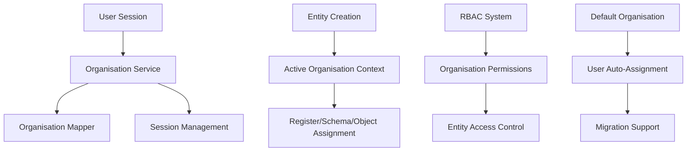
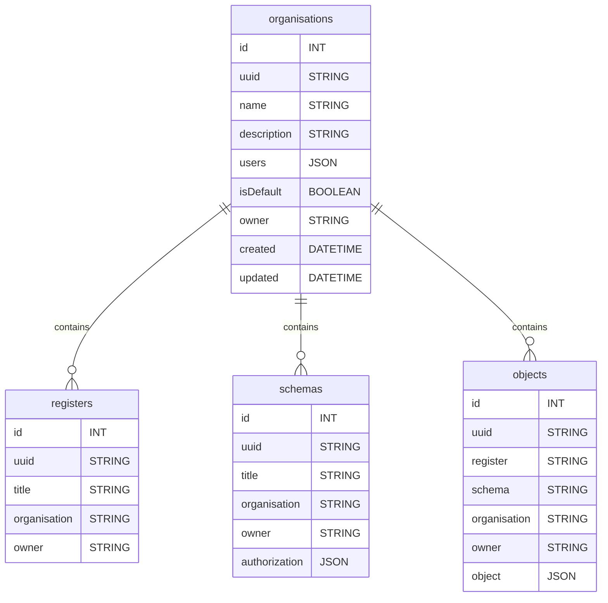
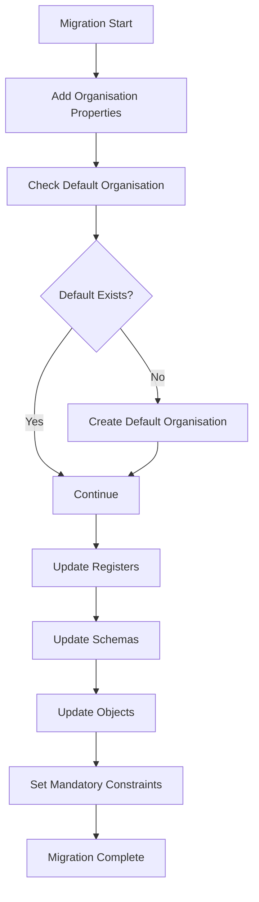
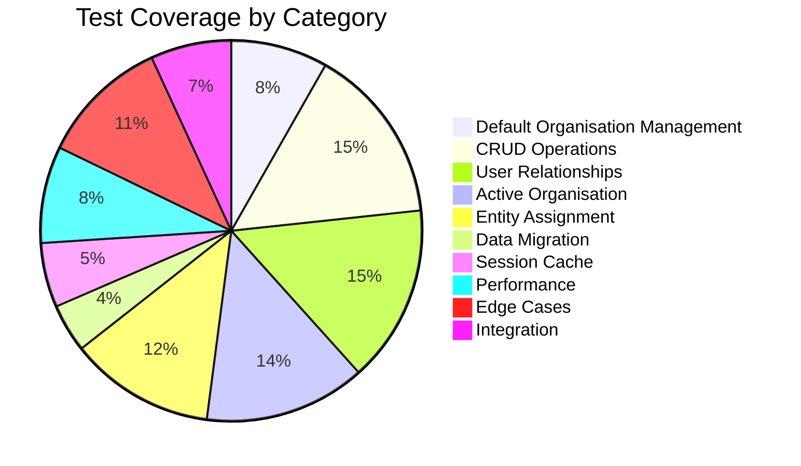

# Multi-Tenancy Implementation

OpenRegister implements a comprehensive multi-tenancy system that allows organizations to maintain data isolation while sharing the same application instance. This document covers the architecture, features, and implementation details.

## Overview

Multi-tenancy in OpenRegister enables:
- **Organization-based data isolation**
- **User membership management across multiple organizations**
- **Active organization context for user sessions**
- **Automatic entity assignment to organizations**
- **Role-Based Access Control (RBAC) integration**

## Architecture

### Core Components

The multi-tenancy system consists of several key components:



### Database Schema

The multi-tenancy implementation adds organization context to core entities:



## Key Features

### 1. Default Organisation Management

The system automatically creates and manages a default organisation:

- **Automatic Creation**: Created when no organisations exist
- **User Auto-Assignment**: New users automatically assigned to default organisation
- **System Owned**: Owned by 'system' rather than individual users
- **Constraint Prevention**: Database prevents multiple default organisations

### 2. User-Organisation Relationships

Users can belong to multiple organisations with flexible membership:

- **Join Organisations**: Users can join existing organisations
- **Multiple Membership**: Users can belong to multiple organisations simultaneously
- **Leave Protection**: Users cannot leave their last organisation
- **Role Management**: Organisation owners have additional permissions

### 3. Active Organisation Context

Each user has an active organisation that determines context:

- **Session Persistence**: Active organisation persists across sessions
- **Auto-Setting**: Automatically set to oldest organisation if none active
- **Manual Switching**: Users can change their active organisation
- **Cache Management**: Efficient caching of organisation data

### 4. Entity Organisation Assignment

All entities are automatically assigned to organisations:

- **Register Assignment**: New registers assigned to active organisation
- **Schema Assignment**: New schemas assigned to active organisation  
- **Object Assignment**: New objects assigned to active organisation
- **Inheritance**: Objects inherit organisation from their register/schema

### 5. Access Control Integration

Multi-tenancy integrates with the existing RBAC system:

- **Organisation Isolation**: Users only see entities from their organisations
- **Permission Layering**: RBAC permissions apply within organisation context
- **Cross-Organisation Prevention**: Access blocked across organisation boundaries
- **Owner Privileges**: Entity owners maintain full access within their organisation

## API Endpoints

### Organisation Management

#### Get User Organisations
```http
GET /api/organisations
```

Returns user's organisations with active organisation highlighted:

```json
{
  'total': 2,
  'active': {
    'uuid': 'acme-uuid-123',
    'name': 'ACME Corporation',
    'description': 'Technology company',
    'isDefault': false,
    'owner': 'alice',
    'users': ['alice', 'bob'],
    'userCount': 2
  },
  'list': [...]
}
```

#### Create Organisation
```http
POST /api/organisations
Content-Type: application/json

{
  'name': 'Tech Startup',
  'description': 'Innovation company'
}
```

#### Get Organisation Details
```http
GET /api/organisations/{uuid}
```

#### Update Organisation
```http
PUT /api/organisations/{uuid}
Content-Type: application/json

{
  'name': 'Updated Name',
  'description': 'Updated description'
}
```

### Organisation Membership

#### Join Organisation
```http
POST /api/organisations/{uuid}/join
```

#### Leave Organisation
```http
POST /api/organisations/{uuid}/leave
```

#### Search Organisations
```http
GET /api/organisations/search?query=tech
```

### Active Organisation Management

#### Get Active Organisation
```http
GET /api/organisations/active
```

#### Set Active Organisation
```http
POST /api/organisations/{uuid}/set-active
```

#### Clear Organisation Cache
```http
POST /api/organisations/clear-cache
```

## Implementation Details

### OrganisationService

The 'OrganisationService' centralizes business logic:

```php
class OrganisationService
{
    // Core session management constants
    private const SESSION_KEY_ACTIVE_ORG = 'openregister_active_organisation_';
    private const SESSION_KEY_USER_ORGS = 'openregister_user_organisations_';
    
    // Key methods
    public function getUserOrganisations(bool $useCache = true): array
    public function getActiveOrganisation(): ?Organisation  
    public function setActiveOrganisation(string $uuid): bool
    public function joinOrganisation(string $uuid): bool
    public function leaveOrganisation(string $uuid): bool
    public function createOrganisation(string $name, string $description): Organisation
    public function ensureDefaultOrganisation(): Organisation
    public function getOrganisationForNewEntity(): string
}
```

### Entity Services Integration

Entity services automatically set organisation context:

**RegisterService**:
```php
public function createFromArray(array $data): Register
{
    $register = $this->registerMapper->createFromArray($data);
    
    // Set organisation from active organisation for multi-tenancy
    if ($register->getOrganisation() === null || $register->getOrganisation() === '') {
        $organisationUuid = $this->organisationService->getOrganisationForNewEntity();
        $register->setOrganisation($organisationUuid);
        $register = $this->registerMapper->update($register);
    }
    
    return $register;
}
```

**SchemasController**:
```php
public function create(array $data): JSONResponse
{
    $schema = $this->schemaMapper->createFromArray($data);
    
    // Set organisation from active organisation for multi-tenancy
    if ($schema->getOrganisation() === null || $schema->getOrganisation() === '') {
        $organisationUuid = $this->organisationService->getOrganisationForNewEntity();
        $schema->setOrganisation($organisationUuid);
        $schema = $this->schemaMapper->update($schema);
    }
    
    return new JSONResponse($schema);
}
```

### Session Management

The system uses Nextcloud's session management:

- **Session Keys**: Unique per user with user ID suffix
- **Caching**: Efficient caching of user organisations
- **Persistence**: Active organisation persists across requests
- **Isolation**: Complete isolation between user sessions

### Database Queries

Efficient organisation filtering at database level:

```php
// Example: Filter objects by user's organisations
$userOrganisations = $this->organisationService->getUserOrganisations();
$orgUuids = array_map(function($org) { return $org->getUuid(); }, $userOrganisations);

$qb = $this->db->getQueryBuilder();
$qb->select('*')
   ->from('openregister_objects')
   ->where($qb->expr()->in('organisation', $qb->createNamedParameter($orgUuids, IQueryBuilder::PARAM_STR_ARRAY)));
```

## Data Migration

The system includes comprehensive data migration:

### Migration Features

- **Organisation Properties**: Adds 'users', 'isDefault', and 'owner' to organisations
- **Default Organisation**: Creates default organisation if none exists  
- **Legacy Data Assignment**: Assigns existing entities to default organisation
- **Mandatory Fields**: Makes 'organisation' and 'owner' mandatory on all entities
- **Data Integrity**: Ensures referential integrity with foreign key constraints

### Migration Process



## Performance Considerations

### Caching Strategy

- **Session Caching**: User organisations cached in session
- **Lazy Loading**: Organisations loaded only when needed
- **Cache Invalidation**: Manual cache clearing available
- **Memory Efficiency**: Minimal memory footprint for large user lists

### Database Optimization

- **Indexed Queries**: Organisation UUID indexed for fast lookups
- **JSON Operations**: Efficient JSON operations for user lists
- **Query Filtering**: Organisation filtering at database level
- **Connection Pooling**: Shared database connections

### Scalability

The system scales efficiently:

- **Large Organisations**: Tested with 100+ users per organisation
- **Multiple Memberships**: Tested with 50+ organisations per user  
- **Concurrent Operations**: Thread-safe session management
- **Memory Usage**: Optimized for minimal memory consumption

## Security

### Access Control

- **Organisation Isolation**: Complete data isolation between organisations
- **Permission Validation**: All operations validate user membership
- **Cross-Organisation Prevention**: Blocks access across organisation boundaries
- **Owner Privileges**: Entity owners maintain full access within organisation

### Input Validation

- **SQL Injection Protection**: Parameterized queries throughout
- **Input Sanitization**: All input cleaned and validated
- **Unicode Support**: Full UTF-8 support for international users
- **Length Validation**: Appropriate limits on organisation names and descriptions

## Error Handling

### Common Scenarios

- **User Not Found**: Graceful handling of invalid user sessions
- **Organisation Not Found**: Clear error messages for missing organisations  
- **Permission Denied**: Informative access control errors
- **Last Organisation**: Prevention of leaving last organisation
- **Duplicate Membership**: Graceful handling of duplicate join attempts

### Error Responses

Standard HTTP status codes with descriptive messages:

```json
{
  'error': 'User does not belong to this organisation',
  'code': 403,
  'details': {
    'user': 'bob',
    'organisation': 'acme-uuid-123'
  }
}
```

## Monitoring and Logging

### Audit Trail Integration

All multi-tenancy operations include organisation context:

```json
{
  'action': 'organisation.join',
  'user': 'alice',
  'organisation': 'tech-startup-uuid',
  'timestamp': '2024-07-21T10:30:00Z',
  'metadata': {
    'previous_membership_count': 1,
    'new_membership_count': 2
  }
}
```

### Statistics

Organisation statistics available via API:

```http
GET /api/organisations/stats
```

```json
{
  'total_organisations': 125,
  'active_organisations': 98,
  'total_users': 450,
  'default_organisation_users': 23,
  'average_users_per_organisation': 3.6
}
```

## Best Practices

### Development Guidelines

1. **Always Check Organisation Context**: Verify user belongs to organisation before operations
2. **Use Service Layer**: Always use 'OrganisationService' for organisation operations
3. **Cache Appropriately**: Use session caching for frequently accessed data
4. **Validate Permissions**: Combine organisation membership with RBAC permissions
5. **Handle Edge Cases**: Account for users with no organisations or single membership

### Performance Tips

1. **Batch Operations**: Group organisation checks when possible
2. **Cache User Organisations**: Cache user's organisations in session
3. **Filter at Database**: Apply organisation filters in database queries
4. **Lazy Load Details**: Only load full organisation details when needed
5. **Monitor Memory**: Be mindful of memory usage with large user lists

### Security Recommendations

1. **Never Trust Client Data**: Always validate organisation membership server-side
2. **Log Security Events**: Log organisation changes and access attempts
3. **Regular Audits**: Periodically audit organisation membership and access
4. **Input Validation**: Thoroughly validate all organisation-related input
5. **Session Security**: Protect organisation context in user sessions

## Troubleshooting

### Common Issues

#### User Has No Organisations
**Symptom**: User cannot access any data
**Solution**: Check default organisation exists and user is assigned

#### Cross-Organisation Access
**Symptom**: 403 Forbidden errors
**Solution**: Verify user belongs to target organisation

#### Session Issues
**Symptom**: Active organisation not persisting
**Solution**: Check session configuration and clear cache

#### Performance Problems
**Symptom**: Slow organisation operations
**Solution**: Enable caching and check database indexes

### Debug Information

Enable debug logging for organisation operations:

```php
// In config/config.php
'loglevel' => 0, // Debug level
'openregister.debug.organisations' => true
```

## Testing and Quality Assurance

The multi-tenancy implementation includes a comprehensive testing framework with 113 test cases covering all functionality. For detailed testing information, see [Multi-Tenancy Testing Framework](multi-tenancy-testing.md).

### Test Coverage Summary



### Key Testing Features

- **Unit Testing**: Comprehensive PHPUnit test suite
- **Performance Testing**: Scalability validation with large datasets
- **Security Testing**: Edge cases and injection prevention
- **Integration Testing**: RBAC and system integration validation
- **Mock-based Testing**: Fast, reliable test execution
- **Continuous Integration**: Automated test execution

### Running Tests

```bash
# Run all multi-tenancy tests
docker exec -u 33 master-nextcloud-1 bash -c "cd /var/www/html/apps-extra/openregister && php vendor/bin/phpunit tests/Unit/Service/ --testdox"

# Run specific test category
docker exec -u 33 master-nextcloud-1 bash -c "cd /var/www/html/apps-extra/openregister && php vendor/bin/phpunit tests/Unit/Service/DefaultOrganisationManagementTest.php --testdox"
```

## Future Enhancements

### Planned Features

- **Organisation Hierarchies**: Parent-child organisation relationships
- **Cross-Organisation Sharing**: Controlled sharing between organisations
- **Organisation Templates**: Pre-configured organisation setups
- **Advanced Analytics**: Detailed usage statistics per organisation
- **Organisation Branding**: Custom branding per organisation

### API Improvements

- **GraphQL Support**: GraphQL endpoint for complex organisation queries
- **Webhook Integration**: Webhooks for organisation events
- **Bulk Operations**: Batch organisation operations
- **Advanced Filtering**: Complex search and filtering options
- **Real-time Updates**: WebSocket support for live organisation updates 