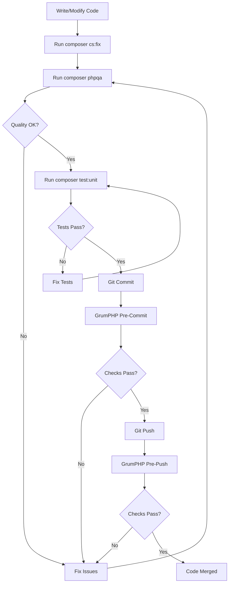
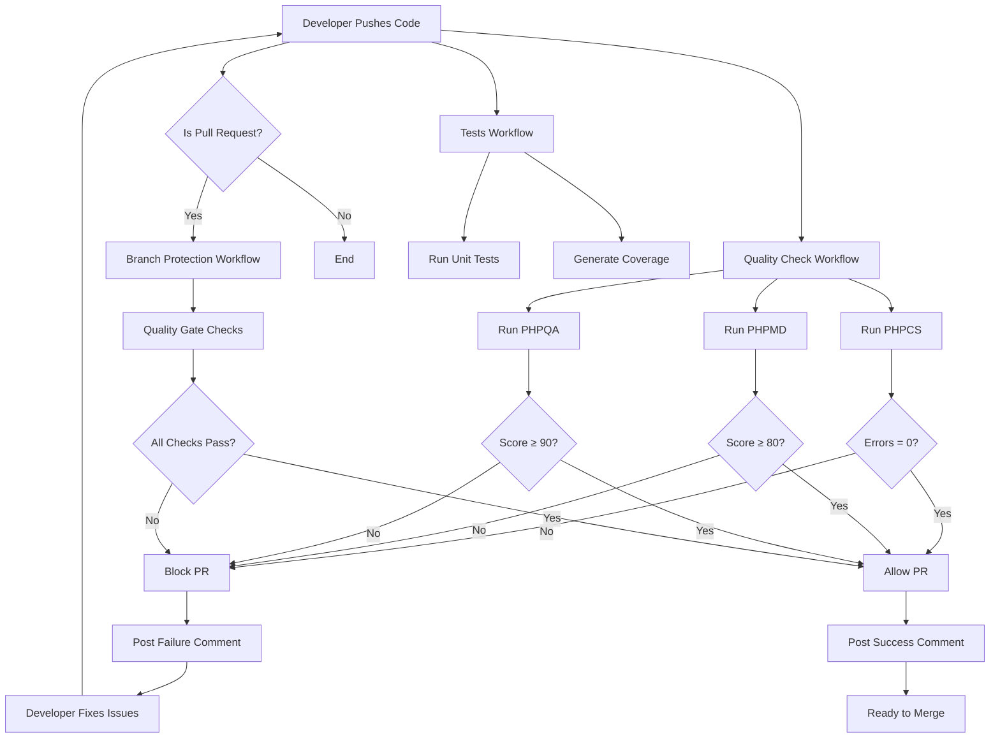

# Quality Assurance

This document describes the quality assurance tools and processes used in the OpenRegister application and all Conduction Nextcloud apps.

## Overview

We use two main tools for quality assurance:

1. **PHPQA** - Generates comprehensive quality reports and metrics
2. **GrumPHP** - Enforces quality standards through git hooks

## PHPQA - PHP Quality Analyzer

PHPQA is our primary tool for analyzing code quality. It runs multiple analyzers and generates a comprehensive report showing the health of our codebase.

### What PHPQA Checks

PHPQA runs the following analyzers:

- **PHPCS** (PHP CodeSniffer) - Coding standards compliance
- **PHPMD** (PHP Mess Detector) - Code smells and potential issues
- **PHPLoc** - Lines of code and project size metrics
- **PHPMetrics** - Complexity, maintainability, and quality metrics
- **PHPCPD** (Copy/Paste Detector) - Duplicate code detection
- **Parallel Lint** - PHP syntax checking

### Running PHPQA

#### Quick Check

```bash
composer phpqa
```

or

```bash
composer qa:check
```

This generates reports in the 'phpqa' directory.

#### Full Analysis

For a complete analysis with all tools:

```bash
composer qa:full
```

#### CI/CD Mode

For continuous integration environments:

```bash
composer phpqa:ci
```

This mode fails the build if quality thresholds are not met.

### Understanding PHPQA Reports

After running PHPQA, you will find several reports:

#### HTML Report

Open 'phpqa/phpqa-offline.html' in your browser for an interactive dashboard showing:

- Overall quality score
- Issues per analyzer
- Trends over time (if run multiple times)
- Detailed breakdown by file

#### JSON Report

The file 'phpqa/phpqa.json' contains machine-readable metrics useful for:

- CI/CD pipelines
- Custom reporting tools
- Tracking quality over time

#### PHPMetrics Report

The 'phpqa/phpmetrics' directory contains detailed complexity metrics:

- Cyclomatic complexity per method
- Maintainability index
- Coupling and cohesion metrics
- Dependency graphs

### Quality Thresholds

We aim for the following quality standards:

| Metric | Target | Critical |
|--------|--------|----------|
| PHPCS Errors | 0 | Must fix |
| PHPMD Violations | < 10 per file | Review critical |
| Code Duplication | < 5% | < 10% |
| Cyclomatic Complexity | < 10 per method | < 20 per method |
| Maintainability Index | > 85 | > 70 |

### When to Run PHPQA

PHPQA should be run:

✅ After implementing new features
✅ After refactoring code
✅ After fixing bugs
✅ Before marking todos as complete
✅ Before requesting code review
✅ Before merging to development or main branches

### Addressing PHPQA Issues

When PHPQA finds issues:

1. **Review the HTML report** to understand the problems
2. **Prioritize critical issues** (PHPCS errors, high complexity)
3. **Fix coding standards** automatically with 'composer cs:fix'
4. **Refactor complex code** to improve maintainability
5. **Reduce duplication** by extracting common code
6. **Re-run PHPQA** to verify fixes

## GrumPHP - Git Hooks for Quality

GrumPHP automatically runs quality checks when you commit or push code, preventing bad code from reaching the repository.

### What GrumPHP Checks

#### Pre-Commit Hook

Runs on every 'git commit':

- **PHP Lint** - Syntax errors
- **PHPCS** - Coding standards
- **JSON Lint** - JSON file validation
- **YAML Lint** - YAML file validation
- **Composer** - Composer.json validation

#### Pre-Push Hook

Runs on every 'git push':

- All pre-commit checks
- **PHPMD** - Code quality issues
- **PHPUnit** - Unit tests

### Setting Up GrumPHP

#### Initialize Git Hooks

After installing dependencies, initialize GrumPHP:

```bash
composer grumphp:init
```

This creates git hooks in '.git/hooks/' directory.

#### Remove Git Hooks

If needed, remove GrumPHP hooks:

```bash
composer grumphp:deinit
```

### Running GrumPHP Manually

Test what GrumPHP would check without committing:

```bash
composer grumphp
```

### Bypassing GrumPHP (Emergency Only)

In rare emergencies, you can bypass GrumPHP:

```bash
git commit --no-verify
```

**⚠️ Warning:** Only bypass GrumPHP when absolutely necessary. Always fix issues properly rather than bypassing checks.

### Understanding GrumPHP Errors

When GrumPHP fails, it shows:

1. **Which task failed** (e.g., phpcs, phpmd, phpunit)
2. **Error details** from that tool
3. **Files that caused the failure**

Fix the errors and commit again. The hooks will run automatically.

## Quality Workflow

Follow this workflow for maintaining high code quality:



### Step-by-Step Guide

1. **Write or modify code**
   - Follow coding standards
   - Add docblocks and type hints
   - Write inline comments

2. **Auto-fix coding standards**
   ```bash
   composer cs:fix
   ```

3. **Check code quality**
   ```bash
   composer phpqa
   ```

4. **Review PHPQA report**
   - Open 'phpqa/phpqa-offline.html'
   - Address critical issues
   - Refactor complex code

5. **Run tests**
   ```bash
   composer test:unit
   ```

6. **Commit changes**
   ```bash
   git add .
   git commit -m "feat: description of changes"
   ```
   - GrumPHP runs pre-commit checks automatically
   - Fix any issues that are found

7. **Push changes**
   ```bash
   git push
   ```
   - GrumPHP runs pre-push checks automatically
   - Fix any issues that are found

## Configuration Files

### .phpqa.yml

PHPQA configuration file that defines:

- Directories to analyze
- Tools to run
- Report formats
- Thresholds

Located at: '.phpqa.yml'

### grumphp.yml

GrumPHP configuration file that defines:

- Git hooks to install
- Tasks to run on each hook
- Task configuration
- Test suites

Located at: 'grumphp.yml'

### phpcs.xml

PHP CodeSniffer ruleset defining coding standards.

Located at: 'phpcs.xml'

### phpmd.xml

PHP Mess Detector ruleset defining code quality rules.

Located at: 'phpmd.xml'

## CI/CD Integration

We use GitHub Actions workflows to enforce quality standards and prevent low-quality code from being merged.

### Automated Workflows

Our repository includes three main quality workflows:

#### 1. Quality Check Workflow

**File:** '.github/workflows/quality-check.yml'

Runs on every push and pull request. Performs:
- PHPCS (Coding Standards) analysis
- PHPMD (Mess Detection) analysis
- PHPQA (Full Quality Analysis)
- Generates and uploads quality reports
- Posts results as PR comments

**Quality Requirements:**
- PHPCS Errors: Must be 0
- PHPMD Score: Should be ≥ 80%
- Overall Quality Score: Must be ≥ 90%

#### 2. Tests Workflow

**File:** '.github/workflows/tests.yml'

Runs on every push and pull request. Performs:
- Unit tests on PHP 8.1, 8.2, and 8.3
- Integration tests (if Nextcloud environment available)
- Code coverage analysis
- Posts coverage report as PR comment

**Coverage Requirements:**
- Minimum: 75% (warning if below)
- Recommended: 85%

#### 3. Branch Protection Workflow

**File:** '.github/workflows/branch-protection.yml'

Runs on pull requests to protected branches. This is the **quality gate** that blocks merges.

**Quality Gate Checks:**

| Check | Requirement | Blocks Merge |
|-------|-------------|--------------|
| PHP Syntax | No errors | Yes |
| PHPCS Errors | Must be 0 | Yes |
| PHPMD Violations | Max 50 | Yes |
| Overall Quality Score | ≥ 90% | Yes |
| Unit Tests | Must pass | No (warning only) |

**Quality Score Calculation:**

The overall quality score is calculated as:

```
Score = 100 - (PHPCS_Errors × 2) - (PHPMD_Violations × 0.1)
```

Examples:
- 0 PHPCS errors, 0 PHPMD violations = 100%
- 0 PHPCS errors, 50 PHPMD violations = 95%
- 1 PHPCS error, 0 PHPMD violations = 98%
- 0 PHPCS errors, 100 PHPMD violations = 90%
- 1 PHPCS error, 100 PHPMD violations = 88% (FAIL)

### Setting Up Branch Protection

To enable quality gates on GitHub:

1. Go to **Settings** → **Branches** → **Add rule**
2. Branch name pattern: 'main', 'master', or 'development'
3. Enable **Require status checks to pass before merging**
4. Select required checks:
   - 'Quality Gate Check'
   - 'Code Quality Analysis'
   - 'PHPUnit Tests' (optional)
5. Enable **Require branches to be up to date before merging**
6. Save changes

### Workflow Integration Diagram



### Understanding Workflow Results

#### Success Example

When a PR meets all requirements:

```
🚦 Quality Gate Status: ✅ PASSED

| Check | Status | Details |
|-------|--------|---------|
| PHP Syntax | ✅ PASS | All PHP files are valid |
| Coding Standards (PHPCS) | ✅ PASS | Errors: 0 (must be 0) |
| Code Quality (PHPMD) | ✅ PASS | Violations: 12 (max 50) |
| Overall Quality Score | ✅ PASS | Score: 98.8% (min 90%) |
| Unit Tests | ✅ PASS | Test suite passed |

✅ All quality checks passed! This PR meets the requirements for merging.
```

#### Failure Example

When a PR does not meet requirements:

```
🚦 Quality Gate Status: ❌ FAILED

| Check | Status | Details |
|-------|--------|---------|
| PHP Syntax | ✅ PASS | All PHP files are valid |
| Coding Standards (PHPCS) | ❌ FAIL | Errors: 5 (must be 0) |
| Code Quality (PHPMD) | ✅ PASS | Violations: 23 (max 50) |
| Overall Quality Score | ❌ FAIL | Score: 87.7% (min 90%) |
| Unit Tests | ✅ PASS | Test suite passed |

❌ Quality gate failed. Please address the issues above before merging.

Required actions:
- Fix PHPCS errors (run 'composer cs:fix')
- Improve overall code quality to reach 90% score
```

### Local Testing Before Push

Always test locally before pushing to avoid failed workflows:

```bash
# 1. Fix coding standards
composer cs:fix

# 2. Run quality analysis
composer phpqa

# 3. Run tests
composer test:unit

# 4. Review quality report
open phpqa/phpqa-offline.html
```

### Bypassing Workflows (Not Recommended)

Workflows cannot be bypassed for pull requests to protected branches. This is intentional to maintain code quality.

If you need to merge urgent fixes:

1. **Create a hotfix branch** from main/master
2. **Fix the urgent issue**
3. **Ensure quality checks pass**
4. **Merge with fast-forward** (if branch protection allows)

Alternatively, repository admins can:
- Temporarily disable branch protection (not recommended)
- Override required status checks (requires admin privileges)

### Viewing Workflow Artifacts

Each workflow run generates artifacts:

1. Go to **Actions** tab on GitHub
2. Click on the workflow run
3. Scroll to **Artifacts** section
4. Download:
   - 'phpqa-reports' - Full quality analysis
   - 'coverage-report' - Test coverage data
   - 'quality-gate-reports' - Quality gate details

### Troubleshooting Workflow Failures

#### Workflow Fails on Dependencies

If 'composer install' fails:
- Check 'composer.json' syntax
- Ensure 'composer.lock' is committed
- Verify PHP version compatibility

#### Workflow Fails on PHPCS

If PHPCS finds errors:
```bash
# Locally fix issues
composer cs:fix

# Verify fixes
composer cs:check

# Commit and push
git add .
git commit -m "fix: coding standards"
git push
```

#### Workflow Fails on Quality Score

If overall score is below 90%:

1. Review PHPQA report locally
2. Fix critical issues first
3. Refactor complex code
4. Reduce code duplication
5. Re-run PHPQA to verify improvements

#### Workflow Times Out

If workflows take too long:
- Check for infinite loops in tests
- Reduce parallel processes in '.phpqa.yml'
- Optimize heavy analyzers

## For AI Agents

When you are an AI agent working on this codebase:

### Mandatory Steps

1. **Always run PHPQA** after completing code changes
2. **Review the generated report** at 'phpqa/phpqa-offline.html'
3. **Address critical issues** before marking work complete
4. **Run tests** to ensure functionality
5. **Document changes** in the appropriate documentation files

### Quality Commands Reference

```bash
# Fix coding standards automatically
composer cs:fix

# Check code quality
composer phpqa

# Check quality with full analysis
composer qa:full

# Run unit tests
composer test:unit

# Run all checks (lint, phpcs, psalm, tests)
composer check

# Run full checks (includes phpstan)
composer check:full

# Run strict checks (includes phpmd)
composer check:strict
```

### Quality Checklist

Before completing a task:

- [ ] Code follows PSR-12 coding standards
- [ ] All methods have docblocks
- [ ] All methods have type hints and return types
- [ ] Inline comments explain complex logic
- [ ] PHPQA report shows no critical issues
- [ ] PHPUnit tests pass
- [ ] Code duplication is minimal
- [ ] Cyclomatic complexity is acceptable
- [ ] Documentation is updated

### Interpreting Quality Scores

When reviewing PHPQA output:

- **PHPCS Score: 1000** = Perfect (0 errors, 0 warnings)
- **PHPCS Score: 950+** = Good (minor warnings only)
- **PHPCS Score: < 900** = Needs improvement (errors present)

- **PHPMD Score: 1000** = Perfect (0 violations)
- **PHPMD Score: 900+** = Good (minor issues)
- **PHPMD Score: < 800** = Needs refactoring

- **Code Coverage: 100%** = All code tested
- **Code Coverage: 75%+** = Good coverage (our minimum)
- **Code Coverage: < 75%** = More tests needed

## Troubleshooting

### GrumPHP Not Running

If GrumPHP hooks don't run:

1. Check hooks are installed:
   ```bash
   ls -la .git/hooks/
   ```

2. Reinitialize:
   ```bash
   composer grumphp:deinit
   composer grumphp:init
   ```

### PHPQA Fails to Run

If PHPQA fails:

1. Ensure dependencies are installed:
   ```bash
   composer install
   ```

2. Check PHP version:
   ```bash
   php -v
   ```
   (Requires PHP 8.1+)

3. Clear previous reports:
   ```bash
   rm -rf phpqa/
   ```

### Out of Memory Errors

If analyzers run out of memory:

```bash
php -d memory_limit=1G vendor/bin/phpqa --report
```

## Best Practices

1. **Run PHPQA regularly** - Don't wait for CI/CD to catch issues
2. **Fix issues immediately** - Don't let quality debt accumulate
3. **Use auto-fixers** - Let tools fix simple issues automatically
4. **Understand the rules** - Know why rules exist, don't just follow blindly
5. **Refactor proactively** - Improve code quality continuously
6. **Test thoroughly** - Quality isn't just about standards, it's about correctness
7. **Document changes** - Keep documentation in sync with code

## Resources

- [PHP CodeSniffer Documentation](https://github.com/squizlabs/PHP_CodeSniffer/wiki)
- [PHPMD Rules](https://phpmd.org/rules/index.html)
- [PHPMetrics Documentation](https://phpmetrics.github.io/website/)
- [GrumPHP Documentation](https://github.com/phpro/grumphp)
- [PHPQA Documentation](https://github.com/EdgedesignCZ/phpqa)
- [PSR-12 Coding Standard](https://www.php-fig.org/psr/psr-12/)

