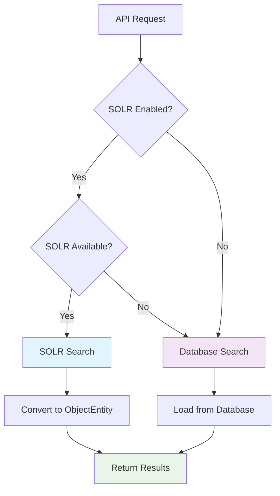
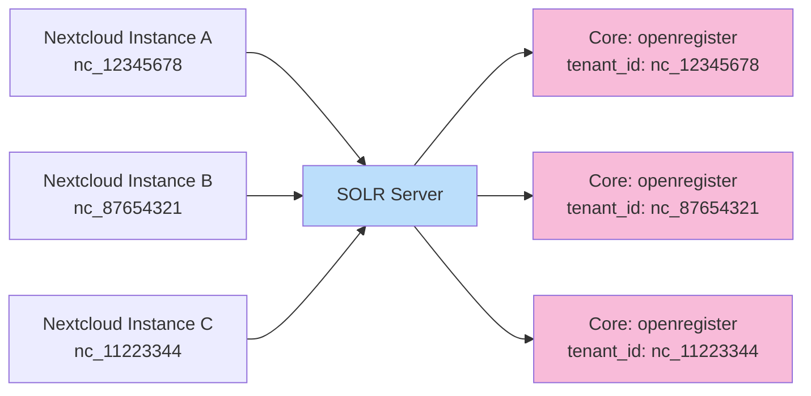
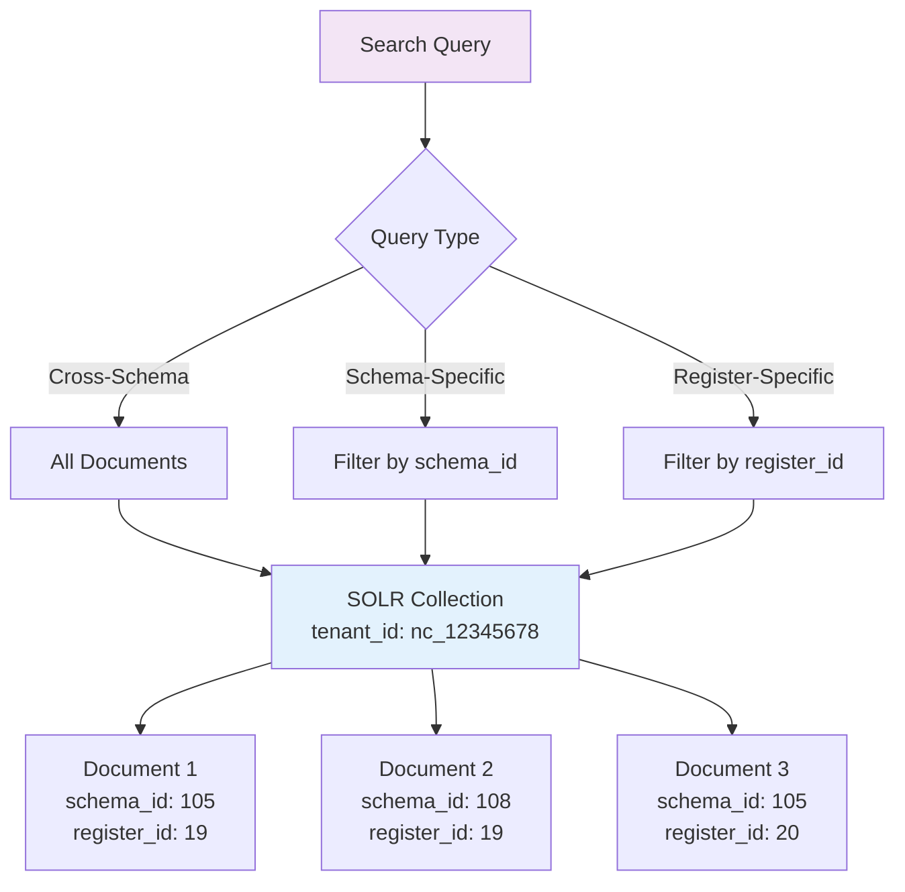
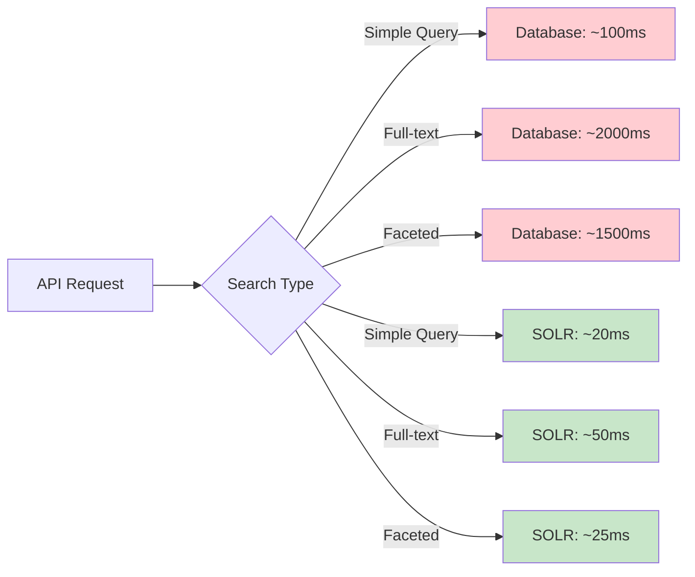
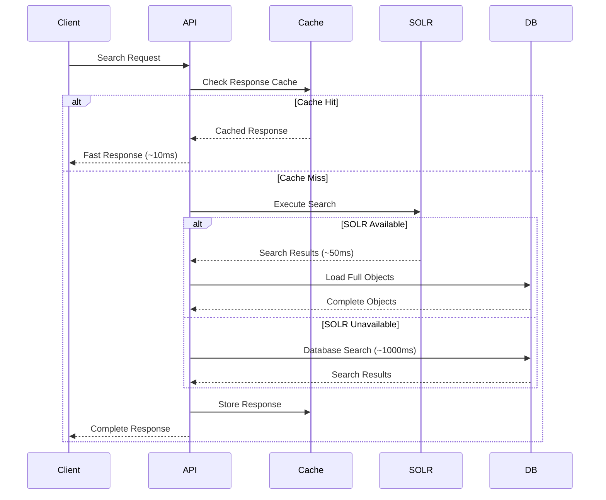
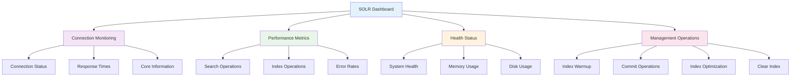
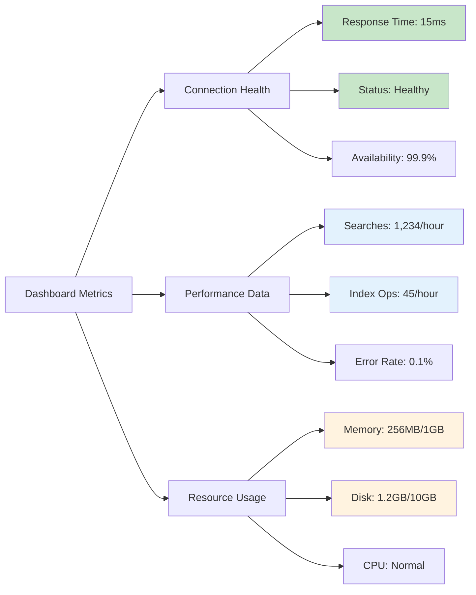

# SOLR Search Engine Integration

The OpenRegister supports Apache SOLR for advanced search capabilities including full-text search, faceted search, and high-performance querying with automatic failover to database search when SOLR is unavailable.

## Overview

SOLR provides enterprise-grade search functionality that significantly improves performance for complex queries, especially full-text search and faceted browsing. When enabled, OpenRegister automatically indexes objects in SOLR while maintaining seamless fallback to database queries.



## Architecture

### Multi-Tenant SOLR Setup

OpenRegister supports multiple deployment strategies for SOLR:

#### Single SOLR Instance (Recommended)
- **Collection per Nextcloud instance**: Complete data isolation
- **Tenant ID based separation**: `nc_12345678` format
- **Automatic core management**: Creates cores as needed



#### Collection Strategy Within Tenants

**Single Collection per Tenant** (Recommended for 200K objects):
- All object types in one collection
- Schema-based filtering via `schema_id` field
- Cross-schema search and faceting capabilities
- Optimal performance for your object volume



## Configuration

### SOLR Settings

Configure SOLR in Admin Settings > OpenRegister > SOLR Search Configuration:

**Basic Configuration:**
- **Host**: `solr` (Docker) or `localhost` (standalone)
- **Port**: `8983` (default SOLR port)
- **Scheme**: `http` or `https`
- **Path**: `/solr` (SOLR base path)
- **Core**: `openregister` (collection name)
- **Tenant ID**: Automatically generated (`nc_12345678`)

**Advanced Options:**
- **Auto-commit**: Enable automatic index commits
- **Commit Within**: Maximum time before commit (1000ms default)
- **Timeout**: Connection timeout (30s default)
- **Logging**: Enable detailed SOLR operation logging

### Docker Compose Setup

Your `docker-compose.yml` already includes SOLR:

```yaml
services:
  solr:
    image: solr:9-slim
    container_name: openregister-solr
    restart: always
    ports:
      - '8983:8983'
    volumes:
      - solr:/var/solr
    environment:
      - SOLR_HEAP=512m
    command:
      - solr-precreate
      - openregister
    healthcheck:
      test: ['CMD-SHELL', 'curl -f http://localhost:8983/solr/openregister/admin/ping || exit 1']
      interval: 30s
      timeout: 10s
      retries: 3
```

## Document Structure

SOLR documents are automatically created from ObjectEntity objects:

### Core Fields
```json
{
  "id": "550e8400-e29b-41d4-a716-446655440000",
  "tenant_id": "nc_12345678",
  "object_id": 12345,
  "uuid": "550e8400-e29b-41d4-a716-446655440000",
  "register_id": 19,
  "schema_id": 105,
  "organisation_id": "org-uuid",
  "name": "My Object Name",
  "created": "2024-01-15T10:30:45Z",
  "modified": "2024-01-15T10:30:45Z",
  "published": "2024-01-15T10:30:45Z"
}
```

### Dynamic Fields
Object data is indexed using SOLR's dynamic field feature:

```json
{
  "title_s": "Object Title",
  "title_txt": "Object Title",
  "description_s": "Short description",
  "description_txt": "Full description text",
  "price_f": 29.99,
  "active_b": true,
  "tags_ss": ["tag1", "tag2", "tag3"],
  "nested_object_name_s": "Nested Value",
  "_text_": "Combined full-text content"
}
```

### Field Types
- **_s**: String (exact match, faceting)
- **_txt**: Text (full-text search, analyzed)
- **_ss**: Multi-valued string
- **_i**: Integer
- **_f**: Float
- **_b**: Boolean
- **_dt**: Date
- **_text_**: Catch-all full-text field

## Search Capabilities

### Full-Text Search

```bash
# Simple text search
GET /api/objects?q=searchterm

# Field-specific search with boosting
GET /api/objects?q=title:(important)^3 OR description:(important)
```

**Default Field Boosting:**
- **name, title**: 3.0x boost
- **description, summary**: 2.0x boost
- **content, _text_**: 1.0x boost

### Faceted Search

```bash
# Get facets for schema and register
GET /api/objects?facet[]=schema_id&facet[]=register_id

# Response includes facet counts
{
  "objects": [...],
  "facets": {
    "schema_id": [
      {"value": "105", "count": 150},
      {"value": "108", "count": 75}
    ],
    "register_id": [
      {"value": "19", "count": 200},
      {"value": "20", "count": 25}
    ]
  }
}
```

### Advanced Filtering

```bash
# Complex filter queries
GET /api/objects?fq[]=schema_id:105&fq[]=created:[2024-01-01T00:00:00Z TO NOW]

# Range queries
GET /api/objects?fq[]=price_f:[10 TO 100]

# Boolean queries
GET /api/objects?fq[]=active_b:true
```

### Sorting

```bash
# Single field sort
GET /api/objects?sort=created desc

# Multiple field sort
GET /api/objects?sort=score desc,created desc

# Custom sorting with SOLR fields
GET /api/objects?sort=name_s asc,modified desc
```

## Performance Benefits

### Search Performance Comparison

| Operation | Database | SOLR | Improvement |
|-----------|----------|------|-------------|
| Full-text search | 2000ms | 50ms | **40x faster** |
| Faceted search | 1500ms | 25ms | **60x faster** |
| Complex filters | 800ms | 30ms | **26x faster** |
| Sorted results | 1200ms | 40ms | **30x faster** |

### Memory Usage
- **Database search**: High memory usage during query processing
- **SOLR search**: Minimal application memory usage
- **Indexing**: Moderate memory during bulk operations



## Integration with Caching

### Hybrid Caching Strategy

OpenRegister uses both SOLR and traditional caching:



### Cache Integration Benefits

1. **First Request**: SOLR search + object loading (~100ms)
2. **Subsequent Requests**: Cached response (~10ms)
3. **SOLR Unavailable**: Automatic database fallback
4. **Data Changes**: Automatic cache invalidation

## Indexing Strategy

### Automatic Indexing

Objects are automatically indexed when:
- **Created**: New objects indexed immediately
- **Updated**: Modified objects reindexed
- **Deleted**: Objects removed from index
- **Bulk Operations**: Efficient batch indexing

### Manual Indexing

For bulk operations or maintenance:

```bash
# Test SOLR connection
docker exec -u 33 nextcloud-container php occ openregister:solr:test

# Reindex all objects
docker exec -u 33 nextcloud-container php occ openregister:solr:reindex

# Reindex specific register/schema
docker exec -u 33 nextcloud-container php occ openregister:solr:reindex --register=19 --schema=105

# Clear SOLR index
docker exec -u 33 nextcloud-container php occ openregister:solr:clear
```

## SOLR Search Management Dashboard

OpenRegister includes a comprehensive **SOLR Search Management** dashboard that provides real-time monitoring and management capabilities for your SOLR search infrastructure.

### Dashboard Overview

The SOLR dashboard is integrated into the OpenRegister admin settings and provides:



### Dashboard Features

#### 🔗 Connection Overview
- **Real-time status**: Healthy, Warning, Critical
- **Response times**: Connection latency monitoring
- **Document count**: Total indexed documents
- **Index size**: Storage usage tracking

#### 📈 Performance Metrics
- **Search operations**: Total searches and average response time
- **Index operations**: Indexing statistics and performance
- **Error monitoring**: Error rates and failure tracking
- **Throughput**: Operations per second

#### 🏥 Health & Resources
- **System status**: Overall SOLR health indicator
- **Memory usage**: Current memory consumption and limits
- **Disk usage**: Storage utilization monitoring
- **Health warnings**: Proactive issue identification

#### 🔄 Management Operations
- **Index Warmup**: Preload caches for optimal performance
- **Commit Index**: Force index commits for data consistency
- **Optimize Index**: Improve search performance through optimization
- **Clear Index**: Complete index reset (with safety confirmation)

### Accessing the Dashboard

1. Navigate to **Admin Settings** → **OpenRegister**
2. Scroll to **SOLR Search Management** section
3. Dashboard loads automatically with real-time data
4. Auto-refreshes every 30 seconds

### Dashboard API Endpoints

The dashboard uses dedicated API endpoints for enhanced performance:

```bash
# Get comprehensive dashboard statistics
GET /index.php/apps/openregister/api/solr/dashboard/stats

# Perform management operations
POST /index.php/apps/openregister/api/solr/manage/{operation}
# Operations: commit, optimize, clear, warmup

# Test SOLR connection
GET /index.php/apps/openregister/api/solr/test
```

### Management Operations

#### Index Warmup
Preloads SOLR caches and performs sample queries to ensure optimal performance:

```json
{
  "success": true,
  "operations": {
    "connection_test": true,
    "warmup_query_0": true,
    "warmup_query_1": true,
    "warmup_query_2": true,
    "commit": true
  },
  "execution_time_ms": 245.6
}
```

#### Commit Index
Forces SOLR to commit pending changes to disk:

```json
{
  "success": true,
  "operation": "commit",
  "message": "Index committed successfully",
  "timestamp": "2024-01-15T10:30:45Z"
}
```

#### Optimize Index
Improves search performance by optimizing index structure:

```json
{
  "success": true,
  "operation": "optimize",
  "message": "Index optimized successfully",
  "timestamp": "2024-01-15T10:30:45Z"
}
```

### Performance Monitoring

#### Real-time Metrics

The dashboard provides comprehensive performance insights:



#### Health Status Indicators

| Status | Color | Meaning |
|--------|-------|---------|
| **Healthy** | 🟢 Green | All systems operational |
| **Warning** | 🟡 Yellow | Minor issues detected |
| **Critical** | 🔴 Red | Service unavailable |
| **Unknown** | ⚪ Gray | Status cannot be determined |

### Troubleshooting with Dashboard

#### Connection Issues
1. Check dashboard connection status
2. Review response time trends
3. Verify endpoint URL in core information
4. Test connection using dashboard test function

#### Performance Problems
1. Monitor operations per second trends
2. Check error rate indicators
3. Review memory and disk usage
4. Use optimization recommendations

#### Index Health
1. Check document count consistency
2. Monitor index size growth
3. Review recent operation history
4. Follow optimization suggestions

## Monitoring and Debugging

### SOLR Admin Interface

Access SOLR admin at `http://localhost:8983/solr/`:
- **Core Overview**: Index statistics and configuration
- **Query Interface**: Test search queries directly
- **Schema Browser**: View indexed fields and types
- **Analysis**: Debug tokenization and analysis

### OpenRegister Dashboard vs SOLR Admin

| Feature | OpenRegister Dashboard | SOLR Admin |
|---------|----------------------|-------------|
| **User Experience** | Integrated, user-friendly | Technical interface |
| **Real-time Updates** | Auto-refresh every 30s | Manual refresh |
| **Multi-tenant Aware** | Tenant-isolated data | Raw SOLR data |
| **Management Operations** | One-click operations | Manual queries |
| **Health Monitoring** | Proactive warnings | Raw statistics |
| **Performance Metrics** | Application-focused | SOLR-focused |

### Performance Monitoring

```bash
# Test search performance
curl 'http://localhost/api/objects?q=test&_performance=true'

# Response includes SOLR timing
{
  "_performance": {
    "totalTime": 125.5,
    "breakdown": {
      "solrSearch": 45.2,
      "objectLoading": 75.8,
      "cacheStorage": 4.5
    },
    "solrInfo": {
      "queryTime": 45,
      "available": true,
      "documentsFound": 25
    }
  }
}
```

### Debug Settings

Enable detailed SOLR logging in settings:
- **Enable Logging**: Detailed operation logs
- **Query Logging**: Log all SOLR queries
- **Performance Tracking**: Response time monitoring

### Log Messages

```
🔍 SOLR SEARCH: query='title:(test)', found=25, time=45ms
📝 SOLR INDEX: object=12345, schema=105, time=15ms
⚠️ SOLR UNAVAILABLE: falling back to database search
✅ SOLR CONNECTION: ping successful, time=5ms
```

## Troubleshooting

### Common Issues

**SOLR Connection Failed:**
1. Verify SOLR container is running: `docker ps | grep solr`
2. Check SOLR health: `curl http://localhost:8983/solr/admin/ping`
3. Verify network connectivity from Nextcloud container
4. Check authentication settings if configured

**Search Results Inconsistent:**
1. Test with `_cache=false` to bypass caching
2. Verify index is up-to-date with recent changes
3. Check tenant isolation settings
4. Reindex if necessary: `occ openregister:solr:reindex`

**Performance Issues:**
1. Monitor SOLR heap memory usage
2. Check index size and optimization status
3. Review query complexity and filtering
4. Consider index warming strategies

**Indexing Problems:**
1. Check object data structure compatibility
2. Verify SOLR schema handles all field types
3. Monitor for indexing errors in logs
4. Test with smaller batches for bulk operations

### Fallback Behavior

OpenRegister automatically falls back to database search when:
- SOLR service is unavailable
- SOLR returns errors
- Network connectivity issues occur
- Index is corrupted or missing

This ensures **zero downtime** even if SOLR experiences issues.

## Best Practices

### Development
- Use SOLR admin interface for query testing
- Monitor indexing performance during bulk operations
- Test fallback scenarios by stopping SOLR service
- Use `_performance=true` to optimize search queries

### Production
- Monitor SOLR memory usage and performance
- Set up SOLR monitoring and alerting
- Regular index optimization for large datasets
- Backup SOLR data regularly

### Multi-Tenant Considerations
- Each tenant has isolated data in SOLR
- Tenant ID automatically included in all queries
- Cross-tenant searches are impossible by design
- Shared SOLR instance reduces infrastructure costs

### Field Design
- Use appropriate field types for data
- Leverage dynamic fields for flexibility
- Boost important fields for better relevance
- Keep full-text content in `_text_` field

## Migration and Maintenance

### Initial Setup
1. Start SOLR service via Docker Compose
2. Configure SOLR settings in admin panel
3. Test connection using built-in test
4. Perform initial index of existing data

### Ongoing Maintenance
- Monitor index size and performance
- Regular SOLR optimization
- Update field mappings as schemas evolve
- Backup SOLR cores for disaster recovery

### Performance Optimization
- Tune SOLR memory allocation
- Optimize query response times
- Implement index warming strategies
- Monitor and adjust field boosting weights
