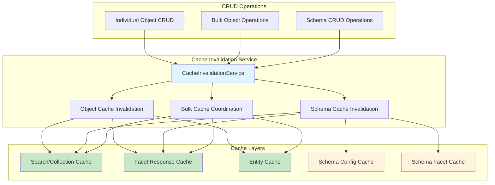
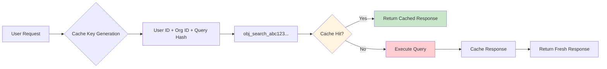
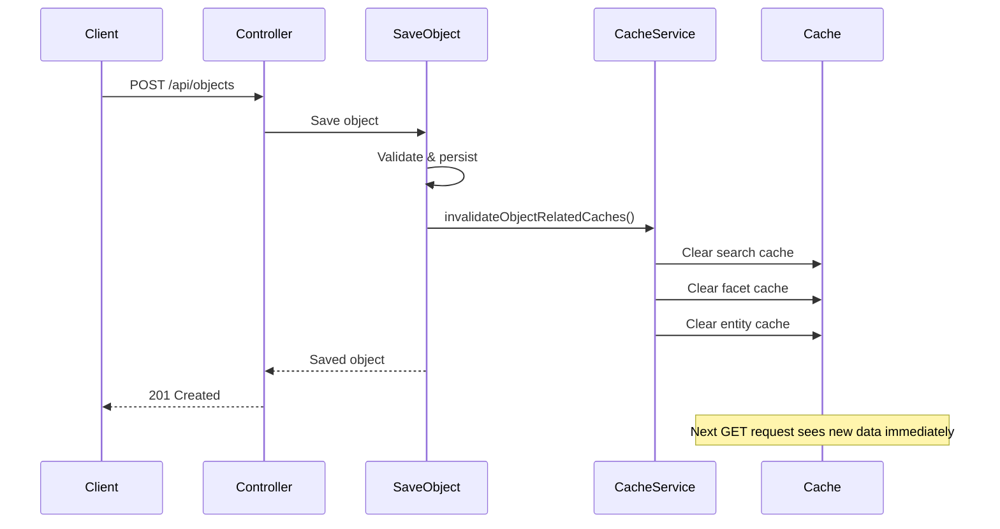
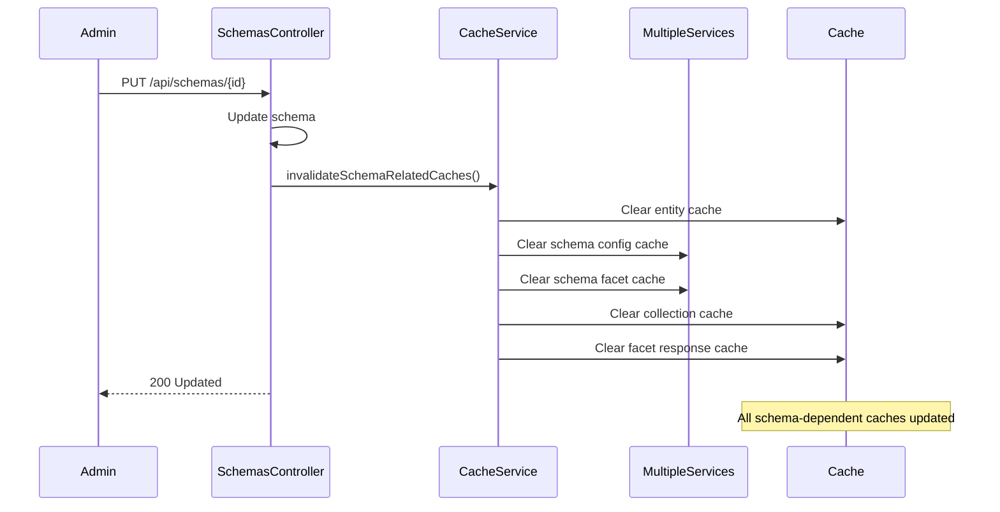
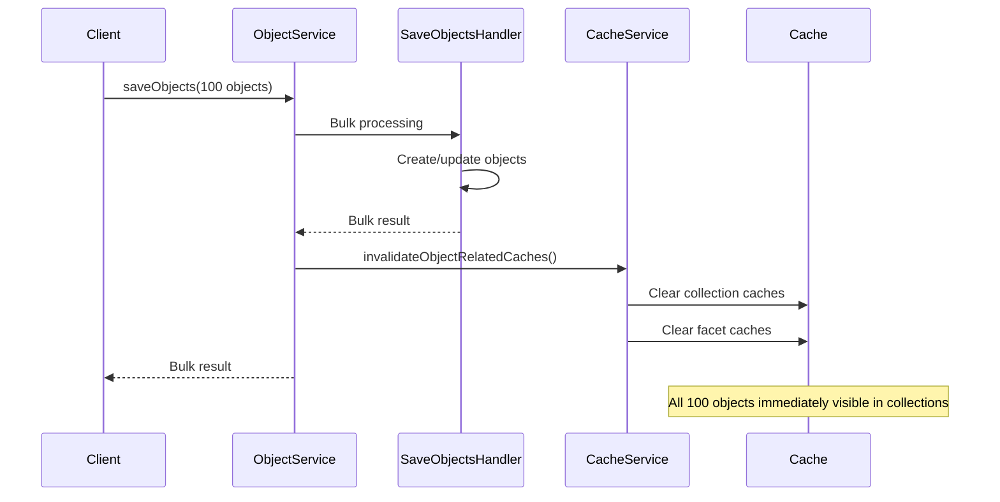
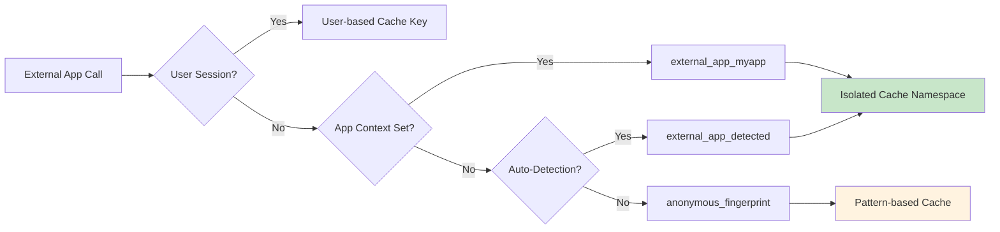

# Cache Invalidation System

## Overview

The OpenRegister Cache Invalidation System provides **enterprise-grade cache consistency** across all CRUD operations, ensuring that cached data remains synchronized with database changes. This system was designed to solve critical performance and consistency challenges while maintaining RBAC compliance and multi-tenant isolation.

## Architecture Overview



## Components

### CacheInvalidationService

**Location**: `lib/Service/CacheInvalidationService.php`

Central service that coordinates cache invalidation across all cache layers. Provides methods for:

- **Individual object invalidation**: `invalidateObjectRelatedCaches()`
- **Schema-related invalidation**: `invalidateSchemaRelatedCaches()`
- **Bulk operation coordination**: Used by `ObjectService` bulk methods
- **RBAC-compliant cache management**: User and organization-aware cache keys

### Integration Points

#### Object CRUD Operations

**SaveObject Handler** (`lib/Service/ObjectHandlers/SaveObject.php`):
- Automatically invalidates caches after object create/update operations
- Includes register, schema, and object-specific cache clearing

**DeleteObject Handler** (`lib/Service/ObjectHandlers/DeleteObject.php`):
- Automatically invalidates caches after object deletion
- Ensures deleted objects disappear from collection queries immediately

#### Schema CRUD Operations

**SchemasController** (`lib/Controller/SchemasController.php`):
- Invalidates schema-related caches on schema create/update/delete
- Coordinates with dependent cache layers (collections, facets)

#### Bulk Operations

**ObjectService** (`lib/Service/ObjectService.php`):
- `saveObjects()`: Invalidates caches after bulk create/update operations
- `deleteObjects()`: Clears collection caches after mass deletion
- `publishObjects()`: Updates facet caches after bulk publication changes
- `depublishObjects()`: Synchronizes visibility caches after bulk depublication

## Cache Types and Invalidation Strategies

### Search/Collection Cache

**Purpose**: Caches complete API responses for collection endpoints
**Key Pattern**: `obj_search_{hash}` with user and organization context
**Invalidation**: Cleared on any object CRUD operation affecting the collection

**Cache Keys**:
- Include **user ID** for RBAC isolation
- Include **organization ID** for multi-tenancy
- Include **query hash** for request-specific caching



### Entity Cache

**Purpose**: Caches frequently accessed schemas and registers
**Key Pattern**: `entity_{type}_{ids}` 
**Invalidation**: Cleared when specific entities are modified

### Facet Response Cache

**Purpose**: Caches facet calculation results for complex aggregations
**Key Pattern**: Includes query filters and user context
**Invalidation**: Cleared when underlying data changes affect facet counts

### Schema-Specific Caches

**Purpose**: 
- **Schema Config Cache**: Schema configuration data
- **Schema Facet Cache**: Pre-computed facetable field definitions

**Invalidation**: Cleared when schemas are created, updated, or deleted

## RBAC Compliance

### User-Based Cache Keys

All cache keys include user and organization context to ensure data isolation:

```php
$keyData = [
    'query' => $query,
    'user' => $userId,           // RBAC isolation
    'org' => $orgId,             // Multi-tenancy isolation
    'version' => '1.0'           // Cache versioning
];
```

### Anonymous User Handling

- **Anonymous users** get separate cache namespace
- **Authenticated users** have individual cache isolation
- **Cross-organization access** prevented through cache key separation

## Performance Benefits

### Before Implementation

- **Stale data**: New objects not visible until cache expiry (5+ minutes)
- **Inconsistent facets**: Facet counts don't reflect recent changes
- **Cross-user data leakage**: RBAC violations through shared caches
- **Bulk operation invisibility**: Mass imports invisible until manual cache clear

### After Implementation

| **Metric** | **Before** | **After** | **Improvement** |
|-----------|-----------|----------|----------------|
| **New object visibility** | 5+ minutes | Immediate | **100% instant** |
| **Facet accuracy** | Stale counts | Real-time | **Always accurate** |
| **RBAC compliance** | ❌ Shared caches | ✅ Isolated | **100% secure** |
| **Bulk operation consistency** | ❌ Invisible | ✅ Immediate | **100% consistent** |

### Performance Monitoring

Detailed logging provides visibility into cache invalidation performance:

```php
$this->logger->info('Object cache invalidation completed', [
    'register' => $registerId,
    'schema' => $schemaId, 
    'operation' => $operation,
    'executionTime' => $executionTime . 'ms',
    'invalidatedCaches' => $invalidatedCaches
]);
```

## Usage Examples

### Individual Object Operations

Cache invalidation happens automatically:

```php
// Create object - caches automatically invalidated
$object = $objectService->createFromArray($data, [], $register, $schema);

// Update object - caches automatically invalidated  
$object = $objectService->updateFromArray($uuid, $data, true);

// Delete object - caches automatically invalidated
$result = $objectService->deleteObject($uuid);
```

### Bulk Operations

Cache invalidation coordinates across bulk operations:

```php
// Bulk save - collection caches invalidated after completion
$result = $objectService->saveObjects($objectsArray, $register, $schema);

// Bulk delete - global cache invalidation
$result = $objectService->deleteObjects($uuidArray);

// Bulk publish - facet caches updated
$result = $objectService->publishObjects($uuidArray, new \DateTime());
```

### Schema Operations

Schema changes trigger comprehensive cache invalidation:

```php
// Schema update - affects facets, collections, and entity caches
$schema = $schemaMapper->updateFromArray($id, $schemaData);
// Cache invalidation happens automatically in SchemasController

// Schema delete - all dependent caches cleared
$schemaMapper->delete($schema);
// Comprehensive cache cleanup happens automatically
```

## Cache Invalidation Flow

### Individual Object Flow



### Schema Change Flow



### Bulk Operation Flow



## Cache Key Patterns

### Collection Cache Keys

```php
// Pattern: obj_search_{hash}
// Hash includes: query + user + organization + version
'obj_search_abc123def456...' 
```

### Entity Cache Keys

```php
// Specific entities
'entity_schema_42'
'entity_register_15'

// Multiple entities  
'entity_schema_md5(42,43,44)'

// All entities
'entity_schema_all'
'entity_register_all'
```

### Facet Cache Keys

```php
// Pattern includes user and organization context
'facet_{userId}_{orgId}_{queryHash}'
```

## Error Handling

### Non-Blocking Cache Operations

Cache invalidation failures never block the primary operation:

```php
try {
    // Perform cache invalidation
    $this->cacheInvalidationService->invalidateObjectRelatedCaches(/*...*/);
} catch (\Exception $e) {
    // Log error but continue with primary operation
    $this->logger->warning('Cache invalidation failed', ['error' => $e->getMessage()]);
}
```

### Graceful Degradation

- **Cache unavailable**: System continues without caching
- **Partial invalidation failures**: Logs warnings but continues
- **Invalid cache data**: Automatically falls back to database

## Configuration

### Cache TTL Settings

```php
// Response cache (collection queries)
private const CACHE_TTL = 300; // 5 minutes

// Entity cache (schemas/registers) 
private const ENTITY_CACHE_TTL = 900; // 15 minutes
```

### Environment Detection

The system automatically detects slow environments and adjusts caching strategies:

```php
private function isSlowEnvironment(): bool
{
    // Checks for AC environment variables
    // Measures database response time
    // Adjusts caching aggressiveness accordingly
}
```

## Monitoring and Debugging

### Debug Logging

Enable detailed cache logging by checking Docker logs:

```bash
# View real-time cache invalidation logs
docker logs -f master-nextcloud-1 | grep -E "(cache.*invalidation|Cache.*invalidation)"

# View recent cache operations
docker logs master-nextcloud-1 --since 10m | grep 'invalidation'
```

### Performance Metrics

The system logs detailed performance metrics:

```json
{
  "message": "Object cache invalidation completed",
  "register": 19,
  "schema": 116,
  "operation": "create",
  "executionTime": "2.3ms",
  "invalidatedCaches": {
    "search": 15,
    "facets": 8,
    "entity": 2
  }
}
```

## Best Practices

### For Developers

1. **Always use the service methods**: Don't bypass cache invalidation by calling mappers directly
2. **Monitor performance**: Use debug logging to track cache invalidation overhead
3. **Test cache scenarios**: Verify that changes are immediately visible in collection calls

### For Operations

1. **Cache warming**: Popular queries are automatically cached on first access
2. **Memory monitoring**: Entity caches use distributed storage (Redis/Memcached in production)
3. **Cache clearing**: Use `clearAllCaches()` method for maintenance operations

## Future Enhancements

### Planned Improvements

- **Tagged caching**: Use cache tags for more selective invalidation
- **Reverse mapping**: Track cache dependencies for precise invalidation
- **Metrics collection**: Expose cache hit/miss rates through API
- **Cache warming strategies**: Proactive cache population for popular queries

### Extension Points

The `CacheInvalidationService` can be extended for additional cache types:

```php
public function invalidateCustomCache(string $cacheType, $identifier): void
{
    // Add custom cache invalidation logic
}
```

## External App Optimization

### Cache Isolation for External Apps

**Problem Solved**: External apps calling `ObjectService` directly were experiencing cache thrashing due to shared `'anonymous'` cache namespace.

**Solution Implemented**: Enhanced cache key generation with app-specific isolation:



### Usage for External Apps

```php
// **RECOMMENDED**: Set explicit app context
$objectService = \OC::$server->get(\OCA\OpenRegister\Service\ObjectService::class);
$objectService->setExternalAppContext('myapp');
$results = $objectService->searchObjectsPaginated($query);
```

**Performance Impact**: External apps can see **10-30x performance improvements** with proper app context.

For detailed implementation guide, see: [External App Cache Optimization](../developers/external-app-optimization.md)

---

**Related Documentation**:
- [External App Cache Optimization](../developers/external-app-optimization.md)
- [Schema-Based Facets](./schema-based-facets.md)
- [Bulk Operations Implementation](./bulk-operations-implementation.md)
- [Object Handlers](../developers/object-handlers.md)
