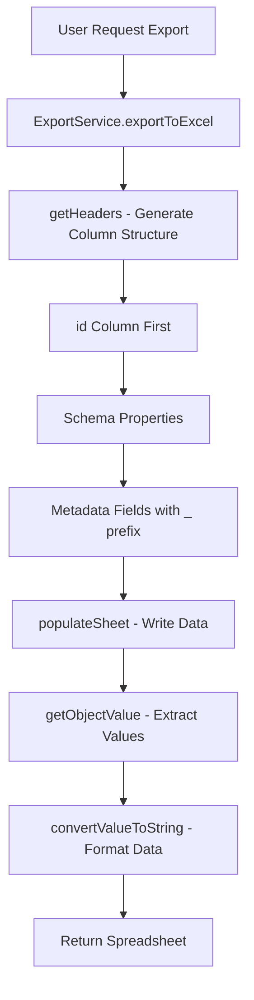
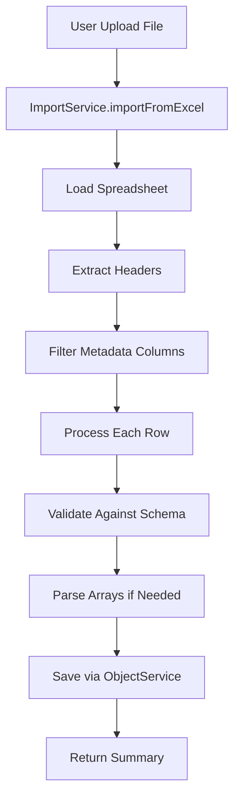

# Import/Export Implementation

This document describes the technical implementation of the import/export functionality in OpenRegister.

## Overview

The import/export system consists of two main services:
- `ExportService`: Handles data export to Excel and CSV formats
- `ImportService`: Handles data import from Excel and CSV formats

## Export Service Implementation

### Class: `ExportService`

Located in `lib/Service/ExportService.php`

#### Key Methods

##### `exportToExcel()`
- Creates a new PhpSpreadsheet instance
- Handles both single schema and multi-schema exports
- Returns a Spreadsheet object ready for download

##### `getHeaders()`
- Generates column headers for export
- **Column Order**:
  1. `id` (always first column)
  2. Schema properties (in schema order)
  3. Metadata fields with `_` prefix (at the end)

##### `getObjectValue()`
- Retrieves values from ObjectEntity objects
- Handles both regular fields and metadata fields
- Uses reflection to dynamically call getter methods
- Converts complex types (arrays, objects) to JSON strings

#### Metadata Field Handling

Metadata fields are automatically included in exports with the following characteristics:

- **Prefix**: All metadata fields are prefixed with `_`
- **Position**: Placed at the end of the export
- **Types**: Handles DateTime, arrays, objects, and scalar values
- **Null Safety**: Gracefully handles null values

#### Available Metadata Fields

```php
$metadataFields = [
    'created',
    'updated', 
    'published',
    'depublished',
    'deleted',
    'locked',
    'owner',
    'organisation',
    'application',
    'folder',
    'size',
    'version',
    'schemaVersion',
    'uri',
    'register',
    'schema',
    'name',
    'description',
    'validation',
    'geo',
    'retention',
    'authorization',
    'groups',
];
```

## Import Service Implementation

### Class: `ImportService`

Located in `lib/Service/ImportService.php`

#### Key Methods

##### `importFromExcel()`
- Loads Excel files using PhpSpreadsheet
- Supports multi-schema imports (one sheet per schema)
- Returns detailed import summary

##### `processSpreadsheet()`
- Processes individual spreadsheet sheets
- Validates headers against schema properties
- Handles data type conversion and array parsing

##### `parseArrayFromString()`
- Converts string representations to arrays
- Supports JSON arrays, comma-separated values, and quoted values
- Includes memory management for large datasets

#### Metadata Column Filtering

The import service automatically filters out metadata columns:

```php
// Skip metadata columns (headers starting with _)
if (str_starts_with($header, '_')) {
    continue;
}
```

This ensures that:
- System metadata is not modified during import
- Only schema-defined properties are processed
- Import integrity is maintained

## Data Flow

### Export Flow



### Import Flow



## Column Structure

### Export Column Order

```
Column A: id (UUID)
Columns B-N: Schema properties (naam, website, type, etc.)
Columns N+1 onwards: Metadata fields (_created, _updated, etc.)
```

### Example Export Structure

For a schema with properties `naam`, `website`, `type`:

| id | naam | website | type | _created | _updated | _owner | _organisation |
|----|------|---------|------|----------|----------|--------|----------------|
| uuid-1 | Test Org | https://example.com | Leverancier | 2024-01-01 10:00:00 | 2024-01-01 10:00:00 | admin | Test Org |

## Error Handling

### Export Errors
- Invalid schema references
- Missing object data
- File system permissions
- Memory limits for large datasets

### Import Errors
- Invalid file format
- Missing required fields
- Schema validation failures
- Duplicate object detection
- Memory management for large files

## Performance Considerations

### Export Optimizations
- Lazy loading of object data
- Streaming for large datasets
- Memory-efficient value conversion
- Batch processing for multiple schemas

### Import Optimizations
- Memory management with garbage collection
- Duplicate detection to prevent loops
- Batch processing of rows
- Error recovery and continuation

## Security Considerations

### Export Security
- Validate user permissions before export
- Sanitize sensitive data in metadata fields
- Limit export size to prevent DoS attacks
- Audit export activities

### Import Security
- Validate file types and content
- Sanitize imported data
- Prevent code injection in array parsing
- Rate limiting for import operations

## Testing

### Unit Tests
- Test individual service methods
- Mock ObjectEntity and Schema objects
- Test error conditions and edge cases
- Validate column structure and data types

### Integration Tests
- Test full export/import cycles
- Validate data integrity across operations
- Test multi-schema scenarios
- Performance testing with large datasets

## Future Enhancements

### Planned Features
- Support for additional file formats (XML, YAML)
- Incremental export/import
- Delta synchronization
- Advanced filtering and selection
- Export templates and customization

### Technical Improvements
- Async processing for large datasets
- Compression for export files
- Caching for frequently accessed data
- Enhanced error reporting and recovery 