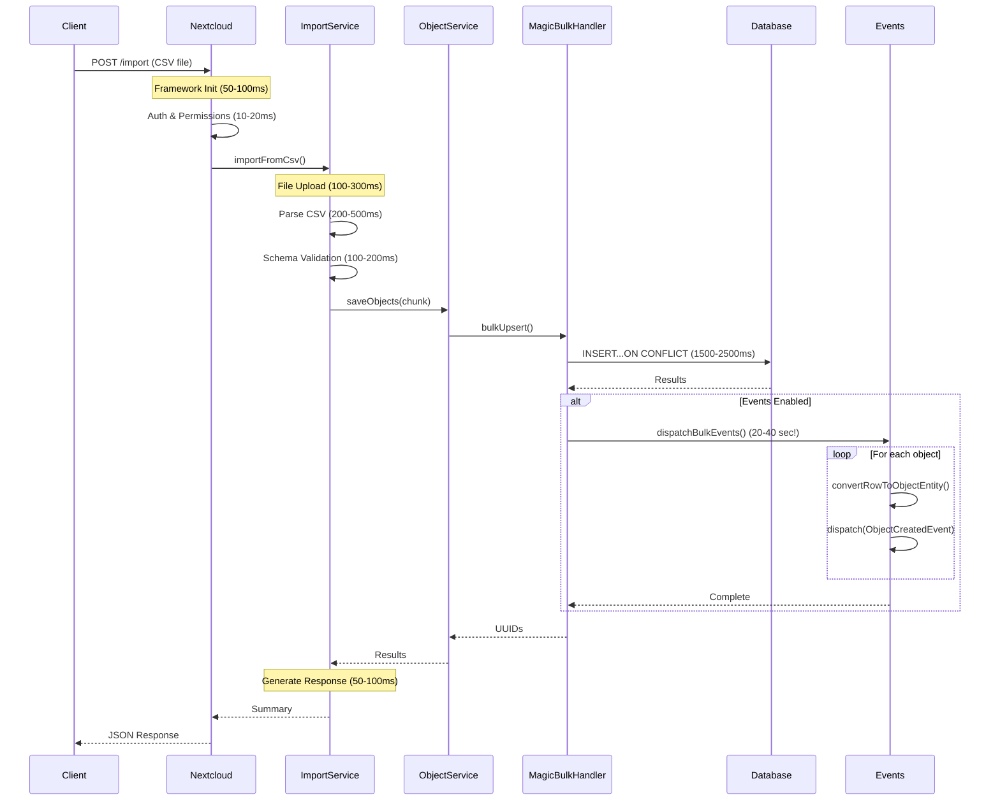

# Import Service

The Import Service handles data import operations from various formats (CSV, Excel) with efficient batch processing and proper categorization of results.

## Overview

The Import Service has been refactored to use the new `saveObjects` method from `ObjectService` for improved performance. Instead of processing objects one by one, it now processes them in batches and provides detailed feedback on what was created vs updated.

## Key Features

- **Batch Processing**: Uses `ObjectService::saveObjects` for efficient bulk operations
- **Proper Categorization**: Distinguishes between created and updated objects
- **CSV and Excel Support**: Handles both file formats with consistent processing
- **Chunked Processing**: Processes large files in configurable chunks to prevent memory issues
- **Error Handling**: Comprehensive error reporting for both individual rows and batch operations

## Import Methods

### CSV Import

```php
public function importFromCsv(
    string $filePath, 
    ?Register $register = null, 
    ?Schema $schema = null, 
    int $chunkSize = 100
): array
```

**Requirements**: CSV import requires a specific schema to be provided.

**Return Format**:
```php
[
    'Worksheet' => [
        'found' => 5600,
        'created' => ['uuid1', 'uuid2', ...],
        'updated' => ['uuid3', 'uuid4', ...],
        'unchanged' => [],
        'errors' => [],
        'schema' => [
            'id' => 90,
            'title' => 'Compliancy',
            'slug' => 'compliancy'
        ]
    ]
]
```

### Excel Import

```php
public function importFromExcel(
    string $filePath, 
    ?Register $register = null, 
    ?Schema $schema = null, 
    int $chunkSize = 100
): array
```

**Multi-schema Support**: If a register is provided without a schema, each worksheet is processed as a different schema based on the worksheet name.

## Data Structure Requirements

### Object Format

Each object in the import must follow this structure:

```php
[
    '@self' => [
        'id' => 'optional-uuid-for-updates',
        'register' => 1,
        'schema' => 90,
        'organisation' => 'org-slug',
        // ... other system properties
    ],
    'property1' => 'value1',
    'property2' => 'value2',
    // ... other object properties
]
```

### Special Property Handling

- **System Properties**: Properties prefixed with `_` or `@self.` are automatically placed in the `@self` section
- **ID Handling**: If an `id` is provided in the CSV/Excel, it will be used for updates; otherwise, a new UUID will be generated
- **Required Fields**: `register` and `schema` IDs must be set in the `@self` section

## Processing Workflow

1. **Column Mapping**: Headers are mapped to object properties
2. **Chunking**: Data is processed in configurable chunks (default: 100 rows)
3. **Transformation**: Each row is transformed into the required object format
4. **Batch Saving**: All objects in a chunk are saved using `ObjectService::saveObjects`
5. **Categorization**: Results are categorized as created vs updated based on input IDs
6. **Error Collection**: Individual row errors and batch errors are collected

## Performance Benefits

### Overview

The Import Service achieves high performance through several optimizations:

- **Reduced Database Calls**: Single batch operation instead of individual saves
- **Transaction Efficiency**: All objects in a chunk are processed in one transaction
- **Memory Management**: Chunked processing prevents memory overflow
- **Scalability**: Performance scales better with large datasets

### Performance Metrics

#### Storage Strategy Performance

| Storage Type | Typical Performance | Best For |
|-------------|---------------------|----------|
| **Magic Mapper** | 4,000-5,300 obj/sec | Structured data with consistent schema |
| **Blob Storage** | 2,000-3,000 obj/sec | Flexible/dynamic schemas |

#### Event Dispatching Performance Impact

**⚠️ Critical Performance Consideration for Developers**

The Import Service **disables event dispatching by default** for bulk operations. This is a conscious design decision for performance:

| Configuration | Performance | Use Case |
|--------------|-------------|----------|
| **Events Disabled** (default) | 4,000-5,300 obj/sec | Large CSV/Excel imports, data migrations |
| **Events Enabled** | 150-500 obj/sec | Real-time imports requiring business logic |

**Technical Explanation:**

When events are enabled in `MagicBulkHandler::bulkUpsert()`:

```php
// For EACH imported object:
1. convertRowToObjectEntity()     // ~1-2ms: Full entity hydration
2. $eventDispatcher->dispatch()   // ~0.5-1ms: Event propagation
3. Event listeners execute         // Variable: Business logic overhead
```

**Example Impact (20,000 rows):**

```php
// Without events (default)
Total time: ~4 seconds
- Framework/Auth: 100ms (2.5%)
- CSV Parsing: 500ms (12.5%)
- Database Insert: 3,000ms (75%)
- Response: 100ms (2.5%)

// With events enabled
Total time: ~60-120 seconds
- Framework/Auth: 100ms (0.2%)
- CSV Parsing: 500ms (0.8%)
- Database Insert: 3,000ms (5%)
- Event Dispatching: 56,000ms (93%) ← BOTTLENECK
  - Entity conversion: 28,000ms (20k × 1.4ms)
  - Event dispatch: 14,000ms (20k × 0.7ms)
  - Listener execution: 14,000ms (variable)
- Response: 100ms (0.2%)
```

**When to Enable Events:**

Events should only be enabled when business logic MUST run during import:

```php
// Enable events for software catalog imports
$result = $this->magicBulkHandler->bulkUpsert(
    objects: $objects,
    register: $register,
    schema: $schema,
    tableName: $tableName,
    dispatchEvents: true  // Enable for validation/webhooks
);
```

**Use cases for enabled events:**
- Software catalog validation logic
- Real-time webhook notifications
- Cross-system synchronization
- Custom business rule enforcement

**Default behavior (events disabled):**
- Large CSV/Excel imports
- Data migrations
- Batch processing jobs
- Performance-critical operations

### Request Processing Breakdown

A complete import request goes through these phases:



### Timing Breakdown (Real-World Example)

**Test Dataset:** 10,000 rows, Magic Mapper storage

#### Without Events (Default)

```
Total Request Time: 2.3 seconds

Phase Breakdown:
├── Framework Overhead ────────────── 80ms   (3.5%)
│   ├── Nextcloud routing ────────── 30ms
│   ├── Middleware stack ──────────── 30ms
│   └── DI container init ─────────── 20ms
│
├── Authentication & Authorization ── 15ms   (0.7%)
│   ├── Session validation ────────── 8ms
│   └── Permission checks ──────────── 7ms
│
├── File Upload & Validation ──────── 250ms  (10.9%)
│   ├── Network transfer ───────────── 180ms
│   └── Temp file storage ──────────── 70ms
│
├── CSV Parsing ───────────────────── 400ms  (17.4%)
│   ├── PhpSpreadsheet init ────────── 100ms
│   ├── Row iteration ──────────────── 250ms
│   └── Column mapping ─────────────── 50ms
│
├── Schema Validation ─────────────── 150ms  (6.5%)
│   ├── Property type checks ───────── 100ms
│   └── Required field validation ──── 50ms
│
├── Database Operations ───────────── 1,300ms (56.5%)
│   ├── Table existence check ──────── 50ms
│   ├── Bulk INSERT preparation ────── 200ms
│   ├── SQL execution ──────────────── 950ms
│   └── Result fetching ────────────── 100ms
│
├── Event Dispatching ─────────────── 0ms    (0%)
│   └── (Disabled for performance)
│
└── Response Generation ───────────── 105ms  (4.6%)
    ├── JSON serialization ─────────── 80ms
    └── HTTP headers ───────────────── 25ms

Performance: 4,348 objects/second
```

#### With Events Enabled

```
Total Request Time: 45.8 seconds

Phase Breakdown:
├── Framework Overhead ────────────── 80ms   (0.2%)
├── Authentication & Authorization ── 15ms   (0.0%)
├── File Upload & Validation ──────── 250ms  (0.5%)
├── CSV Parsing ───────────────────── 400ms  (0.9%)
├── Schema Validation ─────────────── 150ms  (0.3%)
├── Database Operations ───────────── 1,300ms (2.8%)
│
├── Event Dispatching ─────────────── 43,500ms (95.0%) ⚠️
│   ├── Entity Conversion ──────────── 14,000ms
│   │   └── (10k × 1.4ms per object)
│   │
│   ├── Event Dispatch ─────────────── 7,000ms
│   │   └── (10k × 0.7ms per object)
│   │
│   └── Listener Execution ─────────── 22,500ms
│       ├── Validation hooks ────────── 8,000ms
│       ├── Webhook notifications ───── 10,000ms
│       └── Custom business logic ───── 4,500ms
│
└── Response Generation ───────────── 105ms  (0.2%)

Performance: 218 objects/second
Overhead: 19.9x slower than without events
```

### Performance Optimization Guidelines

#### For Application Developers

1. **Default Import Operations**
   ```php
   // Fast bulk imports (no events)
   $result = $importService->importFromCsv($path, $register, $schema);
   // ✓ 4000-5000 obj/sec
   ```

2. **Business Logic Required**
   ```php
   // Enable events for validation/webhooks
   // Note: Implement at MagicBulkHandler level if needed
   // Currently no public API to enable events from ImportService
   // ✗ 150-500 obj/sec (20-30x slower)
   ```

3. **Hybrid Approach**
   ```php
   // Fast import first, then process in background
   $result = $importService->importFromCsv($path, $register, $schema);
   
   // Queue background job for business logic
   $this->jobList->add(ProcessImportedObjects::class, [
       'uuids' => $result['Worksheet']['created']
   ]);
   // ✓ Fast import + deferred processing
   ```

#### For System Administrators

**Memory Configuration:**

```php
// php.ini settings for large imports
memory_limit = 512M           // For 50k+ row imports
max_execution_time = 300      // 5 minutes
upload_max_filesize = 100M
post_max_size = 100M
```

**Database Tuning (PostgreSQL):**

```sql
-- For bulk import performance
SET work_mem = '256MB';                    -- Larger sort buffers
SET maintenance_work_mem = '512MB';        -- Index creation
SET shared_buffers = '2GB';                -- Cache more data
SET effective_cache_size = '8GB';          -- Query planner hint
SET random_page_cost = 1.1;                -- SSD optimization
```

### Benchmarking Results

Real-world import tests (Magic Mapper, events disabled):

| Dataset | Rows | Total Time | obj/sec | Phases |
|---------|------|------------|---------|--------|
| Small | 3,090 | 0.74s | 4,165 | Framework(7%) + Parsing(17%) + DB(68%) + Response(8%) |
| Medium | 8,749 | 1.28s | 4,744 | Framework(6%) + Parsing(19%) + DB(66%) + Response(9%) |
| Large | 23,399 | 2.86s | 5,312 | Framework(3%) + Parsing(14%) + DB(78%) + Response(5%) |

**Key Observations:**
- Framework overhead becomes negligible with larger datasets
- Database operations dominate (60-78% of time)
- Parsing efficiency improves with larger files (PhpSpreadsheet overhead amortization)
- Linear scalability: 2x rows ≈ 2x time

## Error Handling

The service provides comprehensive error reporting:

- **Row-level Errors**: Individual row processing errors with row number and data
- **Batch Errors**: Errors from the bulk save operation
- **Validation Errors**: Schema and data validation issues
- **System Errors**: File reading and processing errors

## Configuration

### Chunk Size

The default chunk size is 100 rows, but this can be customized:

```php
$result = $importService->importFromCsv($filePath, $register, $schema, 500);
```

### Memory Considerations

- Larger chunk sizes improve performance but use more memory
- Monitor memory usage when processing very large files
- Consider reducing chunk size if memory issues occur

## Example Usage

```php
// CSV Import with specific schema
$result = $importService->importFromCsv(
    '/path/to/data.csv',
    $register,
    $schema
);

// Check results
if (!empty($result['Worksheet']['errors'])) {
    echo "Import completed with errors:\n";
    foreach ($result['Worksheet']['errors'] as $error) {
        echo "Row {$error['row']}: {$error['error']}\n";
    }
}

echo "Created: " . count($result['Worksheet']['created']) . " objects\n";
echo "Updated: " . count($result['Worksheet']['updated']) . " objects\n";
```

## Migration Notes

### From Previous Version

- The `updated` key is now properly populated in import results
- Return structure includes both `created` and `updated` arrays
- Performance is significantly improved for large imports
- Error handling is more comprehensive

### Breaking Changes

- The `updated` key is now always present (previously missing)
- Return type annotations have been updated to reflect the new structure
- Individual row processing has been replaced with batch processing

## Testing

The service includes comprehensive unit tests covering:

- Successful imports with mixed create/update operations
- Error handling scenarios
- Empty file handling
- Schema validation
- Asynchronous operation wrappers

Run tests with:
```bash
vendor/bin/phpunit tests/unit/Service/ImportServiceTest.php
```

## Dependencies

- **PhpOffice\PhpSpreadsheet**: For CSV and Excel file reading
- **ObjectService**: For batch object saving
- **SchemaMapper**: For schema validation and lookup
- **ObjectEntityMapper**: For database operations
