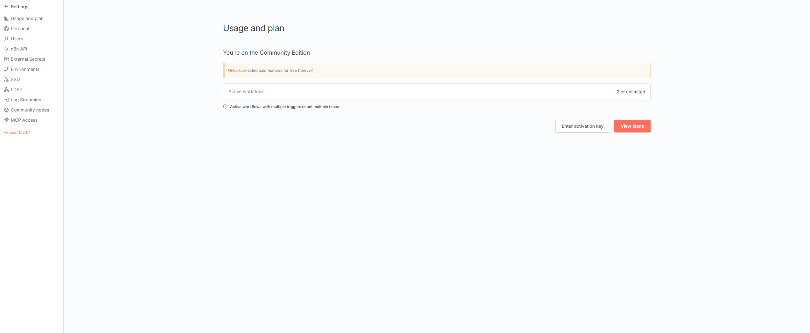
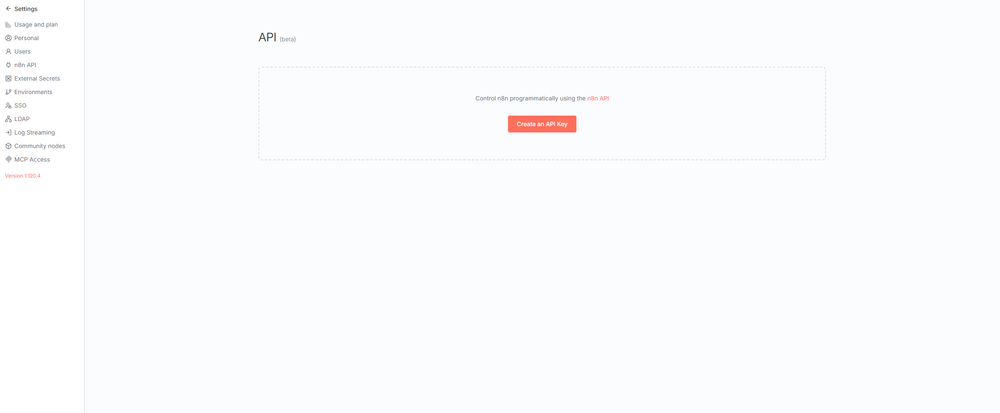
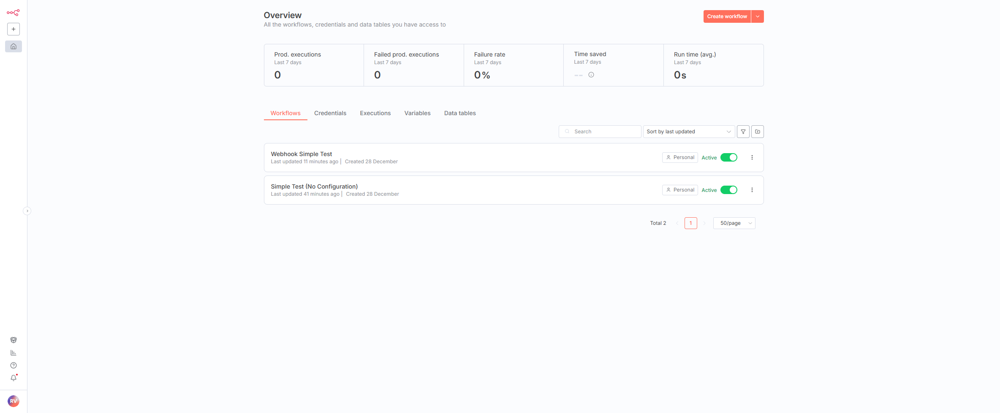
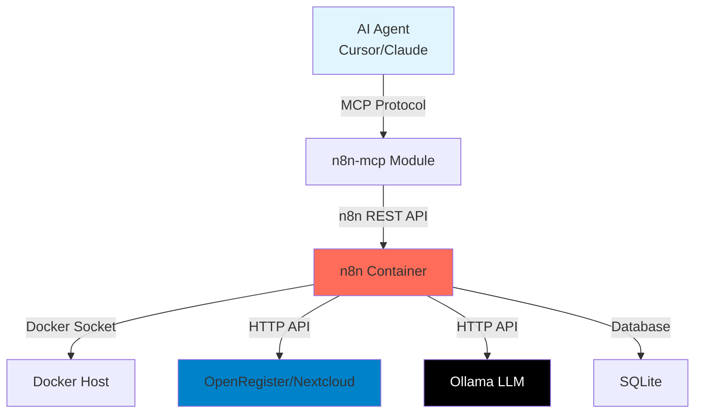

# n8n MCP Integration

## Overview

OpenRegister includes built-in support for the Model Context Protocol (MCP) integration with n8n, enabling AI agents to programmatically control workflow automation.

## What is n8n?

[n8n](https://n8n.io) is a powerful workflow automation tool that allows you to connect different services and automate tasks. Think of it as a more flexible, self-hosted alternative to Zapier or IFTTT.

## What is MCP?

The Model Context Protocol (MCP) is an open standard that enables AI assistants (like Cursor, Claude Desktop, etc.) to connect to external tools and data sources. With MCP, AI agents can:

- 🔍 Discover available tools and workflows.
- ⚡ Execute workflows programmatically.
- 📝 Create and modify workflows.
- 🐛 Debug workflow executions.
- 📚 Access documentation.

## Why Use n8n MCP in OpenRegister?

Combining n8n with MCP provides powerful capabilities:

1. **AI-Assisted Development**: AI agents can help you create, test, and debug workflows.
2. **Automated Testing**: Programmatically execute workflows as part of your CI/CD pipeline.
3. **Intelligent Debugging**: AI can analyze workflow failures and suggest fixes.
4. **Code Quality Automation**: Use workflows for automated PHPCS fixing, linting, testing, and more.
5. **Integration Hub**: Connect OpenRegister with hundreds of external services.

## Features

### ✅ Included in OpenRegister

- Pre-configured n8n container with Docker socket access.
- n8n-mcp module integration.
- Ready-to-use workflow templates for PHPCS automation.
- Comprehensive documentation and examples.

### 🔧 Capabilities

- Execute workflows from Cursor or Claude Desktop.
- AI-powered workflow creation and debugging.
- Integrate with Ollama for local LLM inference.
- Access n8n node documentation via MCP.
- Webhook-based workflow triggers.

## Quick Start

1. **Start n8n:**
   ```bash
   docker-compose --profile n8n up -d
   ```

2. **Configure MCP in Cursor:**
   - Edit `~/.cursor/mcp.json`
   - Add the n8n MCP server configuration
   - Restart Cursor

3. **Test the integration:**
   - Ask your AI agent: "List my n8n workflows"

For detailed setup instructions, see the [Setup Guide](./setup.md).

## Documentation

- [📖 Setup Guide](./setup.md) - Complete installation and configuration instructions.
- [🔧 Troubleshooting](./troubleshooting.md) - Common issues and solutions.
- [💡 Use Cases](./use-cases.md) - Example workflows and integrations.
- [🔐 Security](./security.md) - Best practices for securing your n8n instance.

## Screenshots

### n8n Settings


*The n8n settings menu showing various configuration options including MCP Access (Enterprise feature).*

### n8n API Configuration


*Generate API keys for secure MCP authentication.*

### n8n Workflows


*The n8n workflow overview showing available automation workflows.*

## Architecture



## Example Use Cases

### 1. Automated PHPCS Fixing

Use n8n with Ollama to automatically fix PHP coding standard violations:

```
AI Agent → n8n → Run PHPCS → Parse Errors → 
  Ollama (CodeLlama) → Generate Fixes → Apply to Files → 
  Run Tests → Commit Changes
```

### 2. Webhook-Based CI/CD

Trigger workflows from Git webhooks for automated testing and deployment:

```
GitHub Push → Webhook → n8n → Run Tests → 
  Deploy if Passed → Notify Team
```

### 3. AI-Powered Code Review

Automatically analyze code changes and provide AI-powered feedback:

```
Pull Request → n8n → Extract Diff → 
  Ollama (Analysis) → Post Review Comments
```

## Community Edition vs. Enterprise

OpenRegister uses the **n8n Community Edition** (free, open-source). Some features are Enterprise-only:

| Feature | Community | Enterprise |
|---------|-----------|------------|
| Workflow Automation | ✅ | ✅ |
| API Access | ✅ | ✅ |
| Docker Integration | ✅ | ✅ |
| MCP via n8n-mcp | ✅ | ✅ |
| Built-in MCP Server | ❌ | ✅ |
| OAuth2 for MCP | ❌ | ✅ |
| LDAP/SSO | ❌ | ✅ |

**Note:** We use the open-source `n8n-mcp` package, which works with the Community Edition.

## Technical Details

- **Container:** `openregister-n8n`
- **Port:** 5678
- **Volume:** `n8n` (persistent data storage)
- **User:** `root` (for Docker socket access)
- **Default Credentials:** admin / admin (⚠️ change in production!)
- **MCP Package:** [n8n-mcp](https://www.npmjs.com/package/n8n-mcp) v2.31.3+

## Next Steps

1. Follow the [Setup Guide](./setup.md) to configure MCP.
2. Explore [example workflows](./use-cases.md).
3. Learn about [security best practices](./security.md).
4. Read the [troubleshooting guide](./troubleshooting.md) if you encounter issues.

## References

- [n8n Official Documentation](https://docs.n8n.io/)
- [n8n-mcp npm Package](https://www.npmjs.com/package/n8n-mcp)
- [Model Context Protocol](https://modelcontextprotocol.io/)
- [OpenRegister Documentation](/docs/intro)


