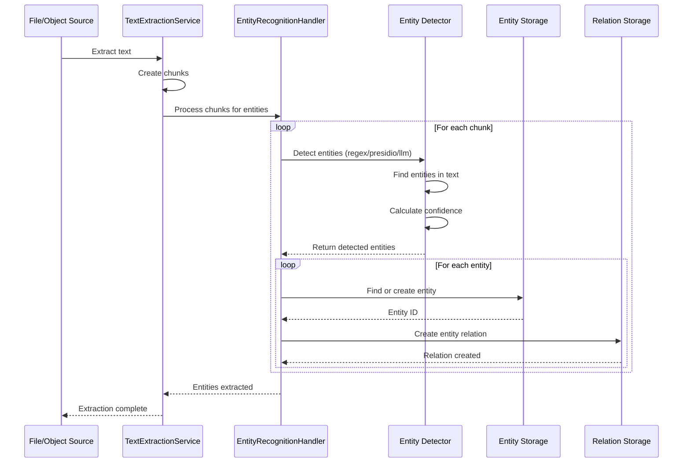

# Named Entity Recognition Technical Documentation

> **📚 Feature Documentation**: See **[Text Extraction, Vectorization & Named Entity Recognition](../Features/text-extraction-vectorization-ner.md)** for user-facing documentation and overview.

## Overview

OpenRegister's EntityRecognitionHandler extracts entities (persons, organizations, emails, etc.) from text chunks for GDPR compliance and data classification. The handler is integrated into the TextExtractionService workflow and automatically processes chunks after they are created. It supports multiple detection methods and stores entities in a GDPR register.

## Architecture

### Service Flow



## Service Implementation

### EntityRecognitionHandler

**Location**: `lib/Service/TextExtraction/EntityRecognitionHandler.php`

**Integration**: Automatically invoked by `TextExtractionService` after chunks are created.

**Key Methods**:

```php
/**
 * Process chunks for a source and extract entities.
 * This method is called after chunks are created to detect and store entities.
 */
public function processSourceChunks(string $sourceType, int $sourceId, array $options = []): array
{
    // Get all chunks for this source (excluding metadata chunks)
    $chunks = $this->chunkMapper->findBySource($sourceType, $sourceId);
    
    foreach ($chunks as $chunk) {
        $result = $this->extractFromChunk($chunk, $options);
    }
    
    return [
        'chunks_processed' => $chunksProcessed,
        'entities_found' => $totalEntities,
        'relations_created' => $totalRelations,
    ];
}

/**
 * Extract entities from a text chunk.
 */
public function extractFromChunk(Chunk $chunk, array $options = []): array
{
    $method = $options['method'] ?? 'hybrid';
    $entityTypes = $options['entity_types'] ?? null;
    $confidenceThreshold = (float) ($options['confidence_threshold'] ?? 0.5);
    
    $text = $chunk->getTextContent();
    
    // Detect entities using selected method
    $detectedEntities = $this->detectEntities($text, $method, $entityTypes, $confidenceThreshold);
    
    // Store entities and create relations
    $entitiesFound = 0;
    $relationsCreated = 0;
    
    foreach ($detectedEntities as $detected) {
        // Find or create entity
        $entity = $this->findOrCreateEntity(
            $detected['type'],
            $detected['value'],
            $detected['category'] ?? $this->getCategoryForType($detected['type'])
        );
        
        // Create entity relation
        $relation = new EntityRelation();
        $relation->setEntityId($entity->getId());
        $relation->setChunkId($chunk->getId());
        $relation->setPositionStart($detected['position_start']);
        $relation->setPositionEnd($detected['position_end']);
        $relation->setConfidence($detected['confidence']);
        $relation->setDetectionMethod($method);
        $relation->setContext($this->extractContext($text, $detected['position_start'], $detected['position_end']));
        
        // Set source references
        if ($chunk->getSourceType() === 'file') {
            $relation->setFileId($chunk->getSourceId());
        } else if ($chunk->getSourceType() === 'object') {
            $relation->setObjectId($chunk->getSourceId());
        }
        
        $this->entityRelationMapper->insert($relation);
        $entitiesFound++;
        $relationsCreated++;
    }
    
    return [
        'entities_found' => $entitiesFound,
        'relations_created' => $relationsCreated,
    ];
}
```

## Database Schema

### Entity Table (GDPR Register)

**Table**: `oc_openregister_entities`

```sql
CREATE TABLE oc_openregister_entities (
    id BIGINT AUTO_INCREMENT PRIMARY KEY,
    uuid VARCHAR(255) NOT NULL UNIQUE,
    type VARCHAR(50) NOT NULL,
    value TEXT NOT NULL,
    category VARCHAR(50) NOT NULL,
    belongs_to_entity_id BIGINT,
    metadata JSON,
    owner VARCHAR(255),
    organisation VARCHAR(255),
    detected_at DATETIME NOT NULL DEFAULT CURRENT_TIMESTAMP,
    updated_at DATETIME NOT NULL DEFAULT CURRENT_TIMESTAMP ON UPDATE CURRENT_TIMESTAMP,
    
    INDEX idx_type (type),
    INDEX idx_category (category),
    INDEX idx_detected (detected_at),
    INDEX idx_value_hash (value(255)),
    INDEX idx_owner (owner),
    INDEX idx_organisation (organisation),
    INDEX idx_belongs_to (belongs_to_entity_id),
    
    FOREIGN KEY (belongs_to_entity_id) REFERENCES oc_openregister_entities(id) ON DELETE SET NULL
) ENGINE=InnoDB DEFAULT CHARSET=utf8mb4 COLLATE=utf8mb4_unicode_ci;
```

**Key Fields**:
- `type`: Entity type (PERSON, EMAIL, PHONE, ORGANIZATION, etc.)
- `value`: The entity value (e.g., 'john.doe@example.com')
- `category`: Classification (personal_data, sensitive_pii, business_data)
- `belongs_to_entity_id`: Parent entity (e.g., phone belongs to person)

### Entity Relation Table

**Table**: `oc_openregister_entity_relations`

```sql
CREATE TABLE oc_openregister_entity_relations (
    id BIGINT AUTO_INCREMENT PRIMARY KEY,
    entity_id BIGINT NOT NULL,
    chunk_id BIGINT NOT NULL,
    role VARCHAR(50),
    file_id BIGINT,
    object_id BIGINT,
    email_id BIGINT,
    position_start INT NOT NULL,
    position_end INT NOT NULL,
    confidence DECIMAL(3,2) NOT NULL,
    detection_method VARCHAR(50) NOT NULL,
    context TEXT,
    anonymized BOOLEAN NOT NULL DEFAULT FALSE,
    anonymized_value VARCHAR(255),
    created_at DATETIME NOT NULL DEFAULT CURRENT_TIMESTAMP,
    
    INDEX idx_entity (entity_id),
    INDEX idx_chunk (chunk_id),
    INDEX idx_file (file_id),
    INDEX idx_object (object_id),
    INDEX idx_confidence (confidence),
    INDEX idx_anonymized (anonymized),
    
    FOREIGN KEY (entity_id) REFERENCES oc_openregister_entities(id) ON DELETE CASCADE,
    FOREIGN KEY (chunk_id) REFERENCES oc_openregister_chunks(id) ON DELETE CASCADE
) ENGINE=InnoDB DEFAULT CHARSET=utf8mb4 COLLATE=utf8mb4_unicode_ci;
```

**Key Fields**:
- `entity_id`: Reference to Entity
- `chunk_id`: Reference to Chunk
- `position_start` / `position_end`: Character positions in chunk
- `confidence`: Detection confidence (0.00-1.00)
- `detection_method`: How it was found (regex, presidio, llm, hybrid)
- `context`: Surrounding text for verification

## Entity Types

### Supported Entity Types

| Entity Type | Description | Examples | GDPR Category |
|-------------|-------------|----------|---------------|
| **PERSON** | Individual names | John Doe, Jane Smith | Personal Data |
| **EMAIL** | Email addresses | john@example.com | Personal Data |
| **PHONE** | Phone numbers | +31 6 12345678 | Personal Data |
| **ADDRESS** | Physical addresses | 123 Main St, Amsterdam | Personal Data |
| **ORGANIZATION** | Company/org names | Acme Corporation | Business Data |
| **LOCATION** | Geographic locations | Amsterdam, Netherlands | Contextual Data |
| **DATE** | Dates and times | 2025-01-15, January 15th | Temporal Data |
| **IBAN** | Bank account numbers | NL91 ABNA 0417 1643 00 | Sensitive PII |
| **SSN** | Social security numbers | 123-45-6789 | Sensitive PII |
| **IP_ADDRESS** | IP addresses | 192.168.1.1 | Contextual Data |

### Entity Categories

| Category | Description | Examples |
|----------|-------------|----------|
| **personal_data** | Personal identifiable information | PERSON, EMAIL, PHONE, ADDRESS |
| **sensitive_pii** | Highly sensitive PII | IBAN, SSN |
| **business_data** | Business-related entities | ORGANIZATION |
| **contextual_data** | Contextual information | LOCATION, IP_ADDRESS |
| **temporal_data** | Time-related information | DATE |

## Detection Methods

### 1. Regex Patterns (Local)

**Status**: ✅ Implemented

**Advantages**:
- No external dependencies
- Fast processing (~10-50ms per chunk)
- Privacy-friendly (no data leaves server)

**Limitations**:
- Lower accuracy for complex cases
- Limited context awareness

**Supported Entities**:
- Email addresses
- Phone numbers
- IBANs
- Basic patterns

**Implementation**:

```php
private function detectWithRegex(string $text, ?array $entityTypes, float $confidenceThreshold): array
{
    $entities = [];
    
    // Email detection
    if ($entityTypes === null || in_array(self::ENTITY_TYPE_EMAIL, $entityTypes, true)) {
        if (preg_match_all('/\b[A-Za-z0-9._%+-]+@[A-Za-z0-9.-]+\.[A-Z|a-z]{2,}\b/', $text, $matches, PREG_OFFSET_CAPTURE)) {
            foreach ($matches[0] as $match) {
                $entities[] = [
                    'type' => self::ENTITY_TYPE_EMAIL,
                    'value' => $match[0],
                    'category' => self::CATEGORY_PERSONAL_DATA,
                    'position_start' => $match[1],
                    'position_end' => $match[1] + strlen($match[0]),
                    'confidence' => 0.9,
                ];
            }
        }
    }
    
    // Phone detection
    if ($entityTypes === null || in_array(self::ENTITY_TYPE_PHONE, $entityTypes, true)) {
        $phonePattern = '/\+?[1-9]\d{1,14}|\+?31\s?[0-9]{9}|\d{3}[-.\s]?\d{3}[-.\s]?\d{4}/';
        if (preg_match_all($phonePattern, $text, $matches, PREG_OFFSET_CAPTURE)) {
            foreach ($matches[0] as $match) {
                $entities[] = [
                    'type' => self::ENTITY_TYPE_PHONE,
                    'value' => $match[0],
                    'category' => self::CATEGORY_PERSONAL_DATA,
                    'position_start' => $match[1],
                    'position_end' => $match[1] + strlen($match[0]),
                    'confidence' => 0.7,
                ];
            }
        }
    }
    
    // Filter by confidence threshold
    return array_filter($entities, fn($e) => $e['confidence'] >= $confidenceThreshold);
}
```

### 2. Presidio (External Service)

**Status**: 📝 Planned (TODO)

**Advantages**:
- High accuracy
- Specialized for PII detection
- Maintained by experts

**Limitations**:
- Requires external service
- Data sent to external API
- Network latency

**Implementation** (Planned):

```php
private function detectWithPresidio(string $text, ?array $entityTypes, float $confidenceThreshold): array
{
    // TODO: Implement Presidio integration
    // For now, fall back to regex
    $this->logger->debug('[EntityRecognitionHandler] Presidio not yet implemented, using regex fallback');
    return $this->detectWithRegex($text, $entityTypes, $confidenceThreshold);
}
```

### 3. LLM-Based (AI)

**Status**: 📝 Planned (TODO)

**Advantages**:
- Context-aware detection
- Handles ambiguity
- Can detect complex entities

**Limitations**:
- Slower processing (~500-2000ms per chunk)
- Higher cost
- Requires API access

**Implementation** (Planned):

```php
private function detectWithLLM(string $text, ?array $entityTypes, float $confidenceThreshold): array
{
    // TODO: Implement LLM-based entity extraction
    // For now, fall back to regex
    $this->logger->debug('[EntityRecognitionHandler] LLM extraction not yet implemented, using regex fallback');
    return $this->detectWithRegex($text, $entityTypes, $confidenceThreshold);
}
```

### 4. Hybrid Approach (Recommended)

**Status**: ✅ Implemented

**Process**:
1. Start with regex for fast detection
2. Validate high-confidence entities
3. Use Presidio/LLM for ambiguous cases (planned)

**Implementation**:

```php
private function detectWithHybrid(string $text, ?array $entityTypes, float $confidenceThreshold): array
{
    // Start with regex for fast detection
    $regexEntities = $this->detectWithRegex($text, $entityTypes, $confidenceThreshold);
    
    // TODO: Add Presidio validation for higher confidence
    // TODO: Add LLM validation for ambiguous cases
    
    return $regexEntities;
}
```

## Entity Storage

### Finding or Creating Entities

```php
private function findOrCreateEntity(string $type, string $value, string $category): GdprEntity
{
    // Try to find existing entity by value and type
    try {
        $qb = $this->entityMapper->getQueryBuilder();
        $qb->select('*')
            ->from('openregister_entities')
            ->where($qb->expr()->eq('type', $qb->createNamedParameter($type)))
            ->andWhere($qb->expr()->eq('value', $qb->createNamedParameter($value)))
            ->setMaxResults(1);
        
        $existing = $this->entityMapper->findEntity($qb);
        
        // Update timestamp
        $existing->setUpdatedAt(new DateTime());
        $this->entityMapper->update($existing);
        
        return $existing;
    } catch (DoesNotExistException $e) {
        // Entity doesn't exist, create new one
        $entity = new GdprEntity();
        $entity->setUuid(Uuid::v4()->toString());
        $entity->setType($type);
        $entity->setValue($value);
        $entity->setCategory($category);
        $entity->setDetectedAt(new DateTime());
        $entity->setUpdatedAt(new DateTime());
        
        return $this->entityMapper->insert($entity);
    }
}
```

## Performance

### Processing Times

| Method | Time per Chunk | Notes |
|--------|----------------|-------|
| **Regex** | 10-50ms | Fast, local |
| **Presidio** | 100-300ms | External API call |
| **LLM** | 500-2000ms | AI processing |
| **Hybrid** | 10-2000ms | Depends on validation needs |

### Recommendations

1. **Batch Processing**: Process enhancements in background jobs
2. **Selective Enhancement**: Only enable features you need
3. **Hybrid NER**: Use fast regex first, validate with LLM only when needed
4. **Confidence Threshold**: Adjust based on use case (default: 0.5)

## API Endpoints

### Entity Extraction

```http
POST /api/chunks/{chunkId}/extract-entities
Content-Type: application/json

{
  "method": "hybrid",
  "confidence_threshold": 0.7,
  "entity_types": ["PERSON", "EMAIL", "PHONE"]
}
```

**Response**:
```json
{
  "entities_found": 5,
  "relations_created": 5,
  "entities": [
    {
      "type": "PERSON",
      "value": "John Doe",
      "confidence": 0.95
    },
    {
      "type": "EMAIL",
      "value": "john@example.com",
      "confidence": 0.9
    }
  ]
}
```

### GDPR Reports

```http
GET /api/entities
GET /api/entities/{entityId}
GET /api/entities/{entityId}/occurrences
GET /api/gdpr/report
```

## Entity Relationships

### EntityLink Table

**Table**: `oc_openregister_entity_links`

Links entities to each other to create a knowledge graph of relationships.

```sql
CREATE TABLE oc_openregister_entity_links (
    id BIGINT AUTO_INCREMENT PRIMARY KEY,
    source_entity_id BIGINT NOT NULL,
    target_entity_id BIGINT NOT NULL,
    relationship_type VARCHAR(100) NOT NULL,
    confidence DECIMAL(3,2) NOT NULL,
    detection_method VARCHAR(50) NOT NULL,
    metadata JSON,
    created_at DATETIME NOT NULL DEFAULT CURRENT_TIMESTAMP,
    updated_at DATETIME NOT NULL DEFAULT CURRENT_TIMESTAMP ON UPDATE CURRENT_TIMESTAMP,
    
    INDEX idx_source (source_entity_id),
    INDEX idx_target (target_entity_id),
    INDEX idx_relationship (relationship_type),
    INDEX idx_confidence (confidence),
    INDEX idx_both (source_entity_id, target_entity_id),
    
    FOREIGN KEY (source_entity_id) REFERENCES oc_openregister_entities(id) ON DELETE CASCADE,
    FOREIGN KEY (target_entity_id) REFERENCES oc_openregister_entities(id) ON DELETE CASCADE,
    
    UNIQUE KEY unique_link (source_entity_id, target_entity_id, relationship_type)
) ENGINE=InnoDB DEFAULT CHARSET=utf8mb4 COLLATE=utf8mb4_unicode_ci;
```

### Relationship Types

#### belongs_to: Contact Information Ownership

The primary relationship type - links contact information to persons or organizations:

```
Phone Numbers:
- Phone(+31612345678) → belongs_to → Person(John Doe)
- Phone(+31201234567) → belongs_to → Organization(Acme Corp)

Email Addresses:
- Email(john.doe@example.com) → belongs_to → Person(John Doe)
- Email(info@acme.com) → belongs_to → Organization(Acme Corp)

Physical Addresses:
- Address(123 Main St, Amsterdam) → belongs_to → Person(John Doe)
- Address(456 Business Park) → belongs_to → Organization(Acme Corp)
```

#### associated_with: Generic Association

For flexible use cases or uncertain relationships:

```
Examples:
- Phone(+31612345678) → associated_with → Person(Jane Doe) (uncertain ownership)
- Email(shared@team.com) → associated_with → Organization(Acme Corp) (shared mailbox)
```

#### primary_contact / alternate_contact: Contact Priority

Marks which contact method is primary:

```
Examples:
Person(John Doe):
- Email(john.doe@work.com) → primary_contact → Person(John Doe)
- Email(john.personal@gmail.com) → alternate_contact → Person(John Doe)
- Phone(+31612345678) → primary_contact → Person(John Doe)
```

### Detection Methods

#### 1. Proximity Detection

Entities found near each other in text are likely related:

```
Text: "Contact John Doe at +31612345678 or john.doe@example.com"

Detection:
- Person(John Doe) found at position 8-16
- Phone(+31612345678) found at position 20-33
- Email(john.doe@example.com) found at position 37-59

Links Created:
- Phone → belongs_to → Person (confidence: 0.85, method: proximity)
- Email → belongs_to → Person (confidence: 0.85, method: proximity)
```

#### 2. Pattern Matching

Known patterns indicate relationships:

```
Patterns:
- "X works for Y" → works_for
- "X at Y" → works_for
- "Y's X" → belongs_to
- "X (Y)" → belongs_to

Example:
Text: "John Doe works for Acme Corp"

Link Created:
- Person(John Doe) → works_for → Organization(Acme Corp)
  (confidence: 0.95, method: pattern)
```

#### 3. LLM Analysis

AI understands context and relationships:

```
Text: "Please contact our sales manager regarding this proposal"

Context:
- Email signature: "John Doe, Sales Manager, Acme Corp"
- Email metadata: from john.doe@acme.com

LLM Analysis:
- Person(John Doe) works for Organization(Acme Corp)
- Email(john.doe@acme.com) belongs to Person(John Doe)
- Role: Sales Manager (stored in Person metadata)

Links Created:
- Person → works_for → Organization (confidence: 0.92, method: llm)
- Email → belongs_to → Person (confidence: 0.98, method: llm)
```

## Configuration

### NER Settings

**Settings → OpenRegister → Text Analysis**

- **Enable Entity Extraction**: Yes/No
- **Extraction Method**: Regex, Presidio, LLM, Hybrid
- **Entity Types**: Select types to detect
- **Confidence Threshold**: Minimum confidence (0.0-1.0)
- **Context Window**: Characters around entity (default: 50)

## Related Documentation

### Feature Documentation
- **[Text Extraction, Vectorization & Named Entity Recognition](../Features/text-extraction-vectorization-ner.md)** - Unified feature documentation
- **[Enhanced Text Extraction](../features/text-extraction-enhanced.md)** - GDPR entity tracking features

### Technical Documentation
- **[Text Extraction Technical Documentation](./text-extraction.md)** - Text extraction implementation
- **[Vectorization Technical Documentation](./vectorization.md)** - Vector embedding implementation

