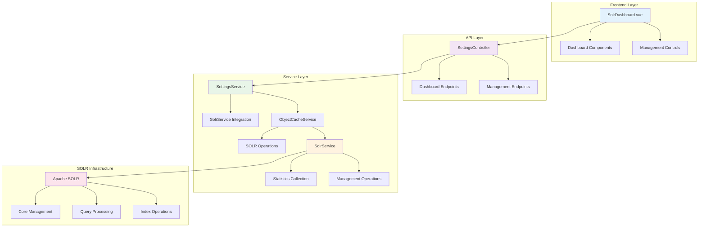
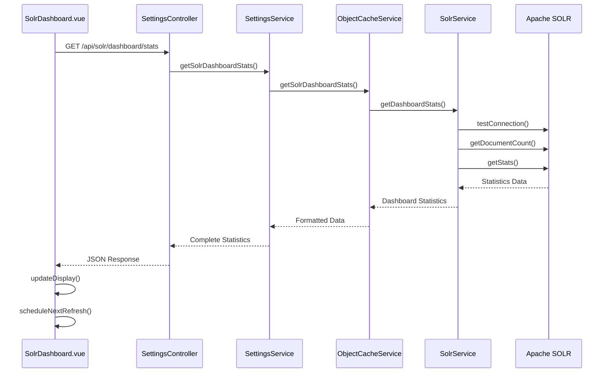
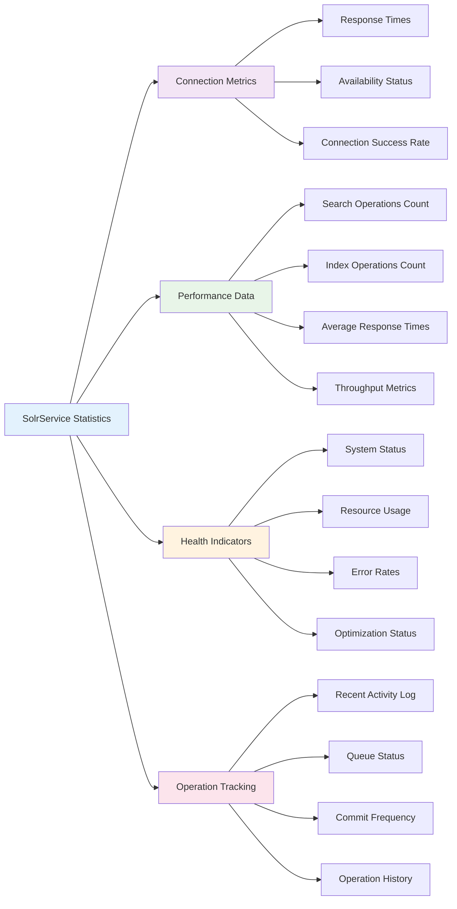
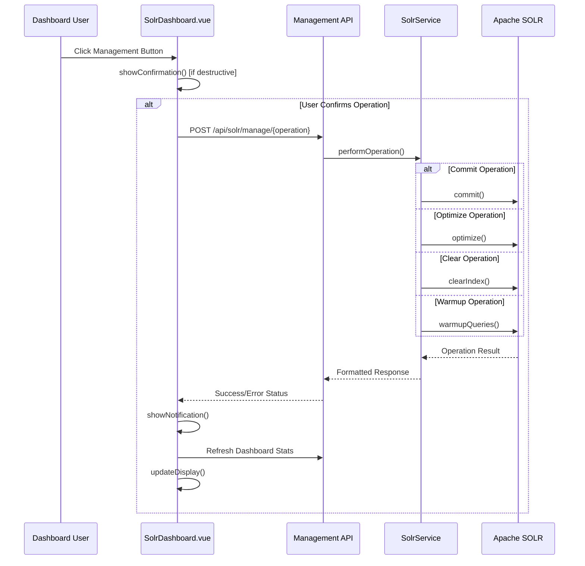

# SOLR Dashboard Management - Technical Implementation

## Overview

The SOLR Dashboard Management system provides comprehensive monitoring and management capabilities for Apache SOLR search infrastructure in OpenRegister. It offers real-time statistics, health monitoring, and administrative operations through a unified web interface.



## Architecture Components

### Frontend Implementation

#### SolrDashboard.vue Component

**Location**: `src/views/settings/SolrDashboard.vue`

The main dashboard component providing comprehensive SOLR monitoring and management interface.

**Key Features:**
- Real-time statistics display with auto-refresh (30s intervals)
- Interactive management controls (warmup, commit, optimize, clear)
- Responsive design with Nextcloud UI components
- Error handling with graceful fallbacks

**Component Structure:**
```vue
<template>
  <!-- Overview Cards -->
  <div class="solr-overview-cards">
    <!-- Connection, Documents, Index Size, Performance -->
  </div>
  
  <!-- Core Information -->
  <div class="solr-cores-grid">
    <!-- Active core details, tenant info -->
  </div>
  
  <!-- Performance Metrics -->
  <div class="performance-grid">
    <!-- Search/Index operations, error rates -->
  </div>
  
  <!-- Health & Resources -->
  <div class="health-grid">
    <!-- System status, memory/disk usage -->
  </div>
  
  <!-- Operations Management -->
  <div class="operations-grid">
    <!-- Recent activity, queue status, commit settings -->
  </div>
</template>
```

**Data Structure:**
```javascript
data() {
  return {
    solrStats: {
      overview: {
        available: false,
        connection_status: 'unknown',
        response_time_ms: 0,
        total_documents: 0,
        index_size: '0 B',
        last_commit: null,
      },
      cores: {
        active_core: 'unknown',
        core_status: 'inactive',
        tenant_id: 'unknown',
        endpoint_url: 'N/A',
      },
      performance: {
        total_searches: 0,
        total_indexes: 0,
        total_deletes: 0,
        avg_search_time_ms: 0,
        avg_index_time_ms: 0,
        operations_per_sec: 0,
        error_rate: 0,
      },
      health: {
        status: 'unknown',
        uptime: 'N/A',
        memory_usage: { used: 'N/A', max: 'N/A', percentage: 0 },
        disk_usage: { used: 'N/A', available: 'N/A', percentage: 0 },
        warnings: [],
        last_optimization: null,
      },
      operations: {
        recent_activity: [],
        queue_status: { pending_operations: 0, processing: false },
        commit_frequency: { auto_commit: false, commit_within: 0 },
        optimization_needed: false,
      }
    }
  }
}
```

### Backend Implementation

#### API Endpoints

**Dashboard Statistics Endpoint**
```php
/**
 * GET /api/solr/dashboard/stats
 * 
 * Returns comprehensive SOLR dashboard statistics including:
 * - Connection status and performance
 * - Core information and configuration
 * - Performance metrics and error rates
 * - Health indicators and resource usage
 * - Recent operations and queue status
 */
public function getSolrDashboardStats(): JSONResponse
```

**Management Operations Endpoint**
```php
/**
 * POST /api/solr/manage/{operation}
 * 
 * Performs SOLR management operations:
 * - commit: Force index commit
 * - optimize: Index optimization
 * - clear: Clear entire index
 * - warmup: Index warmup operations
 */
public function manageSolr(string $operation): JSONResponse
```

**Connection Testing Endpoint**
```php
/**
 * GET /api/solr/test
 * 
 * Tests SOLR connectivity and returns detailed status
 */
public function testSolrConnection(): JSONResponse
```

#### Service Layer Architecture



#### SolrService Enhancements

**New Methods Added:**

```php
/**
 * Get comprehensive dashboard statistics
 * 
 * @return array Complete dashboard metrics
 */
public function getDashboardStats(): array
{
    return [
        'overview' => $this->getOverviewStats(),
        'cores' => $this->getCoreInformation(),
        'performance' => $this->getPerformanceMetrics(),
        'health' => $this->getHealthIndicators(),
        'operations' => $this->getOperationsStatus(),
        'generated_at' => date('c'),
    ];
}

/**
 * Get document count from SOLR core
 */
public function getDocumentCount(): int

/**
 * Get approximate index size
 */
public function getIndexSize(): string

/**
 * Warm up SOLR index with sample operations
 */
public function warmupIndex(): array

/**
 * Calculate operations per second
 */
private function calculateOperationsPerSecond(): float

/**
 * Calculate error rate percentage
 */
private function calculateErrorRate(): float

/**
 * Get overall health status
 */
private function getHealthStatus(): string
```

**Statistics Collection:**

The service collects comprehensive metrics through various methods:



### Data Flow Architecture

#### Statistics Collection Flow

```mermaid
sequenceDiagram
    participant Timer as Auto-Refresh Timer
    participant Vue as SolrDashboard.vue
    participant API as Dashboard API
    participant Service as SolrService
    participant SOLR as Apache SOLR
    
    Timer->>Vue: Trigger Refresh (30s)
    Vue->>API: GET /api/solr/dashboard/stats
    
    API->>Service: getDashboardStats()
    
    parallel
        Service->>SOLR: testConnection()
        and Service->>SOLR: getDocumentCount()
        and Service->>Service: getStats()
        and Service->>Service: calculateMetrics()
    end
    
    Service->>API: Compiled Statistics
    API->>Vue: JSON Response
    Vue->>Vue: updateDisplay()
    Vue->>Vue: scheduleNextRefresh()
    
    Note over Vue,SOLR: Real-time updates every 30 seconds
    Note over Service,SOLR: Multiple parallel queries for efficiency
```

#### Management Operation Flow



## Performance Optimizations

### Lazy Loading Implementation

```php
/**
 * SolrService implements lazy initialization to prevent
 * performance bottlenecks during application startup
 */
class SolrService
{
    private bool $clientInitialized = false;
    
    private function ensureClientInitialized(): void
    {
        if (!$this->clientInitialized) {
            $this->initializeClient();
            $this->clientInitialized = true;
        }
    }
    
    public function getDashboardStats(): array
    {
        $this->ensureClientInitialized();
        // ... statistics collection
    }
}
```

### Parallel Statistics Collection

```php
/**
 * Dashboard statistics are collected in parallel
 * to minimize response times
 */
public function getDashboardStats(): array
{
    $this->ensureClientInitialized();
    
    // Collect base statistics
    $baseStats = $this->getStats();
    $connection = $this->testConnection();
    
    // Parallel collection of different metric types
    return [
        'overview' => $this->buildOverviewStats($baseStats, $connection),
        'cores' => $this->buildCoreStats($connection),
        'performance' => $this->buildPerformanceStats($baseStats),
        'health' => $this->buildHealthStats($baseStats, $connection),
        'operations' => $this->buildOperationsStats($baseStats),
        'generated_at' => date('c'),
    ];
}
```

### Frontend Optimization Strategies

#### Auto-Refresh Management
```javascript
// Intelligent refresh scheduling
mounted() {
  this.loadSolrStats()
  this.refreshInterval = setInterval(() => {
    // Only refresh when not performing operations
    if (!this.loading && !this.operating && !this.warmingUp) {
      this.loadSolrStats()
    }
  }, 30000)
},

beforeDestroy() {
  if (this.refreshInterval) {
    clearInterval(this.refreshInterval)
  }
}
```

#### Error Handling with Graceful Fallbacks
```javascript
async loadSolrStats() {
  this.loadingStats = true
  
  try {
    const response = await fetch('/index.php/apps/openregister/api/solr/dashboard/stats')
    const data = await response.json()
    
    if (data.error) {
      console.error('Failed to load SOLR stats:', data.error)
      // Dashboard shows unavailable state
      return
    }
    
    this.solrStats = { ...this.solrStats, ...data }
    
  } catch (error) {
    console.error('Failed to load SOLR stats:', error)
    // Graceful degradation to offline state
  } finally {
    this.loadingStats = false
  }
}
```

## Error Handling & Resilience

### Service Layer Error Handling

```php
/**
 * Comprehensive error handling with graceful degradation
 */
public function getSolrDashboardStats(): array
{
    try {
        $objectCacheService = $this->container->get(ObjectCacheService::class);
        return $objectCacheService->getSolrDashboardStats();
    } catch (\Exception $e) {
        // Return safe default structure when SOLR unavailable
        return [
            'overview' => [
                'available' => false,
                'connection_status' => 'unavailable',
                // ... safe defaults
            ],
            // ... complete fallback structure
            'error' => $e->getMessage()
        ];
    }
}
```

### Frontend Error States

```vue
<!-- Loading State -->
<div v-if="loadingStats" class="loading-container">
  <NcLoadingIcon :size="64" />
  <p>Loading SOLR statistics...</p>
</div>

<!-- Error State -->
<div v-else-if="solrStats.error" class="error-container">
  <div class="error-message">
    <h3>SOLR Unavailable</h3>
    <p>{{ solrStats.error }}</p>
    <NcButton @click="loadSolrStats">Retry</NcButton>
  </div>
</div>

<!-- Normal State -->
<div v-else class="solr-content">
  <!-- Dashboard content -->
</div>
```

## Security Considerations

### API Endpoint Protection

```php
/**
 * All dashboard endpoints require admin privileges
 * 
 * @NoAdminRequired - NOT used for management operations
 * @NoCSRFRequired - Used for read-only operations only
 */
class SettingsController extends Controller
{
    public function getSolrDashboardStats(): JSONResponse
    {
        // Admin-only access enforced by Nextcloud
    }
    
    public function manageSolr(string $operation): JSONResponse
    {
        // Restricted operations with validation
        if (!in_array($operation, ['commit', 'optimize', 'clear', 'warmup'])) {
            return new JSONResponse(['error' => 'Invalid operation'], 400);
        }
    }
}
```

### Tenant Isolation

```php
/**
 * All SOLR operations are tenant-aware
 */
class SolrService
{
    private function buildQueryString(array $searchParams): string
    {
        // Always enforce tenant isolation
        $tenantFilter = sprintf('tenant_id:%s', $this->escapeSolrValue($this->tenantId));
        
        // Combine with user query
        return sprintf('(%s) AND %s', $userQuery, $tenantFilter);
    }
}
```

## Testing Strategy

### Unit Testing

```php
/**
 * Test dashboard statistics collection
 */
class SolrDashboardTest extends TestCase
{
    public function testGetDashboardStatsWithAvailableSolr()
    {
        $solrService = $this->createMock(SolrService::class);
        $solrService->method('getDashboardStats')->willReturn([
            'overview' => ['available' => true],
            // ... complete test data
        ]);
        
        $result = $this->settingsService->getSolrDashboardStats();
        $this->assertTrue($result['overview']['available']);
    }
    
    public function testGetDashboardStatsWithUnavailableSolr()
    {
        $solrService = $this->createMock(SolrService::class);
        $solrService->method('getDashboardStats')->willThrowException(
            new \RuntimeException('SOLR unavailable')
        );
        
        $result = $this->settingsService->getSolrDashboardStats();
        $this->assertFalse($result['overview']['available']);
        $this->assertArrayHasKey('error', $result);
    }
}
```

### Integration Testing

```bash
#!/bin/bash
# Test SOLR dashboard endpoints

echo "Testing SOLR Dashboard Integration..."

# Test dashboard stats endpoint
echo "1. Testing dashboard statistics..."
docker exec -u 33 master-nextcloud-1 curl -s -u 'admin:admin' \
  -H 'Content-Type: application/json' \
  'http://localhost/index.php/apps/openregister/api/solr/dashboard/stats' | jq .overview.available

# Test connection testing endpoint
echo "2. Testing connection test..."
docker exec -u 33 master-nextcloud-1 curl -s -u 'admin:admin' \
  'http://localhost/index.php/apps/openregister/api/solr/test' | jq .connection.success

# Test management operations
echo "3. Testing warmup operation..."
docker exec -u 33 master-nextcloud-1 curl -s -u 'admin:admin' \
  -X POST -H 'Content-Type: application/json' \
  'http://localhost/index.php/apps/openregister/api/solr/manage/warmup' | jq .success

echo "SOLR Dashboard Integration Tests Complete!"
```

### Frontend Testing

```javascript
/**
 * Vue component testing with Vue Test Utils
 */
import { mount } from '@vue/test-utils'
import SolrDashboard from '@/views/settings/SolrDashboard.vue'

describe('SolrDashboard.vue', () => {
  test('displays loading state initially', () => {
    const wrapper = mount(SolrDashboard)
    expect(wrapper.find('.loading-container').exists()).toBe(true)
  })
  
  test('displays dashboard when data loaded', async () => {
    const wrapper = mount(SolrDashboard)
    
    // Mock API response
    wrapper.vm.solrStats = mockSolrStats
    wrapper.vm.loadingStats = false
    await wrapper.vm.$nextTick()
    
    expect(wrapper.find('.solr-content').exists()).toBe(true)
  })
  
  test('handles management operations', async () => {
    const wrapper = mount(SolrDashboard)
    
    // Mock successful warmup
    wrapper.vm.warmupIndex = jest.fn().mockResolvedValue()
    
    await wrapper.find('.warmup-button').trigger('click')
    expect(wrapper.vm.warmupIndex).toHaveBeenCalled()
  })
})
```

## Deployment & Configuration

### Environment Requirements

```yaml
# docker-compose.yml additions
services:
  solr:
    image: solr:9-slim
    container_name: openregister-solr
    restart: always
    ports:
      - "8983:8983"
    volumes:
      - solr:/var/solr
    environment:
      - SOLR_HEAP=512m
      - SOLR_LOG_LEVEL=WARN
    healthcheck:
      test: ['CMD-SHELL', 'curl -f http://localhost:8983/solr/openregister/admin/ping || exit 1']
      interval: 30s
      timeout: 10s
      retries: 3
```

### Configuration Settings

```php
/**
 * Default SOLR dashboard configuration
 */
private function getDefaultSolrSettings(): array
{
    return [
        'enabled' => false,  // Disabled by default for safety
        'host' => 'solr',
        'port' => 8983,
        'scheme' => 'http',
        'path' => '/solr',
        'core' => 'openregister',
        'timeout' => 30,
        'autoCommit' => true,
        'commitWithin' => 1000,
        'enableLogging' => false,
        'dashboard_refresh_interval' => 30,
    ];
}
```

### Monitoring Setup

```bash
#!/bin/bash
# SOLR Dashboard monitoring script

# Check dashboard health
check_dashboard_health() {
    local response=$(docker exec -u 33 master-nextcloud-1 curl -s -u 'admin:admin' \
        'http://localhost/index.php/apps/openregister/api/solr/dashboard/stats' | jq -r '.overview.connection_status')
    
    if [ "$response" != "healthy" ]; then
        echo "ALERT: SOLR Dashboard reports unhealthy status: $response"
        # Send alert notification
    else
        echo "OK: SOLR Dashboard healthy"
    fi
}

# Monitor performance metrics
check_performance() {
    local error_rate=$(docker exec -u 33 master-nextcloud-1 curl -s -u 'admin:admin' \
        'http://localhost/index.php/apps/openregister/api/solr/dashboard/stats' | jq -r '.performance.error_rate')
    
    if (( $(echo "$error_rate > 5.0" | bc -l) )); then
        echo "ALERT: High SOLR error rate: $error_rate%"
    fi
}

# Run monitoring checks
check_dashboard_health
check_performance
```

## Best Practices & Recommendations

### Development Guidelines

1. **Component Structure**: Keep dashboard components modular and focused
2. **Error Handling**: Always provide graceful fallbacks for SOLR unavailability
3. **Performance**: Use lazy loading and parallel operations where possible
4. **Security**: Ensure all management operations require proper authentication
5. **Testing**: Comprehensive unit and integration testing for all operations

### Production Deployment

1. **Monitoring**: Set up alerting for SOLR availability and performance
2. **Resource Management**: Monitor memory and disk usage trends
3. **Security**: Restrict dashboard access to authorized administrators only
4. **Backup**: Regular backup of SOLR cores and configuration
5. **Scaling**: Monitor query performance and optimize as needed

### Maintenance Tasks

```bash
# Weekly maintenance script
#!/bin/bash

# Check SOLR optimization status
optimization_needed=$(docker exec -u 33 master-nextcloud-1 curl -s -u 'admin:admin' \
    'http://localhost/index.php/apps/openregister/api/solr/dashboard/stats' | \
    jq -r '.operations.optimization_needed')

if [ "$optimization_needed" = "true" ]; then
    echo "Running SOLR optimization..."
    docker exec -u 33 master-nextcloud-1 curl -s -u 'admin:admin' \
        -X POST 'http://localhost/index.php/apps/openregister/api/solr/manage/optimize'
fi

# Generate weekly performance report
echo "Generating SOLR performance report..."
docker exec -u 33 master-nextcloud-1 curl -s -u 'admin:admin' \
    'http://localhost/index.php/apps/openregister/api/solr/dashboard/stats' | \
    jq '.performance' > "solr_performance_$(date +%Y%m%d).json"
```

The SOLR Dashboard Management system provides a robust, scalable solution for monitoring and managing SOLR search infrastructure with enterprise-grade features and comprehensive error handling.
