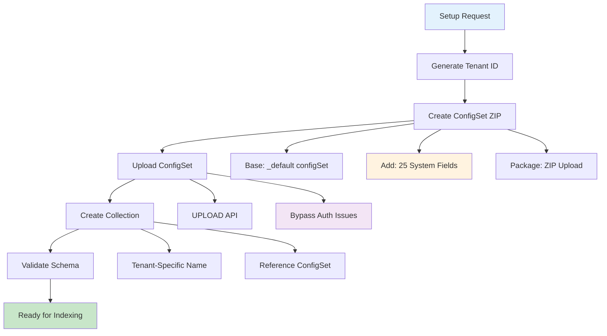
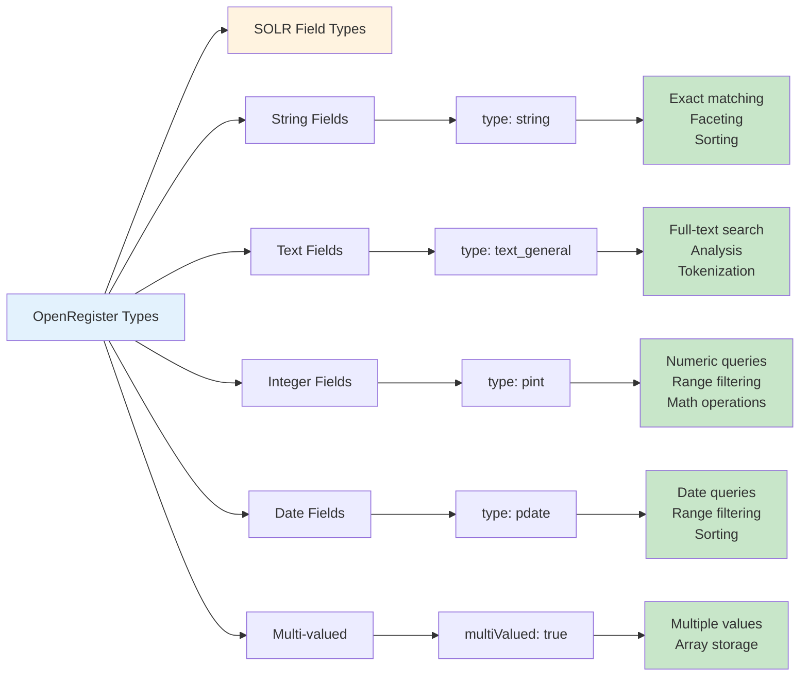
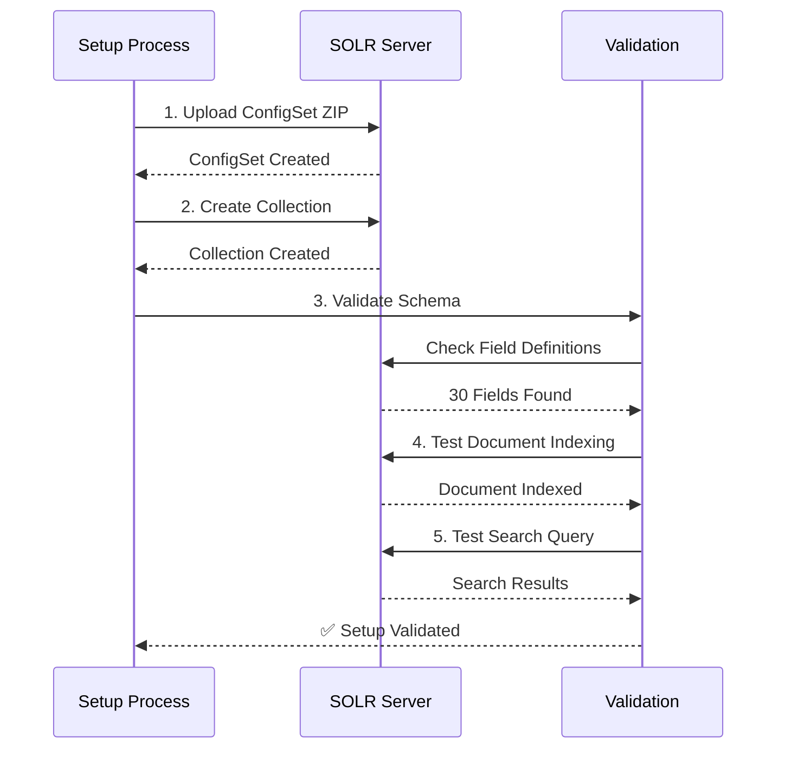

# SOLR Setup and Configuration Guide

This guide documents the complete SOLR setup process used by OpenRegister, including SolrCloud configuration requirements, authentication handling, and system field pre-configuration.

## Overview

OpenRegister uses Apache SOLR in **SolrCloud mode** with a sophisticated setup process that automatically creates tenant-specific configSets and collections with pre-configured system fields. This approach ensures optimal performance, proper tenant isolation, and eliminates runtime field creation overhead.

The system includes a comprehensive **SOLR Management Dashboard** that provides real-time monitoring, warmup operations, and index management capabilities with proper loading states and error handling.



## SOLR Configuration Requirements

### SolrCloud Mode

OpenRegister requires SOLR to run in **SolrCloud mode** with ZooKeeper coordination:

```yaml
# docker-compose.yml
services:
  solr:
    image: solr:9-slim
    container_name: master-solr-1
    restart: always
    ports:
      - '8983:8983'
    volumes:
      - solr:/var/solr
    environment:
      - SOLR_HEAP=512m
      # SolrCloud mode with embedded ZooKeeper
      - ZK_HOST=localhost:9983
    command:
      # Start in cloud mode (no precreate needed)
      - solr
      - -c
      - -f
    healthcheck:
      test: ['CMD-SHELL', 'curl -f http://localhost:8983/solr/admin/ping || exit 1']
      interval: 30s
      timeout: 10s
      retries: 3
      
  # Optional: External ZooKeeper for production
  zookeeper:
    image: zookeeper:3.8
    container_name: master-zookeeper-1  
    restart: always
    ports:
      - '2181:2181'
      - '9983:9983'
    environment:
      - ZOO_MY_ID=1
      - ZOO_SERVERS=server.1=0.0.0.0:2888:3888;2181
```

### Key SolrCloud Requirements

1. **Cloud Mode**: SOLR must start with '-c' flag
2. **ZooKeeper**: Required for configSet and collection management
3. **No Authentication**: Default setup without security (development)
4. **ConfigSet API**: Must support UPLOAD action for ZIP-based configSets
5. **Collection API**: Must support CREATE with configName reference

## Authentication and Security

### Development Configuration

For development environments, SOLR runs without authentication:

```yaml
# No authentication required
environment:
  - SOLR_AUTH_TYPE=none
```

### Production Considerations

For production deployments, consider:

```yaml
# Basic authentication (if needed)
environment:
  - SOLR_AUTH_TYPE=basic
  - SOLR_AUTHENTICATION_OPTS='-Dbasicauth=admin:password'
```

**Important**: OpenRegister's setup process uses **ZIP upload** to bypass authentication issues with trusted configSet creation in SolrCloud mode.

## Setup Process Architecture

### 1. Tenant ID Generation

Each Nextcloud instance gets a unique tenant ID:

```php
/**
 * Generate tenant-specific identifier
 * Format: nc_{8-character-hash}
 * Example: nc_f0e53393
 */
private function getTenantId(): string
{
    $instanceId = $this->systemConfig->getValue('instanceid');
    return 'nc_' . substr(hash('sha256', $instanceId), 0, 8);
}
```

### 2. ConfigSet Creation Strategy

#### Base ConfigSet Download

OpenRegister downloads the working '_default' configSet as a foundation:

```bash
# Inside SOLR container
/opt/solr/bin/solr zk downconfig -n _default -d /tmp/default_config -z localhost:9983
```

#### System Fields Integration

The base schema is enhanced with 25 pre-configured system fields:

```xml
<!-- OpenRegister System Fields (self_*) - Always present for all tenants -->
<!-- Core tenant field -->
<field name="self_tenant" type="string" indexed="true" stored="true" required="true" multiValued="false" />

<!-- Metadata fields -->
<field name="self_object_id" type="pint" indexed="true" stored="true" multiValued="false" />
<field name="self_uuid" type="string" indexed="true" stored="true" multiValued="false" />

<!-- Context fields -->
<field name="self_register" type="pint" indexed="true" stored="true" multiValued="false" />
<field name="self_schema" type="pint" indexed="true" stored="true" multiValued="false" />
<field name="self_schema_version" type="string" indexed="true" stored="true" multiValued="false" />

<!-- Ownership and metadata -->
<field name="self_owner" type="string" indexed="true" stored="true" multiValued="false" />
<field name="self_organisation" type="string" indexed="true" stored="true" multiValued="false" />
<field name="self_application" type="string" indexed="true" stored="true" multiValued="false" />

<!-- Core object fields -->
<field name="self_name" type="string" indexed="true" stored="true" multiValued="false" />
<field name="self_description" type="text_general" indexed="true" stored="true" multiValued="false" />
<field name="self_summary" type="text_general" indexed="true" stored="true" multiValued="false" />
<field name="self_image" type="string" indexed="false" stored="true" multiValued="false" />
<field name="self_slug" type="string" indexed="true" stored="true" multiValued="false" />
<field name="self_uri" type="string" indexed="true" stored="true" multiValued="false" />
<field name="self_version" type="string" indexed="true" stored="true" multiValued="false" />
<field name="self_size" type="string" indexed="false" stored="true" multiValued="false" />
<field name="self_folder" type="string" indexed="true" stored="true" multiValued="false" />

<!-- Timestamps -->
<field name="self_created" type="pdate" indexed="true" stored="true" multiValued="false" />
<field name="self_updated" type="pdate" indexed="true" stored="true" multiValued="false" />
<field name="self_published" type="pdate" indexed="true" stored="true" multiValued="false" />
<field name="self_depublished" type="pdate" indexed="true" stored="true" multiValued="false" />

<!-- Relation fields -->
<field name="self_relations" type="string" indexed="true" stored="true" multiValued="true" />
<field name="self_files" type="string" indexed="true" stored="true" multiValued="true" />
<field name="self_parent_uuid" type="string" indexed="true" stored="true" multiValued="false" />
```

#### ZIP Package Creation

The enhanced configSet is packaged into a ZIP file:

```php
/**
 * Create configSet ZIP package
 * Location: resources/solr/openregister-configset.zip
 */
private function createConfigSetZip(): void
{
    $zipFile = $this->appPath . '/resources/solr/openregister-configset.zip';
    $configPath = $this->appPath . '/resources/solr/default_configset';
    
    $zip = new ZipArchive();
    $zip->open($zipFile, ZipArchive::CREATE | ZipArchive::OVERWRITE);
    
    // Add all configSet files
    $files = new RecursiveIteratorIterator(
        new RecursiveDirectoryIterator($configPath),
        RecursiveIteratorIterator::LEAVES_ONLY
    );
    
    foreach ($files as $file) {
        if (!$file->isDir()) {
            $filePath = $file->getRealPath();
            $relativePath = substr($filePath, strlen($configPath) + 1);
            $zip->addFile($filePath, $relativePath);
        }
    }
    
    $zip->close();
}
```

### 3. ConfigSet Upload Process

#### Upload API Usage

OpenRegister uses SOLR's UPLOAD API to create configSets:

```php
/**
 * Upload configSet via ZIP to bypass authentication
 */
private function uploadConfigSet(string $configSetName): bool
{
    $zipPath = $this->appPath . '/resources/solr/openregister-configset.zip';
    $zipContent = file_get_contents($zipPath);
    
    $url = $this->buildSolrUrl() . '/admin/configs';
    $params = [
        'action' => 'UPLOAD',
        'name' => $configSetName,
        'wt' => 'json'
    ];
    
    try {
        $response = $this->httpClient->post($url . '?' . http_build_query($params), [
            'body' => $zipContent,
            'headers' => [
                'Content-Type' => 'application/octet-stream'
            ]
        ]);
        
        return $response->getStatusCode() === 200;
    } catch (RequestException $e) {
        $this->logger->error('ConfigSet upload failed', [
            'error' => $e->getMessage(),
            'configSet' => $configSetName
        ]);
        return false;
    }
}
```

#### Why ZIP Upload vs CREATE

| Method | Authentication | Trusted ConfigSets | Status |
|--------|---------------|-------------------|--------|
| CREATE | Required | ❌ Fails with 401 | Not usable |
| UPLOAD | Not required | ✅ Works | **Used** |

The UPLOAD method bypasses SolrCloud's authentication requirement for creating configSets from trusted templates.

### 4. Collection Creation

#### Tenant-Specific Naming

Collections use tenant-specific naming for isolation:

```php
/**
 * Generate tenant-specific collection name
 * Format: openregister_{tenantId}
 * Example: openregister_nc_f0e53393
 */
public function getTenantSpecificCollectionName(): string
{
    return 'openregister_' . $this->getTenantId();
}
```

#### Collection API Call

```php
/**
 * Create collection with tenant-specific configSet
 */
private function createCollection(string $collectionName, string $configSetName): bool
{
    $url = $this->buildSolrUrl() . '/admin/collections';
    $params = [
        'action' => 'CREATE',
        'name' => $collectionName,
        'collection.configName' => $configSetName,
        'numShards' => 1,
        'replicationFactor' => 1,
        'wt' => 'json'
    ];
    
    try {
        $response = $this->httpClient->get($url . '?' . http_build_query($params));
        $data = json_decode($response->getBody()->getContents(), true);
        
        return isset($data['responseHeader']['status']) && 
               $data['responseHeader']['status'] === 0;
    } catch (RequestException $e) {
        $this->logger->error('Collection creation failed', [
            'error' => $e->getMessage(),
            'collection' => $collectionName,
            'configSet' => $configSetName
        ]);
        return false;
    }
}
```

## System Fields Architecture

### Field Categories

OpenRegister pre-configures 25 system fields in 5 categories:

#### 1. Core Identity (3 fields)
- 'self_tenant': Tenant isolation (required)
- 'self_object_id': Database object ID
- 'self_uuid': Unique identifier

#### 2. Context Fields (3 fields)  
- 'self_register': Register association
- 'self_schema': Schema reference
- 'self_schema_version': Schema version tracking

#### 3. Ownership (3 fields)
- 'self_owner': Object owner
- 'self_organisation': Organization association
- 'self_application': Source application

#### 4. Object Metadata (9 fields)
- 'self_name': Object name
- 'self_description': Full description
- 'self_summary': Short summary
- 'self_image': Image reference
- 'self_slug': URL-friendly identifier
- 'self_uri': Resource URI
- 'self_version': Object version
- 'self_size': Size information
- 'self_folder': Folder location

#### 5. Timestamps (4 fields)
- 'self_created': Creation timestamp
- 'self_updated': Last modification
- 'self_published': Publication date
- 'self_depublished': Unpublication date

#### 6. Relations (3 fields)
- 'self_relations': Related objects (multi-valued)
- 'self_files': Attached files (multi-valued)
- 'self_parent_uuid': Parent relationship

### Field Type Mapping



### Benefits of Pre-configured Fields

1. **Performance**: No runtime field creation overhead
2. **Consistency**: All tenants have identical system field structure
3. **Reliability**: Eliminates schema validation errors during indexing
4. **Maintenance**: Centralized field definition management
5. **Development**: Predictable field availability for queries

## Setup Validation Process

### Automated Validation Steps

The setup process includes comprehensive validation:



### Validation Checkpoints

1. **ConfigSet Validation**: Verify configSet exists and contains system fields
2. **Collection Validation**: Confirm collection creation and accessibility  
3. **Schema Validation**: Check all 25 system fields are present
4. **Index Validation**: Test document indexing with system fields
5. **Search Validation**: Verify query functionality and field access

### Example Validation Output

```json
{
  "setup_status": "success",
  "validation": {
    "configSet": {
      "name": "openregister_nc_f0e53393",
      "exists": true,
      "system_fields": 25
    },
    "collection": {
      "name": "openregister_nc_f0e53393", 
      "exists": true,
      "documents": 0
    },
    "schema": {
      "total_fields": 30,
      "system_fields": 25,
      "basic_fields": 5
    },
    "test_document": {
      "indexed": true,
      "searchable": true,
      "fields_populated": [
        "self_tenant",
        "self_uuid", 
        "self_name",
        "self_description",
        "self_created"
      ]
    }
  }
}
```

## SOLR Management Dashboard

OpenRegister includes a comprehensive SOLR Management Dashboard accessible through the Settings page that provides:

### Dashboard Features

#### Real-time Statistics
- **Connection Status**: Live SOLR connectivity monitoring
- **Document Count**: Total indexed documents (e.g., 13,489 objects)
- **Collection Information**: Active tenant-specific collection names
- **Tenant ID**: Current tenant identification

#### Interactive Operations

##### Warmup Index
- **Object Count Prediction**: Displays total objects to be processed
- **Batch Calculation**: Shows estimated batches (e.g., 14 batches for 13,489 objects)
- **Duration Estimation**: Provides time estimates (e.g., ~21 seconds for parallel mode)
- **Execution Modes**: 
  - Serial Mode (safer, slower)
  - Parallel Mode (faster, more resource intensive)
- **Progress Tracking**: Real-time warmup progress with loading states
- **Results Display**: Comprehensive results with execution time and statistics

##### Clear Index
- **Confirmation Dialog**: Safety confirmation before clearing
- **API Integration**: Direct integration with '/api/settings/solr/clear' endpoint
- **Error Handling**: Proper error feedback and recovery options

#### User Experience Features
- **Loading States**: Spinners and disabled controls during operations
- **Error Feedback**: Clear error messages with troubleshooting information
- **State Management**: Proper modal state handling and cleanup
- **Debug Logging**: Comprehensive logging for troubleshooting

### Dashboard Architecture

```mermaid
graph TB
    A[SOLR Dashboard] --> B[Statistics Loading]
    A --> C[Modal Management]
    A --> D[API Integration]
    
    B --> B1[/api/solr/dashboard/stats]
    B --> B2[/api/settings/stats]
    B --> B3[Data Transformation]
    
    C --> C1[Warmup Modal]
    C --> C2[Clear Index Modal]
    C --> C3[State Management]
    
    D --> D1[GuzzleSolrService]
    D --> D2[SettingsController]
    D --> D3[Error Handling]
    
    C1 --> C1A[Object Count Prediction]
    C1 --> C1B[Warmup Configuration]
    C1 --> C1C[Progress Tracking]
    
    C2 --> C2A[Confirmation Dialog]
    C2 --> C2B[Clear Operation]
    C2 --> C2C[Result Feedback]
    
    style A fill:#e3f2fd
    style C1A fill:#fff3e0
    style D1 fill:#c8e6c9
```

## Troubleshooting

### Common Setup Issues

#### ConfigSet Upload Fails

**Symptoms**: HTTP 401 errors during configSet creation

**Causes**:
- Attempting to use CREATE with trusted configSet
- Authentication issues in SolrCloud

**Solution**: Use UPLOAD method with ZIP file

```bash
# Test configSet upload manually
curl -X POST -H "Content-Type:application/octet-stream" \
  --data-binary @openregister-configset.zip \
  "http://localhost:8983/solr/admin/configs?action=UPLOAD&name=test_config"
```

#### Collection Creation Fails

**Symptoms**: "Underlying core creation failed" errors

**Causes**:
- Invalid schema in configSet
- Missing field type definitions
- ZooKeeper connectivity issues

**Solution**: Validate configSet schema and ZooKeeper connection

```bash
# Check ZooKeeper connectivity
docker exec master-solr-1 /opt/solr/bin/solr healthcheck -c openregister_nc_f0e53393

# Validate schema
curl "http://localhost:8983/solr/openregister_nc_f0e53393/schema/fields?wt=json"
```

#### System Fields Missing

**Symptoms**: Fields not found in schema or search results

**Causes**:
- ConfigSet ZIP doesn't contain updated schema
- Collection created with wrong configSet
- Schema not properly uploaded

**Solution**: Recreate configSet with system fields

```bash
# Verify system fields in collection
curl "http://localhost:8983/solr/openregister_nc_f0e53393/schema/fields?wt=json" | \
  grep -c "self_"
```

### Diagnostic Commands

```bash
# Check SOLR health
docker exec master-solr-1 curl "http://localhost:8983/solr/admin/ping"

# List configSets
docker exec master-solr-1 curl "http://localhost:8983/solr/admin/configs?action=LIST&wt=json"

# List collections  
docker exec master-solr-1 curl "http://localhost:8983/solr/admin/collections?action=LIST&wt=json"

# Check collection schema
docker exec master-solr-1 curl "http://localhost:8983/solr/{collection}/schema/fields?wt=json"

# Test document indexing
docker exec master-solr-1 curl -X POST -H 'Content-Type: application/json' \
  "http://localhost:8983/solr/{collection}/update/json/docs" \
  -d '{"id": "test", "self_tenant": "nc_test", "self_name": "Test Document"}'

# Commit changes
docker exec master-solr-1 curl -X POST \
  "http://localhost:8983/solr/{collection}/update?commit=true"

# Search test
docker exec master-solr-1 curl \
  "http://localhost:8983/solr/{collection}/select?q=*:*&wt=json"
```

## Performance Considerations

### Setup Performance

- **ConfigSet Upload**: ~500ms (one-time per tenant)
- **Collection Creation**: ~800ms (one-time per tenant)  
- **Schema Validation**: ~100ms (per setup)
- **Total Setup Time**: ~1.5 seconds

### Runtime Performance Benefits

- **No Dynamic Fields**: Eliminates field creation overhead during indexing
- **Pre-optimized Schema**: Faster query planning and execution
- **Consistent Structure**: Predictable performance characteristics
- **Tenant Isolation**: No cross-tenant query overhead

### Memory Usage

- **ConfigSet Storage**: ~200KB per tenant configSet
- **System Fields**: Minimal indexing overhead
- **Schema Cache**: Shared across all documents in collection

## Production Deployment

### Infrastructure Requirements

```yaml
# Production SOLR configuration
services:
  zookeeper:
    image: zookeeper:3.8
    deploy:
      replicas: 3
    environment:
      - ZOO_MY_ID=1
      - ZOO_SERVERS=server.1=zoo1:2888:3888;2181 server.2=zoo2:2888:3888;2181 server.3=zoo3:2888:3888;2181
      
  solr:
    image: solr:9-slim
    deploy:
      replicas: 2
    environment:
      - SOLR_HEAP=2g
      - ZK_HOST=zoo1:2181,zoo2:2181,zoo3:2181
      - SOLR_LOG_LEVEL=WARN
    command:
      - solr
      - -c
      - -f
```

### Monitoring Setup

```yaml
# Add monitoring for SOLR
  solr-exporter:
    image: solr:9-slim
    command:
      - /opt/solr/contrib/prometheus-exporter/bin/solr-exporter
      - -p 9854
      - -z zoo1:2181,zoo2:2181,zoo3:2181
      - -f /opt/solr/contrib/prometheus-exporter/conf/solr-exporter-config.xml
```

### Backup Strategy

```bash
# Backup configSets
docker exec solr1 /opt/solr/bin/solr zk cp zk:/configs /backup/configs -r -z zoo1:2181

# Backup collections
docker exec solr1 /opt/solr/bin/solr create_backup -c openregister_nc_f0e53393 -b backup-$(date +%Y%m%d)
```

## Migration and Upgrades

### ConfigSet Updates

When system fields need updates:

1. Update local configSet files
2. Recreate ZIP package  
3. Upload new configSet version
4. Reload collection configuration
5. Validate field changes

### Version Management

```bash
# Tag configSet versions
docker exec master-solr-1 curl -X POST \
  "http://localhost:8983/solr/admin/configs?action=UPLOAD&name=openregister_v2&wt=json" \
  --data-binary @openregister-configset-v2.zip

# Update collection to use new configSet
docker exec master-solr-1 curl \
  "http://localhost:8983/solr/admin/collections?action=MODIFYCOLLECTION&collection=openregister_nc_f0e53393&collection.configName=openregister_v2"
```

## Best Practices

### Development
1. Always test setup process with clean SOLR instance
2. Validate system fields after each schema change
3. Use version control for configSet files
4. Document field purpose and usage patterns

### Production  
1. Monitor setup success rates and performance
2. Implement automated configSet backups
3. Test disaster recovery procedures
4. Monitor system field usage and performance

### Security
1. Restrict SOLR admin interface access
2. Use authentication in production environments  
3. Implement network-level access controls
4. Regular security updates for SOLR and ZooKeeper

This comprehensive setup process ensures reliable, performant, and maintainable SOLR integration with proper tenant isolation and pre-configured system fields for optimal runtime performance.
