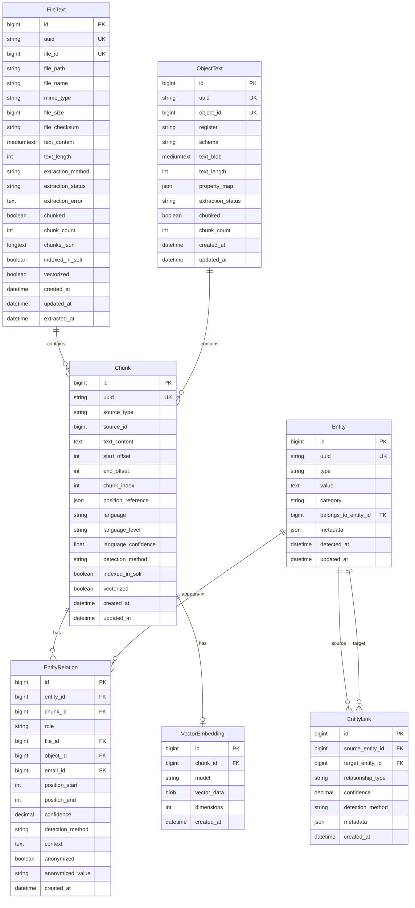
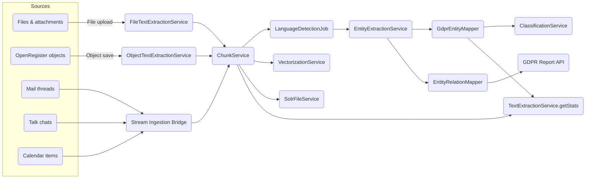
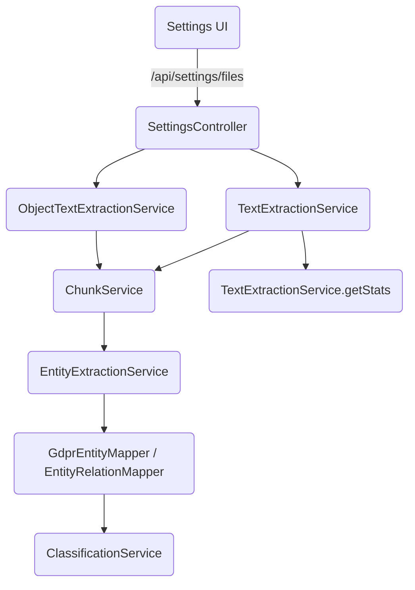

# Text Extraction Database Entities

This document describes the database schema for the enhanced text extraction system including chunking, GDPR entity tracking, and language analysis.

## Multi-Tenancy Support

**All new entities support multi-tenancy** with owner and organisation fields:

- **owner**: User ID of the content owner (inherited from source file/object)
- **organisation**: Organisation UUID (inherited from source file/object)

This ensures:
- Users only see chunks/entities from their own content or shared content
- Organisation-level access control
- Proper data isolation in multi-tenant deployments
- GDPR compliance per organisation

**Inheritance Rules**:
1. **File chunks**: Inherit owner/organisation from file metadata
2. **Object chunks**: Inherit owner/organisation from object entity
3. **Entities**: Inherit from the chunk where first detected
4. **Entity relations**: No separate owner (use entity's owner)

## Entity Relationship Diagram



## Processing Architecture Overview



**Key points**:

- All inputs (files, object attachments, mails, chats, calendar items) converge on the same chunking pipeline, guaranteeing consistent language detection and embedding preparation.
- Vectorization and Solr indexing operate purely on chunks so that future sources automatically benefit.
- GDPR entities always originate from chunks, ensuring accurate role/source tracking before classification or reporting.

## Service Responsibility Diagram



- `SettingsController` coordinates requests initiated from the UI; it delegates to the existing `TextExtractionService` for file extraction and to the upcoming `ObjectTextExtractionService` for object blobs.
- `ChunkService` centralises chunk persistence, language detection, and handoff to vector/Solr pipelines.
- `EntityExtractionService` writes to `GdprEntityMapper` and `EntityRelationMapper`, enabling GDPR reports and anonymisation planning.
- `TextExtractionService::getStats()` now aggregates totals across files, chunks, objects, and entities for the dashboard tiles.

## 1. FileText Entity (Existing, Updated)

Stores extracted text from files.

### Current Schema

```sql
CREATE TABLE oc_openregister_file_texts (
    id BIGINT AUTO_INCREMENT PRIMARY KEY,
    uuid VARCHAR(255) NOT NULL UNIQUE,
    file_id BIGINT NOT NULL UNIQUE,
    file_path VARCHAR(4000) NOT NULL,
    file_name VARCHAR(255) NOT NULL,
    mime_type VARCHAR(255) NOT NULL,
    file_size BIGINT NOT NULL,
    file_checksum VARCHAR(255),
    text_content MEDIUMTEXT,
    text_length INT NOT NULL DEFAULT 0,
    extraction_method VARCHAR(50) NOT NULL DEFAULT 'text_extract',
    extraction_status VARCHAR(50) NOT NULL DEFAULT 'pending',
    extraction_error TEXT,
    chunked BOOLEAN NOT NULL DEFAULT FALSE,
    chunk_count INT NOT NULL DEFAULT 0,
    chunks_json LONGTEXT,
    indexed_in_solr BOOLEAN NOT NULL DEFAULT FALSE,
    vectorized BOOLEAN NOT NULL DEFAULT FALSE,
    created_at DATETIME NOT NULL DEFAULT CURRENT_TIMESTAMP,
    updated_at DATETIME NOT NULL DEFAULT CURRENT_TIMESTAMP ON UPDATE CURRENT_TIMESTAMP,
    extracted_at DATETIME,
    
    INDEX idx_file_id (file_id),
    INDEX idx_extraction_status (extraction_status),
    INDEX idx_mime_type (mime_type),
    INDEX idx_chunked (chunked),
    INDEX idx_indexed (indexed_in_solr),
    INDEX idx_vectorized (vectorized),
    INDEX idx_created (created_at)
) ENGINE=InnoDB DEFAULT CHARSET=utf8mb4 COLLATE=utf8mb4_unicode_ci;
```

### Changes Required

**None** - This entity already supports chunks via 'chunks_json'. Language and language_level will be stored at the chunk level in the new Chunk entity.

**Future Migration**: In a later phase, we may migrate chunks from 'chunks_json' (LONGTEXT) to a dedicated 'Chunk' table for better performance and querying capabilities.

## 2. ObjectText Entity (New)

Stores text blobs created from OpenRegister objects.

### Schema

```sql
CREATE TABLE oc_openregister_object_texts (
    id BIGINT AUTO_INCREMENT PRIMARY KEY,
    uuid VARCHAR(255) NOT NULL UNIQUE,
    object_id BIGINT NOT NULL UNIQUE,
    register VARCHAR(255) NOT NULL,
    schema VARCHAR(255) NOT NULL,
    text_blob MEDIUMTEXT NOT NULL,
    text_length INT NOT NULL DEFAULT 0,
    property_map JSON,
    extraction_status VARCHAR(50) NOT NULL DEFAULT 'completed',
    chunked BOOLEAN NOT NULL DEFAULT FALSE,
    chunk_count INT NOT NULL DEFAULT 0,
    owner VARCHAR(255),
    organisation VARCHAR(255),
    created_at DATETIME NOT NULL DEFAULT CURRENT_TIMESTAMP,
    updated_at DATETIME NOT NULL DEFAULT CURRENT_TIMESTAMP ON UPDATE CURRENT_TIMESTAMP,
    
    INDEX idx_object_id (object_id),
    INDEX idx_register (register),
    INDEX idx_schema (schema),
    INDEX idx_extraction_status (extraction_status),
    INDEX idx_chunked (chunked),
    INDEX idx_owner (owner),
    INDEX idx_organisation (organisation),
    
    FOREIGN KEY (object_id) REFERENCES oc_openregister_objects(id) ON DELETE CASCADE
) ENGINE=InnoDB DEFAULT CHARSET=utf8mb4 COLLATE=utf8mb4_unicode_ci;
```

### Fields

- **id**: Primary key
- **uuid**: Unique identifier for API access
- **object_id**: Reference to oc_openregister_objects.id
- **register**: Register name for context
- **schema**: Schema name for context
- **text_blob**: Concatenated property values
- **text_length**: Character count
- **property_map**: JSON mapping of which properties contributed to which text sections
  ```json
  {
    'firstName': {'start': 0, 'end': 15, 'value': 'firstName: John'},
    'lastName': {'start': 16, 'end': 30, 'value': 'lastName: Doe'}
  }
  ```
- **extraction_status**: Status ('pending', 'completed', 'failed')
- **chunked**: Whether text has been chunked
- **chunk_count**: Number of chunks created
- **created_at**: Creation timestamp
- **updated_at**: Last modification timestamp

### PHP Entity Class

```php
namespace OCA\OpenRegister\Db;

use DateTime;
use JsonSerializable;
use OCP\AppFramework\Db\Entity;

/**
 * ObjectText Entity
 * 
 * Represents text extracted from an OpenRegister object for searching and analysis.
 * 
 * @category Db
 * @package  OCA\OpenRegister\Db
 * @author   OpenRegister Team
 * @license  AGPL-3.0-or-later
 * 
 * @method string getUuid()
 * @method void setUuid(string $uuid)
 * @method int getObjectId()
 * @method void setObjectId(int $objectId)
 * @method string getRegister()
 * @method void setRegister(string $register)
 * @method string getSchema()
 * @method void setSchema(string $schema)
 * @method string getTextBlob()
 * @method void setTextBlob(string $textBlob)
 * @method int getTextLength()
 * @method void setTextLength(int $textLength)
 * @method array|null getPropertyMap()
 * @method void setPropertyMap(?array $propertyMap)
 * @method string getExtractionStatus()
 * @method void setExtractionStatus(string $extractionStatus)
 * @method bool getChunked()
 * @method void setChunked(bool $chunked)
 * @method int getChunkCount()
 * @method void setChunkCount(int $chunkCount)
 * @method DateTime getCreatedAt()
 * @method void setCreatedAt(DateTime $createdAt)
 * @method DateTime getUpdatedAt()
 * @method void setUpdatedAt(DateTime $updatedAt)
 */
class ObjectText extends Entity implements JsonSerializable
{
    protected ?string $uuid = null;
    protected ?int $objectId = null;
    protected ?string $register = null;
    protected ?string $schema = null;
    protected ?string $textBlob = null;
    protected int $textLength = 0;
    protected ?array $propertyMap = null;
    protected string $extractionStatus = 'completed';
    protected bool $chunked = false;
    protected int $chunkCount = 0;
    protected ?DateTime $createdAt = null;
    protected ?DateTime $updatedAt = null;

    public function __construct()
    {
        $this->addType('id', 'integer');
        $this->addType('uuid', 'string');
        $this->addType('objectId', 'integer');
        $this->addType('register', 'string');
        $this->addType('schema', 'string');
        $this->addType('textBlob', 'string');
        $this->addType('textLength', 'integer');
        $this->addType('propertyMap', 'json');
        $this->addType('extractionStatus', 'string');
        $this->addType('chunked', 'boolean');
        $this->addType('chunkCount', 'integer');
        $this->addType('createdAt', 'datetime');
        $this->addType('updatedAt', 'datetime');
    }

    public function jsonSerialize(): array
    {
        return [
            'id' => $this->id,
            'uuid' => $this->uuid,
            'objectId' => $this->objectId,
            'register' => $this->register,
            'schema' => $this->schema,
            'textLength' => $this->textLength,
            'propertyMap' => $this->propertyMap,
            'extractionStatus' => $this->extractionStatus,
            'chunked' => $this->chunked,
            'chunkCount' => $this->chunkCount,
            'createdAt' => $this->createdAt?->format('c'),
            'updatedAt' => $this->updatedAt?->format('c'),
        ];
    }
}
```

## 3. Chunk Entity (New)

Stores individual text chunks with language metadata.

### Schema

```sql
CREATE TABLE oc_openregister_chunks (
    id BIGINT AUTO_INCREMENT PRIMARY KEY,
    uuid VARCHAR(255) NOT NULL UNIQUE,
    source_type VARCHAR(50) NOT NULL,
    source_id BIGINT NOT NULL,
    text_content TEXT NOT NULL,
    start_offset INT NOT NULL,
    end_offset INT NOT NULL,
    chunk_index INT NOT NULL,
    language VARCHAR(10),
    language_level VARCHAR(20),
    language_confidence DECIMAL(3,2),
    detection_method VARCHAR(50),
    indexed_in_solr BOOLEAN NOT NULL DEFAULT FALSE,
    vectorized BOOLEAN NOT NULL DEFAULT FALSE,
    owner VARCHAR(255),
    organisation VARCHAR(255),
    created_at DATETIME NOT NULL DEFAULT CURRENT_TIMESTAMP,
    updated_at DATETIME NOT NULL DEFAULT CURRENT_TIMESTAMP ON UPDATE CURRENT_TIMESTAMP,
    
    INDEX idx_source (source_type, source_id),
    INDEX idx_language (language),
    INDEX idx_language_level (language_level),
    INDEX idx_indexed (indexed_in_solr),
    INDEX idx_vectorized (vectorized),
    INDEX idx_owner (owner),
    INDEX idx_organisation (organisation)
) ENGINE=InnoDB DEFAULT CHARSET=utf8mb4 COLLATE=utf8mb4_unicode_ci;
```

### Fields

- **id**: Primary key
- **uuid**: Unique identifier for API access
- **source_type**: Type of source ('file', 'object', 'mail', 'chat')
- **source_id**: ID of **ultimate source** (file ID, object ID, email ID, chat ID - NOT the text extraction record ID)
- **text_content**: The actual chunk text
- **start_offset**: Character position in original text where chunk starts
- **end_offset**: Character position in original text where chunk ends
- **chunk_index**: Sequential chunk number (0, 1, 2, ...)
- **position_reference**: JSON payload describing how to retrace the chunk:
  ```json
  // File-based chunk
  {
    "type": "file",
    "start": 1024,
    "end": 2048,
    "length": 1024
  }
  // Object-based chunk
  {
    "type": "object",
    "property": "address.street",
    "register": "contracts",
    "schema": "supplier"
  }
  ```
  This guarantees every chunk can be mapped back either to an exact text span (files) or to the specific property path that produced it (objects/mail/chat entries).
- **language**: ISO 639-1 language code ('en', 'nl', 'de', etc.)
- **language_level**: Reading level ('A1', 'B2', 'Grade 8', '65', etc.)
- **language_confidence**: Confidence score for language detection (0.00-1.00)
- **detection_method**: How language was detected ('local', 'api', 'llm', 'hybrid')
- **indexed_in_solr**: Whether chunk is indexed in Solr
- **vectorized**: Whether chunk has vector embedding
- **created_at**: Creation timestamp
- **updated_at**: Last modification timestamp

### PHP Entity Class

```php
namespace OCA\OpenRegister\Db;

use DateTime;
use JsonSerializable;
use OCP\AppFramework\Db\Entity;

/**
 * Chunk Entity
 * 
 * Represents a text chunk with language metadata.
 * 
 * @category Db
 * @package  OCA\OpenRegister\Db
 * @author   OpenRegister Team
 * @license  AGPL-3.0-or-later
 */
class Chunk extends Entity implements JsonSerializable
{
    protected ?string $uuid = null;
    protected ?string $sourceType = null;
    protected ?int $sourceId = null;
    protected ?string $textContent = null;
    protected int $startOffset = 0;
    protected int $endOffset = 0;
    protected int $chunkIndex = 0;
    protected ?string $language = null;
    protected ?string $languageLevel = null;
    protected ?float $languageConfidence = null;
    protected ?string $detectionMethod = null;
    protected bool $indexedInSolr = false;
    protected bool $vectorized = false;
    protected ?DateTime $createdAt = null;
    protected ?DateTime $updatedAt = null;

    public function __construct()
    {
        $this->addType('id', 'integer');
        $this->addType('uuid', 'string');
        $this->addType('sourceType', 'string');
        $this->addType('sourceId', 'integer');
        $this->addType('textContent', 'string');
        $this->addType('startOffset', 'integer');
        $this->addType('endOffset', 'integer');
        $this->addType('chunkIndex', 'integer');
        $this->addType('language', 'string');
        $this->addType('languageLevel', 'string');
        $this->addType('languageConfidence', 'float');
        $this->addType('detectionMethod', 'string');
        $this->addType('indexedInSolr', 'boolean');
        $this->addType('vectorized', 'boolean');
        $this->addType('createdAt', 'datetime');
        $this->addType('updatedAt', 'datetime');
    }

    public function jsonSerialize(): array
    {
        return [
            'id' => $this->id,
            'uuid' => $this->uuid,
            'sourceType' => $this->sourceType,
            'sourceId' => $this->sourceId,
            'textContent' => $this->textContent,
            'startOffset' => $this->startOffset,
            'endOffset' => $this->endOffset,
            'chunkIndex' => $this->chunkIndex,
            'language' => $this->language,
            'languageLevel' => $this->languageLevel,
            'languageConfidence' => $this->languageConfidence,
            'detectionMethod' => $this->detectionMethod,
            'indexedInSolr' => $this->indexedInSolr,
            'vectorized' => $this->vectorized,
            'createdAt' => $this->createdAt?->format('c'),
            'updatedAt' => $this->updatedAt?->format('c'),
        ];
    }
}
```

## 4. Entity (GDPR) Entity (New)

Stores unique entities (persons, emails, organizations) found in content.

### Schema

```sql
CREATE TABLE oc_openregister_entities (
    id BIGINT AUTO_INCREMENT PRIMARY KEY,
    uuid VARCHAR(255) NOT NULL UNIQUE,
    type VARCHAR(50) NOT NULL,
    value TEXT NOT NULL,
    category VARCHAR(50) NOT NULL,
    belongs_to_entity_id BIGINT,
    metadata JSON,
    owner VARCHAR(255),
    organisation VARCHAR(255),
    detected_at DATETIME NOT NULL DEFAULT CURRENT_TIMESTAMP,
    updated_at DATETIME NOT NULL DEFAULT CURRENT_TIMESTAMP ON UPDATE CURRENT_TIMESTAMP,
    
    INDEX idx_type (type),
    INDEX idx_category (category),
    INDEX idx_detected (detected_at),
    INDEX idx_value_hash (value(255)),
    INDEX idx_owner (owner),
    INDEX idx_organisation (organisation),
    INDEX idx_belongs_to (belongs_to_entity_id),
    
    FOREIGN KEY (belongs_to_entity_id) REFERENCES oc_openregister_entities(id) ON DELETE SET NULL
) ENGINE=InnoDB DEFAULT CHARSET=utf8mb4 COLLATE=utf8mb4_unicode_ci;
```

### Fields

- **id**: Primary key
- **uuid**: Unique identifier for API access
- **type**: Entity type ('person', 'email', 'phone', 'organization', 'location', 'date_of_birth', 'id_number', 'bank_account', 'ip_address', 'other_pii')
- **value**: The entity value (e.g., 'john.doe@example.com')
- **category**: Classification ('pii', 'sensitive_pii', 'business_data')
- **belongs_to_entity_id**: Parent entity this belongs to (e.g., phone belongs to person, email belongs to organization)
- **metadata**: Additional context
  ```json
  {
    'normalized': 'john.doe@example.com',
    'aliases': ['j.doe@example.com'],
    'first_seen': '2024-01-15T10:30:00Z',
    'occurrence_count': 42,
    'sources': ['file', 'object', 'email'],
    'relationship_confidence': 0.92,
    'detection_method': 'proximity'
  }
  ```
- **detected_at**: First detection timestamp
- **updated_at**: Last occurrence timestamp

:::tip Parent-Child Relationships
The `belongs_to_entity_id` field creates direct parent-child relationships:
- **Phone** → belongs to → **Person** (phone.belongs_to_entity_id = person.id)
- **Email** → belongs to → **Person** (email.belongs_to_entity_id = person.id)
- **Address** → belongs to → **Organization** (address.belongs_to_entity_id = organization.id)
- **Phone** → belongs to → **Organization** (phone.belongs_to_entity_id = organization.id)

To get all contact info for a person: `SELECT * FROM oc_openregister_entities WHERE belongs_to_entity_id = {person_id}`

**Note**: We do NOT track person-to-person or person-to-organization relationships here. Only attributes/contact info belonging to entities.
:::

### PHP Entity Class

```php
namespace OCA\OpenRegister\Db;

use DateTime;
use JsonSerializable;
use OCP\AppFramework\Db\Entity;

/**
 * Entity (GDPR) Entity
 * 
 * Represents a unique entity (person, email, organization) found in content.
 * 
 * @category Db
 * @package  OCA\OpenRegister\Db
 * @author   OpenRegister Team
 * @license  AGPL-3.0-or-later
 * 
 * @method string getUuid()
 * @method void setUuid(string $uuid)
 * @method string getType()
 * @method void setType(string $type)
 * @method string getValue()
 * @method void setValue(string $value)
 * @method string getCategory()
 * @method void setCategory(string $category)
 * @method int|null getBelongsToEntityId()
 * @method void setBelongsToEntityId(?int $belongsToEntityId)
 * @method array|null getMetadata()
 * @method void setMetadata(?array $metadata)
 * @method DateTime getDetectedAt()
 * @method void setDetectedAt(DateTime $detectedAt)
 * @method DateTime getUpdatedAt()
 * @method void setUpdatedAt(DateTime $updatedAt)
 */
class GdprEntity extends Entity implements JsonSerializable
{
    protected ?string $uuid = null;
    protected ?string $type = null;
    protected ?string $value = null;
    protected ?string $category = null;
    protected ?int $belongsToEntityId = null;
    protected ?array $metadata = null;
    protected ?DateTime $detectedAt = null;
    protected ?DateTime $updatedAt = null;

    // Constants for entity types
    public const TYPE_PERSON = 'person';
    public const TYPE_EMAIL = 'email';
    public const TYPE_PHONE = 'phone';
    public const TYPE_ORGANIZATION = 'organization';
    public const TYPE_LOCATION = 'location';
    public const TYPE_DATE_OF_BIRTH = 'date_of_birth';
    public const TYPE_ID_NUMBER = 'id_number';
    public const TYPE_BANK_ACCOUNT = 'bank_account';
    public const TYPE_IP_ADDRESS = 'ip_address';
    public const TYPE_OTHER_PII = 'other_pii';

    // Constants for categories
    public const CATEGORY_PII = 'pii';
    public const CATEGORY_SENSITIVE_PII = 'sensitive_pii';
    public const CATEGORY_BUSINESS_DATA = 'business_data';

    public function __construct()
    {
        $this->addType('id', 'integer');
        $this->addType('uuid', 'string');
        $this->addType('type', 'string');
        $this->addType('value', 'string');
        $this->addType('category', 'string');
        $this->addType('belongsToEntityId', 'integer');
        $this->addType('metadata', 'json');
        $this->addType('detectedAt', 'datetime');
        $this->addType('updatedAt', 'datetime');
    }

    /**
     * Get the parent entity (person or organization) this entity belongs to
     *
     * @return GdprEntity|null The parent entity or null if this is a root entity
     */
    public function getParentEntity(): ?GdprEntity
    {
        if ($this->belongsToEntityId === null) {
            return null;
        }
        
        // Will be implemented by service layer using EntityMapper
        return null;
    }

    /**
     * Check if this entity has child entities (contact info)
     *
     * @return bool True if this is a person or organization that can have contact info
     */
    public function canHaveChildren(): bool
    {
        return in_array($this->type, [self::TYPE_PERSON, self::TYPE_ORGANIZATION]);
    }

    public function jsonSerialize(): array
    {
        return [
            'id' => $this->id,
            'uuid' => $this->uuid,
            'type' => $this->type,
            'value' => $this->value,
            'category' => $this->category,
            'belongsToEntityId' => $this->belongsToEntityId,
            'metadata' => $this->metadata,
            'detectedAt' => $this->detectedAt?->format('c'),
            'updatedAt' => $this->updatedAt?->format('c'),
        ];
    }
}
```

## 5. EntityRelation Entity (New)

Links entities to specific positions within chunks.

:::note
This entity links **entities to chunks** (where they appear). For **entity-to-entity relationships** (e.g., phone belongs to person), see EntityLink below.
:::


### Schema

```sql
CREATE TABLE oc_openregister_entity_relations (
    id BIGINT AUTO_INCREMENT PRIMARY KEY,
    entity_id BIGINT NOT NULL,
    chunk_id BIGINT NOT NULL,
    role VARCHAR(50),
    file_id BIGINT,
    object_id BIGINT,
    email_id BIGINT,
    position_start INT NOT NULL,
    position_end INT NOT NULL,
    confidence DECIMAL(3,2) NOT NULL,
    detection_method VARCHAR(50) NOT NULL,
    context TEXT,
    anonymized BOOLEAN NOT NULL DEFAULT FALSE,
    anonymized_value VARCHAR(255),
    created_at DATETIME NOT NULL DEFAULT CURRENT_TIMESTAMP,
    
    INDEX idx_entity (entity_id),
    INDEX idx_chunk (chunk_id),
    INDEX idx_role (role),
    INDEX idx_file (file_id),
    INDEX idx_object (object_id),
    INDEX idx_email (email_id),
    INDEX idx_confidence (confidence),
    INDEX idx_anonymized (anonymized),
    
    FOREIGN KEY (entity_id) REFERENCES oc_openregister_entities(id) ON DELETE CASCADE,
    FOREIGN KEY (chunk_id) REFERENCES oc_openregister_chunks(id) ON DELETE CASCADE
) ENGINE=InnoDB DEFAULT CHARSET=utf8mb4 COLLATE=utf8mb4_unicode_ci;
```

### Fields

- **id**: Primary key
- **entity_id**: Reference to Entity
- **chunk_id**: Reference to Chunk
- **role**: Role/context of the entity in this occurrence
  - 'public_figure' - Public figure (may not require anonymization)
  - 'employee' - Employee in official capacity (may not require anonymization)
  - 'private_individual' - Private individual (requires anonymization)
  - 'customer' - Customer/client
  - 'contractor' - External contractor
  - 'author' - Document author
  - 'recipient' - Document recipient
  - 'mentioned' - Mentioned in passing
- **file_id**: Reference to original file (if chunk came from file)
- **object_id**: Reference to original object (if chunk came from object)
- **email_id**: Reference to original email (if chunk came from email)
- **position_start**: Character position where entity starts in chunk
- **position_end**: Character position where entity ends in chunk
- **confidence**: Detection confidence (0.00-1.00)
- **detection_method**: How it was found ('regex', 'presidio', 'llm', 'hybrid')
- **context**: Surrounding text (±50 characters) for verification
- **anonymized**: Whether this occurrence has been anonymized
- **anonymized_value**: Replacement value if anonymized (e.g., '[PERSON_1]')
- **created_at**: Detection timestamp

:::tip Source Tracking
The `file_id`, `object_id`, and `email_id` fields track the **ultimate source** of the chunk, not just the intermediate text entity. This is crucial because:
- **Chunks may change over time** (re-chunking, content updates)
- **GDPR requests need original source documents**
- **Anonymization must trace back to original files**
- **Audit trails require source document references**

Example: If a chunk comes from `file_texts.id=123` which references `files.id=456`, store `file_id=456` (the actual file), not 123 (the text extraction record).
:::

### PHP Entity Class

```php
namespace OCA\OpenRegister\Db;

use DateTime;
use JsonSerializable;
use OCP\AppFramework\Db\Entity;

/**
 * EntityRelation Entity
 * 
 * Links entities to specific positions within chunks, with source tracking and role information.
 * 
 * @category Db
 * @package  OCA\OpenRegister\Db
 * @author   OpenRegister Team
 * @license  AGPL-3.0-or-later
 * 
 * @method int getEntityId()
 * @method void setEntityId(int $entityId)
 * @method int getChunkId()
 * @method void setChunkId(int $chunkId)
 * @method string|null getRole()
 * @method void setRole(?string $role)
 * @method int|null getFileId()
 * @method void setFileId(?int $fileId)
 * @method int|null getObjectId()
 * @method void setObjectId(?int $objectId)
 * @method int|null getEmailId()
 * @method void setEmailId(?int $emailId)
 * @method int getPositionStart()
 * @method void setPositionStart(int $positionStart)
 * @method int getPositionEnd()
 * @method void setPositionEnd(int $positionEnd)
 * @method float getConfidence()
 * @method void setConfidence(float $confidence)
 * @method string getDetectionMethod()
 * @method void setDetectionMethod(string $detectionMethod)
 * @method string|null getContext()
 * @method void setContext(?string $context)
 * @method bool getAnonymized()
 * @method void setAnonymized(bool $anonymized)
 * @method string|null getAnonymizedValue()
 * @method void setAnonymizedValue(?string $anonymizedValue)
 * @method DateTime getCreatedAt()
 * @method void setCreatedAt(DateTime $createdAt)
 */
class EntityRelation extends Entity implements JsonSerializable
{
    protected ?int $entityId = null;
    protected ?int $chunkId = null;
    protected ?string $role = null;
    protected ?int $fileId = null;
    protected ?int $objectId = null;
    protected ?int $emailId = null;
    protected int $positionStart = 0;
    protected int $positionEnd = 0;
    protected float $confidence = 0.0;
    protected ?string $detectionMethod = null;
    protected ?string $context = null;
    protected bool $anonymized = false;
    protected ?string $anonymizedValue = null;
    protected ?DateTime $createdAt = null;

    // Constants for roles
    public const ROLE_PUBLIC_FIGURE = 'public_figure';
    public const ROLE_EMPLOYEE = 'employee';
    public const ROLE_PRIVATE_INDIVIDUAL = 'private_individual';
    public const ROLE_CUSTOMER = 'customer';
    public const ROLE_CONTRACTOR = 'contractor';
    public const ROLE_AUTHOR = 'author';
    public const ROLE_RECIPIENT = 'recipient';
    public const ROLE_MENTIONED = 'mentioned';

    // Constants for detection methods
    public const METHOD_REGEX = 'regex';
    public const METHOD_PRESIDIO = 'presidio';
    public const METHOD_LLM = 'llm';
    public const METHOD_HYBRID = 'hybrid';
    public const METHOD_MANUAL = 'manual';

    public function __construct()
    {
        $this->addType('id', 'integer');
        $this->addType('entityId', 'integer');
        $this->addType('chunkId', 'integer');
        $this->addType('role', 'string');
        $this->addType('fileId', 'integer');
        $this->addType('objectId', 'integer');
        $this->addType('emailId', 'integer');
        $this->addType('positionStart', 'integer');
        $this->addType('positionEnd', 'integer');
        $this->addType('confidence', 'float');
        $this->addType('detectionMethod', 'string');
        $this->addType('context', 'string');
        $this->addType('anonymized', 'boolean');
        $this->addType('anonymizedValue', 'string');
        $this->addType('createdAt', 'datetime');
    }

    /**
     * Check if this entity occurrence requires anonymization based on role
     *
     * @return bool True if this occurrence should be anonymized
     */
    public function requiresAnonymization(): bool
    {
        // Public figures and employees in official capacity may not require anonymization
        $nonPrivateRoles = [
            self::ROLE_PUBLIC_FIGURE,
            self::ROLE_EMPLOYEE,
        ];

        // If role is set and is non-private, may not require anonymization
        if ($this->role && in_array($this->role, $nonPrivateRoles)) {
            return false;
        }

        // Private individuals always require anonymization
        if ($this->role === self::ROLE_PRIVATE_INDIVIDUAL) {
            return true;
        }

        // Default: assume anonymization required for safety
        return true;
    }

    /**
     * Get the source type based on which ID is set
     *
     * @return string|null 'file', 'object', 'email', or null
     */
    public function getSourceType(): ?string
    {
        if ($this->fileId !== null) {
            return 'file';
        }
        if ($this->objectId !== null) {
            return 'object';
        }
        if ($this->emailId !== null) {
            return 'email';
        }
        return null;
    }

    /**
     * Get the source ID based on which ID is set
     *
     * @return int|null The source ID
     */
    public function getSourceId(): ?int
    {
        return $this->fileId ?? $this->objectId ?? $this->emailId;
    }

    public function jsonSerialize(): array
    {
        return [
            'id' => $this->id,
            'entityId' => $this->entityId,
            'chunkId' => $this->chunkId,
            'role' => $this->role,
            'fileId' => $this->fileId,
            'objectId' => $this->objectId,
            'emailId' => $this->emailId,
            'sourceType' => $this->getSourceType(),
            'sourceId' => $this->getSourceId(),
            'positionStart' => $this->positionStart,
            'positionEnd' => $this->positionEnd,
            'confidence' => $this->confidence,
            'detectionMethod' => $this->detectionMethod,
            'context' => $this->context,
            'anonymized' => $this->anonymized,
            'anonymizedValue' => $this->anonymizedValue,
            'requiresAnonymization' => $this->requiresAnonymization(),
            'createdAt' => $this->createdAt?->format('c'),
        ];
    }
}
```

## 6. EntityLink Entity (New)

Links entities to each other to create a knowledge graph of relationships.

:::tip Entity Knowledge Graph
EntityLink enables tracking which contact information belongs to which person or organization:
- Phone number → belongs to → Person
- Phone number → belongs to → Organization
- Email → belongs to → Person
- Email → belongs to → Organization
- Address → belongs to → Person
- Address → belongs to → Organization

**Note**: We track contact info relationships, NOT employment/family relationships.
:::

### Schema

```sql
CREATE TABLE oc_openregister_entity_links (
    id BIGINT AUTO_INCREMENT PRIMARY KEY,
    source_entity_id BIGINT NOT NULL,
    target_entity_id BIGINT NOT NULL,
    relationship_type VARCHAR(100) NOT NULL,
    confidence DECIMAL(3,2) NOT NULL,
    detection_method VARCHAR(50) NOT NULL,
    metadata JSON,
    created_at DATETIME NOT NULL DEFAULT CURRENT_TIMESTAMP,
    updated_at DATETIME NOT NULL DEFAULT CURRENT_TIMESTAMP ON UPDATE CURRENT_TIMESTAMP,
    
    INDEX idx_source (source_entity_id),
    INDEX idx_target (target_entity_id),
    INDEX idx_relationship (relationship_type),
    INDEX idx_confidence (confidence),
    INDEX idx_both (source_entity_id, target_entity_id),
    
    FOREIGN KEY (source_entity_id) REFERENCES oc_openregister_entities(id) ON DELETE CASCADE,
    FOREIGN KEY (target_entity_id) REFERENCES oc_openregister_entities(id) ON DELETE CASCADE,
    
    UNIQUE KEY unique_link (source_entity_id, target_entity_id, relationship_type)
) ENGINE=InnoDB DEFAULT CHARSET=utf8mb4 COLLATE=utf8mb4_unicode_ci;
```

### Fields

- **id**: Primary key
- **source_entity_id**: The entity that is the source of the relationship
- **target_entity_id**: The entity that is the target of the relationship
- **relationship_type**: Type of relationship between entities
  - 'belongs_to' - Contact info (phone/email/address) belongs to person or organization
  - 'associated_with' - Generic association (for flexible use cases)
  - 'primary_contact' - Marks primary contact method
  - 'alternate_contact' - Marks alternate contact method
- **confidence**: Confidence score for the relationship (0.00-1.00)
- **detection_method**: How the relationship was detected
  - 'proximity' - Found near each other in text
  - 'pattern' - Detected via pattern matching
  - 'llm' - Detected by LLM analysis
  - 'manual' - Manually added by user
  - 'inference' - Inferred from other data
- **metadata**: Additional context about the relationship
  ```json
  {
    'evidence': 'Found in same sentence: John Doe, phone: +31612345678',
    'chunk_ids': [123, 456],
    'source_documents': ['contract.pdf', 'email.eml'],
    'verified': false,
    'verified_by': null,
    'verified_at': null,
    'notes': 'Automatically detected from contact block'
  }
  ```
- **created_at**: When relationship was first detected
- **updated_at**: Last modification timestamp

### Relationship Types

#### belongs_to: Contact Information Ownership

The primary relationship type - links contact information to persons or organizations:

```
Phone Numbers:
- Phone(+31612345678) → belongs_to → Person(John Doe)
- Phone(+31201234567) → belongs_to → Organization(Acme Corp)

Email Addresses:
- Email(john.doe@example.com) → belongs_to → Person(John Doe)
- Email(info@acme.com) → belongs_to → Organization(Acme Corp)
- Email(support@acme.com) → belongs_to → Organization(Acme Corp)

Physical Addresses:
- Address(123 Main St, Amsterdam) → belongs_to → Person(John Doe)
- Address(456 Business Park) → belongs_to → Organization(Acme Corp)

IP Addresses:
- IP(192.168.1.100) → belongs_to → Organization(Acme Corp)
```

#### associated_with: Generic Association

For flexible use cases or uncertain relationships:

```
Examples:
- Phone(+31612345678) → associated_with → Person(Jane Doe) (uncertain ownership)
- Email(shared@team.com) → associated_with → Organization(Acme Corp) (shared mailbox)
```

#### primary_contact / alternate_contact: Contact Priority

Marks which contact method is primary:

```
Examples:
Person(John Doe):
- Email(john.doe@work.com) → primary_contact → Person(John Doe)
- Email(john.personal@gmail.com) → alternate_contact → Person(John Doe)
- Phone(+31612345678) → primary_contact → Person(John Doe)
- Phone(+31687654321) → alternate_contact → Person(John Doe)
```

### PHP Entity Class

```php
namespace OCA\OpenRegister\Db;

use DateTime;
use JsonSerializable;
use OCP\AppFramework\Db\Entity;

/**
 * EntityLink Entity
 * 
 * Links entities to each other to create a knowledge graph.
 * 
 * @category Db
 * @package  OCA\OpenRegister\Db
 * @author   OpenRegister Team
 * @license  AGPL-3.0-or-later
 * 
 * @method int getSourceEntityId()
 * @method void setSourceEntityId(int $sourceEntityId)
 * @method int getTargetEntityId()
 * @method void setTargetEntityId(int $targetEntityId)
 * @method string getRelationshipType()
 * @method void setRelationshipType(string $relationshipType)
 * @method float getConfidence()
 * @method void setConfidence(float $confidence)
 * @method string getDetectionMethod()
 * @method void setDetectionMethod(string $detectionMethod)
 * @method array|null getMetadata()
 * @method void setMetadata(?array $metadata)
 * @method DateTime getCreatedAt()
 * @method void setCreatedAt(DateTime $createdAt)
 * @method DateTime getUpdatedAt()
 * @method void setUpdatedAt(DateTime $updatedAt)
 */
class EntityLink extends Entity implements JsonSerializable
{
    protected ?int $sourceEntityId = null;
    protected ?int $targetEntityId = null;
    protected ?string $relationshipType = null;
    protected float $confidence = 0.0;
    protected ?string $detectionMethod = null;
    protected ?array $metadata = null;
    protected ?DateTime $createdAt = null;
    protected ?DateTime $updatedAt = null;

    // Constants for relationship types
    public const TYPE_BELONGS_TO = 'belongs_to';
    public const TYPE_ASSOCIATED_WITH = 'associated_with';
    public const TYPE_PRIMARY_CONTACT = 'primary_contact';
    public const TYPE_ALTERNATE_CONTACT = 'alternate_contact';

    // Constants for detection methods
    public const METHOD_PROXIMITY = 'proximity';
    public const METHOD_PATTERN = 'pattern';
    public const METHOD_LLM = 'llm';
    public const METHOD_MANUAL = 'manual';
    public const METHOD_INFERENCE = 'inference';

    public function __construct()
    {
        $this->addType('id', 'integer');
        $this->addType('sourceEntityId', 'integer');
        $this->addType('targetEntityId', 'integer');
        $this->addType('relationshipType', 'string');
        $this->addType('confidence', 'float');
        $this->addType('detectionMethod', 'string');
        $this->addType('metadata', 'json');
        $this->addType('createdAt', 'datetime');
        $this->addType('updatedAt', 'datetime');
    }

    public function jsonSerialize(): array
    {
        return [
            'id' => $this->id,
            'sourceEntityId' => $this->sourceEntityId,
            'targetEntityId' => $this->targetEntityId,
            'relationshipType' => $this->relationshipType,
            'confidence' => $this->confidence,
            'detectionMethod' => $this->detectionMethod,
            'metadata' => $this->metadata,
            'createdAt' => $this->createdAt?->format('c'),
            'updatedAt' => $this->updatedAt?->format('c'),
        ];
    }
}
```

### Detection Methods

#### 1. Proximity Detection

Entities found near each other in text are likely related:

```
Text: "Contact John Doe at +31612345678 or john.doe@example.com"

Detection:
- Person(John Doe) found at position 8-16
- Phone(+31612345678) found at position 20-33
- Email(john.doe@example.com) found at position 37-59

Links Created:
- Phone → belongs_to → Person (confidence: 0.85, method: proximity)
- Email → belongs_to → Person (confidence: 0.85, method: proximity)
```

#### 2. Pattern Matching

Known patterns indicate relationships:

```
Patterns:
- "X works for Y" → works_for
- "X at Y" → works_for
- "Y's X" → belongs_to
- "X (Y)" → belongs_to

Example:
Text: "John Doe works for Acme Corp"

Link Created:
- Person(John Doe) → works_for → Organization(Acme Corp)
  (confidence: 0.95, method: pattern)
```

#### 3. LLM Analysis

AI understands context and relationships:

```
Text: "Please contact our sales manager regarding this proposal"

Context:
- Email signature: "John Doe, Sales Manager, Acme Corp"
- Email metadata: from john.doe@acme.com

LLM Analysis:
- Person(John Doe) works for Organization(Acme Corp)
- Email(john.doe@acme.com) belongs to Person(John Doe)
- Role: Sales Manager (stored in Person metadata)

Links Created:
- Person → works_for → Organization (confidence: 0.92, method: llm)
- Email → belongs_to → Person (confidence: 0.98, method: llm)
```

#### 4. Inference

Derive relationships from existing data:

```
Known:
- Email(john.doe@acme.com) belongs to Person(John Doe)
- Email domain: @acme.com

Inference:
- Organization(Acme Corp) has domain acme.com
- Person(John Doe) likely works for Organization(Acme Corp)

Link Created:
- Person → works_for → Organization (confidence: 0.75, method: inference)
```

### Use Cases

#### 1. Complete GDPR Profile

When a data subject requests their information:

```php
// Find person entity
$person = $entityMapper->findByValue('John Doe', GdprEntity::TYPE_PERSON);

// Get all linked entities
$links = $entityLinkMapper->findBySourceEntity($person->getId());

// Result includes:
// - All phone numbers belonging to this person
// - All email addresses
// - Organizations they work for
// - Addresses associated with them
// - Related persons (family, colleagues)
```

**Output**:
```
Data Subject: John Doe

Contact Information:
- Phone: +31612345678 (belongs_to, confidence: 0.85, primary)
- Phone: +31687654321 (belongs_to, confidence: 0.78, alternate)
- Email: john.doe@example.com (belongs_to, confidence: 0.92, primary)
- Email: j.doe@company.com (belongs_to, confidence: 0.80, alternate)
- Address: 123 Main St, Amsterdam (belongs_to, confidence: 0.88)

Found in Documents:
- contract-2024.pdf (5 occurrences)
- email-thread.eml (12 occurrences)
- meeting-notes.docx (3 occurrences)
```

#### 2. Organization Profile

View all entities related to an organization:

```php
$org = $entityMapper->findByValue('Acme Corp', GdprEntity::TYPE_ORGANIZATION);
$links = $entityLinkMapper->findByTargetEntity($org->getId());
```

**Output**:
```
Organization: Acme Corp

Contact Information:
- Phone: +31201234567 (belongs_to, confidence: 0.95, primary)
- Phone: +31201234568 (belongs_to, confidence: 0.90, alternate - support line)
- Email: info@acme.com (belongs_to, confidence: 0.98, primary)
- Email: sales@acme.com (belongs_to, confidence: 0.95)
- Email: support@acme.com (belongs_to, confidence: 0.95)
- Address: 456 Business Park, Amsterdam (belongs_to, confidence: 0.92, headquarters)
- Address: 789 Industrial Ave, Rotterdam (belongs_to, confidence: 0.88, warehouse)

Found in Documents:
- company-profile.pdf
- contracts/ (multiple)
- correspondence/ (multiple)
```

#### 3. Anonymization Planning

Before anonymizing, understand all contact information:

```
Plan to anonymize: Person(John Doe)

Check Links:
- Email(john.doe@example.com) belongs_to Person(John Doe)
- Email(j.doe@company.com) belongs_to Person(John Doe)
- Phone(+31612345678) belongs_to Person(John Doe)
- Phone(+31687654321) belongs_to Person(John Doe)
- Address(123 Main St) belongs_to Person(John Doe)

Anonymization Strategy:
1. Replace john.doe@example.com → [EMAIL_42]
2. Replace j.doe@company.com → [EMAIL_43]
3. Replace +31612345678 → [PHONE_15]
4. Replace +31687654321 → [PHONE_16]
5. Replace 123 Main St → [ADDRESS_8]
6. Replace John Doe → [PERSON_1]
7. Update all entity links to reference anonymized IDs
8. Maintain relationship structure for audit trail
```

#### 4. Entity Deduplication

Merge duplicate entities using shared contact information:

```
Detection:
- Phone(+31612345678) belongs_to Person(John Doe)
- Phone(+31612345678) belongs_to Person(J. Doe)
- Email(john.doe@example.com) belongs_to Person(John Doe)
- Email(john.doe@example.com) belongs_to Person(J. Doe)

Analysis:
- Same phone number (100% match)
- Same email (100% match)
- Similar names (likely same person)
- High confidence these are duplicates

Action:
1. Merge Person(J. Doe) into Person(John Doe)
2. Consolidate all contact information
3. Update all EntityLink references
4. Update all EntityRelation references (chunks)
5. Maintain audit trail of merge
6. Mark J. Doe as merged/alias

Result:
Person(John Doe) now has:
- All contact info from both entities
- All chunk occurrences from both entities
- Audit trail showing merge operation
```

### Knowledge Graph Queries

#### Get All Contact Info for a Person

```php
// Find person
$person = $entityMapper->findByValue('John Doe', GdprEntity::TYPE_PERSON);

// Get all contact info linked to this person
$links = $entityLinkMapper->findByTargetAndType(
    $person->getId(), 
    EntityLink::TYPE_BELONGS_TO
);

foreach ($links as $link) {
    $contactInfo = $entityMapper->find($link->getSourceEntityId());
    $isPrimary = $link->getRelationshipType() === EntityLink::TYPE_PRIMARY_CONTACT;
    
    echo "{$contactInfo->getType()}: {$contactInfo->getValue()}";
    echo " (confidence: {$link->getConfidence()}";
    echo $isPrimary ? ", PRIMARY)" : ")\n";
}
```

**Output**:
```
phone: +31612345678 (confidence: 0.85, PRIMARY)
phone: +31687654321 (confidence: 0.78)
email: john.doe@example.com (confidence: 0.92, PRIMARY)
email: j.doe@company.com (confidence: 0.80)
```

#### Find Who a Phone Number Belongs To

```php
// Find phone entity
$phone = $entityMapper->findByValue('+31612345678', GdprEntity::TYPE_PHONE);

// Get all persons/orgs this phone belongs to
$links = $entityLinkMapper->findBySourceAndType(
    $phone->getId(),
    EntityLink::TYPE_BELONGS_TO
);

foreach ($links as $link) {
    $owner = $entityMapper->find($link->getTargetEntityId());
    echo "Phone belongs to: {$owner->getType()} '{$owner->getValue()}' ";
    echo "(confidence: {$link->getConfidence()})\n";
}
```

**Output**:
```
Phone belongs to: person 'John Doe' (confidence: 0.92)
Phone belongs to: person 'Jane Doe' (confidence: 0.65)
```

#### Get All Contact Methods for Organization

```php
// Find organization
$org = $entityMapper->findByValue('Acme Corp', GdprEntity::TYPE_ORGANIZATION);

// Get all contact info
$links = $entityLinkMapper->findByTargetAndType(
    $org->getId(),
    EntityLink::TYPE_BELONGS_TO
);

// Group by type
$contacts = [];
foreach ($links as $link) {
    $contactInfo = $entityMapper->find($link->getSourceEntityId());
    $type = $contactInfo->getType();
    
    if (!isset($contacts[$type])) {
        $contacts[$type] = [];
    }
    
    $contacts[$type][] = [
        'value' => $contactInfo->getValue(),
        'confidence' => $link->getConfidence(),
        'isPrimary' => $link->getRelationshipType() === EntityLink::TYPE_PRIMARY_CONTACT
    ];
}

// Display grouped
foreach ($contacts as $type => $items) {
    echo ucfirst($type) . "s:\n";
    foreach ($items as $item) {
        echo "  - {$item['value']} (conf: {$item['confidence']}";
        echo $item['isPrimary'] ? ", PRIMARY)\n" : ")\n";
    }
}
```

**Output**:
```
Phones:
  - +31201234567 (conf: 0.95, PRIMARY)
  - +31201234568 (conf: 0.90)
Emails:
  - info@acme.com (conf: 0.98, PRIMARY)
  - sales@acme.com (conf: 0.95)
  - support@acme.com (conf: 0.95)
Addresses:
  - 456 Business Park, Amsterdam (conf: 0.92)
```

## Migration Strategy

### Phase 1: Add New Tables (Immediate)

1. Create 'oc_openregister_object_texts' table
2. Create 'oc_openregister_chunks' table
3. Create 'oc_openregister_entities' table
4. Create 'oc_openregister_entity_relations' table

### Phase 2: Populate Chunks Table (Background Job)

1. Read existing 'chunks_json' from 'oc_openregister_file_texts'
2. Create Chunk entities for each JSON chunk
3. Maintain backward compatibility (keep chunks_json populated)
4. Mark migration status in settings

### Phase 3: Language Detection (Optional, Background Job)

1. Process all existing chunks
2. Detect language for each chunk
3. Update 'language' and 'language_confidence' fields

### Phase 4: Entity Extraction (Optional, Background Job)

1. Process all existing chunks
2. Extract entities using configured method
3. Create Entity and EntityRelation records
4. Generate GDPR register report

### Phase 5: Deprecate chunks_json (Future)

1. Once all chunks migrated to table
2. Remove 'chunks_json' column
3. Update services to use Chunk table only

## Indexes and Performance

### Recommended Indexes

```sql
-- Chunk lookups by source
CREATE INDEX idx_chunk_source ON oc_openregister_chunks(source_type, source_id);

-- Language filtering
CREATE INDEX idx_chunk_language ON oc_openregister_chunks(language);

-- Entity lookups
CREATE INDEX idx_entity_type_value ON oc_openregister_entities(type, value(255));

-- Relation lookups
CREATE INDEX idx_relation_entity_chunk ON oc_openregister_entity_relations(entity_id, chunk_id);

-- GDPR queries
CREATE INDEX idx_entity_category ON oc_openregister_entities(category);
CREATE INDEX idx_relation_anonymized ON oc_openregister_entity_relations(anonymized);
```

### Query Performance Estimates

- **Get chunks for file**: ~5-50ms (indexed on source_id)
- **Get all entities of type**: ~10-100ms (indexed on type)
- **Get all occurrences of entity**: ~5-50ms (indexed on entity_id)
- **GDPR report generation**: ~500-5000ms (depends on total entities)

## Storage Requirements

### Estimated Space

- **FileText**: ~5KB per file (with 10 chunks)
- **ObjectText**: ~1KB per object
- **Chunk**: ~1-2KB per chunk
- **Entity**: ~500 bytes per unique entity
- **EntityRelation**: ~200 bytes per occurrence

### Example: 10,000 Documents

```
10,000 files × 5KB = 50 MB (FileText)
10,000 files × 10 chunks × 1.5KB = 150 MB (Chunk)
1,000 unique entities × 500 bytes = 500 KB (Entity)
50,000 occurrences × 200 bytes = 10 MB (EntityRelation)

Total: ~210 MB
```

## Maintenance

### Cleanup Strategies

1. **Orphaned Chunks**: Delete chunks where source no longer exists
2. **Old Entities**: Archive entities not seen in X months
3. **Low Confidence**: Remove entity relations below threshold
4. **Duplicate Detection**: Merge duplicate entities

### Monitoring

```sql
-- Chunks without language detection
SELECT COUNT(*) FROM oc_openregister_chunks WHERE language IS NULL;

-- Low confidence entities
SELECT COUNT(*) FROM oc_openregister_entity_relations WHERE confidence < 0.7;

-- Entities by type
SELECT type, COUNT(*) as count 
FROM oc_openregister_entities 
GROUP BY type 
ORDER BY count DESC;

-- Most common entities
SELECT type, value, COUNT(*) as occurrences
FROM oc_openregister_entities e
JOIN oc_openregister_entity_relations er ON e.id = er.entity_id
GROUP BY e.id
ORDER BY occurrences DESC
LIMIT 20;
```

## API Query Examples

### Get All Chunks for a File

```php
$chunks = $chunkMapper->findBySource('file', $fileId);
```

### Find Entities in a Chunk

```php
$relations = $entityRelationMapper->findByChunkId($chunkId);
$entities = array_map(fn($rel) => $entityMapper->find($rel->getEntityId()), $relations);
```

### GDPR Report: All Persons

```php
$persons = $entityMapper->findByType(GdprEntity::TYPE_PERSON);
foreach ($persons as $person) {
    $occurrences = $entityRelationMapper->findByEntityId($person->getId());
    // Generate report...
}
```

### Find All Chunks in a Specific Language

```php
$chunks = $chunkMapper->findByLanguage('nl');
```

## Conclusion

This database schema provides:

- **Unified Chunking**: Both files and objects processed into common structure
- **GDPR Compliance**: Complete tracking of entities with precise locations
- **Language Support**: Detection and filtering by language and reading level
- **Scalability**: Indexed for performance on large datasets
- **Future-Ready**: Prepared for anonymization, translation, and advanced analysis

The schema balances normalization (separate tables) with performance (denormalized chunks in JSON during transition) to provide flexibility during implementation.

