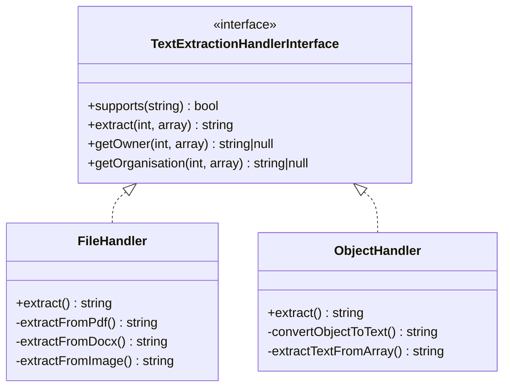
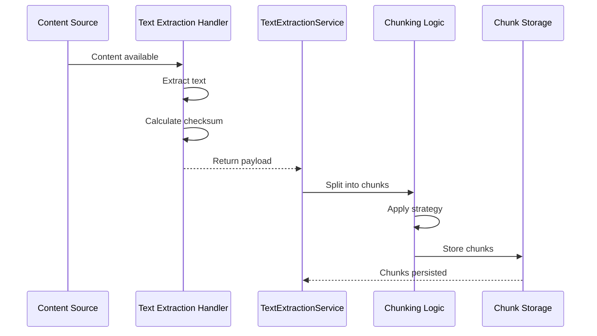

# Text Extraction Technical Documentation

> **📚 Feature Documentation**: See **[Text Extraction, Vectorization & Named Entity Recognition](../Features/text-extraction-vectorization-ner.md)** for user-facing documentation and overview.

## Overview

OpenRegister's Text Extraction Service converts content from various sources (files, objects, emails, calendar items) into searchable text chunks. The service uses a handler-based architecture to support multiple source types and extraction methods.

## Architecture

### Handler-Based Design



**Location**: `lib/Service/TextExtraction/`

### Service Flow



## Database Schema

### Chunk Entity

**Table**: `oc_openregister_chunks`

```sql
CREATE TABLE oc_openregister_chunks (
    id BIGINT AUTO_INCREMENT PRIMARY KEY,
    uuid VARCHAR(255) NOT NULL UNIQUE,
    source_type VARCHAR(50) NOT NULL,
    source_id BIGINT NOT NULL,
    text_content TEXT NOT NULL,
    start_offset INT NOT NULL,
    end_offset INT NOT NULL,
    chunk_index INT NOT NULL,
    checksum VARCHAR(64),
    language VARCHAR(10),
    language_level VARCHAR(20),
    language_confidence DECIMAL(3,2),
    detection_method VARCHAR(50),
    indexed_in_solr BOOLEAN NOT NULL DEFAULT FALSE,
    vectorized BOOLEAN NOT NULL DEFAULT FALSE,
    owner VARCHAR(255),
    organisation VARCHAR(255),
    created_at DATETIME NOT NULL DEFAULT CURRENT_TIMESTAMP,
    updated_at DATETIME NOT NULL DEFAULT CURRENT_TIMESTAMP ON UPDATE CURRENT_TIMESTAMP,
    
    INDEX idx_source (source_type, source_id),
    INDEX idx_checksum (checksum),
    INDEX idx_language (language),
    INDEX idx_owner (owner),
    INDEX idx_organisation (organisation)
) ENGINE=InnoDB DEFAULT CHARSET=utf8mb4 COLLATE=utf8mb4_unicode_ci;
```

**Key Fields**:
- `source_type`: 'file', 'object', 'email', 'calendar'
- `source_id`: ID of the source entity
- `checksum`: SHA256 hash of source text for change detection
- `text_content`: The actual chunk text
- `start_offset` / `end_offset`: Character positions in original text
- `chunk_index`: Sequential chunk number (0-based)

### Entity Class

**Location**: `lib/Db/Chunk.php`

```php
class Chunk extends Entity implements JsonSerializable
{
    protected ?string $uuid = null;
    protected ?string $sourceType = null;
    protected ?int $sourceId = null;
    protected ?string $textContent = null;
    protected int $startOffset = 0;
    protected int $endOffset = 0;
    protected int $chunkIndex = 0;
    protected ?string $checksum = null;
    protected ?string $language = null;
    protected ?string $languageLevel = null;
    protected ?float $languageConfidence = null;
    protected ?string $detectionMethod = null;
    protected bool $indexedInSolr = false;
    protected bool $vectorized = false;
    protected ?string $owner = null;
    protected ?string $organisation = null;
    protected ?DateTime $createdAt = null;
    protected ?DateTime $updatedAt = null;
}
```

## Handlers

### FileHandler

**Location**: `lib/Service/TextExtraction/FileHandler.php`

**Supported Formats**:
- **Documents**: PDF, DOCX, DOC, ODT, RTF
- **Spreadsheets**: XLSX, XLS, CSV
- **Presentations**: PPTX
- **Text Files**: TXT, MD, HTML, JSON, XML
- **Images**: JPG, PNG, GIF, WebP, TIFF (via OCR)

**Extraction Methods**:
- **LLPhant**: Local PHP-based extraction
- **Dolphin**: AI-powered extraction with OCR
- **Native**: Direct text reading for plain text files

**Implementation**:
```php
public function extract(int $sourceId, array $sourceMeta): string
{
    $nodes = $this->rootFolder->getById($sourceId);
    $file = $nodes[0];
    
    // Extract based on MIME type
    $mimeType = $sourceMeta['mimetype'] ?? 'unknown';
    
    // TODO: Implement actual extraction logic
    return $file->getContent();
}
```

### ObjectHandler

**Location**: `lib/Service/TextExtraction/ObjectHandler.php`

**Process**:
1. Load object from database
2. Extract schema and register information
3. Flatten nested object structures
4. Concatenate property values with context
5. Add metadata (UUID, version, organization)

**Implementation**:
```php
public function extract(int $sourceId, array $sourceMeta): string
{
    $object = $this->objectMapper->find($sourceId);
    return $this->convertObjectToText($object);
}

private function convertObjectToText(ObjectEntity $object): string
{
    $textParts = [];
    $textParts[] = "Object ID: " . $object->getUuid();
    
    // Add schema info
    if ($object->getSchema() !== null) {
        $schema = $this->schemaMapper->find($object->getSchema());
        $textParts[] = "Type: " . ($schema->getTitle() ?? $schema->getName());
    }
    
    // Extract object data
    $objectData = $object->getObject();
    if (is_array($objectData)) {
        $textParts[] = "Content: " . $this->extractTextFromArray($objectData);
    }
    
    return implode("\n", $textParts);
}
```

## Chunking Strategies

### Recursive Character Splitting (Recommended)

**Priority Order**:
1. Paragraph breaks (`\n\n`)
2. Sentence endings (`. ! ?`)
3. Line breaks (`\n`)
4. Commas and semicolons
5. Word boundaries (spaces)
6. Character split (fallback)

**Best for**: Natural language documents, articles, reports

**Configuration**:
```php
$chunks = $textExtractionService->textToChunks($text, [
    'chunk_size' => 1000,
    'chunk_overlap' => 200,
    'strategy' => 'RECURSIVE_CHARACTER'
]);
```

### Fixed Size Splitting

**Settings**:
- Chunk size: 1000 characters (default)
- Overlap: 200 characters (default)
- Minimum chunk: 100 characters

**Best for**: Structured data, code, logs

**Configuration**:
```php
$chunks = $textExtractionService->textToChunks($text, [
    'chunk_size' => 1000,
    'chunk_overlap' => 200,
    'strategy' => 'FIXED_SIZE'
]);
```

## Supported File Formats

### Text Documents

| Format | Max Size | Processing Time | Notes |
|--------|----------|----------------|-------|
| `.txt` | 100MB | < 1s | UTF-8, ISO-8859-1, Windows-1252 |
| `.md` | 50MB | < 1s | Preserves structure |
| `.html` | 20MB | 1-3s | Strips scripts/styles |

### PDF Documents

| Type | Max Size | Processing Time | Libraries |
|------|----------|----------------|-----------|
| Text PDF | 100MB | 2-10s | Smalot PdfParser, pdftotext |
| Scanned PDF (OCR) | 50MB | 10-60s | Tesseract OCR |

**Requirements for OCR**:
```bash
# Install Tesseract
sudo apt-get install tesseract-ocr

# With languages
apt-get install tesseract-ocr-nld tesseract-ocr-deu
```

### Microsoft Office

| Format | Max Size | Processing Time | Libraries |
|--------|----------|----------------|-----------|
| `.docx` | 50MB | 2-5s | PhpOffice/PhpWord |
| `.xlsx` | 30MB | 3-10s | PhpOffice/PhpSpreadsheet |
| `.pptx` | 50MB | 2-5s | ZipArchive + XML |

### Images (OCR)

| Format | Max Size | Processing Time | Requirements |
|--------|----------|----------------|--------------|
| JPG, PNG, GIF, BMP, TIFF | 20MB | 5-15s/page | Tesseract OCR |

**Best Practices**:
- Use high-resolution scans (300 DPI ideal)
- Ensure text is legible and not skewed
- Black text on white background works best

### Data Formats

| Format | Max Size | Processing Time | Notes |
|--------|----------|----------------|-------|
| `.json` | 20MB | 1-2s | Recursive extraction |
| `.xml` | 20MB | 1-3s | Tag names and content |

## Service Implementation

### TextExtractionService

**Location**: `lib/Service/TextExtractionService.php`

**Key Methods**:

```php
/**
 * Extract text from a source using appropriate handler.
 */
public function extractSourceText(
    string $sourceType,
    int $sourceId,
    array $sourceMeta
): array {
    $handler = $this->getHandler($sourceType);
    $text = $handler->extract($sourceId, $sourceMeta);
    $checksum = hash('sha256', $text);
    
    return [
        'source_type' => $sourceType,
        'source_id' => $sourceId,
        'text' => $text,
        'checksum' => $checksum,
        'owner' => $handler->getOwner($sourceId, $sourceMeta),
        'organisation' => $handler->getOrganisation($sourceId, $sourceMeta),
    ];
}

/**
 * Split text into chunks.
 */
public function textToChunks(array $payload, array $options = []): array {
    $chunkSize = $options['chunk_size'] ?? self::DEFAULT_CHUNK_SIZE;
    $chunkOverlap = $options['chunk_overlap'] ?? self::DEFAULT_CHUNK_OVERLAP;
    $strategy = $options['strategy'] ?? self::RECURSIVE_CHARACTER;
    
    // Apply chunking strategy
    $chunks = match($strategy) {
        self::FIXED_SIZE => $this->chunkFixedSize($payload['text'], $chunkSize, $chunkOverlap),
        self::RECURSIVE_CHARACTER => $this->chunkRecursive($payload['text'], $chunkSize, $chunkOverlap),
        default => $this->chunkRecursive($payload['text'], $chunkSize, $chunkOverlap)
    };
    
    // Map to chunk entities with checksum
    return array_map(function($index, $chunkText) use ($payload, $chunkSize) {
        return [
            'text_content' => $chunkText,
            'chunk_index' => $index,
            'start_offset' => $index * $chunkSize,
            'end_offset' => ($index * $chunkSize) + strlen($chunkText),
            'checksum' => $payload['checksum'] ?? null,
        ];
    }, array_keys($chunks), $chunks);
}

/**
 * Persist chunks to database.
 */
public function persistChunksForSource(
    string $sourceType,
    int $sourceId,
    array $chunks,
    ?string $owner,
    ?string $organisation,
    int $sourceTimestamp,
    array $payload
): void {
    // Delete existing chunks for this source
    $this->chunkMapper->deleteBySource($sourceType, $sourceId);
    
    // Create new chunks
    foreach ($chunks as $chunkData) {
        $chunk = new Chunk();
        $chunk->setUuid(Uuid::v4()->toString());
        $chunk->setSourceType($sourceType);
        $chunk->setSourceId($sourceId);
        $chunk->setTextContent($chunkData['text_content']);
        $chunk->setStartOffset($chunkData['start_offset']);
        $chunk->setEndOffset($chunkData['end_offset']);
        $chunk->setChunkIndex($chunkData['chunk_index']);
        $chunk->setChecksum($chunkData['checksum'] ?? null);
        $chunk->setOwner($owner);
        $chunk->setOrganisation($organisation);
        
        $this->chunkMapper->insert($chunk);
    }
}
```

## Change Detection

The system uses SHA256 checksums to detect content changes:

```php
// Calculate checksum from extracted text
$checksum = hash('sha256', $extractedText);

// Check if source is up-to-date
public function isSourceUpToDate(
    int $sourceId,
    string $sourceType,
    int $sourceTimestamp,
    bool $forceReExtract
): bool {
    if ($forceReExtract === true) {
        return false;
    }
    
    // Get existing chunks
    $existingChunks = $this->chunkMapper->findBySource($sourceType, $sourceId);
    
    if (empty($existingChunks)) {
        return false;
    }
    
    // Check if checksum matches
    $existingChecksum = $existingChunks[0]->getChecksum();
    $currentChecksum = $this->calculateSourceChecksum($sourceId, $sourceType);
    
    return $existingChecksum === $currentChecksum;
}
```

**Benefits**:
- Avoids unnecessary re-extraction
- Efficient change detection
- Automatic updates on content modification

## Performance

### Processing Times

| File Type | Size | Extraction Time | Chunking Time |
|-----------|------|----------------|---------------|
| Text (.txt) | < 1MB | < 1s | 50ms |
| PDF (text) | < 5MB | 1-3s | 100ms |
| PDF (OCR) | < 5MB | 10-60s | 100ms |
| DOCX | < 5MB | 1-2s | 100ms |
| XLSX | < 5MB | 2-5s | 150ms |
| Images (OCR) | < 5MB | 5-15s | 50ms |

### Bulk Processing

- **Batch Size**: 100 items per batch (configurable)
- **Parallel Processing**: Supported via background jobs
- **Progress Tracking**: Real-time status updates

## API Endpoints

### Text Extraction

```http
POST /api/files/{fileId}/extract
POST /api/objects/{objectId}/extract
GET  /api/chunks?source_type=file&source_id={id}
GET  /api/chunks/{chunkId}
```

### Chunking

```http
POST /api/chunks/chunk
Content-Type: application/json

{
  "source_type": "file",
  "source_id": 12345,
  "options": {
    "chunk_size": 1000,
    "chunk_overlap": 200,
    "strategy": "RECURSIVE_CHARACTER"
  }
}
```

## Error Handling

### Common Errors

| Error | Cause | Solution |
|-------|-------|----------|
| File too large | Exceeds format limit | Reduce size or increase limit |
| Format not supported | Unrecognized format | Enable format or convert file |
| Extraction failed | Corrupted file | Verify file integrity |
| OCR failed | Tesseract not installed | Install Tesseract OCR |

### Recovery

- Failed extractions can be retried via API
- Error messages stored for debugging
- Automatic retry on content update

## Processing Pipeline

### Step-by-Step Flow

```
┌─────────────────────────────────────────────────────────┐
│ 1. File Upload                                          │
│    - User uploads file to Nextcloud                     │
│    - File stored in data directory                      │
│    - Upload completes immediately (non-blocking)        │
└────────────────────┬────────────────────────────────────┘
                     │
                     ▼
┌─────────────────────────────────────────────────────────┐
│ 2. Background Job Queued                                │
│    - FileChangeListener detects new/updated file        │
│    - Queues FileTextExtractionJob asynchronously        │
│    - User request completes without delay               │
└────────────────────┬────────────────────────────────────┘
                     │
                     ▼
┌─────────────────────────────────────────────────────────┐
│ 3. Background Processing (non-blocking)                 │
│    - Job runs in background (typically within seconds)  │
│    - Check MIME type and validate format                │
│    - Use format-specific extractor                      │
│    - Handle encoding issues                             │
│    - Clean/normalize text                               │
└────────────────────┬────────────────────────────────────┘
                     │
                     ▼
┌─────────────────────────────────────────────────────────┐
│ 4. Document Chunking                                    │
│    - Apply selected strategy                            │
│    - Create overlapping chunks                          │
│    - Preserve metadata                                  │
└────────────────────┬────────────────────────────────────┘
                     │
                     ▼
┌─────────────────────────────────────────────────────────┐
│ 5. Storage                                              │
│    - Store chunks in database                           │
│    - Calculate and store checksum                       │
│    - Link chunks to source                             │
└─────────────────────────────────────────────────────────┘
```

### Event Listener

**Location**: `lib/Listener/FileChangeListener.php`

**Purpose**: Automatically process files on upload/update.

**Events**:
- `NodeCreatedEvent` - File uploaded
- `NodeWrittenEvent` - File updated

**Behavior**:
- Checks if extraction is needed (checksum comparison)
- Triggers text extraction automatically via background job
- Updates extraction status
- Full error handling and logging

**Registration**: Registered in `Application.php` with service container integration.

## File Size Limits

### Default Limits

| Format | Default Max Size | Configurable | Reason |
|--------|------------------|--------------|--------|
| Text/Markdown | 100MB | Yes | Memory-efficient |
| HTML | 20MB | Yes | DOM parsing overhead |
| PDF (text) | 100MB | Yes | Direct extraction |
| PDF (OCR) | 50MB | Yes | Processing intensive |
| Office Docs | 30-50MB | Yes | Library limitations |
| Images | 20MB | Yes | OCR memory usage |
| JSON/XML | 20MB | Yes | Parsing complexity |

### Modifying Limits

Edit `lib/Service/SolrFileService.php`:

```php
// File size limits (in bytes)
private const MAX_FILE_SIZE_TEXT = 104857600;  // 100MB
private const MAX_FILE_SIZE_PDF = 104857600;   // 100MB
private const MAX_FILE_SIZE_OFFICE = 52428800; // 50MB
private const MAX_FILE_SIZE_IMAGE = 20971520;  // 20MB
```

**Warning**: Increasing limits may cause:
- Memory exhaustion
- Slow processing
- Timeouts on large files

## Dependencies

### PHP Libraries (Installed via Composer)

```json
{
  "smalot/pdfparser": "^2.0",           // PDF text extraction
  "phpoffice/phpword": "^1.0",          // Word document processing
  "phpoffice/phpspreadsheet": "^1.0"    // Excel processing
}
```

### System Commands

| Command | Purpose | Installation |
|---------|---------|--------------|
| `pdftotext` | PDF extraction fallback | `apt-get install poppler-utils` |
| `tesseract` | OCR for images/scanned PDFs | `apt-get install tesseract-ocr` |

### Checking Dependencies

```bash
# Check if pdftotext is available
which pdftotext

# Check Tesseract version
tesseract --version

# Test OCR
tesseract test-image.png output
```

## Troubleshooting

### Debugging File Processing

**Enable Debug Logging**:
1. Go to Settings → File Management
2. Enable "Detailed Logging"
3. Check logs at: `data/nextcloud.log` or via Docker: `docker logs nextcloud-container`

**Look for**:
```
[TextExtractionService] Processing file: document.pdf
[TextExtractionService] Extraction method: pdfParser
[TextExtractionService] Extracted text length: 45678
[TextExtractionService] Created 12 chunks
```

### Performance Issues

**If processing is slow**:
1. Check file size and format
2. Monitor memory usage: `docker stats`
3. Reduce chunk size to decrease processing time
4. Use faster extraction methods when possible

### File Access Issues

**If you see 'file not found' or 'failed to open stream' errors**:

The system uses asynchronous background jobs to process files:
- **Non-blocking uploads**: File uploads complete immediately without waiting for text extraction
- **Background processing**: Text extraction runs in background jobs (typically within seconds)
- **Path filtering**: Only OpenRegister files are processed
- **Automatic retries**: Failed extractions are automatically retried by the background job system

**To check background job status**:
```bash
# View pending background jobs
docker exec -u 33 <nextcloud-container> php occ background-job:list

# Check logs for extraction job status
docker logs <nextcloud-container> | grep FileTextExtractionJob
```

### Quality Issues

**If text extraction is poor**:
1. Verify source file quality
2. For scanned documents, ensure 300+ DPI
3. Use native PDF over scanned when possible
4. Test with different OCR languages
5. Check for corrupted files

## Best Practices

### For Administrators

✅ **Do**:
- Enable only needed file formats
- Set reasonable size limits
- Monitor storage growth
- Schedule bulk processing off-hours
- Keep dependencies updated

❌ **Don't**:
- Process unnecessary file types
- Set extremely high size limits
- Skip dependency checks
- Run bulk processing during peak hours

### For Users

✅ **Do**:
- Use text-based PDFs when possible
- Provide high-quality scans (300 DPI)
- Use consistent file naming
- Organize files in logical folders

❌ **Don't**:
- Upload password-protected files (won't extract)
- Use low-resolution scans
- Mix unrelated content in single file
- Rely on OCR for perfect accuracy

## FAQ

**Q: Can I process password-protected files?**  
A: No, password-protected files cannot be extracted. Remove password first.

**Q: How accurate is OCR?**  
A: 90-98% accuracy for good quality scans (300 DPI, clear text). Lower for poor scans.

**Q: Can I process files retroactively?**  
A: Yes! Use bulk extraction via API or admin interface.

**Q: Do I need to re-process files after changing chunk strategy?**  
A: Yes, existing chunks won't update automatically. Re-extract to apply new strategy.

**Q: What happens to old chunks when I re-process?**  
A: Old chunks are replaced with new ones. Checksums ensure only changed content is re-processed.

**Q: Can I see extracted text before chunking?**  
A: Check logs with debug mode enabled. Text is logged before chunking.

## Migration

### From FileText to Chunks

The old `FileText` entity stored chunks in `chunks_json`. Migration to dedicated `Chunk` table:

```php
// Migration: Version1Date20251118000000
// Drops deprecated openregister_file_texts and openregister_object_texts tables

// Migration: Version1Date20251117000000
// Adds checksum column to openregister_chunks table
```

**Migration Strategy**:
1. Create `openregister_chunks` table
2. Migrate existing chunks from `chunks_json` to table
3. Update services to use `ChunkMapper`
4. Drop old tables (after verification)

## Related Documentation

### Feature Documentation
- **[Text Extraction, Vectorization & Named Entity Recognition](../Features/text-extraction-vectorization-ner.md)** - Unified feature documentation
- **[Text Extraction Sources](../features/text-extraction-sources.md)** - Source-specific details (files vs objects)
- **[Enhanced Text Extraction](../features/text-extraction-enhanced.md)** - GDPR and language features

### Technical Documentation
- **[Vectorization Technical Documentation](./vectorization.md)** - Vector embedding implementation
- **[Named Entity Recognition Technical Documentation](./named-entity-recognition.md)** - NER implementation

