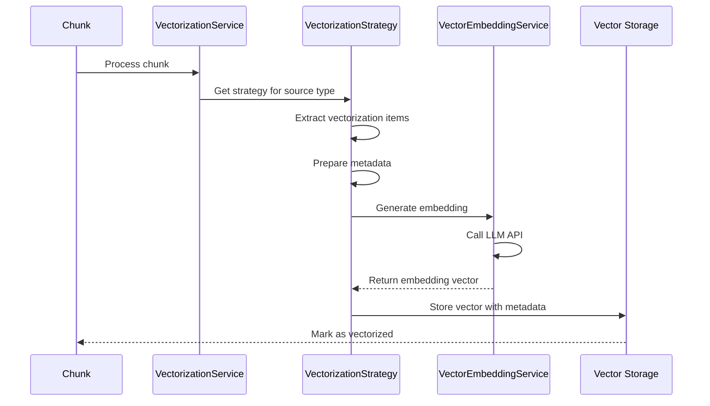
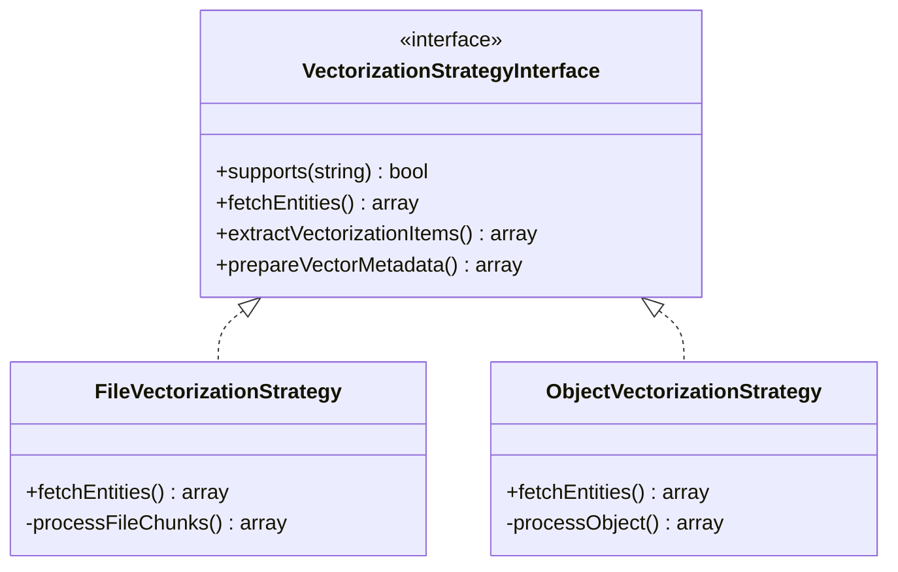

# Vectorization Technical Documentation

> **📚 Feature Documentation**: See **[Text Extraction, Vectorization & Named Entity Recognition](../Features/text-extraction-vectorization-ner.md)** for user-facing documentation and overview.

## Overview

OpenRegister's VectorizationService generates semantic embeddings from text chunks, enabling RAG (Retrieval Augmented Generation) and semantic search capabilities. The service supports multiple embedding providers and vector storage backends.

## Architecture

### Service Flow



### Strategy Pattern



**Location**: `lib/Service/Vectorization/`

## Services

### VectorizationService (Public API)

**Location**: `lib/Service/VectorizationService.php`

**Purpose**: Public API facade for all vector operations. Orchestrates vectorization using strategies and delegates to VectorEmbeddingService.

**Architecture**: This is the single entry point for all vector operations. Other services should call VectorizationService, not VectorEmbeddingService directly.

**Key Methods**:

```php
/**
 * Vectorize entities using appropriate strategy.
 */
public function vectorizeEntity(
    Chunk|ObjectEntity $entity,
    ?VectorizationStrategyInterface $strategy = null
): array {
    // Get strategy for entity type
    if ($strategy === null) {
        $strategy = $this->getStrategyForEntity($entity);
    }
    
    // Extract vectorization items
    $items = $strategy->extractVectorizationItems($entity);
    
    // Generate embeddings
    $embeddings = $this->vectorEmbeddingService->generateBatchEmbeddings(
        array_column($items, 'text'),
        $provider
    );
    
    // Store vectors
    foreach ($items as $index => $item) {
        $embedding = $embeddings[$index];
        $strategy->storeVector($item, $embedding);
    }
    
    return ['vectors_created' => count($items)];
}
```

### VectorEmbeddingService (Internal Handler)

**Location**: `lib/Service/Vectorization/VectorEmbeddingService.php`

**Purpose**: Internal service that generates embeddings using LLM providers. This is an implementation detail - use VectorizationService as the public API.

**Supported Providers**:
- **OpenAI**: text-embedding-ada-002, text-embedding-3-small, text-embedding-3-large
- **Fireworks AI**: nomic-ai/nomic-embed-text-v1.5, thenlper/gte-base
- **Ollama**: nomic-embed-text

**Key Methods**:

```php
/**
 * Generate embedding for single text.
 */
public function generateEmbedding(
    string $text,
    ?string $provider = null
): ?array {
    $provider = $provider ?? $this->getDefaultProvider();
    
    return match($provider) {
        'openai' => $this->generateOpenAIEmbedding($text),
        'fireworks' => $this->generateFireworksEmbedding($text),
        'ollama' => $this->generateOllamaEmbedding($text),
        default => throw new Exception("Unknown provider: {$provider}")
    };
}

/**
 * Generate embeddings for multiple texts (batch).
 */
public function generateBatchEmbeddings(
    array $texts,
    ?string $provider = null
): array {
    // Batch processing for efficiency
    $batchSize = 100;
    $results = [];
    
    foreach (array_chunk($texts, $batchSize) as $batch) {
        $batchResults = $this->callProviderBatchAPI($batch, $provider);
        $results = array_merge($results, $batchResults);
    }
    
    return $results;
}
```

## Vectorization Strategies

### FileVectorizationStrategy

**Location**: `lib/Service/Vectorization/FileVectorizationStrategy.php`

**Process**:
- Processes file chunks individually
- Each chunk gets its own vector
- Metadata includes file ID, path, chunk index

**Implementation**:

```php
public function extractVectorizationItems(Chunk $chunk): array
{
    return [[
        'text' => $chunk->getTextContent(),
        'metadata' => [
            'source_type' => 'file',
            'source_id' => $chunk->getSourceId(),
            'chunk_index' => $chunk->getChunkIndex(),
            'total_chunks' => $this->getTotalChunks($chunk->getSourceId()),
        ]
    ]];
}
```

### ObjectVectorizationStrategy

**Location**: `lib/Service/Vectorization/ObjectVectorizationStrategy.php`

**Process**:
- Processes entire objects as single vectors
- One vector per object (not per chunk)
- Metadata includes object UUID, schema, register

**Implementation**:

```php
public function extractVectorizationItems(ObjectEntity $object): array
{
    // Convert object to text
    $text = $this->objectService->convertObjectToText($object);
    
    return [[
        'text' => $text,
        'metadata' => [
            'source_type' => 'object',
            'source_id' => $object->getId(),
            'uuid' => $object->getUuid(),
            'schema_id' => $object->getSchema(),
            'register_id' => $object->getRegister(),
        ]
    ]];
}
```

## Vector Storage

### Database Storage

**Table**: `oc_openregister_vectors`

```sql
CREATE TABLE oc_openregister_vectors (
    id BIGINT AUTO_INCREMENT PRIMARY KEY,
    entity_type VARCHAR(50) NOT NULL,
    entity_id VARCHAR(255) NOT NULL,
    chunk_index INT NOT NULL DEFAULT 0,
    total_chunks INT NOT NULL DEFAULT 1,
    chunk_text TEXT,
    vector_data BLOB NOT NULL,
    embedding_model VARCHAR(100) NOT NULL,
    embedding_dimensions INT NOT NULL,
    metadata JSON,
    created_at DATETIME NOT NULL DEFAULT CURRENT_TIMESTAMP,
    
    INDEX idx_entity (entity_type, entity_id),
    INDEX idx_model (embedding_model)
) ENGINE=InnoDB DEFAULT CHARSET=utf8mb4 COLLATE=utf8mb4_unicode_ci;
```

**Storage Format**: Serialized binary (PHP `serialize()`)

### Solr Storage

Vectors stored directly in existing Solr collections:

**FileCollection**:
```json
{
  "id": "file_12345_chunk_0",
  "entity_type_s": "file",
  "entity_id_s": "12345",
  "chunk_index_i": 0,
  "chunk_text_txt": "Text content...",
  "_embedding_": [0.1, 0.2, 0.3, ...],
  "_embedding_model_": "text-embedding-3-small",
  "_embedding_dim_": 1536
}
```

**ObjectCollection**:
```json
{
  "id": "object_abc123",
  "entity_type_s": "object",
  "entity_id_s": "abc123",
  "chunk_index_i": 0,
  "chunk_text_txt": "Object text...",
  "_embedding_": [0.1, 0.2, 0.3, ...],
  "_embedding_model_": "text-embedding-3-small",
  "_embedding_dim_": 1536
}
```

## Vector Search Backends

### PHP Cosine Similarity (Default)

**Status**: Always available fallback

**How It Works**:
- Fetches vectors from database
- Calculates cosine similarity in PHP
- Sorts results in memory
- Returns top N matches

**Performance**:
- Suitable for small datasets (&lt;500 vectors)
- Current optimization: Limited to 500 most recent vectors
- Scales linearly: O(n) complexity

**Use When**:
- Small dataset (&lt;500 vectors)
- No PostgreSQL or Solr available
- Testing/development environment

### PostgreSQL + pgvector

**Status**: Available when PostgreSQL with pgvector extension is installed

**Requirements**:
- PostgreSQL version >= 11
- pgvector extension installed
- Vector column migration

**Installation**:

```sql
-- Install extension
CREATE EXTENSION IF NOT EXISTS vector;

-- Create optimized vector table
CREATE TABLE openregister_vectors (
    id SERIAL PRIMARY KEY,
    entity_type VARCHAR(50),
    entity_id VARCHAR(255),
    chunk_index INTEGER,
    total_chunks INTEGER,
    chunk_text TEXT,
    embedding vector(768),  -- Native vector type!
    embedding_model VARCHAR(100),
    embedding_dimensions INTEGER,
    metadata JSONB,
    created_at TIMESTAMP DEFAULT CURRENT_TIMESTAMP
);

-- Create HNSW index for fast similarity search
CREATE INDEX ON openregister_vectors 
USING hnsw (embedding vector_cosine_ops);
```

**Performance**:
- 10-100x faster than PHP
- Database-level KNN search
- Optimal for medium-large datasets

### Solr 9+ Dense Vector Search

**Status**: Available when Solr 9.0+ is configured

**Capabilities**:
- Dense Vector Field Type: `DenseVectorField`
- KNN Search: K-Nearest Neighbors query parser
- Similarity Functions: Cosine, Dot Product, Euclidean
- Indexing Algorithms: HNSW (Hierarchical Navigable Small World)

**Schema Configuration**:

```xml
<fieldType name="knn_vector" class="solr.DenseVectorField" 
           vectorDimension="768" 
           similarityFunction="cosine" 
           knnAlgorithm="hnsw"/>

<field name="_embedding_" type="knn_vector" indexed="true" stored="true"/>
```

**Query Example**:

```json
{
  "q": "{!knn f=_embedding_ topK=10}[0.123, 0.456, ...]",
  "fl": "id,score"
}
```

**Performance**:
- Very fast distributed vector search
- Best for large-scale deployments
- 100-1000x faster than PHP at scale

## Configuration

### Settings Location

Vector search backend configuration stored in LLM settings:

```json
{
  "llm": {
    "vectorConfig": {
      "backend": "solr",
      "solrCollection": "openregister_vectors",
      "solrField": "_embedding_"
    }
  }
}
```

### Configuration Properties

| Property | Type | Default | Description |
|----------|------|---------|-------------|
| `backend` | string | `'php'` | Vector search backend: 'php', 'database', or 'solr' |
| `solrCollection` | string\|null | `null` | Solr collection name (required for Solr backend) |
| `solrField` | string | `'_embedding_'` | Solr field name for dense vectors |

## Performance

### Processing Times

| Stage | Time per Item | Notes |
|-------|---------------|-------|
| **Embedding Generation** | 200-500ms | Per chunk (one-time) |
| **Vector Storage** | 10-50ms | Database or Solr |
| **Vector Search (PHP)** | 1-10s | Depends on dataset size |
| **Vector Search (PostgreSQL)** | 20-200ms | With HNSW index |
| **Vector Search (Solr)** | 10-30ms | With HNSW index |

### Performance Comparison

**Test**: Search 10,000 vectors, return top 10 results

| Backend | Latency | Throughput | Memory |
|---------|---------|------------|--------|
| **PHP** | 10s | 1 req/s | Low |
| **PostgreSQL + pgvector** | 50ms | 50 req/s | Medium |
| **Solr 9+ (HNSW)** | 20ms | 100+ req/s | Medium-High |

## API Endpoints

### Vectorization

```http
POST /api/chunks/vectorize
Content-Type: application/json

{
  "source_type": "file",
  "source_id": 12345,
  "provider": "openai"
}
```

**Response**:
```json
{
  "success": true,
  "vectors_created": 14,
  "model": "text-embedding-3-small",
  "dimensions": 1536
}
```

### Semantic Search

```http
POST /api/search/semantic
Content-Type: application/json

{
  "query": "budget discussion with John",
  "limit": 10,
  "filters": {
    "source_type": ["file", "object"]
  }
}
```

**Response**:
```json
{
  "results": [
    {
      "chunk_id": 123,
      "source_type": "file",
      "source_id": 12345,
      "text": "...discussed budget with John Doe...",
      "similarity": 0.87,
      "metadata": {
        "file_name": "meeting-notes.pdf",
        "chunk_index": 3
      }
    }
  ],
  "total": 10
}
```

## Backend Configuration

### UI Configuration

Configure in **Settings → OpenRegister → LLM Configuration**:

1. Click **"Configure LLM"** button
2. Scroll to **"Vector Search Backend"** section
3. Select backend from dropdown:
   - PHP Cosine Similarity (🐌 Slow)
   - PostgreSQL + pgvector (⚡ Fast)
   - Solr 9+ Dense Vector (🚀 Very Fast)
4. If Solr selected:
   - Choose Solr collection from dropdown
   - Vector field name is automatically set to `_embedding_`
5. Click **"Save Configuration"**

### Backend Detection

The system automatically detects available backends:

**Database Detection**:
- Checks database platform (PostgreSQL vs MariaDB/MySQL)
- Queries for pgvector extension
- Shows availability status

**Solr Detection**:
- Checks Solr version >= 9.0
- Lists available collections
- Validates vector field configuration

## Recommended Setup

| Dataset Size | Recommended Backend | Reason |
|--------------|---------------------|--------|
| &lt; 500 vectors | PHP | Simple, no setup |
| 500 - 10,000 | PostgreSQL + pgvector | Fast, integrated |
| 10,000+ | Solr 9+ | Best performance, scalability |

## Migration

### From PHP to PostgreSQL

1. Install PostgreSQL with pgvector extension
2. Migrate vector table to PostgreSQL
3. Update Nextcloud database configuration
4. Select "PostgreSQL + pgvector" in LLM Configuration
5. System will auto-detect and enable

### From PHP to Solr

1. Ensure Solr 9.0+ is running
2. Create or select Solr collection
3. Configure vector field in Solr schema (`_embedding_`)
4. Select "Solr 9+ Dense Vector" in LLM Configuration
5. Choose collection and save

### Switching Backends

You can switch backends at any time:
- Configuration changes take effect immediately
- Existing vectors remain in database
- New searches use selected backend
- No data migration required (vectors stored in database regardless of backend)

## Solr Integration Details

### Vector Storage in Existing Collections

Vectors are stored directly in existing Solr collections (fileCollection and objectCollection) rather than a separate vector collection:

**Files**: Vectors stored in `fileCollection` alongside file chunks  
**Objects**: Vectors stored in `objectCollection` alongside object data

This enables:
- Single source of truth for each entity
- Full document retrieval without additional lookups
- Atomic updates to existing documents

### Solr Document Structure

Vectors are stored as fields in existing Solr documents:

```json
{
  "id": "object_abc123_chunk_0",
  "entity_type_s": "object",
  "entity_id_s": "abc123",
  "chunk_index_i": 0,
  "chunk_text_txt": "This is the text that was embedded...",
  "_embedding_": [0.1, 0.2, 0.3, ...],
  "_embedding_model_": "text-embedding-ada-002",
  "_embedding_dim_": 1536
}
```

### KNN Query Syntax

The implementation uses Solr's KNN query parser:

```
{!knn f=_embedding_ topK=10}[0.1, 0.2, 0.3, ...]
```

**Benefits**:
- Very fast (millisecond range)
- Uses HNSW indexing algorithm
- Returns full documents with all metadata
- Supports filtering by entity type

### Configuration

No separate `solrCollection` field needed - uses existing `fileCollection` and `objectCollection` from Solr settings. The `solrField` is hardcoded to `_embedding_` (a reserved system field).

## Performance Monitoring

### Current Performance

**PHP Backend**:
- 279 vectors → ~300ms similarity calculation
- 1,000 vectors → ~1 second
- 10,000 vectors → ~10 seconds
- Plus embedding generation time (~1.5s)
- **Current optimization**: Limited to 500 most recent vectors

**PostgreSQL + pgvector**:
- 1K vectors → ~20ms
- 10K vectors → ~50ms
- 100K vectors → ~200ms
- Uses HNSW indexing

**Solr 9+ Dense Vector**:
- 1K vectors → ~20ms
- 10K vectors → ~15ms
- 100K vectors → ~30ms
- Uses HNSW indexing algorithm
- Distributed search across collections

### Performance Targets

| Metric | Current (PHP) | Target (PostgreSQL) | Best (Solr) |
|--------|-------------------|---------------------|---------------|
| **Search Time (1K vectors)** | 1s | 20ms | 10ms |
| **Search Time (10K vectors)** | 10s | 50ms | 15ms |
| **Search Time (100K vectors)** | 100s | 200ms | 30ms |
| **Indexing** | None | HNSW | ANN algorithms |
| **Scalability** | Poor | Good | Excellent |

### Performance Comparison

**Test**: Search 10,000 vectors, return top 10 results

| Backend | Latency | Throughput | Memory | Index Time |
|---------|---------|------------|--------|------------|
| **PHP** | 10s | 1 req/s | Low | N/A |
| **PostgreSQL + pgvector** | 50ms | 50 req/s | Medium | Fast |
| **Solr 9+ (HNSW)** | 20ms | 100+ req/s | Medium-High | Medium |

## Troubleshooting

### Backend Not Available

**PostgreSQL + pgvector**:
- Verify PostgreSQL is installed
- Check pgvector extension: `SELECT * FROM pg_extension WHERE extname = 'vector';`
- Install if missing: `CREATE EXTENSION vector;`

**Solr 9+**:
- Verify Solr version >= 9.0
- Check Solr is accessible
- Verify collection exists
- Check vector field is configured in schema

### Slow Performance

**PHP Backend**:
- Consider migrating to PostgreSQL or Solr
- Current optimization limits to 500 most recent vectors
- Performance scales linearly with vector count

**PostgreSQL**:
- Ensure HNSW index is created
- Check query execution plan
- Monitor database performance

**Solr**:
- Verify HNSW indexing is enabled
- Check collection health
- Monitor Solr performance metrics

## API Endpoints

### Get Database Info

```bash
GET /api/settings/database
```

Returns database type, version, and vector support.

### Get Solr Info

```bash
GET /api/settings/solr-info
```

Returns Solr availability, version, and collections.

## Related Documentation

### Feature Documentation
- **[Text Extraction, Vectorization & Named Entity Recognition](../Features/text-extraction-vectorization-ner.md)** - Unified feature documentation
- **[AI Chat Interface](../Features/ai.md)** - RAG and semantic search usage

### Technical Documentation
- **[Text Extraction Technical Documentation](./text-extraction.md)** - Text extraction implementation
- **[Named Entity Recognition Technical Documentation](./named-entity-recognition.md)** - NER implementation

