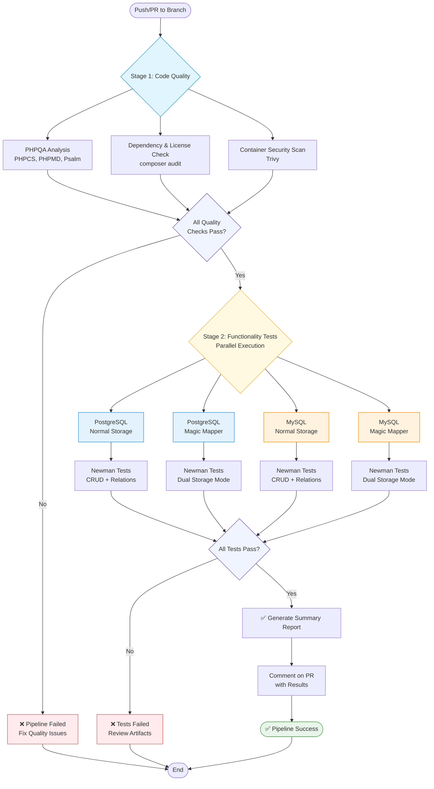

# Testing

This document describes the testing strategy and CI/CD pipeline for OpenRegister.

## CI/CD Pipeline Architecture

OpenRegister uses a comprehensive two-stage CI/CD pipeline that ensures code quality and functionality across multiple database and storage configurations.



## Stage 1: Code Quality

Stage 1 runs sequentially and must pass before Stage 2 begins. All checks must succeed.

### PHPQA Analysis
- **PHPCS**: Code style checks (0 errors required)
- **PHPMD**: Code quality analysis (≤150 violations threshold)
- **Psalm**: Static type analysis (0 errors required)

**Thresholds:**
- PHPCS Errors: **Must be 0**
- Psalm Errors: **Must be 0**
- PHPMD Violations: **Must be ≤150**

### Dependency & License Check
- Security vulnerability scanning (`composer audit`)
- License compliance validation
- Composer.json validation

### Container Security Scan
- Trivy vulnerability scanner
- Scans base Docker images
- SARIF report uploaded to GitHub Security

## Stage 2: Functionality Tests

Stage 2 runs 4 test jobs in parallel for fast feedback. Each job tests a unique combination of database and storage mode.

### Test Matrix

| Job # | Database | Storage Mode | Description |
|-------|----------|--------------|-------------|
| 1 | PostgreSQL | Normal (Blob) | Objects stored as JSON in single table |
| 2 | PostgreSQL | Magic Mapper | Objects stored in dedicated schema tables |
| 3 | MySQL | Normal (Blob) | Objects stored as JSON in single table |
| 4 | MySQL | Magic Mapper | Objects stored in dedicated schema tables |

### Database Configurations

#### PostgreSQL
- **Image**: `pgvector/pgvector:pg16`
- **Extensions**: pgvector, pg_trgm (for search)
- **Port**: 5432

#### MySQL
- **Image**: `mysql:8.0`
- **Charset**: utf8mb4
- **Port**: 3306

### Storage Modes

#### Normal Storage (JSON Blob)
Objects are stored as JSON in the `oc_openregister_objects` table:
```json
{
  "uuid": "123e4567-e89b-12d3-a456-426614174000",
  "schema": "Person",
  "object": {
    "name": "John Doe",
    "email": "john@example.com"
  }
}
```

#### Magic Mapper (Multi-table)
Objects are stored in dedicated tables with proper database columns:
```sql
CREATE TABLE oc_openregister_person (
  _id BIGINT PRIMARY KEY,
  _uuid VARCHAR(255),
  _name VARCHAR(255),
  name VARCHAR(255),
  email VARCHAR(255)
);
```

### Newman Integration Tests

Each test job runs the complete Newman test suite:

**Tests Included:**
- CRUD operations (Create, Read, Update, Delete)
- Relations testing (/uses and /used endpoints)
- Search functionality
- Filtering and pagination
- Validation rules
- Error handling

**Test Collections:**
- `openregister-crud.postman_collection.json` - Main CRUD tests
- Dual storage mode tests (Normal + Magic Mapper)

**Running Locally:**
```bash
# Normal storage tests
cd tests/integration
./run-tests.sh

# Dual storage tests (both modes)
./run-dual-storage-tests.sh
```

## Test Results & Artifacts

### Artifacts Uploaded (30-day retention)
- PHPQA reports (HTML + JSON)
- Newman test results (HTML + JSON)
- License report (JSON)
- Trivy security scan (SARIF)

### PR Comments
Automated PR comments include:
- Quality score breakdown
- Test results matrix
- Pass/fail status for each job
- Links to detailed artifacts

Example:
```
# 🎯 CI Pipeline Results

## Stage 1: Code Quality ✅
All quality checks passed!

## Stage 2: Functionality Tests

| Database | Storage Mode | Status |
|----------|--------------|--------|
| PostgreSQL | Normal (Blob) | ✅ success |
| PostgreSQL | Magic Mapper | ✅ success |
| MySQL | Normal (Blob) | ✅ success |
| MySQL | Magic Mapper | ✅ success |

📊 Detailed reports available in workflow artifacts.
```

## Local Testing

### Prerequisites
```bash
# Install dependencies
composer install
npm install -g newman newman-reporter-htmlextra

# Start Docker environment
cd apps-extra/openregister
docker-compose up -d
```

### Running Quality Checks
```bash
# PHP Lint
composer lint

# Code Style (PHPCS)
composer phpcs

# Static Analysis (Psalm)
composer psalm

# Code Quality (PHPMD)
composer phpmd

# All Quality Checks
composer phpqa
```

### Running Integration Tests
```bash
# Single storage mode
cd tests/integration
./run-tests.sh

# Both storage modes
./run-dual-storage-tests.sh --verbose

# Specific environment
export BASE_URL=http://localhost:8080
export ADMIN_USER=admin
export ADMIN_PASSWORD=admin
./run-tests.sh --mode ci --clean
```

## Quality Standards

### PHPCS (Code Style)
- **Target**: 0 errors
- **Standard**: Custom ruleset based on PEAR + Squiz + PSR
- **Config**: `phpcs.xml`

**Common violations:**
- Line length > 125 characters (warning)
- Missing doc comments
- Incorrect spacing

### Psalm (Static Analysis)
- **Target**: 0 errors
- **Level**: 4 (balanced)
- **Config**: `psalm.xml`

**Common violations:**
- Missing type hints
- Invalid return types
- Undefined variables

### PHPMD (Code Quality)
- **Target**: ≤150 violations
- **Config**: `phpmd.xml`

**Acceptable violations (with suppressions):**
- BooleanArgumentFlag - API pattern for filters
- ExcessiveMethodLength - Complex business logic
- CyclomaticComplexity - Complex algorithms
- StaticAccess - Framework requirements

## Continuous Integration

### Triggers
The CI pipeline runs on:
- Push to `main`, `master`, `development`, `dev`
- Pull requests to these branches
- Manual workflow dispatch

### Branch Protection
Recommended branch protection rules:
- ✅ Require status checks to pass
- ✅ Require CI pipeline success
- ✅ Require up-to-date branches
- ✅ Require code review approval

### Workflow Files
- `.github/workflows/ci-pipeline.yml` - Main CI/CD pipeline
- `.github/workflows/quality-check.yml` - Legacy quality checks
- `.github/workflows/newman-tests.yml` - Legacy Newman tests

## Performance

### Pipeline Execution Time
- **Stage 1**: ~5-10 minutes
- **Stage 2**: ~15-20 minutes (parallel)
- **Total**: ~20-30 minutes

### Optimization
- ✅ Parallel test execution (4 jobs)
- ✅ Docker layer caching
- ✅ Composer dependency caching
- ✅ Newman report caching

## Troubleshooting

### Pipeline Failures

#### Stage 1 Failures
**PHPCS Errors:**
```bash
# Auto-fix style issues
composer phpcs:fix

# Check remaining issues
composer phpcs
```

**Psalm Errors:**
```bash
# Update baseline (if intentional)
composer psalm:baseline

# Check specific file
vendor/bin/psalm lib/Service/MyService.php
```

**PHPMD Violations:**
```bash
# Generate report
composer phpmd > phpmd-report.txt

# Add suppression (see below)
```

#### Stage 2 Failures
**Newman Test Failures:**
```bash
# Run locally with verbose output
cd tests/integration
./run-tests.sh --verbose

# Check specific collection
newman run openregister-crud.postman_collection.json \
  --env-var "base_url=http://localhost:8080" \
  --reporters cli,htmlextra
```

**Database Connection Issues:**
```bash
# Check database service
docker-compose ps

# Check logs
docker-compose logs db

# Restart services
docker-compose restart
```

### PHPMD Suppressions

For architectural patterns that are intentional, add inline suppressions:

```php
/**
 * @SuppressWarnings(PHPMD.BooleanArgumentFlag)
 * Reason: Boolean flags are part of the established API pattern for filtering
 */
public function searchObjects(
    array $filters = [],
    bool $_rbac = true,
    bool $_multitenancy = true
): array {
    // ...
}
```

**Common suppressions:**
- `BooleanArgumentFlag` - Filter flags in API methods
- `ExcessiveMethodLength` - Complex business logic
- `CyclomaticComplexity` - Complex algorithms
- `NPathComplexity` - Complex decision paths
- `StaticAccess` - Framework static methods

## Best Practices

### Before Committing
1. ✅ Run `composer phpqa` locally
2. ✅ Run `./tests/integration/run-tests.sh`
3. ✅ Fix all PHPCS errors (0 required)
4. ✅ Fix all Psalm errors (0 required)
5. ✅ Update documentation if needed

### Writing Tests
1. ✅ Add tests for new features
2. ✅ Test both storage modes
3. ✅ Test error cases
4. ✅ Use descriptive test names
5. ✅ Include assertions for all responses

### Code Quality
1. ✅ Keep methods under 100 lines
2. ✅ Keep cyclomatic complexity under 10
3. ✅ Avoid else expressions (early returns)
4. ✅ Add PHPDoc blocks for all public methods
5. ✅ Use type hints everywhere

## Resources

- [GitHub Actions Documentation](https://docs.github.com/en/actions)
- [Newman CLI Documentation](https://learning.postman.com/docs/running-collections/using-newman-cli/command-line-integration-with-newman/)
- [PHPCS Documentation](https://github.com/squizlabs/PHP_CodeSniffer/wiki)
- [Psalm Documentation](https://psalm.dev/docs/)
- [PHPMD Documentation](https://phpmd.org/documentation/index.html)
