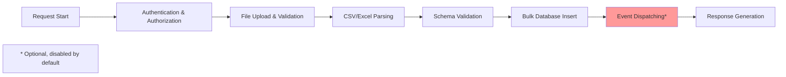

# Importing Data

The OpenRegister application supports importing data from CSV and Excel files with improved performance and better result reporting.

## Supported Formats

- **CSV files** (.csv) - Single schema imports
- **Excel files** (.xlsx, .xls) - Single or multi-schema imports

## Import Process

### 1. Prepare Your Data

Your import file should have:
- **Headers row**: First row containing column names
- **Data rows**: Subsequent rows with actual data
- **ID column** (optional): Include an `id` column if you want to update existing records

### 2. Column Mapping

The system automatically maps CSV/Excel columns to object properties:

- **Regular columns** (e.g., `name`, `description`) become object properties
- **System columns** (prefixed with `_` or `@self.`) are placed in the system metadata
- **ID column**: If you include an `id` column, existing records will be updated; new records will be created

### 3. Import Results

After import, you'll see a detailed summary:

```json
{
    "message": "Import successful",
    "summary": {
        "Worksheet": {
            "found": 5600,
            "created": ["uuid1", "uuid2", "uuid3"],
            "updated": ["uuid4", "uuid5"],
            "unchanged": [],
            "errors": [],
            "schema": {
                "id": 90,
                "title": "Compliancy",
                "slug": "compliancy"
            }
        }
    }
}
```

#### Understanding the Results

- **`found`**: Total number of rows processed (excluding headers)
- **`created`**: Array of UUIDs for newly created objects
- **`updated`**: Array of UUIDs for existing objects that were updated
- **`unchanged`**: Array of UUIDs for objects that didn't change (if any)
- **`errors`**: Array of any errors encountered during import
- **`schema`**: Information about the schema used for the import

## Best Practices

### For Large Imports

- **Chunk size**: The system processes data in chunks (default: 100 rows) to manage memory
- **File size**: Very large files are automatically handled efficiently
- **Progress monitoring**: Monitor the import progress through the result summary

### Data Quality

- **Validate data**: Ensure your data meets schema requirements before import
- **Check headers**: Make sure column names match expected property names
- **Test with small files**: Test your import format with a small dataset first

### Update vs Create

- **To create new records**: Don't include an `id` column, or leave it empty
- **To update existing records**: Include the `id` column with existing UUIDs
- **Mixed operations**: You can have both new and existing records in the same import

## Common Scenarios

### Scenario 1: Creating New Records

```
CSV Content:
name,description,status
Item 1,First item description,active
Item 2,Second item description,pending
```

**Result**: All records will be created (UUIDs generated automatically)

### Scenario 2: Updating Existing Records

```
CSV Content:
id,name,description,status
existing-uuid-123,Updated Item 1,New description,active
existing-uuid-456,Updated Item 2,New description,pending
```

**Result**: Existing records will be updated with new values

### Scenario 3: Mixed Create and Update

```
CSV Content:
id,name,description,status
existing-uuid-123,Updated Item 1,New description,active
,New Item 2,New item description,pending
```

**Result**: First record will be updated, second will be created

## Error Handling

### Common Errors

- **Schema mismatch**: Column names don't match schema properties
- **Data type errors**: Values don't match expected data types
- **Required field missing**: Required properties are empty
- **Invalid UUIDs**: ID column contains invalid UUIDs

### Error Details

Each error includes:
- **Row number**: Which row had the problem
- **Error message**: Description of what went wrong
- **Data context**: The problematic data for debugging

## Performance Improvements

The latest version includes significant performance improvements:

- **Batch processing**: Multiple records are processed together for better efficiency
- **Reduced database calls**: Fewer database operations mean faster imports
- **Memory optimization**: Large files are processed in manageable chunks
- **Transaction efficiency**: Related operations are grouped for better performance

### Performance Metrics

Import performance varies based on several factors:

#### Storage Strategy Impact

| Storage Type | Performance | Use Case |
|-------------|-------------|----------|
| **Magic Mapper** (default) | 4,000-5,300 objects/sec | Structured data, high-performance queries |
| **Blob Storage** | 2,000-3,000 objects/sec | Flexible schema, document-like data |

#### Event Dispatching Impact

**⚠️ Important Performance Consideration**

Event dispatching allows business logic to run during imports (e.g., software catalog validation, webhooks). However, it significantly impacts performance:

| Mode | Performance | Processing Overhead | Recommended For |
|------|-------------|---------------------|-----------------|
| **Events OFF** (default) | 4,000-5,300 obj/sec | Minimal | Large CSV imports, data migrations |
| **Events ON** | 150-500 obj/sec | Entity mapping + event dispatch per row | Real-time imports with business logic |

**Why the difference?**

When events are enabled, each imported row is:
1. Fully converted to an `ObjectEntity` (~1-2ms per object)
2. Dispatched through the event system (~0.5-1ms per object)
3. Processed by all registered event listeners (variable time)

For a 20,000 row import:
- **Without events**: ~4 seconds
- **With events**: ~60-120 seconds

**When to enable events:**
- Software catalog imports that require validation
- Imports that trigger notifications or webhooks
- Real-time synchronization with external systems
- Custom business logic that must run per object

**Default behavior:** Events are **disabled** for CSV/Excel imports to maximize performance.

### Performance Breakdown

A typical import consists of several phases:



#### Timing Breakdown (10,000 rows example)

| Phase | Time (ms) | % of Total | Description |
|-------|-----------|------------|-------------|
| **Framework Overhead** | 50-100ms | 2-5% | Nextcloud routing, middleware |
| **Authentication** | 10-20ms | <1% | User verification, permissions |
| **File Upload** | 100-300ms | 5-15% | Network transfer, temp storage |
| **CSV Parsing** | 200-500ms | 10-20% | Reading file, parsing rows |
| **Schema Validation** | 100-200ms | 5-10% | Property type checking |
| **Database Operations** | 1,500-2,500ms | 60-70% | Bulk insert/update |
| **Event Dispatching** | 0ms (off) <br/> 20,000-40,000ms (on) | 0% / 90%+ | Entity conversion + events |
| **Response Generation** | 50-100ms | 2-5% | JSON serialization |

**Key Insight:** Database operations are the primary time factor with events disabled. With events enabled, event dispatching becomes 90%+ of the total time.

### Real-World Performance Examples

Based on actual import tests with Magic Mapper storage:

#### Small Dataset (3,090 rows - Organisatie)
- **Without events**: 0.74 seconds (4,165 obj/sec)
- **With events**: 17.3 seconds (178 obj/sec)
- **Speedup**: 23.4x faster without events

#### Medium Dataset (8,749 rows - Module)
- **Without events**: 1.28 seconds (4,744 obj/sec)
- **With events**: 25.5 seconds (265 obj/sec)
- **Speedup**: 17.9x faster without events

#### Large Dataset (23,399 rows - Moduleversie)
- **Without events**: 2.86 seconds (5,312 obj/sec)
- **With events**: 32.7 seconds (516 obj/sec)
- **Speedup**: 10.3x faster without events

**Note:** These timings include all phases (framework, auth, parsing, database, response).

## Troubleshooting

### Schema Dropdown Not Populated

If the schema dropdown is empty when importing a CSV file:

1. **Select a register first**: The schema dropdown only shows schemas that belong to the selected register
2. **Wait for loading**: The modal refreshes register and schema lists when opened - wait for the loading spinner to complete
3. **Check register schemas**: Ensure the selected register has schemas associated with it
4. **Refresh the page**: If the issue persists, try refreshing the browser page

**Note**: The schema dropdown is only visible for CSV files. Excel files can contain multiple sheets with different schemas, so schema selection happens automatically based on sheet names.

### Import Not Working

1. **Check file format**: Ensure your file is a valid CSV or Excel file
2. **Verify schema**: Make sure you've selected the correct schema for import
3. **Check permissions**: Ensure you have permission to import to the selected register
4. **Review errors**: Check the error messages for specific issues

### Performance Issues

1. **Reduce chunk size**: If memory issues occur, try smaller chunk sizes
2. **Check file size**: Very large files may take longer to process
3. **Monitor system resources**: Ensure adequate memory and CPU resources

### Data Not Appearing

1. **Check import status**: Verify the import completed successfully
2. **Review error log**: Look for any errors that prevented data from being saved
3. **Verify schema mapping**: Ensure columns are mapped to the correct properties
4. **Check permissions**: Confirm you can view the imported data

## Support

If you encounter issues with data import:

1. **Check the documentation**: Review this guide for common solutions
2. **Review error messages**: The detailed error information often contains the solution
3. **Contact support**: Provide the error details and import file format for assistance
