# SOLR Dashboard User Guide

## Overview

The SOLR Search Management Dashboard provides an intuitive interface for monitoring and managing your Apache SOLR search infrastructure. This guide will help you understand and effectively use all dashboard features.

## Accessing the Dashboard

1. **Login** to your Nextcloud instance as an administrator
2. Navigate to **Settings** → **Administration** → **OpenRegister**
3. Scroll down to the **SOLR Search Management** section
4. The dashboard will automatically load with current statistics


## Dashboard Overview

The dashboard is organized into several key sections, each providing specific insights into your SOLR search performance:

```mermaid
graph TB
    A[SOLR Dashboard] --> B[📊 Overview Cards]
    A --> C[🏗️ Core Information]
    A --> D[📈 Performance Metrics]
    A --> E[🏥 Health & Resources]
    A --> F[🔄 Recent Operations]
    A --> G[⚡ Management Actions]
    
    style A fill:#e3f2fd
    style B fill:#f3e5f5
    style C fill:#e8f5e8
    style D fill:#fff3e0
    style E fill:#fce4ec
    style F fill:#e1f5fe
    style G fill:#f1f8e9
```



## Understanding the Dashboard Sections

### 📊 Overview Cards

The top section provides four key metrics at a glance:

#### 🔗 Connection Status
- **Healthy (Green)**: SOLR is responding normally
- **Warning (Yellow)**: Minor issues detected  
- **Critical (Red)**: SOLR is unavailable
- **Response Time**: How quickly SOLR responds to requests

#### 📊 Documents
- **Total Count**: Number of documents currently indexed
- **Growth Tracking**: Monitor how your index grows over time

#### 💾 Index Size
- **Storage Usage**: Current space used by the search index
- **Monitoring**: Track storage growth for capacity planning

#### ⚡ Performance
- **Operations/Second**: Current system throughput
- **Performance Indicator**: Color-coded performance rating

### 🏗️ Core Information

This section shows technical details about your SOLR setup:

- **Core Name**: The SOLR core being used (`openregister`)
- **Status**: Whether the core is active and operational
- **Tenant ID**: Your unique identifier for data isolation
- **Endpoint URL**: The internal SOLR connection address

### 📈 Performance Metrics

Monitor your search performance with detailed statistics:

#### Search Operations
- **Total Searches**: Cumulative search queries processed
- **Average Time**: How long searches take to complete

#### Index Operations  
- **Total Indexes**: Documents added to the search index
- **Average Time**: How long indexing operations take

#### Error Monitoring
- **Error Rate**: Percentage of failed operations
  - **Green (0-5%)**: Excellent performance
  - **Yellow (5-10%)**: Monitor closely
  - **Red (>10%)**: Requires attention

### 🏥 Health & Resources

Monitor system health and resource usage:

#### Overall Status
- **Status Indicator**: Visual health indicator with color coding
- **Uptime**: How long SOLR has been running
- **Last Optimization**: When the index was last optimized

#### Memory Usage
- **Current Usage**: RAM currently used by SOLR
- **Memory Limit**: Maximum available memory
- **Usage Percentage**: Visual progress bar

#### Disk Usage
- **Storage Used**: Disk space consumed
- **Available Space**: Remaining storage capacity
- **Usage Percentage**: Visual progress bar

#### Health Warnings
- **Proactive Alerts**: Issues that need attention
- **Recommendations**: Suggested actions to improve performance

### 🔄 Recent Operations

Track recent SOLR activity and system status:

#### Recent Activity
- **Operation Types**: Index, search, and delete operations
- **Operation Counts**: Number of each operation type
- **Timestamps**: When operations occurred
- **Status**: Success/failure indicators

#### Queue Status
- **Pending Operations**: Operations waiting to be processed
- **Processing Status**: Whether operations are currently running
- **Last Processed**: When the last operation completed

#### Commit Settings
- **Auto Commit**: Whether automatic commits are enabled
- **Commit Interval**: How often changes are committed
- **Last Commit**: When the index was last committed

## Management Operations

The dashboard provides several management tools to maintain optimal SOLR performance:

### 🔥 Warmup Index

**Purpose**: Preloads SOLR caches for optimal performance

**When to Use**:
- After SOLR restart
- Before high-traffic periods
- When performance seems slower than usual

**What it Does**:
- Tests SOLR connectivity
- Executes sample search queries
- Preloads frequently used data into memory
- Commits any pending changes

**Steps**:
1. Click the **Warmup Index** button
2. Wait for the operation to complete (usually 1-3 seconds)
3. Check the success notification

### ✅ Commit Index

**Purpose**: Forces SOLR to save all pending changes to disk

**When to Use**:
- After bulk data imports
- Before taking backups
- When data consistency is critical

**What it Does**:
- Saves all uncommitted changes permanently
- Makes recent changes searchable
- Ensures data durability

**Steps**:
1. Click the **Commit** button
2. Operation typically completes in under 1 second
3. Verify success in the notification

### 🔧 Optimize Index

**Purpose**: Improves search performance by reorganizing the index structure

**When to Use**:
- Weekly maintenance (for active systems)
- After large data imports or deletions
- When the dashboard shows "Optimization Recommended"
- If search performance has degraded

**What it Does**:
- Merges index segments for better performance
- Removes deleted documents from the index
- Improves query response times
- Reduces storage usage

**Steps**:
1. Click the **Optimize** button
2. Wait for completion (can take several minutes for large indexes)
3. Monitor the progress and success notification

**⚠️ Note**: Optimization can take time and uses significant resources. Schedule during low-traffic periods.

### 🗑️ Clear Index

**Purpose**: Completely removes all data from the search index

**⚠️ DANGER**: This operation is **IRREVERSIBLE** and will delete all search data

**When to Use**:
- During development/testing only
- When performing full data reindex
- To resolve corrupted index issues
- **NEVER** in production without backup

**What it Does**:
- Removes all documents from the search index
- Resets all statistics and counters
- Makes the search index empty (fallback to database search)

**Steps**:
1. Click the **Clear Index** button
2. **READ THE WARNING** carefully
3. Type confirmation if required
4. Confirm you understand data will be lost
5. Click **Clear Index** in the confirmation dialog
6. Wait for completion notification

**Recovery**: After clearing, you'll need to reindex all your data through the appropriate data import/sync processes.

## Interpreting Dashboard Information

### Performance Indicators

#### Connection Status Colors
- **🟢 Green**: Excellent performance, no issues
- **🟡 Yellow**: Acceptable performance, monitor trends
- **🔴 Red**: Performance issues, immediate attention needed
- **⚪ Gray**: Status unknown, check SOLR availability

#### Resource Usage Guidelines
- **Memory Usage**:
  - **0-70%**: Normal operation
  - **70-90%**: Monitor closely, consider increasing memory
  - **90-100%**: Critical, performance degradation likely

- **Disk Usage**:
  - **0-80%**: Normal operation
  - **80-95%**: Plan for storage expansion
  - **95-100%**: Critical, cleanup or expansion needed

#### Error Rate Interpretation
- **0-1%**: Excellent system health
- **1-5%**: Good performance, occasional expected errors
- **5-10%**: Elevated error rate, investigate causes
- **>10%**: High error rate, requires immediate attention

### Optimization Recommendations

The dashboard provides intelligent recommendations:

#### "Optimization Recommended" Notice
Appears when:
- Index has grown significantly since last optimization
- Many documents have been deleted
- Search performance has degraded
- Fragmentation is detected

**Action**: Run optimization during low-traffic periods

#### High Error Rate Warnings  
Appears when:
- Error rate exceeds 5%
- Connection issues detected
- Resource constraints identified

**Actions**:
1. Check SOLR service status
2. Review system resources
3. Check error logs
4. Consider restarting SOLR service

#### Resource Warnings
Appears when:
- Memory usage exceeds 85%
- Disk usage exceeds 90%
- Performance degradation detected

**Actions**:
1. Review resource allocation
2. Consider scaling up resources
3. Optimize query patterns
4. Clean up old data

## Troubleshooting Common Issues

### Dashboard Shows "SOLR Unavailable"

**Symptoms**:
- Connection status shows "unavailable" or "critical"
- Dashboard displays error messages
- Search functionality falls back to database

**Solutions**:
1. **Check SOLR Service**:
   - Verify SOLR container is running
   - Check Docker logs for SOLR errors
   - Restart SOLR service if needed

2. **Verify Configuration**:
   - Check SOLR host/port settings
   - Verify network connectivity
   - Test SOLR admin interface access

3. **Test Connection**:
   - Use the dashboard's connection test feature
   - Check response times and error messages

### Poor Search Performance

**Symptoms**:
- High average search times (>100ms)
- Low operations per second
- User complaints about slow search

**Solutions**:
1. **Run Optimization**:
   - Use the dashboard's optimize function
   - Schedule regular optimization

2. **Check Resources**:
   - Monitor memory usage
   - Ensure adequate RAM allocation
   - Check disk I/O performance

3. **Review Query Patterns**:
   - Analyze search queries for complexity
   - Consider query optimization
   - Review indexing strategy

### High Memory Usage

**Symptoms**:
- Memory usage consistently >85%
- Slow response times
- Occasional out-of-memory errors

**Solutions**:
1. **Increase SOLR Memory**:
   ```yaml
   # In docker-compose.yml
   environment:
     - SOLR_HEAP=1024m  # Increase from 512m
   ```

2. **Optimize Queries**:
   - Review complex search patterns
   - Limit result set sizes
   - Use appropriate filters

3. **Index Maintenance**:
   - Run regular optimizations
   - Clean up old/unused data
   - Monitor index growth

### Index Size Growing Too Fast

**Symptoms**:
- Disk usage increasing rapidly
- Index size much larger than source data
- Storage warnings

**Solutions**:
1. **Run Optimization**:
   - Remove deleted documents
   - Compact index segments
   - Reclaim disk space

2. **Review Data**:
   - Check for duplicate indexing
   - Review retention policies
   - Clean up test/temporary data

3. **Monitor Growth**:
   - Track index size trends
   - Set up disk usage alerts
   - Plan storage capacity

## Best Practices

### Regular Maintenance

#### Daily Tasks
- Check dashboard health status
- Monitor error rates
- Review performance trends

#### Weekly Tasks
- Run index optimization
- Review resource usage trends
- Check for system warnings

#### Monthly Tasks
- Analyze performance reports
- Review and clean old data
- Update capacity planning

### Performance Optimization

#### Search Optimization
- Use specific field searches when possible
- Implement proper result pagination
- Cache frequently used queries
- Monitor slow query patterns

#### Index Optimization
- Schedule optimization during low-traffic periods
- Run optimization after bulk data operations
- Monitor index fragmentation
- Balance optimization frequency vs. performance impact

#### Resource Management
- Monitor resource trends over time
- Plan capacity increases proactively
- Set up alerting for resource thresholds
- Document resource requirements for different workloads

### Security Considerations

#### Access Control
- Limit dashboard access to administrators
- Use secure connection methods
- Regularly review access logs
- Implement proper authentication

#### Data Protection
- Never run "Clear Index" in production without backup
- Test all operations in development first
- Document all management procedures
- Maintain regular backup schedules

## Getting Help

### Information Gathering
When reporting issues, include:
- Dashboard screenshots showing the problem
- Error messages from notifications
- Performance metrics from the dashboard
- Recent operations and their status

### Support Resources
- **Technical Documentation**: Detailed implementation guides
- **API Documentation**: For custom integrations
- **Community Forums**: User discussions and solutions
- **Issue Tracker**: Bug reports and feature requests

The SOLR Dashboard provides powerful tools for managing your search infrastructure. Regular monitoring and proactive maintenance will ensure optimal performance and user satisfaction.
