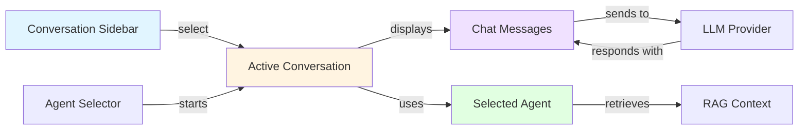

# Conversations - User Guide

## Overview

Conversations allow you to interact with your data using natural language through agents. You can ask questions, get insights, and find information across your files and database objects.

## Interface Layout

## Getting Started

### Accessing the Chat Interface

1. Click on **Chat** or **Conversations** in the main navigation menu
2. The chat interface will open with a sidebar showing your conversation history

## Understanding the Interface

### Sidebar (Left)

The conversation sidebar shows:
- **Active conversations**: Your current conversations
- **Archive**: Deleted conversations (can be restored)
- **New Conversation button**: Start a new chat
- **Collapse/Expand button**: Toggle sidebar visibility

Each conversation item displays:
- Title (auto-generated or custom)
- Last update time  
- Message count

### Main Chat Area (Right)

The main area includes:
- **Header**: Shows conversation title and current agent
- **Message history**: All your questions and AI responses
- **Message input**: Type your questions here
- **Send button**: Submit your message

## Starting a Conversation

### Step 1: Create a New Conversation

1. Click the **+** button in the sidebar
2. Select an AI agent from the list
3. Click **Start Conversation**

### Step 2: Ask Your First Question

Type your question in the input field and press Enter or click Send.

**Example Questions:**
- "What information do you have about customer projects?"
- "Show me all files related to the Amsterdam office"
- "Summarize the data in the product catalog"
- "Find documents mentioning budget 2024"

### Understanding AI Responses

AI responses include:

1. **Main Answer**: The AI's response to your question
2. **Sources**: References to files or objects used to generate the answer
   - Click on a source to view it
   - Relevance score shows how closely the source matches your question
3. **Feedback buttons**: Thumbs up/down to rate the response quality

## Managing Conversations

### Renaming a Conversation

1. Click the **Pencil icon** in the conversation header
2. Enter a new title
3. Click **Save**

### Deleting a Conversation

**Soft Delete (Archive):**
1. Hover over a conversation in the sidebar
2. Click the **Delete button** (trash icon)
3. The conversation moves to the Archive

**Permanent Delete:**
1. Switch to the **Archive** view in the sidebar
2. Hover over an archived conversation
3. Click the **Delete button** again
4. Confirm permanent deletion

### Restoring an Archived Conversation

1. Switch to the **Archive** view in the sidebar
2. Hover over the conversation
3. Click the **Restore button**
4. The conversation returns to your active list

## Working with Multiple Organisations

If you're a member of multiple organisations:

### Switching Organisations

1. Use the organisation selector in the main navigation
2. Your conversation list automatically updates to show conversations from the new organisation
3. Previous conversations remain accessible when you switch back

### Organisation-Specific Conversations

- Each conversation belongs to one organisation
- You only see conversations from your current organisation
- Agents and data access are also organisation-specific

## Tips for Effective AI Conversations

### Ask Clear, Specific Questions

**❌ Bad:**
- "Show me stuff"
- "What do you have?"

**✅ Good:**
- "List all projects with deadlines in November 2024"
- "What files contain information about the marketing budget?"

### Provide Context

Include relevant details in your questions:
- Time periods: "in the last quarter", "from 2024"
- Categories: "customer invoices", "internal documents"
- Locations: "Amsterdam office", "European region"

### Use Follow-Up Questions

The AI remembers your conversation context:
1. "What products were launched in 2024?"
2. "Which of those had the highest sales?"
3. "Show me the marketing materials for the top one"

### Verify Sources

Always check the cited sources:
- Click on source links to view the original information
- Confirm the AI's interpretation matches the source content
- Report inaccuracies using the feedback buttons

## Troubleshooting

### No Agent Available

**Problem**: "No agents available" message when creating a conversation

**Solutions:**
- Contact your administrator to create AI agents
- Ensure agents are configured for your organisation
- Check that you have permission to access existing agents

### Poor Quality Responses

**Problem**: AI gives irrelevant or incorrect answers

**Solutions:**
- Rephrase your question more specifically
- Provide more context in your question
- Check if the agent has access to relevant data views
- Try a different agent specialized for your topic
- Use the thumbs down button to provide feedback

### Missing Conversations

**Problem**: Can't find a conversation you created

**Solutions:**
- Check if you're in the correct organisation
- Look in the Archive (you may have accidentally deleted it)
- Ensure you're logged in with the same account

### "Access Denied" Error

**Problem**: Can't open a conversation

**Solutions:**
- You may not be the conversation owner
- The conversation may belong to a different organisation
- The agent may have been deleted or modified
- Contact your administrator if the issue persists

### Slow Responses

**Problem**: AI takes a long time to respond

**Solutions:**
- The AI is processing a complex query
- Many sources need to be searched
- The LLM provider may be experiencing high load
- Try asking a more focused question

## Privacy and Security

### Your Data

- Conversations are private to you within your organisation
- Organisation administrators cannot read your conversations
- Conversations are stored encrypted in the database

### AI Processing

- Questions and context are sent to the configured LLM provider
- File and object metadata is sent for context retrieval
- Full file contents are not sent, only relevant excerpts
- Check your organisation's AI policy for details

### Deleting Data

- Soft-deleted conversations can be restored for 30 days
- After permanent deletion, conversations cannot be recovered
- Message history is also permanently deleted

## Keyboard Shortcuts

| Action | Shortcut |
|--------|----------|
| Send message | Enter |
| New line in message | Shift + Enter |
| Toggle sidebar | (use button) |

## Best Practices

### For Finding Information

1. **Start broad, then narrow**: Ask general questions first, then drill down
2. **Use keywords**: Include important terms from your files/data
3. **Specify sources**: Mention if you're looking for files vs. database records
4. **Time-bound queries**: Include date ranges when relevant

### For Data Analysis

1. **Ask for summaries**: "Summarize the...", "What's the overview of..."
2. **Request comparisons**: "Compare X and Y", "What's the difference between..."
3. **Seek patterns**: "What trends do you see...", "Are there commonalities in..."

### For Productivity

1. **Save successful queries**: Copy useful questions for later reuse
2. **Name conversations**: Rename conversations with descriptive titles
3. **Use multiple agents**: Different agents for different purposes
4. **Provide feedback**: Help improve responses with thumbs up/down

## Advanced Features

### Conversation Metadata

Conversations can store custom metadata (if your organisation enables it):
- Tags for categorization
- Priority levels
- Custom attributes

### Agent-Specific Behavior

Different agents have different:
- **Specializations**: Customer support, technical docs, data analysis
- **Data access**: Limited to specific views or folders
- **Tone**: Professional, friendly, technical
- **Response length**: Concise vs. detailed

Ask your administrator which agents are available and their specific purposes.

## Frequently Asked Questions

**Q: Can I share a conversation with a colleague?**
A: Currently, conversations are private. You can copy/paste responses or suggest your colleague ask the same question.

**Q: How many conversations can I have?**
A: There's no limit. You can archive old ones to keep your list manageable.

**Q: Does the AI learn from my conversations?**
A: The AI uses conversation context within each chat but doesn't learn globally from your conversations.

**Q: Can I export my conversations?**
A: This feature may be available depending on your organisation's configuration. Contact your administrator.

**Q: What happens to my conversations if an agent is deleted?**
A: Your conversations remain accessible for viewing, but you can't send new messages. The agent name shows as "(deleted)".

**Q: Can I use the AI offline?**
A: No, AI features require an internet connection to reach the LLM provider.

## Support

If you encounter issues:
1. Check this documentation
2. Try the troubleshooting steps above
3. Contact your organisation's Nextcloud administrator
4. Report bugs at your organisation's support channel

## See Also

- [AI Agents](../features/agents.md) - Learn about creating and configuring agents
- [Semantic Search](../user-guide/semantic-search.md) - Understand how the AI finds information
- [Conversations API](../api/conversations.md) - For developers integrating with the API

