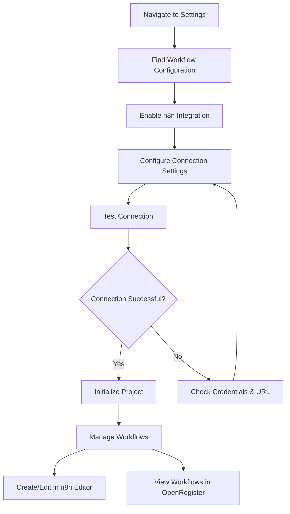
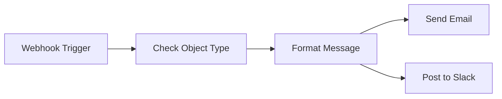
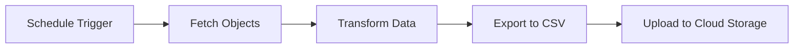
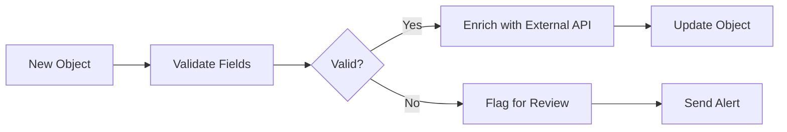
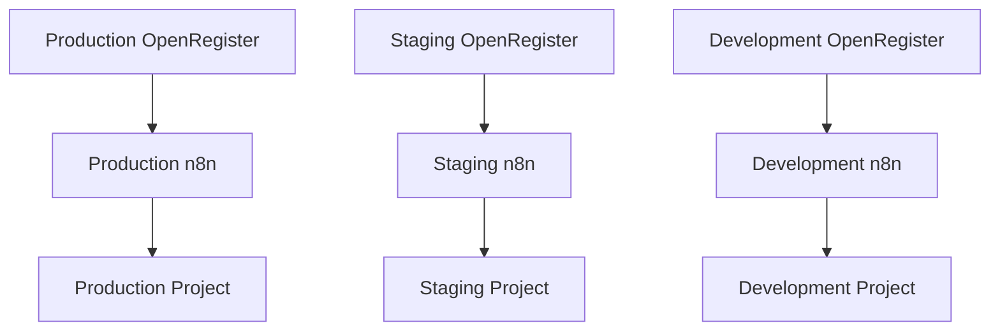

# n8n Workflow Configuration

OpenRegister integrates with n8n to provide powerful workflow automation capabilities. This integration allows you to create, manage, and execute workflows directly from OpenRegister to automate data processing, notifications, integrations, and more.

## Overview

n8n is a fair-code workflow automation tool that enables you to connect various services and automate tasks. With the OpenRegister n8n integration, you can:

- Connect to your n8n instance
- Create and manage projects for organizing workflows
- Upload and maintain workflows from OpenRegister
- Trigger workflows based on object events
- Schedule automated tasks
- Execute workflows manually

## Configuration Flow

## Setup Steps

### 1. Enable n8n Integration

1. Navigate to **Settings** in OpenRegister
2. Scroll to the **Workflow Configuration** section
3. Toggle the **n8n integration** switch to enable it

### 2. Configure Connection Settings

#### n8n Base URL

Enter the URL of your n8n instance. This is typically:
- For Docker: 'http://master-n8n-1:5678'
- For local development: 'http://localhost:5678'
- For production: 'https://n8n.yourdomain.com'

#### API Key

1. Open your n8n instance
2. Navigate to **Settings → API**
3. Create a new API key
4. Copy the key (starts with 'n8n_api_')
5. Paste it into the OpenRegister configuration

:::info
API keys in n8n are user-specific and provide full access to your n8n instance. Keep them secure!
:::

#### Project Name

Choose a project name for organizing your OpenRegister workflows in n8n. The default is 'openregister'.

### 3. Test Connection

Click the **Test Connection** button to verify:
- The n8n instance is reachable
- The API key is valid
- You have proper permissions

A successful test will show:
- Connection status
- n8n version information
- Connected user details

### 4. Initialize Project

Once the connection is successful, click **Initialize Project** to:
- Create the project in n8n (if it does not exist)
- Set up the workspace for OpenRegister workflows
- Verify project accessibility

The initialization will return:
- Project name and ID
- Number of existing workflows

## Managing Workflows

### Creating Workflows

1. Click **Open n8n Editor** to access the n8n interface
2. Create your workflow using n8n nodes
3. Assign the workflow to your OpenRegister project
4. Save and activate the workflow

### Viewing Workflows

The **Workflow Management** section displays:
- All workflows in your OpenRegister project
- Workflow status (Active/Inactive)
- Workflow tags
- Quick access to the n8n editor

Click **Refresh Workflows** to update the list.

## Workflow Examples

### Example 1: Object Creation Notification

This workflow:
1. Listens for object creation events via webhook
2. Checks the object type
3. Formats a notification message
4. Sends notifications via email and Slack

### Example 2: Scheduled Data Export

This workflow:
1. Runs on a schedule (e.g., daily at midnight)
2. Fetches objects from OpenRegister
3. Transforms data into the required format
4. Exports to CSV
5. Uploads to cloud storage (S3, Google Drive, etc.)

### Example 3: Data Validation and Enrichment

This workflow:
1. Triggers when a new object is created
2. Validates required fields
3. If valid, enriches data from external APIs
4. If invalid, flags for review and sends alerts

## API Integration

OpenRegister provides several API endpoints for n8n workflows:

### Object Operations
- 'GET /api/objects' - List objects
- 'GET /api/objects/{id}' - Get object details
- 'POST /api/objects' - Create object
- 'PUT /api/objects/{id}' - Update object
- 'DELETE /api/objects/{id}' - Delete object

### Workflow Endpoints
- 'GET /api/settings/n8n/workflows' - List workflows
- 'POST /api/settings/n8n/initialize' - Initialize project

## Security Considerations

### API Key Management
- Store API keys securely
- API keys are masked in the UI
- Only save full keys during initial configuration
- Rotate keys periodically

### Project Isolation
- Each OpenRegister instance should have its own project
- Use project-based organization for multi-tenant setups
- Limit workflow access through n8n permissions

### Network Security
- Use HTTPS for production n8n instances
- Restrict n8n access to trusted networks
- Use firewall rules to limit exposure

## Troubleshooting

### Connection Failed

**Issue:** Cannot connect to n8n instance

**Solutions:**
1. Verify the n8n URL is correct
2. Check that n8n is running
3. Ensure the API key is valid
4. Check firewall and network settings
5. Review Docker network configuration (for containerized setups)

### Project Initialization Failed

**Issue:** Cannot create or access project

**Solutions:**
1. Verify API key has admin permissions
2. Check n8n logs for errors
3. Ensure the project name is valid
4. Test connection before initializing

### Workflows Not Visible

**Issue:** Workflows exist in n8n but do not show in OpenRegister

**Solutions:**
1. Click **Refresh Workflows** button
2. Verify workflows are assigned to the correct project
3. Check workflow permissions in n8n
4. Review n8n project settings

## Best Practices

### Workflow Organization
- Use descriptive workflow names
- Add tags for categorization
- Document workflow purpose and triggers
- Version control workflow exports

### Performance
- Avoid long-running workflows
- Use batch processing for large datasets
- Implement error handling and retries
- Monitor workflow execution times

### Maintenance
- Regularly review and update workflows
- Remove unused workflows
- Test workflows after OpenRegister updates
- Keep n8n instance up to date

## Advanced Configuration

### Multi-Environment Setup

For organizations running multiple OpenRegister environments:

- Use separate n8n instances for each environment
- Or use separate projects within a single n8n instance
- Configure environment-specific webhooks and triggers

### Webhook Configuration

To trigger workflows from OpenRegister events:

1. Create a webhook node in n8n
2. Copy the webhook URL
3. Configure the webhook in OpenRegister (future feature)
4. Test the webhook with sample data

## Resources

- [n8n Documentation](https://docs.n8n.io/)
- [n8n Community Forum](https://community.n8n.io/)
- [n8n Workflow Templates](https://n8n.io/workflows/)
- [OpenRegister API Documentation](../api/overview.md)

## Support

For issues with:
- **n8n integration**: Contact OpenRegister support
- **n8n workflows**: Check n8n documentation and community
- **API connectivity**: Review OpenRegister API documentation

## Changelog

### Version 1.0.0
- Initial n8n integration
- Project creation and management
- Workflow listing and access
- Connection testing and validation

