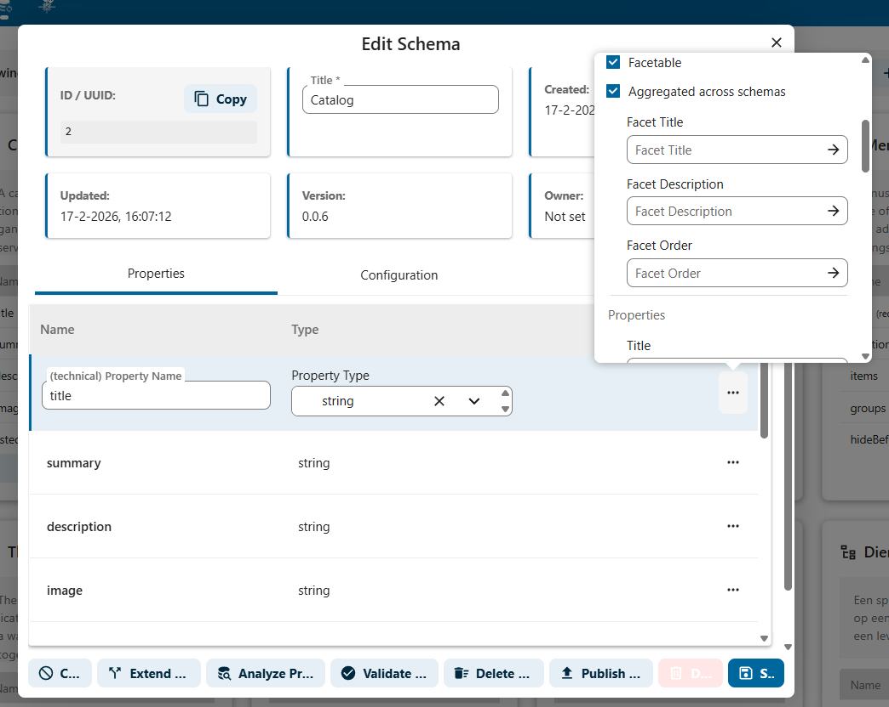

# Setting Facets from Schema Properties

Facets are filters that allow users to narrow down search results by specific properties. In Open Register, you can configure individual schema properties as facets so they appear as filter options in the search interface.

## What Are Facets?

A facet is a filterable dimension of your data. For example, if your objects have a `status` property with values like "Active", "Archived", and "Draft", you can make `status` a facet. Users will then see a filter in the search panel that lets them select one or more status values to narrow results.

## Configuring Facets on Schema Properties

Facets are configured per property in the **Edit Schema** dialog.

### Step 1: Open the Schema Editor

1. Navigate to **Schemas** in the left sidebar
2. Find the schema you want to configure
3. Click on the schema to open it, or click **Edit** from the actions menu

### Step 2: Open the Property Settings

1. In the **Properties** tab, find the property you want to make facetable
2. Click the **three-dot menu** next to the property
3. A popover appears with the facet configuration options

### Step 3: Enable the Facet

The popover shows the following settings:

| Setting | Description |
|---------|-------------|
| **Facetable** | Check this to make the property available as a search facet |
| **Aggregated across schemas** | When checked, this facet will aggregate values from all schemas that have a property with the same name — useful for shared properties like `status` or `type` |
| **Facet Title** | The display name shown to users in the filter panel (defaults to the property name) |
| **Facet Description** | Optional help text explaining what this facet filters on |
| **Facet Order** | A number that controls where this facet appears relative to other facets (lower numbers appear first) |

### Step 4: Save the Schema

After configuring the facet settings:

1. Close the property popover
2. Click **Save** at the bottom of the Edit Schema dialog
3. The facet will become available in the search interface

## Facet Settings Explained

### Facetable

This is the main toggle. When enabled, the property becomes available as a filter in the search panel. Only enable this for properties that have a reasonable number of distinct values — properties with thousands of unique values (like free-text descriptions) do not make useful facets.

**Good facet candidates:**
- Status fields (Active, Archived, Draft)
- Type/category fields
- Organisation names
- Boolean fields (yes/no)

**Poor facet candidates:**
- Free-text descriptions
- Unique identifiers
- Timestamps (use date range filters for these)

### Aggregated Across Schemas

When enabled, this facet collects values from **all schemas** that have a property with the same name. This is useful when multiple schemas share a common property.

**Example**: If both the "Product" and "Module" schemas have a `status` property, enabling aggregation on both will create a single "Status" facet that shows all status values from both schemas combined.

### Facet Title

The label displayed to users in the filter panel. If left empty, the technical property name is used. Use a human-readable name here.

**Example**: For a property named `beschrijvingKort`, you might set the facet title to "Short Description".

### Facet Description

Optional text that helps users understand what the facet filters. This can appear as a tooltip or help text in the search interface.

### Facet Order

Controls the display position of this facet relative to others. Facets with lower order numbers appear first. Use this to put the most commonly used filters at the top.

**Example ordering:**
| Facet | Order |
|-------|-------|
| Status | 1 |
| Type | 2 |
| Organisation | 3 |
| Category | 4 |

## How Facets Appear in the Search Interface

Once configured, facets appear in the **Filter Objects** panel on the Search / Views page. Depending on the property type, facets can appear as:

- **Dropdowns**: For properties with a moderate number of values
- **Checkboxes**: For selecting multiple values
- **Date ranges**: For date properties (from/to pickers)

Users can combine multiple facets to create complex filters. Active filters are shown at the top of the filter panel and can be cleared individually or all at once.

## Best Practices

1. **Be selective**: Only make properties facetable if they have a manageable number of distinct values and are useful for filtering
2. **Use clear titles**: Set human-readable facet titles so users understand what each filter does
3. **Order thoughtfully**: Put the most frequently used facets first with low order numbers
4. **Use aggregation wisely**: Enable "Aggregated across schemas" only when the same property name truly represents the same concept across schemas
5. **Test after configuring**: After saving, go to the Search / Views page and verify that the facet appears and works as expected
