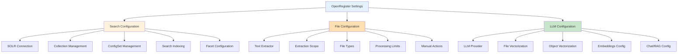
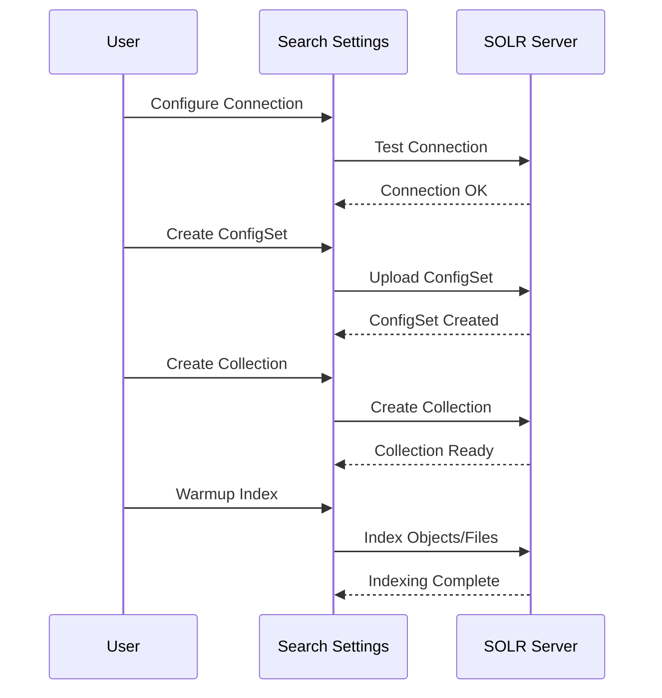
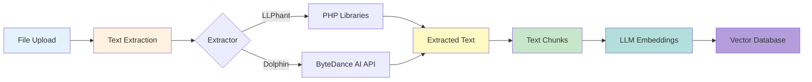
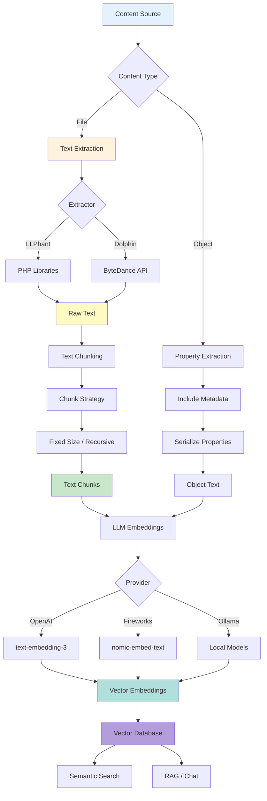
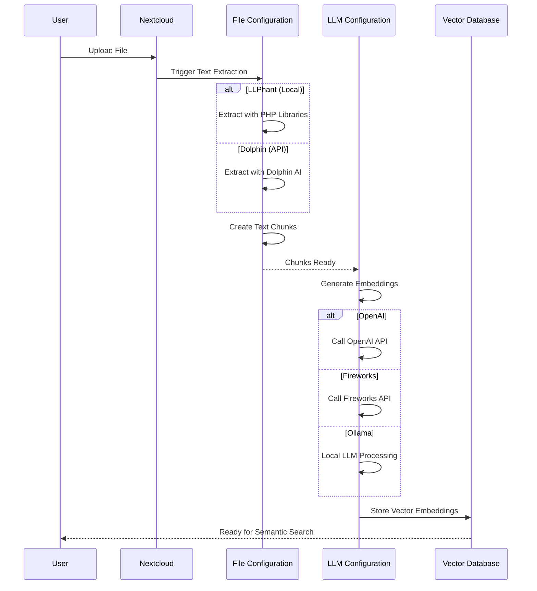

# Settings Configuration Guide

This guide explains how to configure OpenRegister through the Settings page, which is organized into three main sections: **Search Configuration**, **File Configuration**, and **LLM Configuration**.

## Overview

The Settings page provides a centralized location for configuring all aspects of OpenRegister, with clear separation between search indexing features and AI/LLM-powered features.



## Search Configuration

The Search Configuration section focuses on Apache SOLR search engine integration and search indexing operations.

### Purpose

This section handles:
- SOLR connection and setup
- Search index management
- Collection and ConfigSet operations
- Search-specific file and object warmup
- Facet configuration for search

### Available Actions

#### Connection Settings
Configure your SOLR server connection:
- SOLR host and port
- ZooKeeper configuration
- Authentication settings
- Connection testing

#### ConfigSet Management
Manage SOLR configSets:
- Create tenant-specific configSets
- Upload custom configurations
- View existing configSets
- Delete unused configSets

#### Collection Management
Control SOLR collections:
- Create new collections
- View collection statistics
- Delete collections
- Reload configurations

#### File Warmup
Warm up file search index:
- Index files for search
- Batch processing options
- Progress tracking
- Search index statistics

#### Object Warmup
Warm up object search index:
- Index objects for search
- Parallel/serial processing modes
- Real-time progress updates
- Index statistics and counts

#### Inspect Index
View and analyze your search index:
- Field inspection
- Document counts
- Index statistics
- Field type information

#### Configure Facets
Set up faceted search:
- Define facet fields
- Configure facet behavior
- Test facet queries
- View facet statistics

### Configuration Flow



## File Configuration

The File Configuration section manages text extraction from files, which is a **prerequisite** for LLM vectorization and semantic search.

### Purpose

Text extraction is the first step in the content processing pipeline. Without text extraction, files cannot be chunked or vectorized for semantic search. This section handles:
- Text extractor selection (LLPhant or Dolphin)
- Extraction scope configuration
- File type support
- Processing limits
- Manual extraction triggers

### Text Extraction Process



### Key Terminology

**Text Extraction**: Converting files (PDF, DOCX, images, etc.) into plain text.

**Chunks**: Smaller portions of text split from larger documents. Chunking is necessary because:
- LLM embedding models have token limits
- Smaller chunks provide more precise semantic search results
- Chunks can overlap to preserve context at boundaries

**Text Extractors**:
- **LLPhant**: Local PHP library, best for simple text-based files
  - Native support: TXT, MD, HTML, JSON, XML, CSV
  - Library support: PDF, DOCX, XLSX (requires additional PHP libraries)
  - No OCR support (cannot extract from images)
- **Dolphin**: ByteDance AI API, best for complex documents
  - Full support for all file types
  - OCR for scanned documents and images (JPG, PNG, GIF, TIFF, WebP)
  - Advanced table and formula extraction
  - Better handling of complex layouts

### Configuration Options

#### Extract Text From (Extraction Scope)
- **None (Disabled)**: No automatic text extraction
- **All Files**: Extract from all uploaded files in Nextcloud
- **Files in Specific Folders**: Extract only from designated folders
- **Files Attached to Objects**: Extract only from files attached to OpenRegister objects (recommended)

#### Extraction Mode
- **Background Job**: Process files asynchronously (recommended for performance)
- **Immediate**: Process during upload (may slow down uploads)
- **Manual Only**: Only extract when manually triggered via Actions menu

#### Supported File Types
Configure which file types should be processed:
- **Documents**: PDF, DOCX, DOC, XLSX, XLS, PPTX, ODT, RTF
- **Text Files**: TXT, MD, HTML, JSON, XML, CSV
- **Images**: JPG, PNG, GIF, TIFF, WebP (requires Dolphin for OCR)

#### Processing Limits
- **Maximum File Size**: Limit file size for extraction (1-500 MB)
- **Batch Processing Size**: Number of files to process in parallel (1-100)

### Statistics Dashboard

The File Configuration dashboard displays:
- **Connection Status**: Extractor service status (LLPhant always shows "Local", Dolphin shows connection state)
- **Total Files**: All files in the system
- **Files Extracted**: Successfully extracted files
- **Text Chunks**: Number of text portions created from files
- **Pending Extraction**: Files waiting to be processed
- **Failed Extractions**: Files that encountered errors

### Available Actions

Access file extraction actions through the Actions menu:
- **Extract Pending Files**: Process all files waiting for extraction
- **Retry Failed Extractions**: Reprocess files that failed previously
- **View Status**: See detailed extraction status and logs

### Important Notes

⚠️ **Text extraction is required before LLM vectorization**. The process flow is:
```
File Upload → Text Extraction → Chunking → Embedding Creation → Semantic Search
```

Without text extraction enabled, files cannot be vectorized for semantic search or used with AI features.

## LLM Configuration

The LLM Configuration section handles all AI and Large Language Model-related features, including vectorization and embeddings. **Note**: LLM features require text extraction to be configured first for file processing.

### Purpose

This section manages:
- LLM provider configuration
- Vector embeddings for semantic search
- File vectorization and chunking
- Object vectorization
- RAG (Retrieval-Augmented Generation) settings

### Available Actions

#### LLM Configuration
Configure your LLM provider and models:
- **Embedding Provider**: Select provider for vector embeddings (OpenAI, Ollama, Fireworks)
- **Chat Provider**: Select provider for RAG and chat features
- **API Configuration**: Set API keys and endpoints
- **Model Selection**: Choose specific models for embeddings and chat
- **Test Connection**: Verify LLM provider connectivity

#### File Management
Configure file processing and vectorization:
- **Vectorization Settings**: Enable/disable automatic file vectorization
- **Vectorization Provider**: Choose embedding provider for files
- **Document Chunking**: Configure chunking strategy and parameters
  - Chunking strategy (Fixed Size, Recursive Character)
  - Chunk size (100-4000 characters)
  - Chunk overlap for context preservation
- **File Type Support**: Select which file types to process
  - Office documents (PDF, DOCX, XLSX, PPTX)
  - Text formats (TXT, MD, HTML, JSON, XML)
  - Images with OCR (JPG, PNG, GIF, TIFF)
- **OCR Settings**: Enable text extraction from images
- **Processing Limits**: Set maximum file size and batch processing size
- **Statistics**: View file vectorization progress and statistics

#### Object Management
Configure object vectorization for semantic search:
- **Vectorization Settings**: Enable/disable automatic object vectorization
- **Vectorization Provider**: Choose embedding provider for objects
- **Vectorization Triggers**:
  - Vectorize on object creation
  - Re-vectorize on object update
- **Schema-Specific Settings**: Choose which schemas to vectorize
- **Text Extraction Settings**: Configure metadata inclusion and nesting depth
- **Bulk Operations**: Vectorize all existing objects
- **Statistics**: View object vectorization progress

### Complete Processing Pipeline



### Key Terminology

**Embeddings (Vectors)**: Numerical representations of text that capture semantic meaning. Created by LLM models, these allow for similarity comparison and semantic search.

**Vectorization**: The process of converting text (from files or objects) into embeddings using an LLM model.

**Chunks**: Text portions split from larger documents. Files are chunked before vectorization because:
- LLM models have token limits (typically 512-8192 tokens)
- Smaller chunks provide more precise search results
- Each chunk becomes a separate embedding

**Chunking Strategies**:
- **Fixed Size**: Split text into equal-sized chunks (simple, predictable)
- **Recursive Character**: Split intelligently at paragraph/sentence boundaries (better context preservation)

**Chunk Overlap**: Portions of text shared between adjacent chunks to maintain context across boundaries (typically 10-20% of chunk size).

## Separation of Concerns

The settings are organized to maintain clear separation between different feature sets:

### Search Configuration
- **Focus**: Traditional search indexing
- **Technology**: Apache SOLR
- **Use Cases**: 
  - Full-text search
  - Faceted filtering
  - Keyword matching
  - Performance optimization
- **No Dependency**: Works independently

### File Configuration
- **Focus**: Text extraction from files
- **Technology**: LLPhant (PHP) or Dolphin (ByteDance AI)
- **Use Cases**:
  - Extract text from documents
  - OCR for scanned images
  - Create text chunks for processing
- **Dependency**: Required for file-based LLM features

### LLM Configuration
- **Focus**: AI-powered features
- **Technology**: Large Language Models + Vector Embeddings
- **Use Cases**:
  - Semantic search
  - Document summarization
  - Question answering
  - Content generation
  - Similarity matching
- **Dependency**: Requires File Configuration for file processing

## Configuration Best Practices

### For Search Configuration

1. **Connection Setup**:
   - Test your SOLR connection before creating collections
   - Use appropriate credentials in production
   - Monitor connection health regularly

2. **Index Management**:
   - Perform warmup operations during off-peak hours
   - Use parallel mode for faster processing (if resources allow)
   - Monitor index size and performance

3. **Facet Configuration**:
   - Start with commonly filtered fields
   - Test facet queries before deploying
   - Monitor facet performance impact

### For File Configuration

1. **Extractor Selection**:
   - **LLPhant**: Best for simple text-based files, free, no external dependencies
     - Native: TXT, MD, HTML, JSON, XML, CSV
     - With libraries: PDF, DOCX, XLSX
     - No OCR support
   - **Dolphin**: Best for complex documents, requires API key, supports OCR
     - All file types supported
     - Advanced table/formula extraction
     - OCR for scanned documents and images

2. **Extraction Scope**:
   - Start with "Files Attached to Objects" (most focused)
   - Expand to folders if needed for specific use cases
   - Avoid "All Files" in large Nextcloud instances (performance impact)

3. **Extraction Mode**:
   - Use "Background Job" for best performance (recommended)
   - Only use "Immediate" if real-time extraction is critical
   - Consider "Manual Only" for selective processing

4. **File Type Configuration**:
   - Enable only file types you actually need
   - Consider disabling image OCR if not needed (saves processing time)
   - Monitor failed extractions for unsupported formats

5. **Processing Limits**:
   - Set appropriate file size limits based on your resources
   - Start with smaller batch sizes (5-10) and increase if system handles it well
   - Monitor extraction statistics regularly

### For LLM Configuration

1. **Provider Selection**:
   - Choose providers based on your needs:
     - **OpenAI**: Best quality, paid service, extensive model options
     - **Fireworks**: Fast inference, paid service, good for high-volume
     - **Ollama**: Local deployment, free but requires GPU resources
     - **Azure OpenAI**: Enterprise support, paid service, compliance-focused

2. **Prerequisites**:
   - **Configure File Configuration first** if you want file vectorization
   - Text extraction must be enabled and working
   - Verify files are being extracted successfully before enabling vectorization

3. **Vectorization Strategy**:
   - Enable file vectorization only after text extraction is configured
   - Enable object vectorization for semantic object search
   - Consider disabling re-vectorization on update to save API costs
   - Use selective schema vectorization to control costs

4. **Chunking Configuration**:
   - **For precise search**: Smaller chunks (500-1000 characters)
   - **For context preservation**: Larger chunks (1500-2000 characters)
   - **Overlap**: 10-20% of chunk size (e.g., 100-200 for 1000-char chunks)
   - **Strategy**: Recursive Character for better sentence/paragraph boundaries

5. **Cost Management**:
   - Monitor API usage through LLM statistics dashboard
   - Start with smaller embedding models (e.g., text-embedding-3-small)
   - Use Ollama for development and testing
   - Enable vectorization selectively (specific schemas/file types)
   - Consider disabling re-vectorization on updates

## Accessing Settings

1. Log in to your Nextcloud instance as an administrator
2. Navigate to **Settings** → **Administration** → **OpenRegister**
3. Select the configuration section you need:
   - **Search Configuration** for search indexing (SOLR)
   - **File Configuration** for text extraction
   - **LLM Configuration** for AI features (vectorization, semantic search)

## Troubleshooting

### Search Configuration Issues

**Problem**: Cannot connect to SOLR
- Verify SOLR container is running
- Check connection settings (host, port)
- Test connection using the Test Connection button

**Problem**: Collection creation fails
- Ensure ConfigSet is created first
- Check SOLR logs for errors
- Verify ZooKeeper is accessible

**Problem**: Indexing fails
- Check that collection exists
- Verify object/file permissions
- Review error logs

### File Configuration Issues

**Problem**: Text extraction fails
- Verify text extractor is properly configured
- For LLPhant: Ensure required PHP libraries are installed
- For Dolphin: Check API key and endpoint configuration
- Test connection if using Dolphin
- Check file type is supported by selected extractor

**Problem**: No chunks being created
- Ensure text extraction is enabled
- Verify extraction scope includes your files
- Check that files are not exceeding size limits
- Review extraction statistics for failed files

**Problem**: OCR not working
- OCR requires Dolphin extractor (LLPhant doesn't support OCR)
- Verify Dolphin connection is successful
- Check that image file types are enabled
- Ensure images are not corrupted

### LLM Configuration Issues

**Problem**: LLM connection fails
- Verify API key is correct
- Check API endpoint configuration
- Test connection using the Test Connection button
- Ensure you have API credits/quota available

**Problem**: Vectorization not working for files
- **Check File Configuration first** - text extraction must be enabled
- Verify files have been extracted (check File Configuration statistics)
- Ensure chunks are being created from extracted text
- Confirm vectorization is enabled in File Management modal
- Check LLM provider is configured correctly

**Problem**: Vectorization not working for objects
- Ensure vectorization is enabled in Object Management modal
- Verify correct schemas are selected for vectorization
- Check that objects exist in selected schemas
- Review LLM provider configuration

**Problem**: Poor semantic search results
- Review chunk size and overlap settings (File Management)
- Ensure appropriate file types are enabled (File Configuration)
- Verify embedding model is suitable for your content
- Check that sufficient files/objects have been vectorized
- Consider re-vectorizing with different chunk settings

## Processing Pipeline Summary

Understanding the complete flow from file upload to semantic search:



## Summary

The OpenRegister settings page is organized to provide:
- **Clear Separation**: Search, File Processing, and AI features in dedicated sections
- **Prerequisite Awareness**: File Configuration must be set up before LLM file vectorization
- **Easy Access**: Dedicated action menus for each section
- **Comprehensive Control**: Full configuration of all features
- **Best Practices**: Guided configuration with sensible defaults
- **Real-time Feedback**: Statistics and testing capabilities for each component

### Configuration Order

For best results, configure in this order:

1. **Search Configuration** (if using SOLR search)
   - Independent of other features
   - Can be configured at any time

2. **File Configuration** (required for file-based AI features)
   - Must be configured before LLM file vectorization
   - Choose extractor and configure scope
   - Verify extraction is working via statistics

3. **LLM Configuration** (for semantic search and AI features)
   - Configure after File Configuration (for files)
   - Set up provider and models
   - Enable vectorization as needed
   - Monitor usage and costs

For more detailed information:
- Search Configuration: See [SOLR Setup Guide](../technical/solr-setup-configuration.md)
- File Processing: See [File Management Guide](../Features/files.md)
- LLM Features: See [Semantic Search Guide](../user-guide/semantic-search.md)

